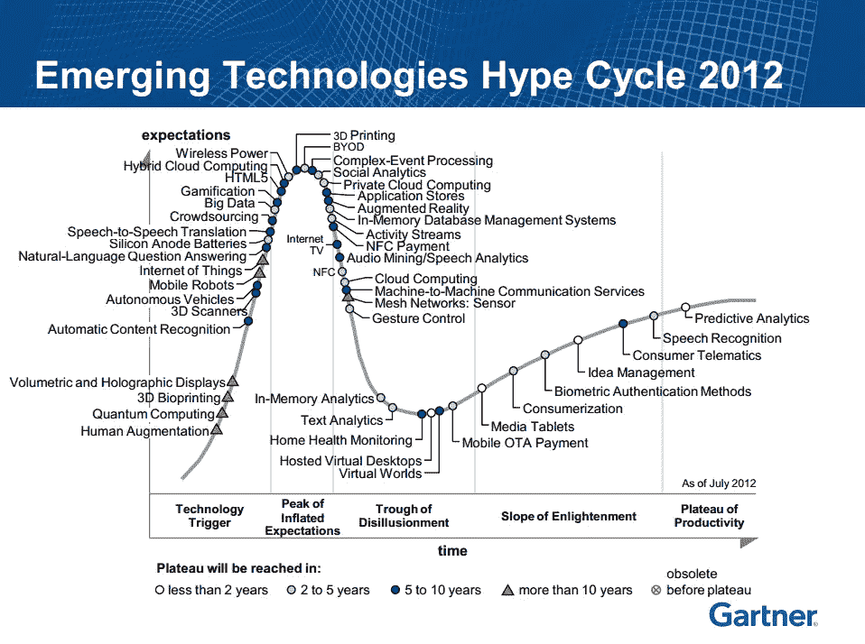
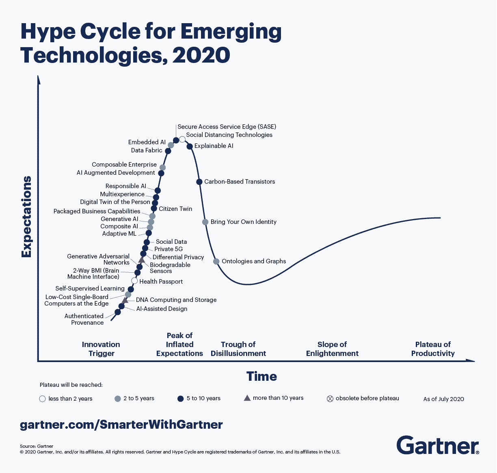
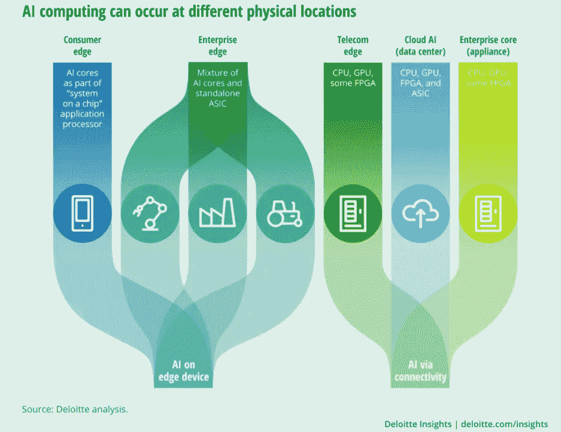
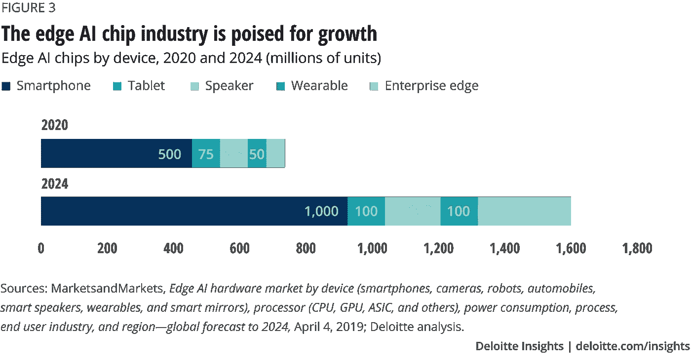

# 边缘智能:另一种时尚？

> 原文：<https://medium.com/analytics-vidhya/edge-intelligence-another-fad-4bed90418907?source=collection_archive---------18----------------------->

什么是真正的边缘智能，它将如何改变 ML 应用。

还记得云计算是热门词汇的时候吗？那是 2011-2012 年。事实上，根据 Gartner 的说法，云计算在那个时候已经滑入低谷，现在可能，哦，不，肯定是在生产力的高原[新闻专线]。

Gartner 2012 年炒作周期

快进十年(是的，你和我都老了，是的，你和我都是书呆子)，现在你看到的是人工智能的新的坚定拥抱。趋势似乎是洗一副牌，抽出一张牌，然后把它放在人工智能前面。

负责任的 AI

生成人工智能

复合人工智能

可解释的人工智能

“饶了我吧”艾

让我们看看 2020 年对我们做了什么(显然除了日冕)

一件有趣的事情发生了。

边缘 AI 甚至嵌入式 AI 现在正处于膨胀预期的顶峰。从英伟达、谷歌到赛灵思，科技行业有不少大佬；加入潮流。[哈姆扎阿里]。

# 什么是 Edge AI？

直到最近，人工智能计算几乎都是在数据中心、企业核心设备或电信边缘处理器上远程执行的——而不是在本地设备上。这是因为人工智能计算是处理器密集型的，需要数百个不同类型的(传统)芯片来执行。硬件的尺寸、成本和功耗使得基本上不可能在比储物箱更小的地方容纳 AI 计算阵列。

现在，边缘人工智能芯片正在改变这一切。[德勤]

[德勤](https://www2.deloitte.com/us/en/insights/industry/technology/technology-media-and-telecom-predictions/2020/ai-chips.html)

与 Edge 和嵌入式人工智能一起出现的一个术语是人工智能加速器。这些正是德勤提到的那些边缘 AI 芯片。

**AI 加速器**是一类专门的硬件加速器或计算机系统，旨在加速人工智能应用，特别是人工神经网络、机器视觉和机器学习。典型的应用包括机器人、物联网和其他数据密集型或传感器驱动任务的算法。[维基-人工智能-ACC]

2019 年初，谷歌发布了一款用于嵌入式推理应用的 TPU Edge 处理器。TPU Edge 使用 TensorFlow Lite，它用低精度参数对神经网络模型进行编码以进行推理，在 5V 输入电源下运行 ML 模型[谷歌-TPU]。这只是众多产品中的一种，产品清单还在不断扩大，精度和功效方面的性能也在不断提高。

[德勤](https://www2.deloitte.com/us/en/insights/industry/technology/technology-media-and-telecom-predictions/2020/ai-chips.html)

一些人甚至声称**摩尔定律已经死亡**，可预见的未来将不再是缩小场效应晶体管，而是将更多不同的设备技术集成到针对性能和能效优化的日益异构的计算机架构中。[泰斯，托尼，&王]

边缘计算被认为是前进的方向。大规模计算的未来生态系统被设想为这种分散化、民主化的设备，它将云服务从网络核心推向更接近物联网设备和数据源的网络边缘[赵]。

边缘计算看起来如此有前途的原因是它解决了困扰在云上部署机器学习的几个关键问题[赵]

1.  **数据安全和隐私**

物联网和移动设备产生大量数据，这些数据可能是隐私敏感的。因此，在模型推断阶段，保护边缘智能应用程序的数据源附近的隐私和数据安全也很重要。

1.  **低连通性**

有必要在边缘智能应用中最小化 DNN 模型推断期间的开销，特别是云的昂贵广域网带宽使用。这里的通信开销主要取决于 DNN 推断的模式和可用带宽。

**2。权力制约。**

DNN 模型推理的计算和通信开销带来了大量的能量消耗。对于边缘智能应用，能效非常重要，并受 DNN 模型的大小和边缘设备上的资源的影响。

**3。低延迟要求**

对于一些实时智能移动应用(如 AR/VR 移动游戏和智能机器人)，它们通常有严格的截止时间要求，如 100 毫秒的延迟。延迟指标受多种因素影响，包括边缘设备上的资源、数据传输方式和执行 DNN 模型的方式

# 那么这仅仅是一种时尚吗？

由人工智能芯片驱动的智能机器可以帮助扩大现有市场，威胁现有企业，并改变制造业、建筑业、物流业、农业和能源等行业的利润分配方式。

收集、解释和立即处理大量数据的能力对于许多数据密集型应用来说至关重要，未来学家认为这些应用正在变得广泛:视频监控、虚拟现实、自主无人机和车辆等等。这种未来在很大程度上取决于人工智能芯片的优势:为设备带来智能。[德勤]

基本上，你的六核 Iphone(2x 3.1 GHz Firestorm+4x 1.8 GHz ice storm)和苹果 GPU (4 核显卡)是一台野兽般的机器，这是一种浪费，我们主要用它来发无意识的推文。

然而研究人员有另一个计划。

请在 Linkedin 上给我留言，告诉我你对未来 2-5 年边缘智能的看法

# 来源:

[赵](【https://arxiv.org/pdf/1905.10083.pdf】)

[新闻专线]([https://www . globe NEWSWIRE . com/news-release/2020/08/21/2081841/0/en/Cloud-Computing-Industry-to-Grow-from-371-40 亿-in-2020-to-832-10 亿-by-2025-at-a-a-of-17-5 . html](https://www.globenewswire.com/news-release/2020/08/21/2081841/0/en/Cloud-Computing-Industry-to-Grow-from-371-4-Billion-in-2020-to-832-1-Billion-by-2025-at-a-CAGR-of-17-5.html)

[哈姆扎·阿里]]([https://arxiv.org/ftp/arxiv/papers/2009/2009.00803.pdf](https://arxiv.org/ftp/arxiv/papers/2009/2009.00803.pdf))

https://cloud.google.com/edge-tpu[TPU](https://cloud.google.com/edge-tpu)

[WIKI-AI-ACC]([https://en.wikipedia.org/wiki/AI_accelerator](https://en.wikipedia.org/wiki/AI_accelerator)

【德勤】([https://www2 . DELOITTE . com/us/en/insights/industry/technology/technology-media-and-telecom-predictions/2020/ai-chips . html](https://www2.deloitte.com/us/en/insights/industry/technology/technology-media-and-telecom-predictions/2020/ai-chips.html))

[Theis，T. N .，& Wong，H.-S. P. (2017 年)。摩尔定律的终结:信息技术的新开端。科学与工程中的计算，19(2)，41–50。doi:10.1109/mcse . 2017.29]([https://sci-hub.se/10.1109/MCSE.2017.29](https://sci-hub.se/10.1109/MCSE.2017.29))