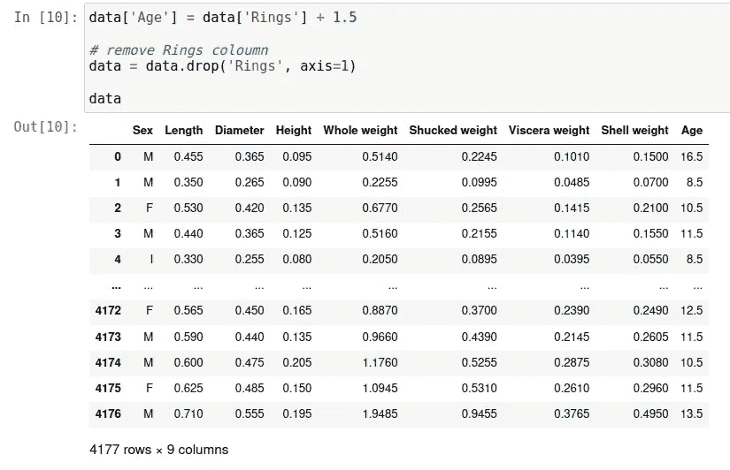
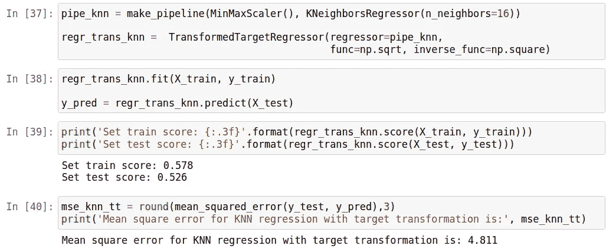

# 目标转换对回归模型预测鲍鱼年龄的影响

> 原文：<https://medium.com/analytics-vidhya/effect-of-target-transformation-on-abalone-age-prediction-using-regression-model-da6d3a185a31?source=collection_archive---------2----------------------->

迪马斯·邦塔尔托

# **简介**

回归是确定变量与其他变量之间因果关系的一种方法。在简单回归分析中，变量之间的关系是线性的，其中变量 X 的变化将永久地跟随变量的变化。

回归是一种分析方法，通常用于查看两个或多个变量之间的影响。通常，回归分析用于进行预测或预报。同时，这些变量之间的关系是函数关系，在数学模型中实现。

其值被预测的变量称为目标。在回归中，目标值是连续的。

在现实世界中，有时会发现非正态分布的目标。这有时会影响模型的数据性能。

在做分析之前，有时会先对目标进行变换，使分布接近正态。

本文将尝试使用回归模型来确定目标转换对分析的影响。我们将使用的数据是鲍鱼数据集。

# 目标

*   了解目标转换对用于预测鲍鱼年龄的回归方法的影响。

# 方法

1.从 http://archive.ics.uci.edu/ml/datasets/Abalone[网站](http://archive.ics.uci.edu/ml/datasets/Abalone)获取数据集。
2。检查数据集。
3。对数据集进行探索性数据分析。
4。对数据集进行要素工程。
5。比较有和没有目标转换的回归模型。

我们将使用的回归模型有:
1。线性回归
2。k 最近邻
3。决策树
4。支持向量机

至于目标转换，我们将使用 np.sqrt

# 关于数据集

数据集从[http://archive.ics.uci.edu/ml/datasets/Abalone](http://archive.ics.uci.edu/ml/datasets/Abalone)中检索。给出了属性名称、属性类型、度量单位和简短描述。

# 导入库

# 获取数据集

我们先得到数据集。我们通过网站[http://archive.ics.uci.edu/ml/datasets/Abalone](http://archive.ics.uci.edu/ml/datasets/Abalone)获得鲍鱼数据集

从上表中我们可以看到，该数据有 4，177 个样本，包含 9 个特征。

# 检查数据集

我们首先检查数据的条件，包括特征类型和数据描述。

除了“性别”特征之外，所有特征都是浮点和整数。从上面的信息中，我们可以发现数据中没有缺失值。

我们查看数据的描述，以确保数据是知情的。

数据信息表明数据中没有缺失值。但是，如果你看数据描述，在高度测量中有一个值 0(`Height`列)。这个 0 值可能是数据中的测量误差，所以我们必须首先处理它。

## 处理测量误差

`Height`栏中的数据可能有测量误差。我们首先检查 0 值的位置和数量。

在`Height`栏中有 2 个样本估计有测量误差。两个空值在婴儿性别(I)中。

由于只有两个样本，我们可以省略这两个值。只是在本文中我们将用婴儿(I)性别的平均值来代替它。

我们可以看到数据集中没有空值。

# 分割数据集

在我们将数据分为训练数据和测试数据之前，我们将首先确定鲍鱼的年龄。鲍鱼的年龄是年轮数加 1.5 得出的。

鲍鱼的年龄已经确定了。

接下来，我们将把数据分成训练数据和测试数据组。我们将确定多达数据集 30%的测试数据的大小

为了便于下一步，我们将现有的变量分开。

# 探索性数据分析

## 性别特征

让我们开始分析数据火车。我们从查看性别条件开始(`Sex`列)。因为关于性别的数据类型是分类数据，所以我们将使用饼图来分析它。

如果我们观察一下，性别分布相当平衡，每个性别大约占 30%。

在后面的建模中，我们仍然会使用这个分类特性。

我们将使用一次性编码来进一步处理这个分类特征。

## 数字特征

接下来，让我们看看数字特征的分布。

从上图中，我们可以看到数字特征不是正态分布的，除了`Height`特征看起来稍微呈正态分布。`Length`和`Diameter`特性的值分布在曲线的右侧，这意味着它们的偏斜度为负。其他要素的值分布在曲线的左侧，这意味着偏度为正。

让我们看看这个数字特征中是否有异常值

我们可以看到每个数字特征都有一个异常值。异常值的个数就是数据不呈正态分布的可能性。

我们不会删除这个异常值，因为我们担心会丢失数据集中的信息。

对于数字特征，在下一个过程中，我们将使用`MinMaxScaler`缩放连续特征

## 目标分布

接下来，我们将查看目标分布(`Age`列)

在上图中，我们可以看到目标不是正态分布，可能的值分布在曲线的左侧，这意味着偏斜度为正。

为了确保这一点，我们检查目标中是否有异常值。

导致目标的异常值的存在不是最大分布的。我们也不会删除这些离群值，以免丢失数据集的信息。

我们将在目标上执行转换，以期提高模型的性能。

## 皮尔逊相关

我们将看到特征之间的相关性，特别是数值特征与目标之间的相关性。

每个数字特征与目标具有线性相关性，仅在 0.5 的范围内，这意味着与目标的线性既不太强也不太弱(中等)。

此外，我们可以在下面的散点图中看到它

我们可以看到，在数字特征和目标之间存在线性关系，即使通过皮尔逊相关计算也是适度的。

# 预处理和特征工程

我们首先执行分类特征工程。我们将使用 one-hot-encoding 来编码分类特征。

我们可以看到数据集中的列增加到了 11。让我们看看为结果设置的训练。

接下来，我们将特征与目标分开。

# 系统模型化

我们将首先用`MinMaxScaler`缩放特征。我们还将使用一个`pipeline`来简化这个过程。我们还将使用`GridSearchCV`来帮助估计最佳参数，其中 cv 等于 5。

对于使用转换目标的过程，我们将使用`TransformedTargetRegressor`。

我们将用`np.sqrt`转换目标。

## 线性回归

我们从线性回归模型开始。对于线性回归，我们估计的参数是`fit_intercept`。

**无目标转换的线性回归**

**带目标转换的线性回归**

## 最近邻回归

我们将要估计的参数是`n_neighbors`

**无目标变换的最近邻回归**

**采用目标变换的最近邻回归**

## 决策树回归

我们将为决策树回归设置的参数是`max_depth`和`max_features`

**没有目标转换的决策树**

**带目标转换的决策树**

## 支持向量回归

我们将要设置的参数是`C`和`gamma`。

**无目标转换的支持向量回归**

**带目标变换的支持向量回归**

以上所有模型的计算，我们总结在下表中。

# 讨论

在线性回归中，目标变换能够减少均方误差值。它甚至能够提高模型的性能。但是，线性回归中的目标转换实际上降低了模型的复杂度。这可以在对转换的目标使用线性回归时看到，模型实际上经历了欠拟合。

在 KNN 回归中，无论有没有目标变换，模型对数据都很复杂(过度拟合)。在这个模型中变换目标实际上降低了模型的性能并增加了均方误差值。虽然目标转换能够在相同模型的使用中稍微使模型更通用。

目标转换的效果在决策树回归中得到了很好的体现。目标变换能够减少均方误差值。虽然它降低了模型的复杂性，但目标转换能够使该模型对数据更通用。

目标变换对 SVR 模型有不利的影响。目标变换实际上增加了均方误差值，也降低了模型的性能。此模型中的目标转换也增加了模型的复杂性，从而使模型变得对数据不太通用。

# 结论

根据以上所有计算，可以得出以下结论:

1.  目标转换对每个模型都有不同的影响。
2.  在上面使用的四个模型中，可以用作预测器的模型是没有模型转换的线性回归。因为该模型是对数据最一般化的，即使它不是具有最小均方误差的模型。

# 进一步分析

未来需要使用其他回归模型以及其他目标转换方法进行分析，如`boxcox`、`np.log1p`、`np.log`等。

# 参考

1.[http://archive.ics.uci.edu/ml/datasets/Abalone](http://archive.ics.uci.edu/ml/datasets/Abalone)
2。[https://thomassoseco . blogspot . com/2019/02/skewness-Dan-Kurt osis . html](https://thomassoseco.blogspot.com/2019/02/skewness-dan-kurtosis.html)3 .[https://www . ka ggle . com/ashokkumarpalivela/鲍鱼-年龄-预测-端到端-项目](https://www.kaggle.com/ashokkumarpalivela/abalone-age-prediction-end-to-end-project)
4。[https://sci kit-learn . org/stable/auto _ examples/compose/plot _ transformed _ target . html](https://scikit-learn.org/stable/auto_examples/compose/plot_transformed_target.html)
5。[https://www . Merdeka . com/jateng/regrisi-adalah-meto de-untuk-menen tukan-sebab-aki bat-kenali-jenis-Dan-contohnya-kln . html？page=2](https://www.merdeka.com/jateng/regresi-adalah-metode-untuk-menentukan-sebab-akibat-kenali-jenis-dan-contohnya-kln.html?page=2)