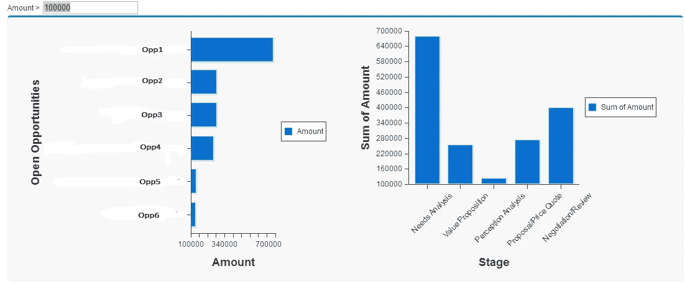
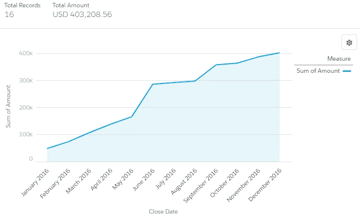
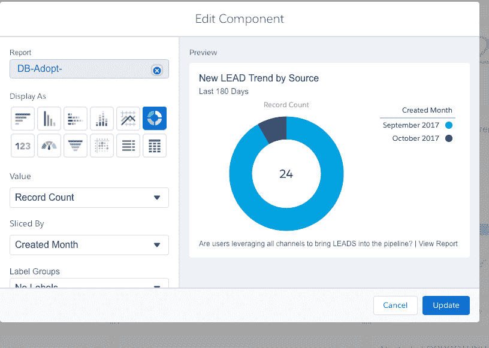
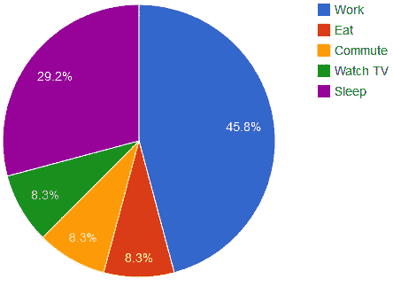
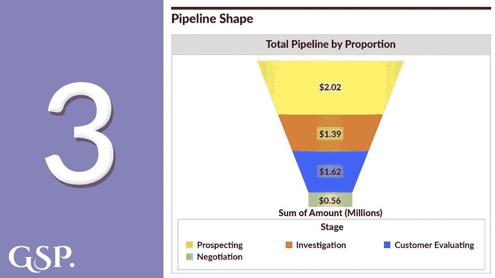
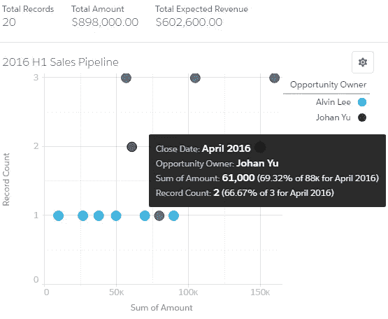
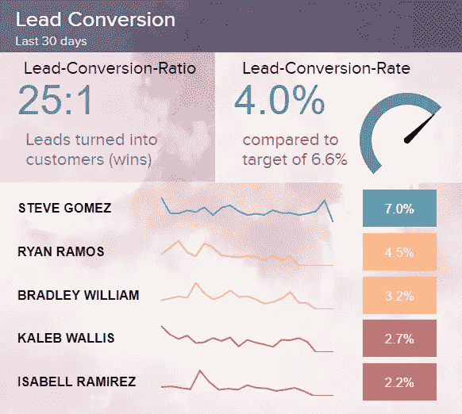
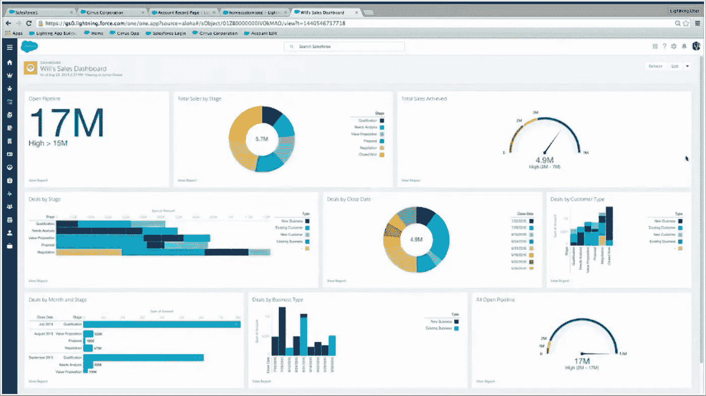
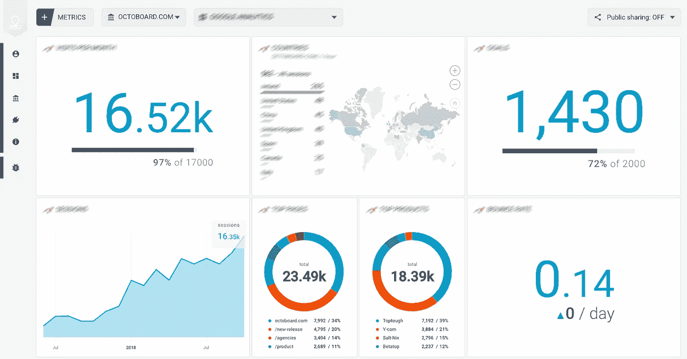

# 使用 Salesforce 仪表板实现有效的数据可视化

> 原文：<https://medium.com/analytics-vidhya/effective-data-visualization-using-salesforce-dashboards-bb93a380d7c0?source=collection_archive---------10----------------------->

对于任何业务来说，数据可视化都是最重要的东西。你可以创建模型，做分析&然后创建困难的图表，但最终我们需要向不知道里面发生了什么的人解释事情。他们需要深入了解公司或产品的现状。数据可视化更多的是一种交流工具。它就像一个谷歌翻译，用外行的术语为商业人士翻译数据语言。

图片来源:【Tableau 的交互式数据可视化工具—Salesforce.com

## Salesforce 中的数据可视化:

Salesforce 是一家云计算服务软件(SaaS)公司，专门从事客户关系管理(CRM)。Salesforce 的服务允许企业使用云技术更好地与客户、合作伙伴和潜在客户联系。现在，salesforce 允许我们使用可用的图表创建仪表板。这在很多方面都有帮助——例如，如果您使用 CRM，您必须登录以获取数据或查看数据情况，如今天增加了多少客户，流失客户等。—仪表板是更好的方式。因为在一天结束的时候，数字比现代世界中的任何东西都更有说服力，图表帮助数字表达自己。

数字游戏:52%的用户花太多时间更新他们的电子表格。神圣的 Excel。

在本文中，我将介绍 salesforce 中有多少个图表，这些图表的用途是什么，以及如何使用 salesforce 有效地创建仪表板。

## salesforce 中可用的图表类型:

*   垂直和水平条形图
*   折线图
*   饼图/圆环图
*   漏斗图
*   散点图
*   桌子
*   卡片

**这些图表用在哪里？**

*   **条形图**:当我们想要显示数据点的分布或者比较不同数据子组的值时，可以使用条形图。从条形图中，我们可以看到哪些组是最高或最常见的，以及其他组如何与其他组进行比较。简单来说，我们可以用它来比较两个子群之间的数据。条形图以水平长度显示数值，因此这种格式适用于比较距离或时间。例如:当你有两列时，一列是分类的，另一列是数字的——条形图非常有用

Salesforce 条形图

*   折线图:折线图基本上是时间序列图。通俗地说，时间序列是指一段时间内的增长变化。我们可以用这个图表来显示我们公司在一段时间内的表现，或者我们在一段时间内增加或失去了多少客户。例如:如果一家公司 A 需要分析其销售额多年来是如何增长的，他们倾向于使用这种折线图。

Salesforce 折线图

*   饼图/甜甜圈图:通常饼图和甜甜圈图用于显示数值的分布或百分比，以及它们在 100%中所占的比例，或者用外行的术语来说，显示比例。饼图用于单个分组，而圆环图用于多个分组的情况。甜甜圈通常在中间显示总数。在饼图中，每个切片的弧长(以及其中心角度和面积)与它所代表的数量成比例。简单来说，每一片披萨都代表了每个品类所占的比例。

中间显示总计的圆环图

饼图:

Salesforce 饼图

*   漏斗图:漏斗图用于可视化数据从一个阶段到另一个阶段的逐渐减少。每个阶段的数据都表示为 100%的不同部分(整体)。漏斗图用于表示销售过程中的各个阶段，并显示每个阶段的潜在收入。这也有助于识别组织销售流程中的潜在问题领域。漏斗图类似于堆积百分比条形图。简单来说，我们的漏斗图以漏斗形式显示增长。例如，如果你想计算某样东西的花费，你可以用这个。它还显示比例，就像一个酒杯，以及如何在每个值之间共享。虽然我们不分享我们的葡萄酒，漏斗图显示比例。

漏斗图销售队伍

*   散点图:用于显示两个变量之间的线性关系。我们可以绘制两个相互对比的数字摘要，以直观显示报告中特定分组的值之间的相关性。更简单地说，为了显示它们之间的密切关系，我们可以使用散点图。例如，如果你想显示营销对销售有多大影响，我们可以展示图表。在下面的图表中，他们显示了与数量和金额相关的利息有多少。

salesforce 中的散点图

*   表格:表格用于以基本形式显示数据，以便人们理解。例如，如果您想要显示报告，或者如果您想要显示计数或值，我们使用表。表格是数据可视化的基本形式，非常容易理解。只在人们
*   卡片:卡片通常用来显示某物的总数或记录某一特定物体的数量。当有人想要查看一个对象的记录计数时，这些非常有用。举个例子，你想知道你的销售队伍今天的登录次数，卡片可以显示出来。
*   KPI:强大而令人敬畏的一个。KPI 基本上是一个速度计，或者是一个指示发生了多少事情的指示器。它比较过去和新的数据并给出数值。例如，如果您昨天添加了一个客户，它会显示在+中，如果您失败了，它会显示在-。KPI 是一个指标图。

类似速度表的图表是 KPI 图表

## Salesforce 仪表板:

有效的 salesforce 仪表板

现在，Salesforce 提供了使用给定图表创建我们自己的仪表板的出色方法。为了创建仪表板，您需要准备好报告。请始终记住，报告和仪表板是相互关联的。在某些情况下，我们还可以使用已经可用的标准报告来创建仪表板(意味着您不必创建仪表板)。

*   要创建仪表板，点击顶部菜单中的*仪表板*。在那里，您可以编辑现有仪表板的组件，也可以创建新的仪表板。要创建新的仪表板，选择右上方的*新仪表板*选项。我们还可以复制仪表板，就像我们在高中时复制一样。
*   你将会得到一个类似于《部落冲突》中的空白设置。为了制作图表，你必须插入图表并添加它。我们需要单击 add component 将组件添加到图表中——类似于 clash of clans，但比什么都有趣。因为您已经知道要使用什么图表，所以您可以轻松地创建不同类型的图表并将其添加到 dashboard。

因此，最后当您完成时，保存仪表板。您的仪表板现在可以查看了。请记住，当谈到仪表板时，这都是你的想象。

生鲜销售 crm 中有效的仪表板设计

构建更有趣的仪表板并可视化数据。我们还可以添加 powerbi 和 tableau 来使我们的仪表板看起来更好，但这分别需要花费 10 美元和 6 美元。

感谢阅读。