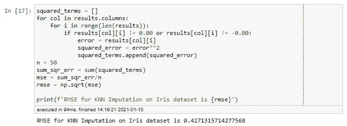
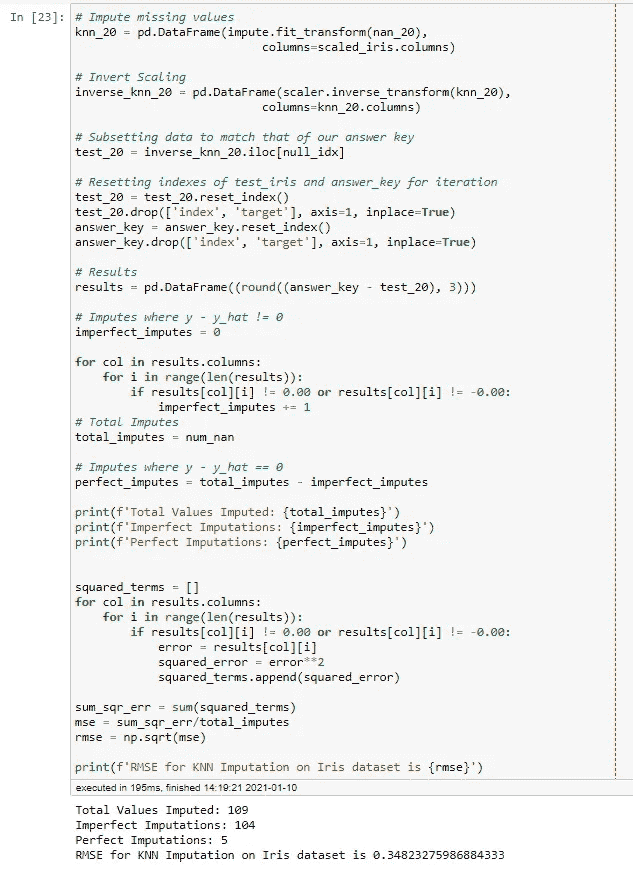

# KNN 插补的有效性，第一部分:Iris 数据集

> 原文：<https://medium.com/analytics-vidhya/effectiveness-of-knn-imputation-part-i-the-iris-dataset-e784f157275a?source=collection_archive---------7----------------------->

[图片来源](https://dawdling.doody.id.au/coming-together/)

几乎每个数据科学家在第一次清理数据集时都会对自己说:“一定有更好的方法！”

许多人都有这种感觉，这就是为什么互联网上充斥着致力于寻找简化数据清理和处理缺失值的方法的博客和论坛帖子。个人推荐 [Alvira Swalin](/@aswalin) 的文章“[如何处理缺失数据](https://towardsdatascience.com/how-to-handle-missing-data-8646b18db0d4)”。非常翔实有用！

其中一种很受欢迎的方法是 KNN 插补。如果您以前从未听说过这种方法，这是一种使用 K *-* 最近邻算法输入缺失值的方法。这是一个非常聪明的解决方案，可以节省你很多时间。

话虽如此，但当我第一次得知这件事时，我不禁觉得这太好了，不像是真的。我不断听到我的导师的声音在我的脑海里说，“即使这是一个高度优化的估计，它仍然只是一个估计，你不能报告为事实。”这很有道理。如果给你一张病人图表，你发现病人 A 的体重不见了，你可以试着根据身材相似的病人的体重来猜测他们的体重，但这是他们实际体重的可能性极低。

不过，这种插补方法之所以流行是有原因的，它甚至被数据科学领域的一些知名人士所使用。因此，我想看看它在不同的数据集上有多准确。

在这一系列报告的第一部分，我们将看看经典的虹膜数据集。这个分类数据集是一个很好的基线。虽然它很小，但这三类(setosa、virginica 和 versicolor)达到了完美的平衡。这些特征(即萼片和花瓣的尺寸)都是连续的，这使得测量精度更加简单。最棒的是:它非常干净！

# 预处理

## 标签编码

就预处理而言，不需要太多。所有需要做的就是确保`target`列是标签编码的，然后缩放数据。幸运的是，您实际上可以加载带有已经标签编码的`target`列的数据集。

## 复制数据帧

一旦您确保了`target`列是标签编码的，就制作一个数据集的副本。该副本稍后将用作答案，以此来衡量我们的结果。为了便于交流，我们将这个副本称为“控制集”，而原始副本将是“实验集”。

## 缩放比例

由于 KNN 通过计算点与点之间的欧几里德距离来确定最近的相邻点，因此所有数据的比例相同非常重要。现在，你可以说 Iris 数据集中的测量差异并没有大到需要缩放。它们都是以厘米为单位测量的，最大和最小的尺寸只有 7.8 厘米的差别。然而，与此同时，人们可能会认为这没有坏处，特别是考虑到在进行 KNN 插补时缩放数据是多么重要。因此，我们将继续使用 Sci-Kit Learn 中的 MinMaxScaler。

## 复制缩放数据

在完成预处理之前，我们将复制这个缩放的实验集。这将使未来的试验进行得更快，因为我们将有一个已经缩放的数据框架。

预处理的最后几个部分是针对实验本身的。首先，我们需要随机删除数据。然后，我们需要通过使用实验集中受影响行的索引对控制集进行子集化来制作我们的“答案”。

## 删除数据

在这个阶段，我们首先为可复制性设置一个种子。如果结果是不可重复的，那么它就不是一个实验，不是吗？

接下来，我们将定义要从中删除数据的列。本质上，我们从不希望从目标变量中删除数据，因为在预处理过程中，目标变量中缺少数据的任何行都很可能从数据集中删除。

之后，我们使用一个`for`循环来索引数据帧中的随机细胞样本，并将它们的值更改为`np.nan`。需要注意的是，超参数`frac`定义了要采样的细胞比例。由于这是一个小数据集，我们将从`frac=0.1`开始，这样总数据的 10%将被删除。

参数`replace`决定了一行是否可以被多次选择。由于数据集中的行有多个缺失值是很常见的，我们将把它设置为`True`。

现在我们将检查实验装置的损坏情况。

## 答复关键

接下来是答案！首先，我们对实验数据进行子集划分，使其只包含缺失值的行。然后我们从这个子集的索引列表。最后，我们使用这个列表来索引控件集中相应的行，以生成我们的答案密钥。

这样，我们的预处理就完成了，我们可以继续进行实验了！

# 实验

娱乐时间到了！首先，实例化 KNNImputer 并设置要从中进行计算的邻居的数量。由于实验集只丢失了 9.67%的数据，我们将继续使用`n_neighbors = 5`。那就该估算了！

既然已经估算了值，我们需要反转比例，以便我们可以根据我们的答案来测量结果。

接下来，使用我们之前制作的索引列表对该数据进行子集划分，使其与答案的索引相匹配。

为了计算结果，我们需要重置答案和实验集的索引。重置索引将创建一个名为`index`的列，因此我们需要删除它，同时我们也可以删除`target`(尽管这是可选的)。

一旦删除了`index`列，我们就创建一个数据框，其中的单元格是答案和实验集的对应单元格之间的差异。

现在我们有了一个数据框架，其中包含了输入数据的行，我们需要找出准确性。

# 解读准确性

让我们看看是否碰巧有任何完美的插补(例如`y - y_hat == 0`)。我们将合计不完全估算的总数(其中`y - y_hat != 0`)并从估算的值总数中减去它们(58，如前面计算的)。

我们最终得到了一个完美的估算结果！还不错！现在我们要找出均方根误差。RMSE 惩罚重大错误，这让我们看到了“最坏的情况”可能是什么。

为了进行计算，我们将创建一个循环，从估算值中收集所有的误差，并对它们进行平方。从那里，这些值将被加在一起，然后我们将得到结果和的平方根。

注意:“如果”条件是不必要的，但是它表明了一种理解，即人们想要过滤掉在实验集中没有改变的值。实际上，只要误差平方和除以估算值的数量，这些零点(包括误差== 0 的情况)就不会对 RMSE 产生影响。

那么我们该如何解读这一点呢？对于虹膜数据集，当 30%的行包含缺失数据时(总体上有 10%的数据缺失)，平均而言，KNN 插补可以在实际值的 0.427 cm 内进行估计。这还不算太糟！如果我们将邻居的数量设置得更高，我们可能会看到更高的准确性。

# 如果我们删除更多的数据呢？

让我们拿着缩放数据的备用副本重新运行实验，这次删除总数据的 20%。

注意:我们已经改变了这个实验的随机种子。

我们的结果呢？

稍微准确一点！怎么会这样呢？嗯，可能是几个因素综合作用的结果。

## 随机种子变化

为了确保第二个实验完全独立于第一个实验，我们改变了随机种子。这意味着删除的值与第一次不同。如果第一个实验去除了异常值，估算者必须基于 5 个最近邻的平均值进行估算，那么误差自然会更高。另一方面，如果异常值未被移除，且被采样的 20%碰巧更接近平均值，则 KNN 估算自然会更准确，因为它在更“安全”的范围内工作，而不是估计很少出现的值。

## 目标变量的重要性

另一个因素是目标变量。在两个实验中，目标变量保持不变。这意味着即使没有萼片和花瓣尺寸的数据，至少也有该行属于哪一类的数据。因此，这暗示着这三个类别之间存在着明显的差异。差异越明显，重叠就越少，KNN 插补就越准确。

因此，我们已经看到，KNN 是相当准确的连续特征。在[第 2 部分](https://benmauss.medium.com/effectiveness-of-knn-imputation-part-ii-the-terry-stops-dataset-4c23cf48ec35)中，我们将使用西雅图特里停靠点数据集，该数据集完全由具体的分类特征组成。到时候见！