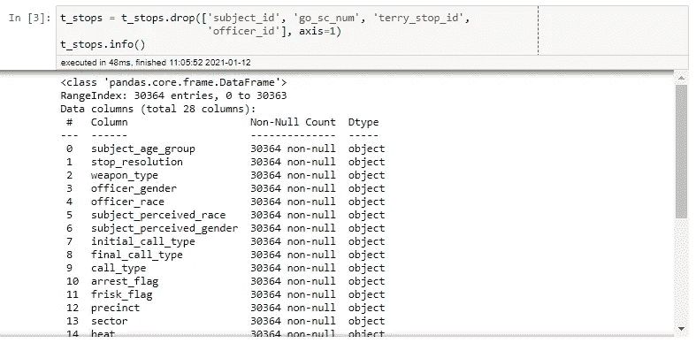
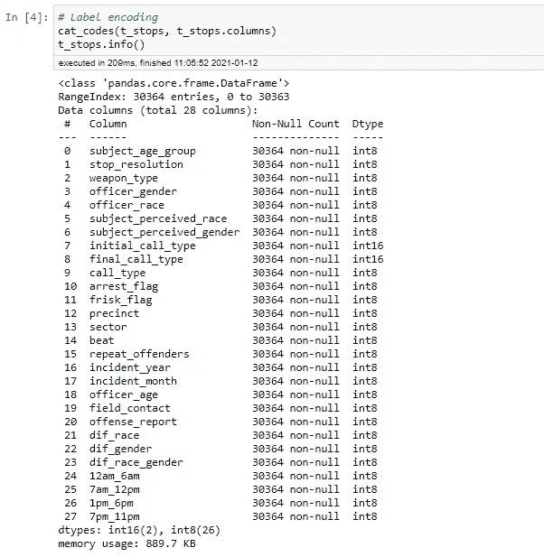
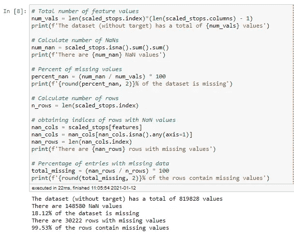
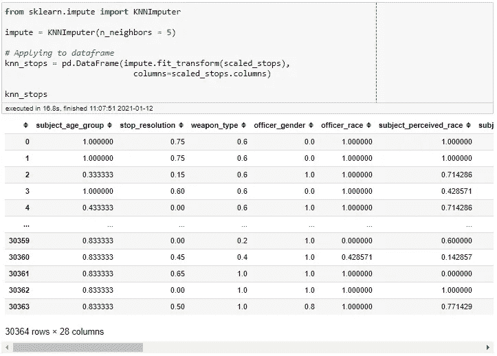
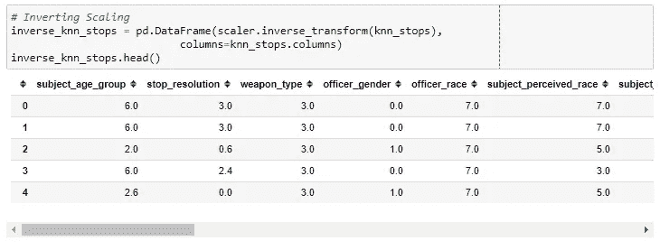
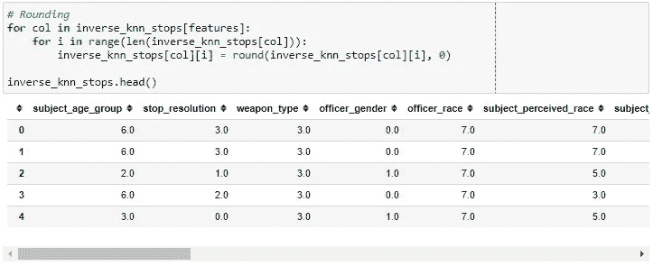
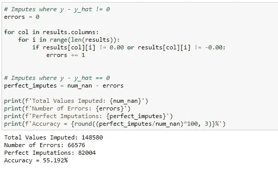
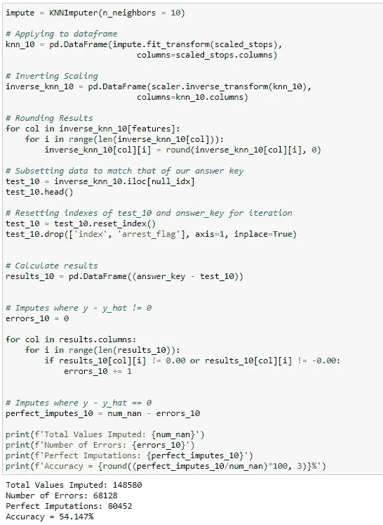
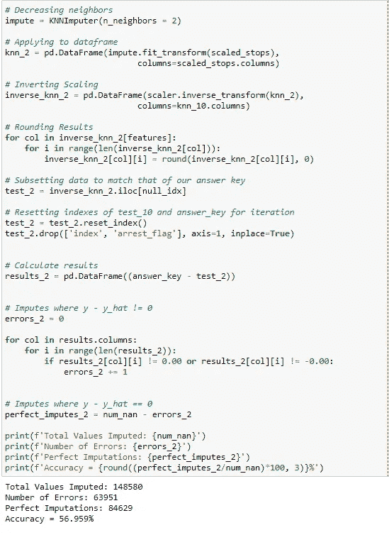
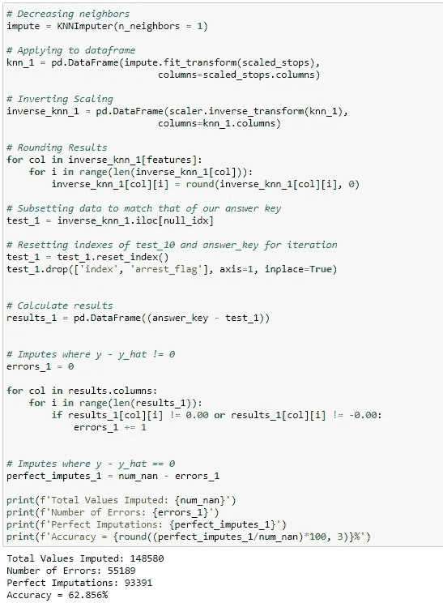

# KNN 插补的有效性，第二部分:特里停止数据集

> 原文：<https://medium.com/analytics-vidhya/effectiveness-of-knn-imputation-part-ii-the-terry-stops-dataset-4c23cf48ec35?source=collection_archive---------15----------------------->

图片来源:Getty Images

[上周](https://benmauss.medium.com/effectiveness-of-knn-imputation-part-i-the-iris-dataset-e784f157275a)我们观察了 Sci-Kit Learn 的 KNNImputer 在 Iris 数据集上的有效性。选择这个数据集作为开始，因为它小，平衡，最重要的是，简单。所有特征都由连续值组成。这使得对结果的评估非常直接，解释也更加容易。

本周，我们将看看在 [Kaggle](https://www.kaggle.com/city-of-seattle/seattle-terry-stops) 上提供的特里停站数据集。更具体地说，所用的数据集是我之前为一个分类项目[预处理过的数据集。除了原始数据(停止的对象的人口统计数据、涉及的官员的种族和性别、在特里停止期间执行的动作等。)它包括一些工程特征，例如，如果该官员与该对象是不同的种族或性别(或两者都有)，如果该对象被多次拦截(被标记为“惯犯”)，等等..](https://github.com/bmauss/LogReg_Analysis_of_Terry_Stops)

选择这个数据集是因为它与虹膜数据集完全相反。它很大(30，000+行)，它很臃肿(28 列)，它很混乱(高度的类不平衡)，并且所有的特征都是绝对的。因为我们要输入的值是分类的，所以评估结果将是非黑即白的:正确的类别是否被输入？不存在算法“大部分正确”的灰色地带。

# 预处理

预处理和上次的[一样，但是有两个例外。首先，我们需要先删除包含唯一标识符的列。我们需要去掉这些，因为这实质上是要求 KNN 估算者根据最近邻居的平均名字来猜测受试者或官员的名字。这不公平。](https://benmauss.medium.com/effectiveness-of-knn-imputation-part-i-the-iris-dataset-e784f157275a)

另一个变化是我们需要对整个数据集进行标签编码，而不仅仅是目标变量，在本例中是列`arrest_flag`(一个二进制类，其中 0 表示主体没有被逮捕，1 表示他们被逮捕)。

接下来是相同的过程:缩放数据集，设置随机种子值，然后移除数据。这一次，我们将从删除 20%的数据开始，看看它会如何影响数据集。同样，每行可以被选择多次。

不到 150，000 个数据单元被删除，30，000 行中的 99%受到影响。我得说这已经够乱的了。很少看到 99%的行至少缺少一个值的精选数据集。

然后，像上次一样，我们获取包含缺失值的所有行的索引，并保存它们，以使用未缩放数据的副本来创建答案密钥。

# KNN 插补

现在，是时候估算了！

应该注意的是，由于丢失的数据量和算法必须考虑和计算平均值的邻居数量，这在计算上是昂贵的。如果你正在跟进，你可能想在 Google Colab 中运行这个。

然后反转比例，以便我们可以将结果与我们的答案进行比较。

在开始评估之前，我们还有一个额外的步骤。因为 KNNImputer 将使用位于最近邻居中的相应数据的*平均值*来填充缺失的数据。这意味着并非所有的估算值都是整数。许多将是有理数。这就产生了一个问题，因为所有的分类数据都是标签编码的，并且用一个整数表示。有理数是无法解释的。为了解决这个问题，我们需要四舍五入到最接近的整数。

# 评价

如上所述，评估基本上是“通过-失败”。正确的类别要么被估算，要么没有。让我们来看看结果:

准确性只比随机概率高一点点。让我们看看调整邻居的数量是否有积极的作用。我们将调整 n_neighbors 参数并再次运行试验。让我们把它设置为 10。

## 10 个邻居

邻居越多，准确率越低。这是有意义的，因为算法将包括更远的邻居，这将对估算的平均值产生负面影响。现在让我们减少邻居的数量。

## 两个邻居

只有两个邻居，准确性确实提高了，但提高的不是很多。这也是需要对估算值进行舍入的限制。计算平均值时，将任何奇数除以 2 都会得到一个以. 5 结尾的值。所有这些都将被围捕。为了避免这种情况，最好使用奇数个邻居。

让我们最后一次尝试减少邻居的数量。

## 1 个邻居

我们走吧！准确率从 55%提高到 62%。这仍然是相当低的，但是有其他的方法来优化它。删除列，解决阶级不平衡，你能想到的。如果没有一种方法来优化这一点并提高准确性，KNN 插补就不会如此流行。然而，这是另一个时间的话题。

记住，我们实验的目的是确定 KNN 插补对分类数据的有效性。这个问题的答案很简单。由于所有的结果都必须四舍五入，KNN 插补更难处理分类数据。这带来了将估计类别推/拉得更接近或更远离实际值的风险。