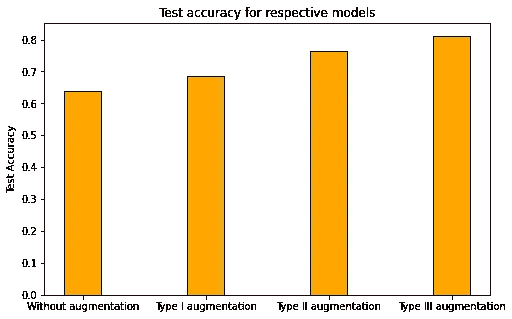

# 图像增强对模型性能的影响

> 原文：<https://medium.com/analytics-vidhya/effects-of-image-augmentation-on-model-performance-3f8effbf54e5?source=collection_archive---------4----------------------->

[https://www.googleapis.com](https://www.googleapis.com/download/storage/v1/b/kaggle-user-content/o/inbox%2F1723677%2F5042f32b75cd19ad71d5a35c5587ae79%2FScreen%20Shot%202020-02-24%20at%2011.32.02%20AM.png?generation=1582572736200811&alt=media)

这篇博客是**关于形象提升的 2 部分博客系列**的**B 部分**。它分为:-

部分 A :介绍图像增强，各种增强技术，以及通过可用库的实现。

**B 部分**:建立并训练 PyTorch 模型，分析使用图像增强对性能的影响。

# 介绍

最近，深度学习在机器学习(ML)和深度神经网络(DNN)领域发展迅速。卷积神经网络(CNN)主要用于图像分析和分类目的。尽管取得了巨大的成就和前景，深度神经网络和伴随的学习算法仍有一些缺点和挑战需要解决。

这些网络严重依赖于大型数据集来提供良好的结果，并在真实世界的一般环境中工作(在野外)。不幸的是，在许多应用中，访问大数据是困难的，例如医学图像分析等。因此我们需要像图像增强这样的技术。

图像增强可以描述为生成新图像来训练我们的深度学习模型的过程。这些新图像是使用已经可用的数据集创建的，因此我们不必手动收集它们。这是在假设可以通过增强技术从原始数据集中提取更多特征的情况下完成的。

# 构建 PyTorch 模型

我们将在 PyTorch 中训练一个简单的图像分类模型(如果你是新手，请参考[和](/swlh/image-classification-tutorials-in-pytorch-transfer-learning-19ebc329e200)),以比较添加多种图像增强技术后的结果。为了保持简单和快速，我们使用了 Resnet 18 模型。我们将使用包含 20 个花卉类别的[数据集](https://www.kaggle.com/c/flower-classification-with-tpus/)，下面附上一些样本:

为了显示图像增强对模型的影响，我们将使用不同的图像增强技术多次训练相同的模型，并将比较每个模型的测试精度。我们将训练 4 个不同的模型，1 个没有增强，3 个模型有不同的图像增强技术。

我们还附加了代码来训练模型，您可以使用它来复制结果。如果您已经习惯于在 pytorch 中训练图像分类模型，可以跳过阅读这些代码片段。

## 加载数据

这里您将使用`torchvision`来加载数据。数据应该放在笔记本旁边，否则，你可以在这里下载。数据集分为三个部分，即培训、验证和测试。

预训练的网络(Resnet18)在 ImageNet 数据集上训练，其中每个颜色通道被单独标准化。对于所有三个集合，我们需要将图像的平均值和标准偏差标准化为网络训练的内容。对于平均值，它是`[0.485, 0.456, 0.406]`，对于标准偏差，它是从 ImageNet 图像中推断出来的`[0.229, 0.224, 0.]`。这将确保每个颜色通道以 0 为中心，范围从-1 到 1。

## 标签映射

我们还需要使用文件`flower_to_name.json`加载从类别标签到类别名称的映射。这是一个 JSON 对象，我们可以用`[json](https://docs.python.org/2/library/json.html)` 模块读取。这将给我们一个字典映射，整数编码的类别到花的实际名称。

## 构建和训练分类器

既然数据已经为训练做好了准备，就该构建和训练分类器了。像往常一样，你应该使用一个预先训练好的模型`torchvision.models`来获取图像特征。使用先前获得的那些特征来构建和训练新的前馈分类器。

使用线性输出 20 和 softmax 函数(与要分类的类别数相同)构建自定义分类器

定义测量验证损失和准确度的函数。

根据验证数据训练和测试我们的模型，以检查它的执行情况。

## 测试您的网络

# 使用图像增强

现在应用图像增强，我们必须编辑我们的转换对象。我们将创建一个应用各种增强(如随机旋转，颜色抖动，水平翻转等)的合成变换。

> 关于各种图像增强技术，请参考本博客的第一部分。

我们将在 3 个单独的集合中应用图像增强，并将比较结果，这些集合可以在下面看到。所有 3 个集合都具有随机调整大小的裁剪、ToTensor 和 Normalize common，它们不完全是增强技术，因为我们应该将相同维度的图像馈送到我们的神经网络，我们应该调整图像的大小或获取特定维度的裁剪，Normalize 函数用于将图像在-1 到 1 之间进行归一化，并将 PIL 图像张量转换为 torch 张量。所有这些步骤都是必要的。

**类型 I 增强:**首先，我们向训练集添加随机水平翻转变换，然后将其提供给模型并训练模型。

**第二类增强:**然后我们继续给当前的变换对象添加一个系数为(p=0.5)的随机旋转。

**第三类增强:**对于模型中的最后一个变化，使用颜色抖动增强技术向数据集添加一个变换。

如上所述进行修改后，分别运行整个代码，再次训练 Resent18 模型。

# 结果

现在的主要目标是观察是否有任何差异发生由于图像增强。比较我们在上面构建和训练的所有模型的性能。

下面我们可以通过图来直观地看到结果。

第一个图描绘了每个时期所有模型的验证准确性。

下图显示了每个模型的测试精度，这是判断一个模型的主要标准。

我们可以清楚地得出结论，通过对我们的 Pytorch 图像分类模型实施图像增强，提高了准确性，这是使用增强技术的主要优点，这也减少了过拟合，使得模型对真实世界场景更鲁棒。

# 选择合适的增强技术的基本准则

选择应用图像增强技术可能是一项具有挑战性和忙乱的任务。增强技术完全取决于我们使用的数据集，应用图像增强技术背后的主要思想是调整图像，并确保调整后的图像看起来仍然是测试场景中可能出现的东西。例如，我们不能在本博客中使用的数据集上应用垂直翻转，但是垂直翻转可以用于卫星图像，其中翻转图像不会使图像变得虚假。此外，由于所有增强技术都是按顺序应用的，有时当所有增强技术一起应用时，它们的组合效果会产生人工图像，因此在开始训练之前，您应该尝试可视化少数应用了所有增强技术的样本。

还有一件事要记住，当应用空间增强时，如果你正在处理对象检测、语义分割等问题，你也应该改变标签。在图像分类的情况下，由于标签只是图像上的一个标签，它不会影响标签，但在对象检测的情况下，我们需要根据我们应用的空间增强技术来改变框。如果我们水平翻转图像，我们也需要翻转盒子。

# 摘要

这就是当我们缺乏训练数据时，我们如何使用图像增强技术。

1.  我们学习了如何旋转、移动、改变颜色模式和翻转图像。我们学习并讨论了选择合适的增强技术的基本准则，以及这些技术的实际应用。
2.  使用图像增强，我们可以提高我们的模型效率，即使训练数据集更少或更差。

> 感谢你的贡献。

# 参考

1.  https://pytorch.org/docs/stable/index.html
2.  【http://cs231n.stanford.edu/reports/2017/pdfs/300.pdf 
3.  [https://www . analyticsvidhya . com/blog/2019/12/image-augmentation-deep-learning-py torch/](https://www.analyticsvidhya.com/blog/2019/12/image-augmentation-deep-learning-pytorch/)
4.  [https://www.kaggle.com/c/flower-classification-with-tpus/](https://www.kaggle.com/c/flower-classification-with-tpus/)
5.  [https://github.com/LeanManager/PyTorch_Image_Classifier](https://github.com/LeanManager/PyTorch_Image_Classifier)