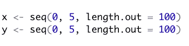

# 高效的数字化转型—从小步开始

> 原文：<https://medium.com/analytics-vidhya/efficient-digital-transformation-it-starts-with-the-small-steps-2d26836e4de5?source=collection_archive---------5----------------------->

# 数据驱动的决策制定

数据科学的一位大院长 Kirk Borne 最近写了一篇文章，讨论了一个非常重要的主题:“如何通过商业文化转型从数据悖论走向数据生产力”

简而言之，要成为高效的数据驱动型企业，it **需要的不仅仅是囤积数据。**

它表示，“仅仅彻底改革你的技术和流程不会让你变成一家数据驱动型企业”。它需要的是“也进行一定的文化变革”。下面增加了对这篇文章的参考。

我想补充一下这个观点，商业领袖必须找到技术理解、数学知识和行业背景的**正确组合，以帮助他们的企业实现这种高效的数据驱动环境**，这无疑是**在自己的业务领域保持领先的必要条件**。

在这篇文章中，我想把重点放在技术部分，一些看似世俗的东西，如在数据驱动模型的世界中编写算法所需的主干对象类。

# 对象类别

对象类(如向量、矩阵、数据框……)是**的第一步，也是最复杂的数据驱动模型或最新的机器学习应用程序建立在**之上的基础。

如果没有这个基础，就很难成功运行数据驱动的环境。

正是这些最初的小步骤在早期阶段决定了整个企业的结果。

在我的上一篇文章中，我思考了当我作为一个编程新手开始学习不同的对象类时所遇到的困难和感到的乏味。

首先，我跳过了这一部分。我想尽可能快地完成“大”编码。

当然，现实很快就消失了，我不得不回来花很多精力研究这个特殊的编码领域。

这里有一个小例子(从 R 语言的角度)说明为什么不应该跳过那些编码会话中“蹩脚”的第一部分，因为它们与任何模型中的大算法块一样重要。

# 创建网格空间

假设我们有两个**向量**，向量 1 和向量 2 的长度都是 20:

现在，我们在这两个向量之间创建一个可能组合的**网格。expand.grid() —函数的作用是:**

该函数创建一个**数据帧**，其尺寸取决于所涉及的矢量以及各个矢量的长度。

在这种情况下，结果是 20^2 = 400 行(即观测值)和 2 列(对于两个向量中的每一个)的数据框。包含长度= 20 的第三个向量将创建 20^3 = 8，000 行和 3 列的数据帧。

以下是基于 2 个向量及其各自长度 20 的可能组合的网格:

作者图片

不过，这并不十分壮观，不是吗？我告诉过你，会很无聊的。

将向量的长度增加到 100，同时保持向量的范围不变(即-15 到+15 ),将为我们提供在 2 列中具有 10，000 个观察值的数据帧。

作者图片

尽管如此，这仍然不是真正的壮观…

# 使用网格空间

当然，网格空间不是为了自己的目的而创建的。它在这里服务于一个更大的任务(大局——如果你想这么说的话)。

看看一个**函数**被放置在**网格空间**上的情况，看看这个函数在这个区域的表现如何。

重点是，这个函数可以是机器学习模型的**成本函数，为了对模型的任何训练产生最佳结果，该函数必须被最小化。**

这里有一个例子。

让我们再次假设两个向量:

以及以下功能:

f(x，y)=(x—2.19)^2+(y—1.88)^2+cos(3x+1.41)+sin(4y—1.73)

换句话说:

我们想知道这个函数在这两个向量的网格空间中可以取哪些值。首先，我们为这两个向量创建一个可能值的区域:

这将创建一个包含 10，000 个组合数据点的数据框，包含 2 列。以下是此网格空间的一些示例:

然后，我们将(成本)函数“放置”在这个网格上:

请注意，在这一步中，我们不再直接寻址向量。我们**需要的**是由 expand.grid() —函数产生的数据帧的**列，它们表示网格空间中的常见观察值。**

结果是一个根据网格面积有 10，000 个值的向量。

以下是一些结果:

这个长度为 1e4 的向量，包含函数在这个网格空间中获取的所有值，现在是可用的，可以在任何任务中进一步研究。

但是要实现这一点，我们必须在不同的框架和相互依赖中使用数据。

# 局部最小值，全局最小值

如果我们想要可视化结果，有几个选项可以做到这一点。

这里，我们决定使用 plot3D 包中的 persp3D()函数创建 3D 图。

尽管对于使用的绘图函数，我们不能只取上面创建的长度为 10，000 的向量。此**不适用于可视化部分向量的尺寸**(每个长度为 100)。

在这种情况下，我们需要一个尺寸为 100 x 100 的**矩阵**来嵌入网格空间内的所有函数值。

换句话说，**相同数量的观察值**被**捆绑在不同的对象类中，具有不同的维度构建，以便绘图功能**工作。

这是视觉效果:

作者图片

但这本身并不是一个结果。

以成本函数为例，可视化清楚地显示了在给定网格空间的情况下，该函数如何创建**几个局部最小值**(图中的蓝色区域)和**一个全局最小值**(深蓝色区域)。

作者图片

我们在这里。如果这将是机器学习模型的**成本函数，我们将例如已经暴露于**问题，即如何找到全局最小值，同时不陷入局部最小值，以便获得手头问题的最准确模型**。**

算法讨论，如梯度下降或粒子群优化跟进…

简而言之，它**开始相当简单，但很快进入更难的主题**。

# 结论

繁重的数据结构、复杂的统计模型以及最新的机器学习应用程序都是建立在这些小步骤之上的。

因此，我们必须紧紧抓住那些为大局奠定基础的小步骤。

为了成为**高效的数据驱动型企业**，决策者必须找到**技术背景、数学知识和对行业背景的深刻理解的正确组合**。

要做到这一点，人们不应该忽视我们在这里展示的看似很小的步骤(作为一个相当普通的例子),从技术的角度来看。

这些小步骤会很快导致更复杂、更难解决的问题。

# 参考

如何通过商业文化转型从数据悖论走向数据生产力 Kirk Borne 博士撰写的三大数据悖论，发表于 LinkedIn/2021 年 10 月 21 日