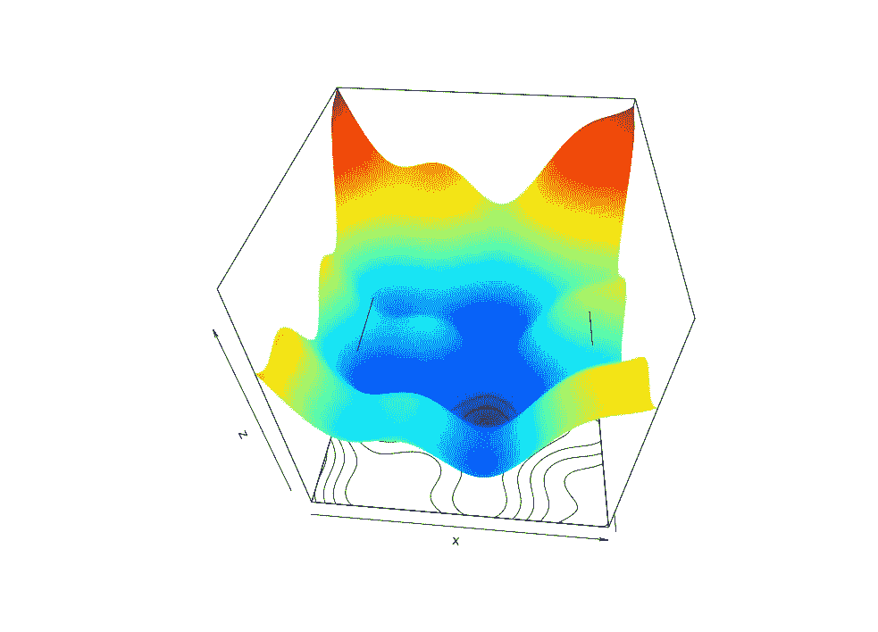
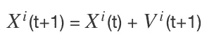
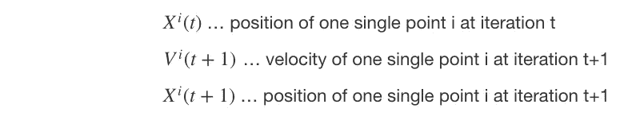
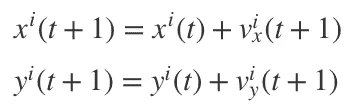
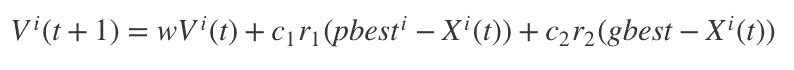
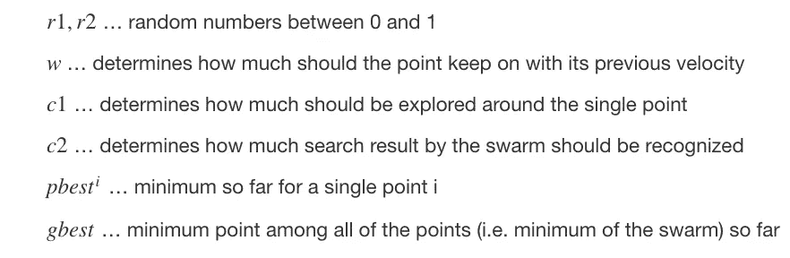
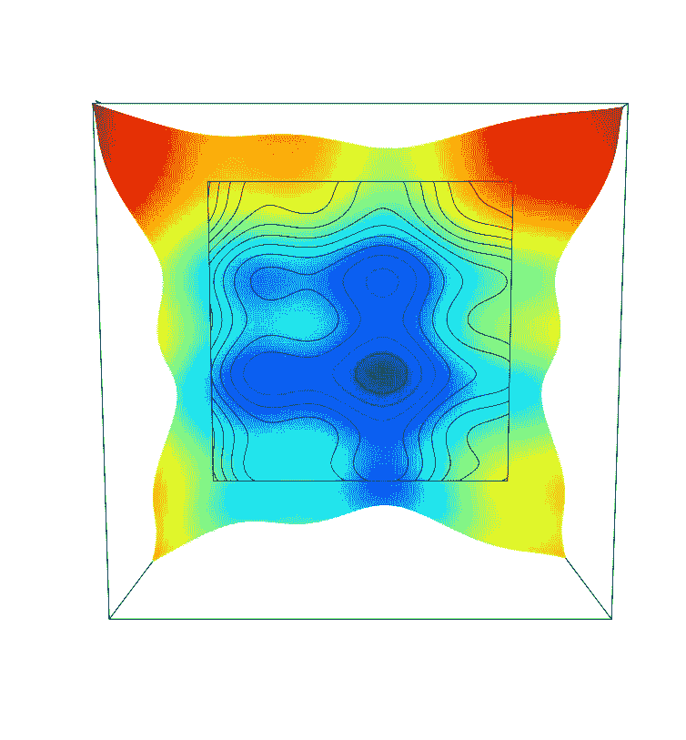
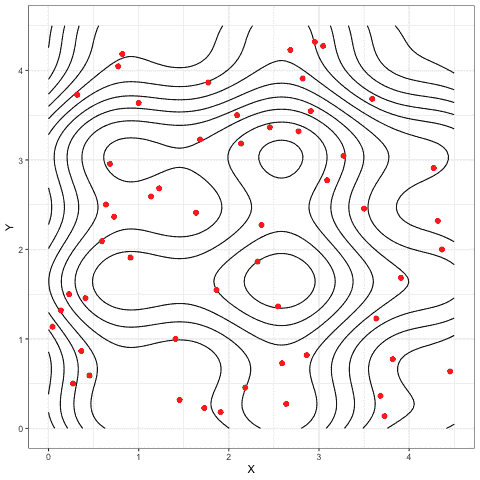
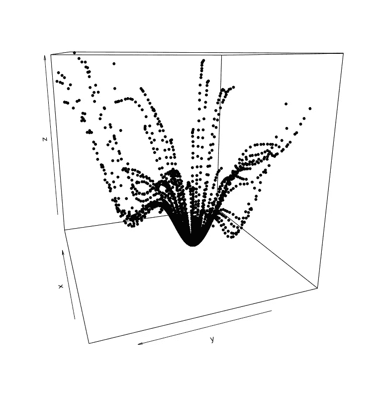
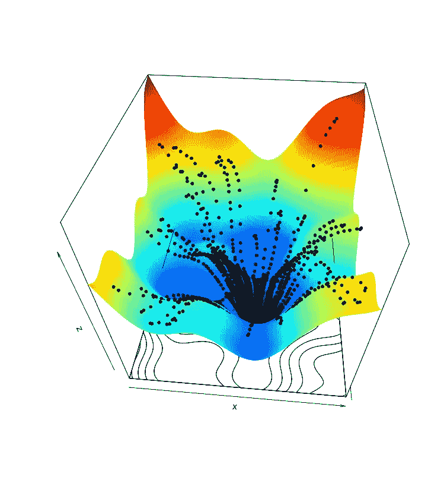

# 高效的数字转换—粒子群优化器

> 原文：<https://medium.com/analytics-vidhya/efficient-digital-transformation-particle-swarm-optimiser-aca8bd0dda26?source=collection_archive---------2----------------------->

# 群体智能

你可能会说我容易激动，但我发现更令人着迷的是，我们可以通过数学函数和几行代码**反映**鸟类、绵羊或蜜蜂的**群体行为**，以便利用这一现象优化例如机器学习模型。

群体智能的基本原理是，一群动物，就像一群鸟或一群鱼，在群体中移动，从每个成员的经验中获益。因此，团队的**结果要比单个成员的总和好得多。**

这堪比一群海豚猎食。每个成员都分享自己的经验和发现，以便小组本身能够寻求最佳方案。

照片由 fgxrocks0 经由 pixabay.com 拍摄

# 商业环境

在推动企业数字化转型的过程中，**至关重要的是**领导层要找到**技术背景、数学知识和行业专长**的正确组合，同时——注意**必要的文化转变**的发生。

了解周围的情况，这些工具、模型和“最先进”的应用程序大致如何工作，以及何时在何种情况下使用**与那些必须在新的技术环境中工作的**员工**建立信任，同时**也为那些必须做出决策的人提供更多便利和信任**。**

**高效的数据驱动战略决策是我们的目标。**

因此，在上一篇文章中——为了有助于实现这个目标——我们在技术方面做了一些阐述(参考下文)。

这一次，我们考察一个来自数学/技术领域的例子——粒子群优化器，作为群体智能的一面镜子。

# 粒子群优化器——基础

粒子群优化器原则上是一种由动物的群体智能行为引发的算法，正式来说是在解空间中搜索最优解。

这可能是**机器学习模型**的情况，该机器学习模型用于将观察结果分类为例如乳腺癌/非乳腺癌病例、违约/非违约信贷申请，或者被训练用于预测某些股票的股价。

在这种情况下，许多输入参数创建多维解空间，并且通过保持分类/预测中的误差总和尽可能低来搜索最优解。换句话说，所应用的机器学习算法的成本函数应该被置于其最小值。

对于下面的函数，这将是深蓝色区域。

作者图片

有**种不同的策略来寻找最优解**(这里是成本函数的最小值)。

其中一个策略是使用**梯度下降算法**。简而言之，这种优化算法试图通过改变输入参数的权重来达到成本函数的最小值。通过考虑误差的变化率来改变权重。所以，我们在微积分的问题之内。

但是，成本函数可能不只有一个最小值。相反，可能有许多局部最小值(上图中的蓝色点)和一个全局最小值(上图中的深蓝色点)。

**问题**是梯度下降算法**可能陷入局部最小值**之一，这将**表示次优解**。您可以在其他一些文章中找到关于这个主题的更多细节。参考资料补充如下。

**另一方面，粒子群优化器**试图通过“发送”均匀分布在解空间中的随机点来克服这些麻烦。然后，对于每个随机点，导出成本函数值。

现在，每个随机点(称为粒子)在两个方向上移动:

*   朝向每个点的局部最优(最小)值。
*   朝向所有点的全局最优值

随着这一步，群体智能开始行动。粒子的这种运动当然要重复几次。

# 粒子群优化器——更多细节

随着每一次迭代，这些单点中的任何一个在它自己的位置周围搜索最小值，同时由整个群检测到的一个最小值驱动。

在每次迭代中，每个单独的粒子将被更新如下:

随着

给定一个二维坐标系(x，y)，这意味着:

迭代 t+1 时的速度定义为:

随着

如前所述，该算法将有助于**更好地克服陷入局部最小值**的问题。此外，粒子群优化器**可以容易地并行化**，因为每个点可以并行更新，并且仅收集点最小值的更新值以及群最小值(例如，对于 map-reducing 架构很重要)。

最后但同样重要的是，粒子群优化器不依赖于成本函数的梯度，这在梯度难以导出时**会有帮助。**

# 粒子群优化器——一个例子

让我们回到上图中的函数。

俯视图清楚地显示了这个解空间中的**局部最小值**(蓝色区域)以及**全局最小值**:

作者图片

这是工作中的**粒子群优化器**！它显示了大约 50 个随机分布的粒子(红色)在 100 次迭代内下降到全局最小值的方式:

作者 gif

下一张图显示了那些最初随机分布的粒子是如何从 3D 角度找到它们进入全局最小值的。注意，例如在左侧，算法如何没有陷入那些局部最小值中的一个。

作者图片

最后，粒子群优化器在三维解空间中达到成本函数的全局最小值的总体结果:

作者图片

# 结论

就像我开头说的:太神奇了！

当然，这只是非常谨慎地触及粒子群优化的话题。关于这个主题的更多内容(以及在技术和金融领域的一些应用)，我在下面附上了一些参考资料。

尽管如此，这表明掌握技术概念和数学背景是相对容易的，以便帮助建立对这些新技术的必要信心和信任。

这有助于企业**将这些技术与基本业务经验**相结合，从而**触发数字化转型**，将这些技术带入适当的业务环境。

**业务环境、战略和新技术相结合——企业保持竞争优势的秘诀。**

# 参考

高效的数字化转型——始于 Christian Schitton 发表于 2021 年 11 月 7 日《媒体与分析》杂志的《小步骤》

D-DARKS 发表于 LinkedIn/2021 年 8 月 3 日的《机器学习中没有黑箱》

新一代信用评分:机器学习(第四部分),作者 Christian Schitton，发表于 LinkedIn/2020 年 2 月 24 日

Adrian Tam 发表在《机器学习掌握》/ 2021 年 9 月 16 日的《粒子群优化的温和介绍》

如何在 R 中从零开始构建一个基本的粒子群优化器

Arga Adyatama 的粒子群优化发表于 RPubs/2019 年 12 月 27 日

Riddhiman 在 R'tichoke 和 Rb loggers/2021 年 11 月 5 日发表的 R 中使用粒子群优化找到最佳投资组合