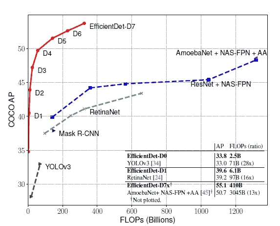
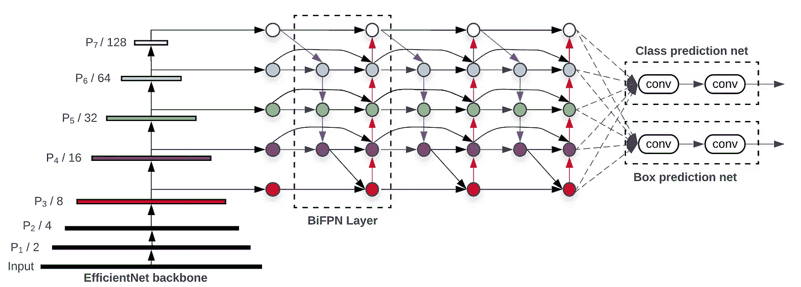
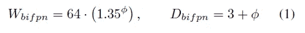
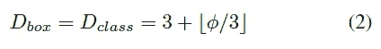
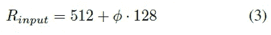
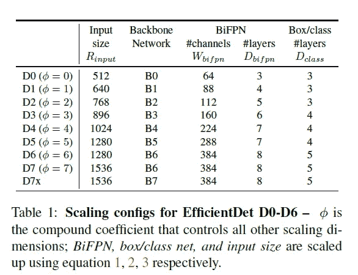

# EfficientDet:可扩展且高效的对象检测

> 原文：<https://medium.com/analytics-vidhya/efficientdet-scalable-and-efficient-object-detection-384a5df9011a?source=collection_archive---------3----------------------->

**简介:**

高效检测一系列新的目标检测模型。看到一个标题“EfficientDet”后想到的第一个问题，真的高效吗？让我们探索 EfficientDet 背后的直觉，看看它是否真的有效。

模型效率在计算机视觉中变得越来越重要。近年来，在更精确的物体检测方面已经取得了各种进展。但是随着我们向更精确的目标检测网络发展，网络在参数数量、FLOPS 方面将变得更昂贵。例如，最新的基于 AmoebaNet 的 NAS-FPN 检测器需要 167M 个参数和 3045B 个 FLOPS(比 RetinaNet 多 30 倍)才能达到最先进的精度。

提高目标检测网络精度的通常方法是通过增加层数或增加通道数或增加模型输入图像分辨率来使网络更深。但是随机增加上述维度中的任何一个都会降低精度增益。例如，ResNet-1000 与 ResNet-101 具有相似的精度，尽管它有更多的层。因此，在 effectively det 论文中，作者介绍了一种系统的模型缩放方法，并指出仔细平衡网络深度、宽度和分辨率可以获得更好的性能。

首先，在针对图像分类的 EfficientNet 论文中提出了模型缩放的概念(即通过增加网络的深度、宽度和分辨率来获得更好的性能)。但在看到 EfficientNet 的结果后，他们将这种技术应用于对象检测，并将其称为 EfficientDet。在 EfficientNet 论文中，作者开发了一个基线网络，他们称之为 EfficientNet，它是由 NAS(神经结构搜索)开发的。通过 NAS 开发网络背后的直觉是探索网络架构的空间(空间包含 Conv、Maxpool、SeparableConv 等)。到目前为止，无论我们有什么架构，例如 YOLO、固态硬盘等。所有这些架构都是由一些人类专家设计的，但这并不意味着我们完全探索了网络架构的空间。因此，谷歌的团队想出了一个通过 NAS 开发架构的想法，该架构在引擎盖下使用强化学习，并以某种程度的准确性和失败为优化目标开发了一个 EfficientNET(在这篇博客中，我们不讨论 NAS 如何工作)，然后我们在不同的资源约束下扩大了 EfficientNet，以获得 efficient net 模型家族(B0，B1，B2，B3，B4，B5，B6，B7)。

【EfficientDet 与其他模型的比较:

将相同的模型缩放概念应用于 EfficientDet，以获得针对不同资源约束的模型系列(D0、D1、D2、D3、D4、D5、D6、D7)。efficientdet-D0 在 COCO 数据集上使用 2.5B FLOPS 实现了 33.8 AP，比 YOLOv3 在 COCO 数据集上使用 71B FLOPS 实现 33 AP 小 28 倍。

**高效架构:**

EfficientDet 架构:采用 EfficientNet 作为主干网络，BiFPN 作为特征网络，共享类/箱预测网络。

EfficientDet 架构遵循一级检波器范式。他们采用 ImageNet-pre trained efficient nets 作为主干网络，并提出了 BiFPN 作为特征网络，它从主干网络中提取 3-7 级特征(P3、P4、P5、P6、P7 ),并重复应用自上而下和自下而上的双向特征融合。这些融合的特征被馈送到类和盒网络，以分别产生对象类和包围盒预测。

**主干网络:**使用与 B6 efficient net-B0 相同的宽度/深度缩放系数，以便可以使用 ImageNet 预训练的检查点。

**BiFPN 网络:**作者像在 EfficientNets 中所做的那样指数增长 BiFPN 宽度(通道数)，但是线性增加深度(层数)，因为深度需要四舍五入到小整数。在网格搜索之后，1.35 被检测为宽度的最佳比例因子。

**盒/类预测网络:**宽度保持与 BiFPN 相同，但深度(层数)线性增加。

**输入图像分辨率:**由于在 BiFPN 中使用特征级别 3–7，输入分辨率必须除以 *2^7* = 128，因此我们线性增加分辨率。

**参考文献:**

 [## EfficientDet:可扩展且高效的对象检测

### 模型效率在计算机视觉中变得越来越重要。本文系统地研究了神经网络

arxiv.org](https://arxiv.org/abs/1911.09070)  [## EfficientNet:重新思考卷积神经网络的模型缩放

### 卷积神经网络(ConvNets)通常是在固定的资源预算下开发的，然后按比例放大用于…

arxiv.org](https://arxiv.org/abs/1905.11946)