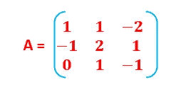
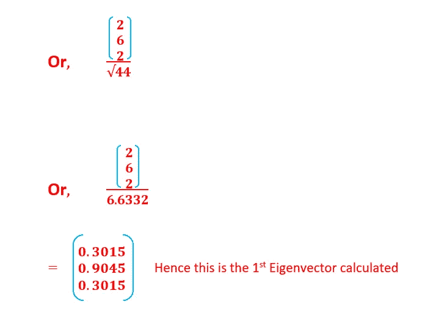

# 特征值和特征向量——计算隐藏在算法之下，但永远不会显示出来

> 原文：<https://medium.com/analytics-vidhya/eigenvalue-and-eigenvector-computation-hidden-beneath-algorithm-but-never-shows-up-10278975169b?source=collection_archive---------2----------------------->

大多数有数据科学和机器学习背景的人都会熟悉特征值和特征向量，以及它们在不同算法中的大量使用。

主题地图-

1.特征值和特征向量的应用范围

2.特征值和特征向量的使用

3.特征值和特征向量的计算

4.展示 RStudio 上的示例。

因此，我不会在这里触及特征向量和特征值的定义，但肯定会尝试向你展示它们是如何以最简单的方式计算的。

但在此之前，让我告诉你机器学习的不同领域，这些可以主要用于。

特征值和特征向量是许多众所周知的机器学习算法的构建块。

1.它们被广泛用于自然语言处理中的潜在语义分析(LSA)，

2.用于 SVD(奇异值分解)的推荐引擎中，

3.用于文本摘要，

4.用于特征选择和降维，包括 PCA(主成分分析)

5.用于计算机视觉，包括图像分割、人脸识别、光谱聚类、三维重建等。

所有上面列出的领域使用特征值和特征向量作为他们的核心逻辑。

因此，让我们通过一个示例来深入了解这两者是如何手动计算的。

让我们从一个基于用户评级的产品推荐系统的例子开始。该表描述了用户对产品的评分，评分范围为-3 到 3。其中 3 表示优秀，-3 表示较差

凡用户未对产品进行评级的地方，该列用 0 填充。

这是一个小维度的矩阵，但是想象一下，如果我们有一个非常大维度的矩阵，比如 100，000 行和 100 列，那么肯定会带来许多挑战。如此大的矩阵最终会占用磁盘上相当大的空间。此外，模型在数据上运行和自我训练变得非常耗时。让我们面临更多挑战的是，理解和可视化如此多维度的数据可能会变得更加困难。因此，理想的情况将是应用一种机制来将该矩阵转换/缩减为具有较小维度的较小空间。

*特征值和特征向量帮助我们减少维度空间，同时确保*大部分关键信息被保留*。*

这个 3×3 矩阵是基于上表描述的:

作者图片

该矩阵是 3×3 矩阵，即 n×m 矩阵，其中 n 是行，m 是列。

*为了进行这样的变换，原始矩阵 A 乘以一个向量 v。矩阵 A 乘以一个向量 v 计算出一个新的向量，该向量称为变换后的向量。*

*变换后的向量只是向量 v 的缩放形式，即标量(* λ)乘以*向量 v。因此，向量 v 被称为原始矩阵的特征向量，而标量* λ被称为特征值。

因此，利用这些特征向量，可以在没有太多信息损失的情况下表示大维矩阵。

*我们不必每次都手动计算特征值和特征向量，有算法可以做到这一点，但了解内部工作原理会让我们更有信心使用算法并更好地理解它。*

*因此它的数学部分:*

**Av = λv** **其中 A =矩阵，v =特征向量，λ =特征值**

*这意味着矩阵 A 和向量 v 可以用标量* **λ** *和向量 v*代替

为了进一步计算，我们需要熟悉两个概念。

1.  *一个矩阵的行列式=对角元素相乘，然后再相减得到。一旦我们做了计算，下面就清楚了。例如——*

作者图片

***a(e * I—f * h)—b(d * I—f * g)+c(d * h—e * g)= 0***

*2。单位矩阵——它是一个对角线为 1 且所有其他元素都为 0 的矩阵。例如——*

作者图片

此外， **Av = λv** 可以表示为:

**Av — λv** **= 0，即| A — λ * I | = 0**

随后，**行列式** ( **A — λ * I ) = 0**

*上式，***Av—λv****= 0***也可以写成*

**A *特征向量—特征值*特征向量= 0**

*更进一步，*

作者图片

作者图片

现在可以计算相关特征值的特征向量。

对于我们的计算，考虑λ = 2。

**| A — λ * I | =行列式** ( **A — λ * I ) = 0**

作者图片

*现在，*这可以通过高斯消去法找到特征向量来简化。

行缩减的第一步是从行 2 中减去行 1。

作者图片

最终的简化矩阵如下所示。

作者图片

随着矩阵的简化，我们可以通过求解下面的方程找到λ = 2 的相关特征向量，该方程本身是从上面表示的简化矩阵导出的。

注意:—第三行的所有元素都为 0。因此，只有行 1 和行 2 被考虑用于导出λ1、λ2 和λ3 值。

作者图片

因此，与λ = 2 相关的特征向量为

作者图片

作者图片

类似地，你可以计算另外两个特征值的特征向量。

现在，我将使用相同的矩阵 a，在 R 中得到相同的结果。

下面是给出相同结果的 R 代码。

#读取矩阵，A
A<-as . Matrix(data . frame(c(1，-1，0)，c(1，2，1)，c(-2，1，-1))

#显示矩阵
A

#计算特征值和特征向量
e < -特征值(A)

#显示特征值
e $值

#显示特征向量
e$vectors

因此，我总结了特征向量和特征值的计算。