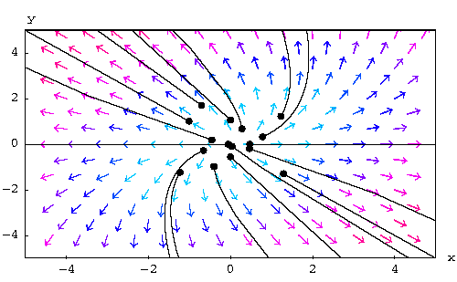
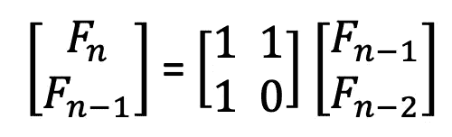
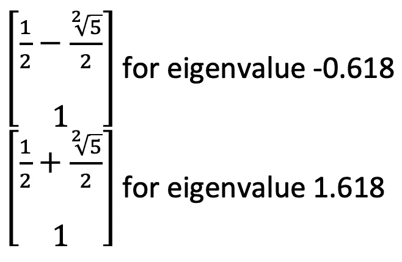
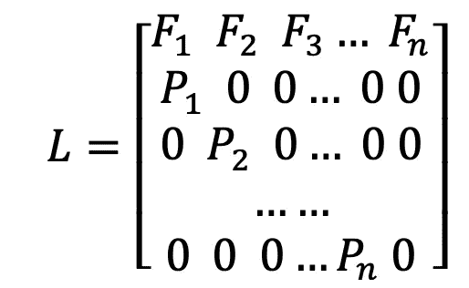
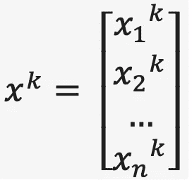

# 特征向量和特征值:更深入的理解

> 原文：<https://medium.com/analytics-vidhya/eigenvectors-and-eigenvalues-a-deeper-understanding-c715f8ded4c7?source=collection_archive---------4----------------------->

“Eigen”的字面意思是来自德语的特征。这些向量被恰当地命名，因为这些向量最终给出了某种趋势。任何具有特征向量的矩阵，其所有坐标最终都将遵循尽可能接近特征向量的关系。为了详细说明这一点，我将使用一些例子。

# 斐波那契数列

要解释斐波那契数列，它只是前面两项的和。如果我们从 0 和 1 开始序列，序列将是

0, 1, 1, 2, 3, 5, 8, 13…

它一直持续到无穷远。如果我们把它画在笛卡尔坐标系中，我们可以得到一个向量和一个方阵来给出斐波纳契数列的下一个值

第一行表示序列中的下一个值，而第二行表示序列中的当前值。如果我们绘制这个图，我们会看到每个值大约是前一个值的 1.618 倍。如果我们从 0 和 1 开始，第十个值将是 55，第十一个值将是 89。我们还可以看到，55 乘以 1.618 也大约是 89。如果我们计算这个向量的特征值，结果是-0.618 和 1.618。其特征向量为

该序列不仅将遵循它将是前一项的 1.618 倍的趋势，而且它还将在遵循向量的线上，该向量是 1.618 的特征值的相同特征向量，因为 1.618 是主要特征值。由此我们可以理解特征值的重要性，因为最终一个序列如果以矩阵的形式书写，将遵循由其特征值和其特征向量定义的特征。随着项数的增加，我们可以很容易地推导出下一个项数的精确程度。

这不仅可以用起始值 0 和 1 来实现，还可以用任何值来实现。我们将看到，下一项增加的因子与本征值相同。随着这些值的增加，它们也将接近代表系统中特征向量的线。

# 人口增长模型

在 20 世纪 40 年代，P.H .莱斯利发现了一种模拟人口增长的方法，用这种方法我们可以相对准确地发现人口增长的程度。莱斯利矩阵作用于我们正在处理的特定物种的繁殖率和存活率的概率。莱斯利矩阵是通过将各自的值放入矩阵中而形成的

其中 n 是我们对人口进行划分的阶段数，F 是人口中女性的数量，P 是属于人口中一个阶段的成员进入下一个阶段的概率。我们只选取女性群体，因为在给定的群体中，女性是负责繁殖的群体。我们把这个矩阵代入矩阵方程

xₖ₊₁=xₖ

其中 xᵏ是矩阵

这个矩阵中的 k 值代表我们处理初始人口的年份，n 是人口被划分的阶段数。这个等式是由逻辑得到的

x₁=x₀

和

x₂=x₁=x₀=x₀

诸如此类。虽然用这个矩阵方程我们可以容易地计算种群增长，但是对于大的 k 值，需要大量的计算，因此我们找到了系统的特征向量和相应的特征值。通过这个，我们得到了系统增长的总趋势，最终我们可以很容易地计算出 k 值大时 xₖ的值

# 求解微分方程组

通过将适当的值放入增广矩阵中，我们可以借助于特征值及其对应的特征向量来求解微分方程组。在首先找到增广矩阵的特征值之后，我们以对角矩阵(D)的形式排列它们，其对角元素是特征值。然后，我们找到相应的特征向量，我们安排在一个矩阵(P)。

我们将在方程 u = Du '中代入对角矩阵，其中 u 是系统的解。还应该注意到，D 向量向我们显示了系统在每次迭代中改变了多少，因此它也代表了系统的变化率。一旦我们找到 u，我们把它放入方程 y = Pu，其中 P 是包含特征向量的矩阵。矩阵 P 将给出每次迭代中值将如何变化的大致方向，当我们将这些值相乘时，我们将能够得到系统(y)的解。

特别是通过看微分方程系统的最后一个例子，我们可以看到特征向量和特征值如何向我们展示一个系统如何变化的一般趋势。特征值向我们展示了系统变化率的大小，特征向量向我们展示了变化发生的方向。