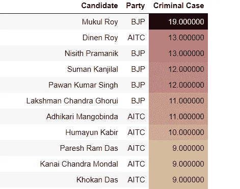

# 2021 年选举分析:西孟加拉邦

> 原文：<https://medium.com/analytics-vidhya/election-analysis-2021-west-bengal-b78aad7d9d03?source=collection_archive---------24----------------------->


在过去的三个月里，印度媒体最重要的新闻是孟加拉国的选举，因为莫迪政府竭尽全力去赢得选举。尽管他们坚持不懈的努力，他们甚至没有越过 3 位数的大关。

# 分析

我们将分析选举数据。我已经从这个 [**网站**](https://myneta.info/WestBengal2021/) **下载了我的数据。**

# 所有候选人数据

我们已经下载了数据，在开始分析之前，我会试着更好地理解数据。

```
import pyforest
df=pd.read_csv("west_bengal/west_bengal.csv")
```


```
df.info()
```


# 大多数 Imp 选区

```
constituency = df['constituency'].value_counts().head(10)fig = px.bar(x=constituency.index, y=constituency, height=500, width=700, title='Top 10 Constituency Name')fig.update_traces(marker = dict(
                            line = dict(color = "rgb(20, 20, 20)", width = 2)))
fig.show()
```


# 刑事案件

```
df.groupby('party')['criminal_cases'].sum().reset_index().sort_values(by='criminal_cases', ascending=False).head(15).style.background_gradient(cmap='Blues')
```


```
crime = df[df['criminal_cases']!=0]
crime =crime.groupby(['candidate','party'])['criminal_cases'].sum().reset_index().sort_values(by='criminal_cases',ascending=False)
crime.style.background_gradient(cmap='pink_r')
```


观察 : BJP 候选人身上的刑事案件数量最多。一名 BJP 候选人身上总共有 27 起案件，他仍在竞选中。

# 教育

```
fig = px.pie(values=df['education'].value_counts(), names=df['education'].value_counts().index, height=500)fig.update_traces(pull=[0.0,0.0,0.2,0.0], hole=.3, hoverinfo="label+percent", marker=dict(colors=line_colors, line=dict(color='black', width=2)))fig['layout'].update(title='Education Distribution', titlefont_size=20)fig.show()
```


```
a4_dims = (19, 7.5)
fig, ax = plt.subplots(figsize=a4_dims)
sns.set(style='darkgrid')
sns.countplot(x ='education', 
              data = df , 
              order = df['education'].value_counts().index ,
              palette ="prism")
fig.suptitle('Education Distribution using Bar Chart', fontsize=25)
plt.show()
```


**观察**:所有应聘者中有 25%是毕业生。只有 18%的人是研究生。

# 总资产

```
df.groupby('party')['total_assets'].sum().reset_index().sort_values(by='total_assets',ascending=False)
```


观察:AITC 拥有最多的资产，其次是 BJP。

# 选举获胜者 2021 孟加拉语

可以再次从同一个 [**网站**](https://myneta.info/Puducherry2021/index.php?action=show_winners&sort=default) 收集数据。之前对所有竞选候选人的分析。我们将讨论选举结果和获胜的候选人。

```
bengal=pd.read_csv("bengal_votes.csv")
```


```
party_winner = bengal['Party'].value_counts()

fig = px.bar(x=party_winner.index, y=party_winner, height=600, width=1100, title='Party Distribution', text=(bengal['Party'].value_counts()/len(bengal['Party'])*100))fig.update_traces(textposition='outside',texttemplate='%{text:.4s}%',marker = dict(color = "rgba(255, 0, 0, 0.7)",
                            line = dict(color = "rgb(20, 20, 20)", width = 2)))
fig.show()
```


# 刑事案件

```
bengal.groupby("Party")["Criminal Case"].sum().reset_index().sort_values(by="Criminal Case", ascending=False).style.background_gradient(cmap='Blues')
```


```
crime = bengal[bengal['Criminal Case']!=0]
crime =crime.groupby(['Candidate','Party'])['Criminal Case'].sum().reset_index().sort_values(by='Criminal Case',ascending=False)
crime.style.background_gradient(cmap='pink_r')
```



意见:在获胜的议员中，AITC 的刑事案件最多，这是显而易见的，因为他们有 202 名议员在选举中获胜。来自 BJP 的 Mukul Roy 拥有最高的个人案例。

# 教育

```
fig = px.pie(values=bengal['Education'].value_counts(), names=bengal['Education'].value_counts().index, height=500)fig.update_traces(pull=[0.0,0.0,0.2,0.0], hole=.3, hoverinfo="label+percent", marker=dict(colors=line_colors, line=dict(color='black', width=2)))fig['layout'].update(title='Education Distribution', titlefont_size=20)fig.show()
```


```
a4_dims = (19, 7.5)
fig, ax = plt.subplots(figsize=a4_dims)
sns.set(style='darkgrid')
sns.countplot(x ='Education', 
              data = bengal , 
              order = bengal['Education'].value_counts().index ,
              palette ="prism")
fig.suptitle('Education Distribution using Bar Chart', fontsize=25)
plt.show()
```


**观察**:最高数量的中标候选人(24%)是毕业生。21%的胜出候选人仅仅是第 12 关。

# 再次竞选成员中的叛逃者

对于数据，我会使用 [**网站**](https://myneta.info/WestBengal2021/index.php?action=recontestAssetsComparison) **。**这次很多候选人改变了党派，正如媒体告诉我们的，很多 TMC 成员在选举前加入了 BJP。这就是我想知道的

```
defectors.value_counts("Remarks").reset_index().style.background_gradient(cmap="Pastel2")
```


观察:从 INC 叛逃的人比 AITC 还多。