# 电子随机事实 API(应用编程接口)

> 原文：<https://medium.com/analytics-vidhya/electronics-random-facts-api-application-programming-interface-70b9914cbf94?source=collection_archive---------11----------------------->

安基塔·达雷卡

[苏亚斯克](https://medium.com/u/b3e08ad7ef89?source=post_page-----70b9914cbf94--------------------------------)

**API(应用编程接口)**

您是否曾经想过如何从一个应用程序中提取一个特性并集成到另一个应用程序中？

每次你查看天气、搜索位置或在手机上收到通知时，你都在使用 API。有用且吸引人的 API 可以给应用程序带来惊喜。

应用编程接口(API)是两个软件之间的媒介，允许它们进行通信。它从系统中获取响应，并返回给用户。API 让用户更容易直观地找到资源

因此，API 使我们能够从其他应用程序中提取特性，并将这些特性与我们的应用程序集成。

# 内部和外部 API

在我们的云时代，移动设备的增加以及对服务的大规模内部/外部采用的需求，基于 REST 的 API 已经取代了 SOAP Web 服务。REST APIs 是基于 HTTP 的，更轻便，更容易理解和集成，因此已经成为创建企业 API 的事实上的标准。企业 API 可以是内部 API，即 LoB(业务线)内部或跨 LoB(业务线)的 API，也可以是面向合作伙伴和第三方开发人员的外部 API。

外部 API 是一种接口，旨在方便广大网络和移动开发者访问。这意味着外部 API 既可以由发布 API 的组织内部的开发人员使用，也可以由希望注册访问该接口的组织外部的任何开发人员使用。

# 何时创建 API

1.当用户需要访问数据时

2.当数据频繁更改或更新时。

3.当用户需要从应用程序中提取一个特性时。

# 应用

我们都在各种活动或聚会中使用 twitter 机器人，以显示所有人的参与和热情。这是 API 最好的应用之一。Twitter 机器人是根据软件指令自动发布(或转发)、关注和发送直接消息的帐户。

所有这些机器人都由 Twitter API 驱动。除了允许你执行简单的动作——比如发微博或关注用户 Twitter API 还可以告诉机器人平台上什么时候发生了特定的事情。例如，您可以要求 Twitter API 告诉您的机器人，每当它收到一个新的追随者。然后，您可以对您的机器人进行编程，使用 API 向追随者发送消息。

# 使用 flask 从头开始创建 API

让我们学习使用 flask 从头开始创建 API！！！

在做很多项目的时候，我们会遇到很多有“每日提示”功能的软件。这个特性确实有利于用户在使用该软件时了解一些有用的提示和技巧。它让我们的生活更轻松！！

同样的，如果我们将一个叫做“每日事实”的功能整合到任何一个学术平台上，你不认为学生们了解与他们正在学习的主题相关的各种有趣的事实是有益和令人兴奋的吗？

给你一个惊喜！

我们将从头开始创建一个 API。这个 API 会随机显示一些与“电子”相关的有趣事实。您可以进一步将这个 API 集成到您的应用程序中。

# 软件要求:

**Python IDE** (集成开发环境)

https://code.visualstudio.com/download

**Heroku cli**

[https://devcenter.heroku.com/articles/heroku-](https://devcenter.heroku.com/articles/heroku-cli%23download-and-install)[CLI #下载安装](https://devcenter.heroku.com/articles/heroku-cli%23download-and-install)

**邮递员金丝雀**

[https://www.postman.com/downloads/canary/](https://www.postman.com/downloads/canary/)

你需要做的就是遵循这些步骤！！！

# **第一步**:创建一个文件夹——“app”

# **第二步:**打开端子

**a .**创建虚拟环境—【env】—环境名称

**b .激活虚拟环境**

这就是你的终端看起来的样子。

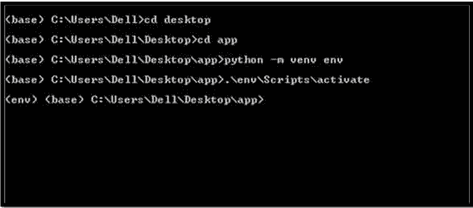

# **第三步:数据集创建:**

在“app”文件夹中创建包含事实的“facts.csv”。您可以在此处找到数据集:

它包含 30 个电子事实。[https://github.com/darekarankita0/factt/blob/main/facts.csv](https://github.com/darekarankita0/factt/blob/main/facts.csv)

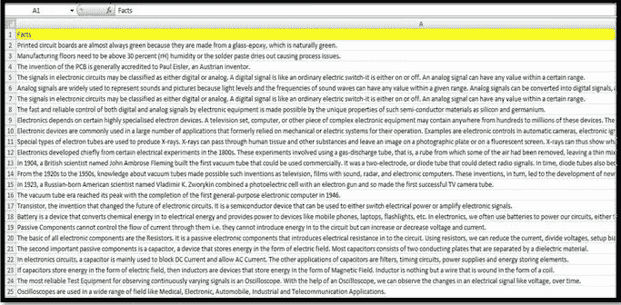

# 第四步:烧瓶:

Flask 是一个用 Python 写的 web 应用框架。Flask 基于 Werkzeug WSGI 工具包和 Jinja2 模板引擎。

**烧瓶代号:**【app . py】[https://github.com/darekarankita0/factt/blob/main/app.py](https://github.com/darekarankita0/factt/blob/main/app.py)

这个 API 将显示与电子相关的随机事实。每次调用 API 时，都会显示不同的事实。

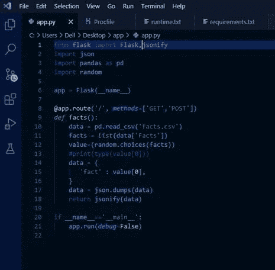

# 烧瓶:

导入 Flask 模块并从 Flask 模块创建 Flask web 服务器。

## __name__:

这是当前文件。这个当前文件将代表我们的 web 应用程序。我们正在创建 Flask 类的一个实例，并将其命名为 app。

## @app.route("/"):

它表示默认页面。根据应用程序中的特性，我们可以在代码中定义各种路由。

当一条路线被调用时，该功能被激活。

## “主要”:

当我们运行 python 脚本时，它会在执行时将名称“main”分配给脚本。如果我们导入另一个脚本，If 语句将阻止其他脚本运行。

当我们运行 app.py 时，它会将其名称改为 main，然后 if 语句才会激活。

## **调试:**

这将运行应用程序。使 debug=True 会允许网页上出现可能的 python 错误。这将有助于我们跟踪错误。

## **jsonify** :

jsonify 是 flask 的 Flask 中的一个函数。json 模块。jsonify 将数据序列化为 JavaScript Object Notation (JSON)格式，用 application/json mimetype 将它包装在一个响应对象中。注意，jsonify 有时是直接从 flask 模块导入的，而不是从 flask 导入的。

为什么两个 HTTP 方法，methods=['GET '，' POST']？

嗯，我们最终将对 GET 和 POST 请求使用相同的路径——分别服务于 facts.html 的*页面和处理表单提交。*

# 步骤 5:安装模块:

*pip 安装烧瓶 gunicorn 熊猫*

# 步骤 6:在本地主机上运行 flask api:

*python app.py*

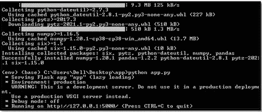

# 第七步:

复制本地主机 url 并粘贴到 Postman 中测试 API:[http://127 . 0 . 0 . 1:5000/](http://127.0.0.1:5000/)

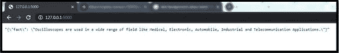

# 步骤 8:在“app”文件夹中创建“Procfile”

*web: gunicorn app:app*

**web** — web 应用

gunicorn 是一个用于 WSGI 应用程序的纯 Python HTTP 服务器。它允许您通过运行多个

**app**—guni corn 后面的第一个“app”是我们主文件的名字。

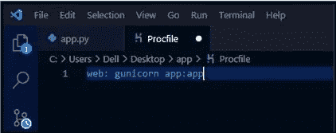

# 步骤 9:在“app”文件夹中创建“requirements.txt”

在终端中运行下面的命令来创建“requirements.txt”

*pip 冻结> requirements.txt*

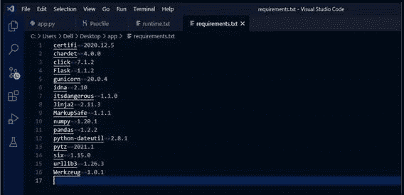

这就是 requirements.txt 的样子。

它包含运行应用程序所需的各种库。

# 步骤 10:在“app”文件夹中创建“runtime.txt”

您需要使用以下命令检查您的 python 版本:

*python -V*

“runtime.txt”文件包含 python 版本，例如:python-3.8.5

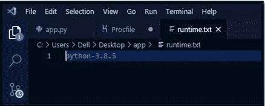

# 现在你一定在想创建所有这些文件的目的是什么！！

在 heroku 平台上部署我们的 API 时，我们将使用所有这些文件。

让我们进入下一步。

# 部署 API:

**1。** **HEROKU**

**2。** **NGROK**

**1。** **HEROKU**

Heroku 是一个基于容器的云平台即服务(PaaS)。开发人员使用 Heroku 来部署、管理和扩展现代应用。这个平台优雅、灵活且易于使用，为开发者提供了将应用推向市场的最简单途径。

# 部署在 heroku

第一步:在 heroku 上创建一个免费账户。可以免费部署 5 个 app！https://id.heroku.com/login

# 步骤 2:选择任意一种部署方法。

在 heroku cloud 上部署应用有 3 种方式。

# A.Heroku Git —使用 heroku cli

**安装 heroku cli**

https://dev center . heroku . com/articles/heroku-CLI #下载并安装

**初始化一个空存储库，在存储库中添加文件，并提交所有更改**。

*git 初始化*

*git 添加*

*git commit -m“初始提交”*

**使用**登录 heroku CLI

*heroku 登录或 heroku 登录-i*

*heroko 创造*

**从本地向 heroku 远程推送代码。**

*饭桶推 heroku 主人*

[**https://mighty-caverns-32025.herokuapp.com/**](https://mighty-caverns-32025.herokuapp.com/)

**b .**GitHub

**GitHub** 是一个用于版本控制和协作的代码托管平台。您可以将代码存储在存储库中

[**https://github.com/**](https://github.com/)

**在 heroku** 上选择部署方式为“GitHub”

**新建—创建新应用—应用名称—创建应用**

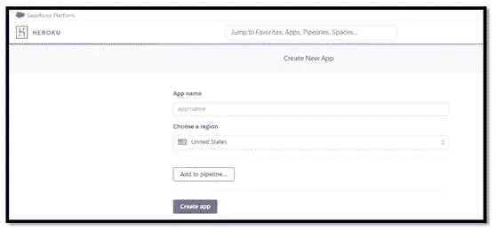

**在 github 上创建一个新的资源库，并将文件从“app”文件夹上传到资源库**

**提交**

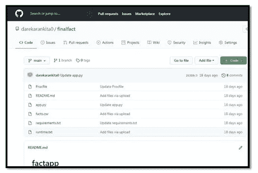

**搜索存储库并启用自动部署**

**点击部署分支**

[https://mighty-caverns-32025.herokuapp.com/](https://mighty-caverns-32025.herokuapp.com/)

**3。容器注册表— —使用 herok cli**

安装 Heroku CLI

**下载并安装** [**Heroku CLI。**](https://devcenter.heroku.com/articles/heroku-command-line)

如果您还没有，请登录您的 Heroku 帐户，按照提示创建一个新的 SSH 公共密钥。

*heroku 登录*

**登录集装箱登记处**

您必须在本地安装 Docker 才能继续。运行此命令时，您应该会看到输出。

*docker ps*

**现在您可以登录集装箱登记处。**

*heroku 容器:登录*

**推送基于 Docker 的应用**

**在当前目录下构建 Docker 文件，并推送 Docker 镜像。**

*heroku 容器:推送网页*

**部署变更**

**发布新推送的图片以部署您的应用。**

heroku 容器:发布网页

# 2.NGROK

NGROK 是一个跨平台的应用程序，它使开发人员能够以最少的努力将本地开发服务器公开给 Internet。该软件使您的本地托管的 web 服务器看起来托管在 ngrok.com 的一个子域上，这意味着不需要本地机器上的公共 IP 或域名。

**第一步**。在[www.ngrok.com](http://www.ngrok.com/)创建账户

**第二步。**下载 NGROK 应用程序

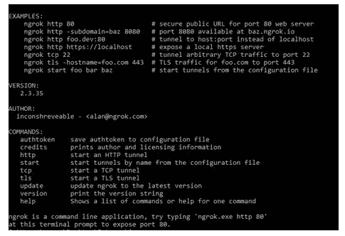

**第三步。**通过命令 ngrok authtoken 整合 authtoken (authtoken 在[www.ngrok.com](http://www.ngrok.com/)的 dasboard 上给出)

**步骤四。**使用 comman ngrok http:[http://127 . 0 . 0 . 1:5000/](http://127.0.0.1:5000/)启动隧道

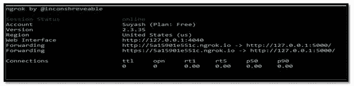

**下面给你一些参考！**

**参考文献:**

**烧瓶:**https://flask-doc.readthedocs.io/

**HEROKU:**https://devcenter.heroku.com/categories/reference

**恩罗克:**https://ngrok.com/docs

**邮差金丝雀:**[https://learning . POSTMAN . com/docs/getting-started/introduction/](https://learning.postman.com/docs/getting-started/introduction/)

此外，您可以将该 API 集成到您的应用程序中。让我们在后半部分将 API 集成到聊天机器人中！！

与此同时，您可以查看[这个](/@mavihs62/custom-bots-using-rasa-framework-and-java-a11f86c470ab)博客来集成 API，查看[这个博客](https://dev-guha2000.medium.com/augmented-reality-chatbot-531a402dfb5f)来实现 JAR 文件中的 AR(在 chatbot 框架中)，这样您就可以自己创建一个端到端的项目。

# **谢谢你！**