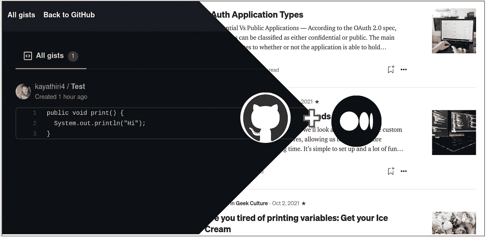

# 在你的文章中嵌入代码

> 原文：<https://medium.com/analytics-vidhya/embed-code-to-your-medium-article-be592729c280?source=collection_archive---------4----------------------->

嵌入来自 Github Gist 的代码

您可能已经写了许多文章，并试图在文章中包含代码片段。你的大部分文章，将包括编程代码。您可以使用以下不同的技术来包含代码片段:

# 1:直接嵌入

可以使用 **Command+Alt/Option+6** 来添加代码片段。您可以在代码片段中添加代码。输出如下所示: