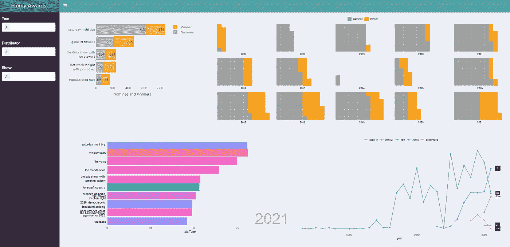
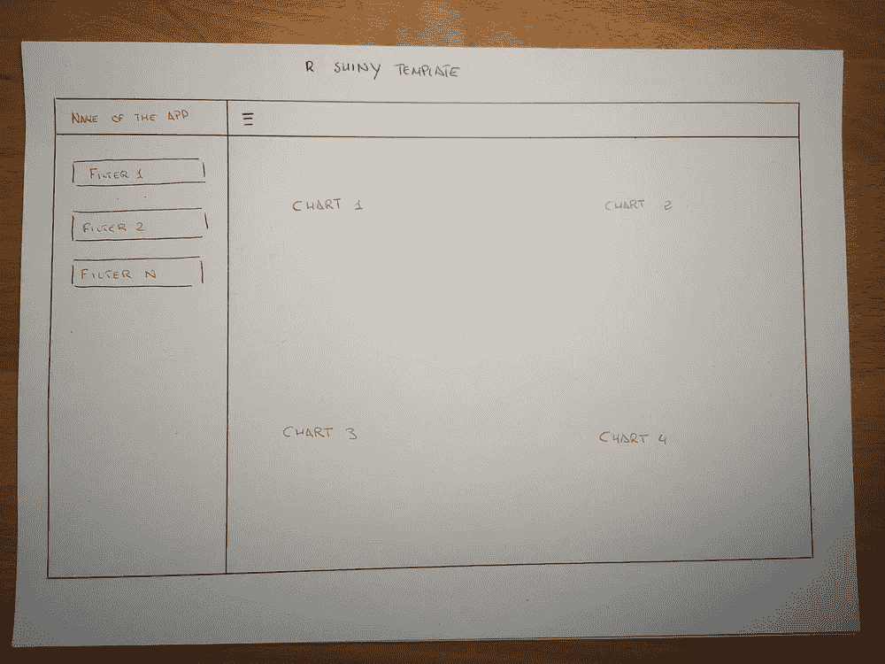
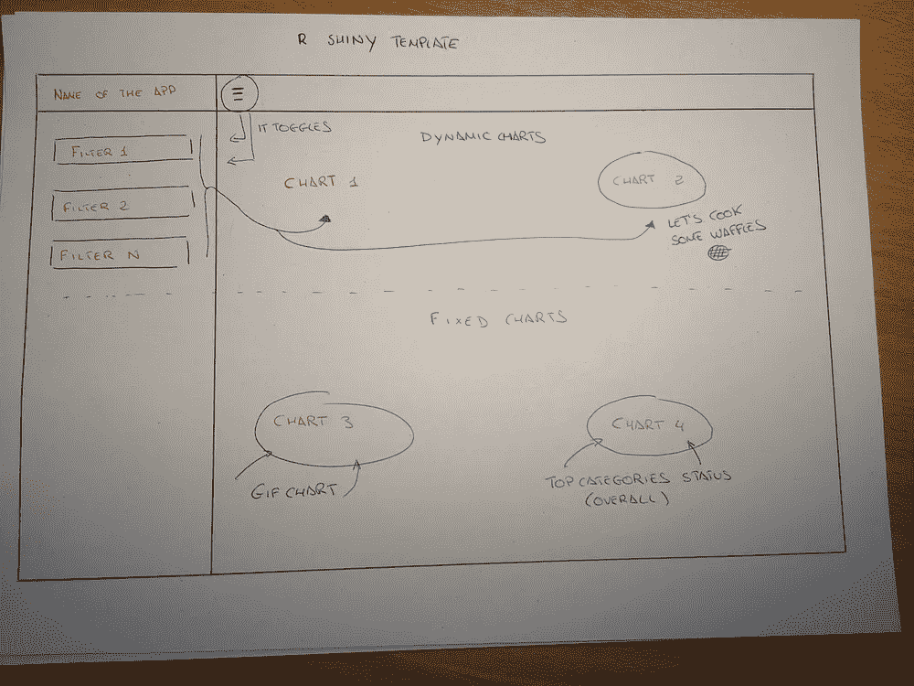
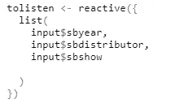
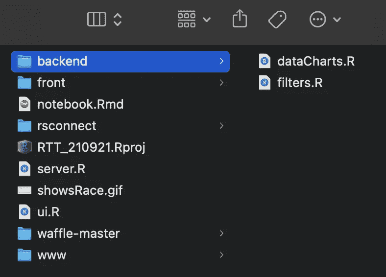
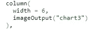
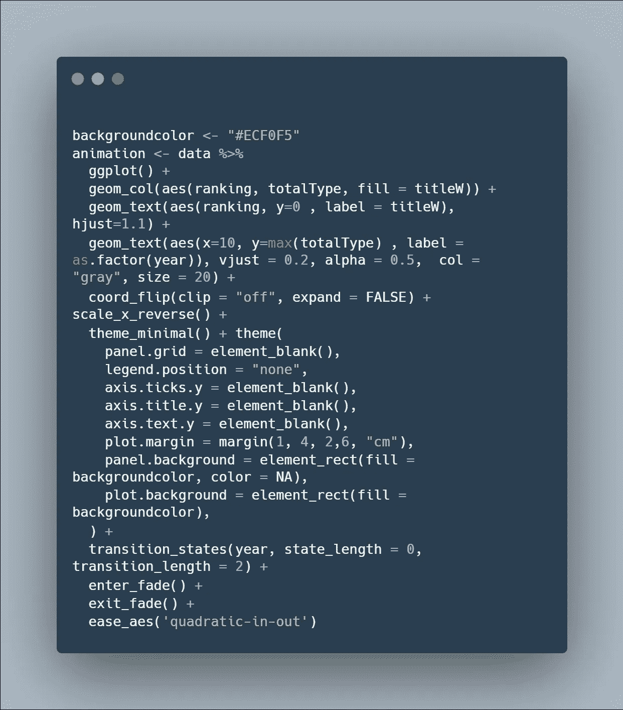
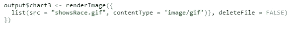
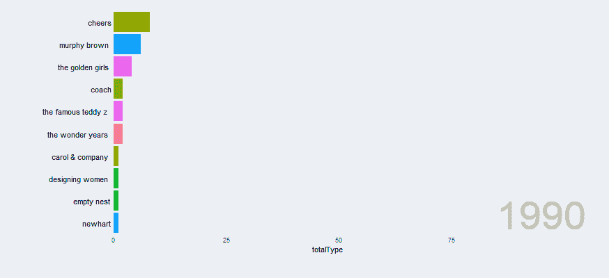

# 艾美奖奖——建立我自己的闪亮框架

> 原文：<https://medium.com/analytics-vidhya/emmy-awards-building-my-own-r-shiny-framework-237538880cf7?source=collection_archive---------4----------------------->

T4 最近发布的最酷的数据集之一是艾美奖奖数据集。

对于那些不知道的人来说，TidyTuesday 挑战是关于每周在 R 中进行一次数据探索，使用 TidyTuesday 提供的数据集或文章。

这是提高你的 R 技能、获得反馈和认识社区中许多有趣的人的绝佳方式。

对于这个特定的挑战，我利用了我作为一名**开发人员**(代码效率，如何生成可靠的文件结构，部署知识)和作为一名**数据分析师**的知识:如何争论和正确地呈现数据。因此，我创建了一个自定义的 R Shiny 框架，以便将来作为模板使用。

最终仪表板

# 用户界面

在开始编码之前，我最初的想法是创建一个易于复制的仪表板，作为我未来项目的模板。因此，它应该包含:

*   **Filters** :多选，在这种情况下动态查看数据。
*   **侧边栏的切换功能**。过滤器需要屏幕上的空间，这应该是可选的。
*   **CSS** 定制应用:我自己的颜色和字体🎨
*   图表用空格分隔:为了保持整洁，通常我会尽量展示不超过 4 个图表。

所以我心目中的用户界面是这样的:

R 闪亮模板的草稿

# 我的自定义 R 闪亮框架

设计好 UI 结构后，下一步是创建文件基础设施，避免我的文件杂乱无章。在用不同的代码语言(Django，Angular，Laravel…)使用了几个框架之后，我认为把我的文件分成几个部分的最好方法是:

**前端文件**

*   `ui.R`:包含了 app 的整体结构。
*   **前端**文件夹:包含与图表可视化相关的 R 文件。

如果你想添加很多元素，比如过滤器、图表等等，一个好的代码实践是将`ui.R`分成几个文件。为了让你的代码尽可能的干净。在这种情况下，没有必要。

**后端文件**

*   `server.R`:它包含了应用程序的反应部分:提取数据，ETL，最后将数据返回给 ui。

让我们在这里暂停一下。从 ui 中收集过滤器参数很重要，以便以后使用它们来过滤我们的数据。为了做到这一点，我们创建了一个*反应*元素，它将作为应用程序中的监听器。

过滤器参数的监听器。

之后，我们创建一个`observeEvent`来使用监听器信息。

*   **后端**文件夹:它包含一个控制过滤器功能的`filters.R`文件和一个过滤和变异数据以便在可视化中使用的`dataCharts.R`文件。

**笔记本。Rmd** **文件**:它允许我创建和测试图表，而无需在每次需要时激活应用程序。是快速测试和做实验的好方法。

**www 文件夹**:包含 app 的 CSS。此外，如果你想添加任何图片加载到闪亮的应用程序，这里是你把它。

最后但同样重要的是，生成这个特定的应用程序还有其他必要的文件:

*   *showsRace.gif.* 这个 gif 被用作应用程序中的图表 3，这是因为(据我所知)在 R shiny 中绘制动画图表时，需要先将其导出为 gif。
*   *华夫饼主*文件夹。这个文件夹是我用来在应用程序中生成[华夫饼](https://github.com/hrbrmstr/waffle)的库。我把它放在这里是因为，由于 waffle 库不是一个 CRAN 包，当你在 R Shiny 中部署它时，你会得到一个错误。这个错误的解决方案是从源代码下载这个包，并在代码中加载它。

我为文件基础设施定制的框架。

# 将 gif 包含到仪表板中

让我们看一个具体的例子来说明这一切是如何工作的:让我们生成动画的条形图并将其绘制到仪表板中。

首先，我们需要在 *ui* 中为图表创建一个空间(在本例中，将是第三个图表):

我们使用 imageOutput，因为我们需要在这里显示一个 gif

之后，我们需要在 R 闪亮的外面生成 gif，下面是代码

R 中的 Bar Race gif

最后一步是使用`server.R`中的代码渲染图像，如下所示:

这将把我们的动画图表绘制到仪表板中👏

# 结论

经过几个小时的编码和拼接，这是最终的仪表板，其中:

*   左上图:它显示了根据提名和获奖情况排序的前 5 名节目。
*   右上角的图表:在这里你可以看到一个华夫饼可视化，前一个图表中绘制的前 1 名节目的提名数与获胜数(即:下一个图像代表*周六夜现场*的提名者与获胜者)
*   左下角图表:每年 10 大动态 gif 展示。
*   右下角的图表:随着时间的推移，我最喜欢的每个分销商有多少“胜利”。

该代码包含在:

*   r 闪亮:[https://j0xkj8-juan0antonio.shinyapps.io/RTT_210921/](https://j0xkj8-juan0antonio.shinyapps.io/RTT_210921/)
*   github:[https://github.com/juaancabsou/r-tidy-tuesday](https://github.com/juaancabsou/r-tidy-tuesday)

这就是这个整洁的星期二的全部内容。感谢阅读！如果您有任何反馈，我们将非常欢迎和感谢。

联系信息

*   📱领英:[胡安·安东尼奥·卡贝萨·索萨](https://www.linkedin.com/in/juan-antonio-cabeza-sousa-5b954968/)
*   📬电子邮件:juaancabsou@gmail.com
*   🖥️推特:@Aceconhielo