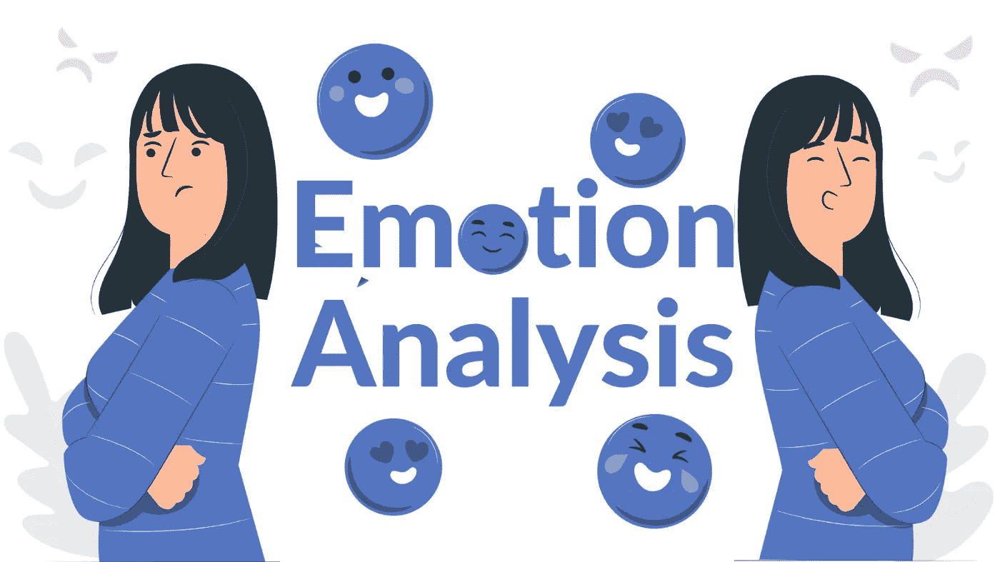

# 情感分析

> 原文：<https://medium.com/analytics-vidhya/emotion-analysis-d7a9d68b17ed?source=collection_archive---------3----------------------->

在某些情况下，情感分析可能无法捕捉客户的真实感受。发现和解释文本数据中描述的潜在情绪的技术被称为情绪分析。

[情感分析](https://www.bytesview.com/emotion-analysis)可以从各种来源收集文本数据，以检查主观信息并理解其背后的情感。

情感分析是发现和解释文本材料中传达的情感的技术。

情绪检测和分类是简单的任务，可以根据文本中描述的情绪类型来完成，如恐惧、愤怒、快乐、悲伤、爱、灵感或中立。核心意图是通过分配极性(消极、积极或中性)来提取观点、想法和思想，从而分析人类语言。

这些顾客的评论包含了编码他们购物感受的信息。对某些企业的审查和评级是在决策过程中提供一些情报以确保企业进步的重要前奏。

这篇短文试图在情绪分析的主题上完全指导初学者，因此它讨论了好处、应用和工具。

# 情绪分析的好处

*   通过分析大量的社交媒体和反馈数据，检查和权衡文本数据中传达的情绪。
*   情感分析将帮助你确定你的品牌在用户中的声誉。定义可能损害公司声誉的通知。
*   情绪分析有助于识别早期问题，并在问题变得更严重之前解决它们，从而避免人才流失。

# 这里有一些有趣的情感分析方法。

**识别和预测市场趋势**

它允许您分析大量的市场研究数据，以确定新兴趋势，并更好地了解消费者情绪。这种练习可以帮助你在复杂的股市交易中导航，并根据市场情绪做出决定。

**对品牌形象保持警惕**

情感分析经常被用来调查用户对产品或话题的看法。它还可以用于进行产品分析，并向开发团队提供所有相关数据。

**看看民意调查和政治调查**

任何人都可以使用情绪分析来编译和分析大量的文本数据，如新闻、社交媒体、观点和建议，以预测选举的结果。它考虑了公众对两位候选人的感受。

**正在分析客户反馈数据。**

客户反馈数据可用于确定需要改进的地方。情绪分析可以帮助您从客户反馈数据中提取价值和见解，并制定有效的客户满意度策略。

**观察和分析社交媒体对话**

社交媒体对话是信息的金矿。通过情绪分析，看看社交媒体上关于你的品牌的对话，看看你的客户在说什么；这可以帮助任何公司更有效地规划未来战略。

**员工流动率下降**

分析大量员工反馈数据，确定员工满意度。情绪分析工具使用这些见解来提高士气和生产力，同时还告诉您员工的感受。

# 用于情绪分析的工具

1.  [字节视图 ](https://www.bytesview.com/)

[BytesView 先进的机器学习技术可以帮助你分析作者在一段文字中表达的情绪。](https://www.bytesview.com/emotion-analysis)

基于文本中表达的感情类型，如恐惧、愤怒、快乐、悲伤、爱、鼓舞或中立，这很容易做到。收集和分析大量文本数据，以分析您的追随者、客户等的情绪。

**2。步行者**

另一个优秀的情绪分析工具是 Talkwalker。它声称拥有可用的最佳情绪分析技术，允许它区分讽刺和其他模糊形式的负面提及。这个工具最好与你的社交媒体渠道结合使用，因为它可以准确地告诉你人们如何看待你公司的社交媒体账户。

**3。克拉布里奇**

Clarabridge 是一个多方面的平台，包括客户体验管理。情绪分析是这个解决方案的一个组成部分。该工具中的情感分析非常详细，考虑了解析、框架、行业和来源。

**4。品牌手表**

Brandwatch 也是我常用的分析工具之一。它分析品牌情绪，显示趋势，并包括一个很酷的功能，称为“图像洞察力”就像主题可以与您的品牌名称相关联一样，该功能可以识别与您的品牌徽标相关联的图像。

**5。词汇分析**

Lexalytics 是一个商业智能解决方案，可以分析各种类型的文本。Lexalytics 处理社交媒体评论、调查、评论和任何其他类型的文本文档。除了情感分析，该工具还执行情感检测、主题提取和意图检测，这可以帮助用户看到完整的上下文。

# 我希望你读得很好