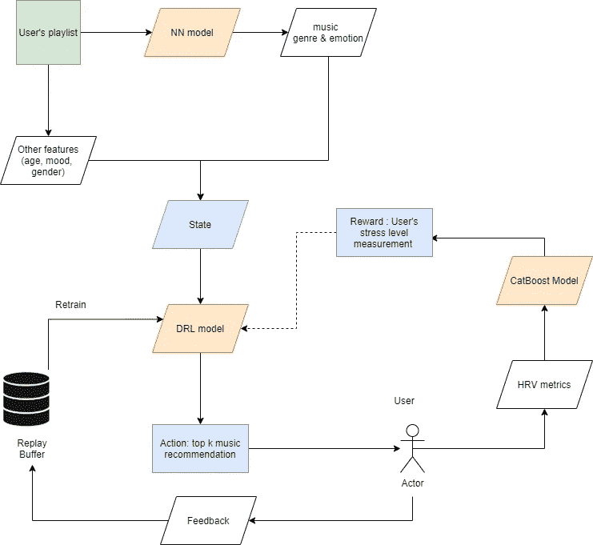
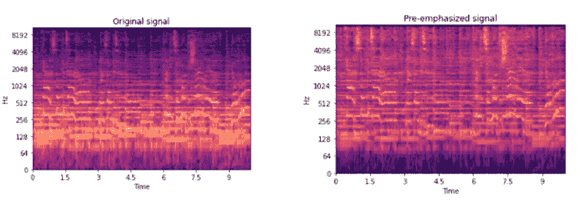
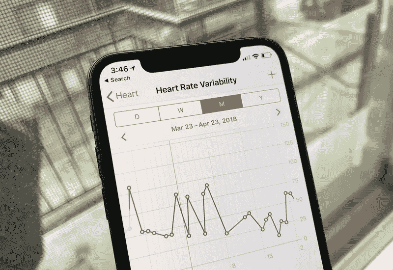
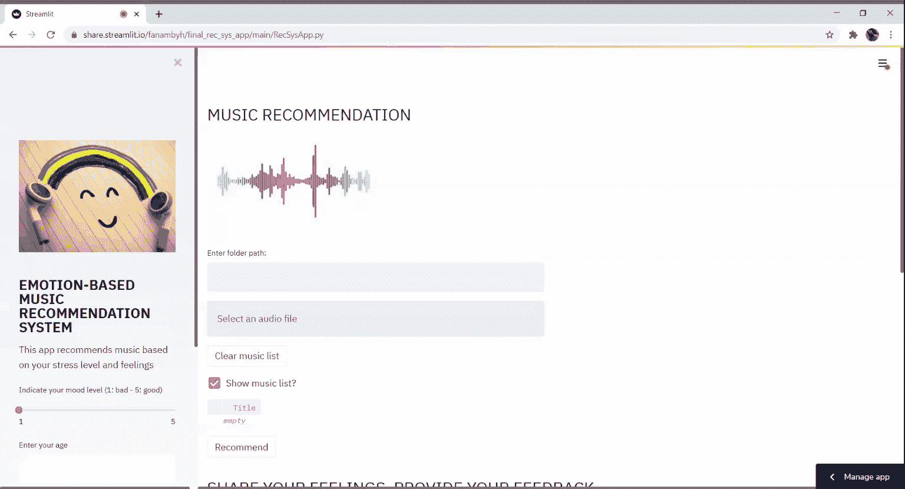
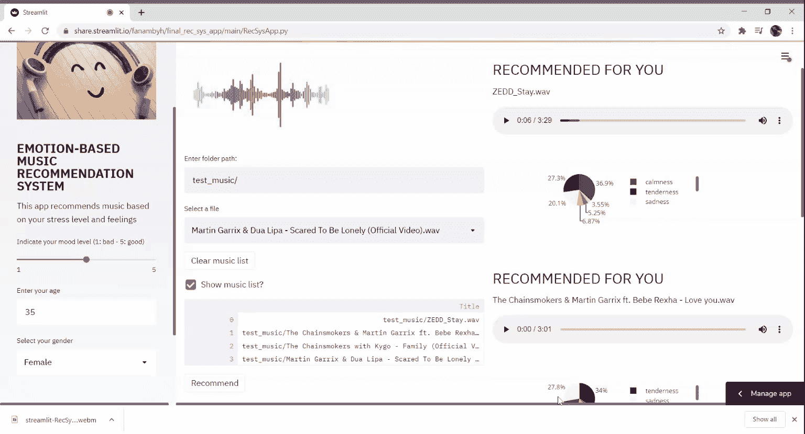

# 使用深度强化学习方法的基于情感的音乐推荐系统

> 原文：<https://medium.com/analytics-vidhya/emotion-based-music-recommendation-system-using-a-deep-reinforcement-learning-approach-6d23a24d3044?source=collection_archive---------2----------------------->

你知道声音和音乐与我们的情感大脑沟通吗？很神奇，不是吗？

事实上，几种类型的研究表明，听声音和音乐对我们的感觉和情绪有着重要的作用和影响[ [1](https://www.researchgate.net/publication/11040897_%27Emotional_Sounds_and_the_Brain_the_Neuro-affective_Foundations_of_Musical_Appreciation%27) ] [ [2](https://www.researchgate.net/publication/228389838_The_Science_and_Psychology_Behind_Music_and_Emotion) ]。至于我们的情绪，在推荐[ [3](https://medium.com/r?url=https%3A%2F%2Fwww.researchgate.net%2Fpublication%2F323143572_Affective_recommender_systems_the_role_of_emotions_in_recommender_systems) 中起着重要的作用。

大多数现有的推荐系统是基于用户提供的评级。*嗯，有一个圈套！这些系统只允许您体验静态的用户体验，因为系统将根据评级历史给出推荐，而不考虑可能影响预测的其他参数，如用户反应、行为、感觉或情绪[ [4](https://link.springer.com/chapter/10.1007%2F978-3-642-15208-5_19) ]。*

*诀窍在于*通过考虑这些行为和情感特征，用户可以从更动态、定制和定制的体验中受益。*还有更好的*，情绪是非常有趣的隐性指标，利用它们的一种方式是在深度强化学习方法的奖励系统中使用它们。

# 一个情感推荐系统

*你有没有想象过一个结合了音乐和情感的推荐系统？一个可以根据你的感觉和情绪提出定制播放列表，并可以根据你过去的经验适应你的行为的系统？那个好奇的问题促使我开发了一个基于情感的音乐推荐系统项目。*

该项目是一个基于深度强化学习的项目，它使用添加到用户信息(主要是他的年龄、情绪和性别)中的音乐情感和流派作为状态特征，以及基于用户感觉的奖励系统，即从他的心率变异性(HRV)中检测到的他的压力水平。它的目标是 ***根据用户以前录制的感受*** *，从给定的播放列表中向用户推荐最适合和定制的顶级 k 歌。*

## 下面是它的工作原理

假设我们之前已经通过他们的 HRV 观察了几个用户每次听给定播放列表时的反应，以及他们在听每首歌曲时的情绪。然后，我们有历史观察和反馈数据，这些数据可用于提供强化学习环境，以便:

深度强化学习环境结构

*   该状态由音乐特征(主要是流派和情感)和用户信息(即他的年龄、性别和他的情绪)组成，以 1 到 5 的标度来测量，使得 1 表示*悲伤，5 表示 ***快乐，****
*   *奖励是用户在听完一首特定歌曲后的反应(无论这首歌让他感觉更平静还是更有压力)，主要是从他的 HRV 中识别的他的压力水平。*

## *音乐流派和情感特征的处理和提取*

*因为用户将输入原始音频文件，所以在它们可以被用作状态特征之前，有必要识别流派和情感特征。为此，我建立了一个分析音乐流派和情感的模型，一个适合多标签分类问题的**神经网络**。该模型可以识别用户可能感觉到的一组目标情绪 ***(温柔、平静、力量、快乐、悲伤、紧张)*** ，并且能够识别 ***古典、流行、摇滚和电子*** 音乐流派。*

*使用用于音频和音乐处理的 python 模块 ***librosa 对音频文件进行处理:*** 在 timbral 之前使用预加重方法对高频信号进行增强，并提取温度图特征以馈入分类器模型。*

**

*使用 librosa 进行高频信号预加重(来源:作者)*

## *根据心率变异性识别压力水平(HRV)*

*你一定想知道什么是心率变异性。我来澄清一下！*

**

*HRV 是对每次心跳之间时间变化的测量，通常用于评估一个人的身体状况，最终评估他的生产力、精力和压力水平。您可以使用任何可穿戴设备或任何心脏监测应用来测量 HRV，并且可以轻松地将数据导出为 csv 文件[ [5](https://www.firstbeat.com/en/blog/what-is-heart-rate-variability-hrv/) ]。*

*你是最新的！让我们继续前进。*

*为了支持 DRL 的奖励系统，我建造了一个位于 HRV 的压力水平分析器。这是一款 **CatBoost 型号**，能够使用 HRV 检测高、中、低应力水平。以下度量用于预测用户的压力水平: ***他的心率，4 个时域度量(SDNN、均值-RR、pNN50 和 RMSSD)，以及 3 个频域度量(甚低频、低频和高频)。*** 这些都是 HRV 测量中最常用的指标。*

# *这是底线！*

*我知道我几乎可以听到你在想:“压力水平分析仪和模型的奖励系统有什么关系？”。别离开我，我会解释的。*

*DRL 模型的奖励系统是基于用户给出的反馈，这里是从他的压力水平来衡量的。因此，高水平的压力，被解释为不满意的标志，将被转换为对模型零收益的奖励。相反，更合理或相对较低的压力水平被解释为满意的标志，并将转化为对模型的积极奖励。*

*为了构建我的基于 DRL 的系统，我想出了一种基于 A2C(优势行动者-批评家)模型的 ***PyTorch 实现的方法，在使用 ***gym 库开发的定制环境上训练***，这是一个专门用于强化算法开发的 OpenAI 工具包*** 。DRL 模型得分 **0.80，运行 10000 个学习步骤**。*

# *检索来自用户的反馈*

*为了保持系统的动态性，我建立了一个数据库作为回复缓冲区，用来保存新提供的反馈和观察结果。为了提高未来推荐的质量并使系统更好地适应用户的行为，稍后可以在离线生产环境中使用这些反馈数据来重新训练该模型。*

# *所有这些中的数据集呢？*

*我使用以下两种不同的数据源来开发项目:*

*1- ***数据集，关于从带有目的情绪化*** 的游戏中诱发的音乐情绪，此处[可用](http://www2.projects.science.uu.nl/memotion/emotifydata/)。这个数据集由 400 首歌曲的摘录组成，分别标注了它们各自的流派和参与者在听每首歌曲时强烈感受到的情绪注释[6]。*

*2- ***用于应力监测的生物特征 kaggle 数据集*** ，此处可用【7】。该数据集包含从 SWELL [8][9]和 WESAD 数据集[10]计算的心率变异性(HRV)和皮肤电活动(EDA)数据。*

# *现在，演示时间！*

*该系统已使用 streamlit 框架及其内置的共享功能进行部署。要与系统交互:*

*1-输入您选择的播放列表和您的信息(年龄、心情和性别)，*

*2-系统将从您的播放列表中推荐最合适的前 2 首歌曲，*

**

*音乐推荐*

*从上图中可以看出，系统推荐的歌曲有着共同的特点:它们都唤起了温柔、平静和悲伤的情绪，而且可信度很高。*

*3-听歌，*

*4-上传您的 HRV 指标进行反馈分析，*

*5-保存您的反馈。*

**

*应力水平分析*

*就这么简单！👌*

# *承认*

*我非常感谢非洲 2020 数据科学密集型(DSI)项目为我提供了开发这个项目的绝佳机会。衷心感谢 DSI 导师在本项目实现过程中给予的宝贵支持。*

# *参考*

*[1] [潘克塞普，贾克&伯纳茨基，京特。(2002).情感声音和大脑:音乐欣赏的神经情感基础。行为过程。60.133–155.10.1016/s 0376–6357(02)00080–3](https://www.researchgate.net/publication/11040897_'Emotional_Sounds_and_the_Brain_the_Neuro-affective_Foundations_of_Musical_Appreciation')*

*[2] [沙夫隆，加文。(2010).音乐和情感背后的科学和心理学。](https://www.researchgate.net/publication/228389838_The_Science_and_Psychology_Behind_Music_and_Emotion)*

*[3] [特卡尔夫西维奇，马尔科&科西尔，安德烈&塔西维奇，尤里&库纳维尔，马特夫日。(2011).情感推荐系统:情感在推荐系统中的作用。9–13.](https://www.researchgate.net/publication/323143572_Affective_recommender_systems_the_role_of_emotions_in_recommender_systems)*

*[4] [接受推荐并提供反馈:推荐系统的用户体验，电子商务和网络技术，2010 年，第 61 卷，ISBN:978–3–642–15207–8，Bart P. Knijnenburg，Martijn C. Willemsen，Stefan Hirtbach](https://link.springer.com/chapter/10.1007%2F978-3-642-15208-5_19)*

*[5] [什么是心率变异性(HRV) &为什么很重要？](https://www.firstbeat.com/en/blog/what-is-heart-rate-variability-hrv/)*

*[6] A .阿尔贾纳基，f .威灵，R. C .韦尔特坎普。通过一个众包游戏研究音乐诱发的情绪。信息处理与管理，2015。*

*[7] S. Koldijk，M. A. Neerincx 和 W. Kraaij，“通过结合不引人注目的传感器检测办公室的工作压力”，IEEE Trans .影响。计算机。，第 9 卷第 2 期，第 227–239 页，2018 年。*

*[8] S. Koldijk、M. Sappelli、S. Verberne、M. A. Neerincx 和 W. Kraaij，“压力和用户建模研究的膨胀知识工作数据集”，Proc .第 16 国际。糖膏剂多模态交互。——ICMI 2014 年，第 291–298 页，2014 年。*

*[9] Kraaij，ir. W .教授博士(拉德布大学& TNO)；Koldijk，理学硕士。TNO 和拉德布大学；Sappelli，理学硕士(TNO &拉德布大学)(2014 年):用于压力和用户建模研究的膨胀知识工作数据集。DANS。[https://doi.org/10.17026/dans-x55-69zp](https://doi.org/10.17026/dans-x55-69zp)*

*[10] Schmidt，p .，Reiss，a .，Duerichen，r .，Marberger，c .，和 Van Laerhoven，K. (2018 年)。介绍 WESAD，一个用于可穿戴压力和影响检测的多模态数据集。2018 年 ICMI 国际多式联运会议论文集。【https://doi.org/10.1145/3242969.3242985 号*