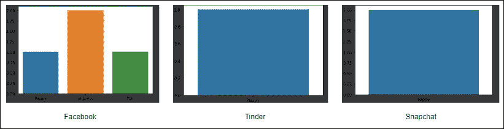

# 使用变形金刚对 Twitter 数据进行情感分类

> 原文：<https://medium.com/analytics-vidhya/emotion-classification-on-twitter-data-using-transformers-baa941772f31?source=collection_archive---------22----------------------->


# 介绍

自然语言处理的世界最近被变形金刚的发明超越了。变压器与传统的基于序列的网络完全无关。rnn 是用于基于序列的任务如文本生成、文本分类等的初始武器。但是随着 LSTM 和 GRU 细胞的出现，在文本中捕捉长期依赖性的问题得到了解决。但是学习 LSTM 细胞模型是一项艰巨的任务，因为我们不能让它并行学习。

变换器类似于基于编码器-解码器的网络，在末端具有关注层，以使模型有效地学习文本的相关上下文。让我们看看如何使用这个令人敬畏的 python 包装器[简单的变形金刚](https://simpletransformers.ai/)以简单的方式实现它们

你需要创建一个 Twitter 开发者账户，这样你就可以访问它的 API，并使用许多令人难以置信的功能。请通过[这个](https://developer.twitter.com/en)了解更多。

# 先决条件

简单的 Transformer 模型是根据特定的自然语言处理(NLP)任务构建的。每个这样的型号都配备了专门设计的特性和功能，最适合它们要执行的任务。使用简单变压器模型的高级过程遵循相同的模式。我们将使用库中的文本分类模块来构建情感分类器模型。通过下面的代码安装简单的 transformers 库。

```
pip install simpletransfomers
```

最好创建一个虚拟环境并安装它。安装包后，按照下面的[链接](https://developer.twitter.com/en/apply-for-access)中提到的步骤组织你的 Twitter 开发者账户。建立帐户后，获取您帐户的不记名令牌，并将其保存在 YAML 文件中，如下所示:

```
search_tweets_api: 
 bearer_token: xxxxxxxxxxxxxxxxxxxxxxx
```

# 建模

对于该任务，我们将使用来自 Kaggle 的以下数据集:[文本中的情感](https://www.kaggle.com/ishantjuyal/emotions-in-text)。数据集有两列，一列有文本，另一列有相应的情感。让我们可视化数据集及其类分布。

数据集包含以下情感类别:*悲伤、愤怒、爱、惊讶、恐惧、快乐，而*你可以在下图中看到它的分布

在对数据集建模之前，我们可以做一些基本的预处理步骤，如清理文本、用数字对类进行编码等，这样最终的数据帧看起来就像下图。

我将以下内容定义为模型训练的输入配置。我使用 XL-Net 来建模数据集，因为它是 transformers 的高级版本，能够捕捉更长序列的上下文。max_seq_length 保持为 64，因为在数据集中找到的最大标记数是 66，如果您想为更大的文本输入训练模型，可以根据需要将它增加到更大的值。

```
from simpletransformers.classification import ClassificationModel, ClassificationArgs model_args = ClassificationArgs() 
model_args.num_train_epochs = 4 
model_args.reprocess_input_data = True 
model_args.save_best_model = True model_args.save_optimizer_and_scheduler = False model_args.overwrite_output_dir = True 
model_args.manual_seed = 4 
model_args.use_multiprocessing = True 
model_args.train_batch_size = 16 
model_args.eval_batch_size = 8 
model_args.max_seq_length = 64 
model = ClassificationModel("xlnet", "xlnet-base-cased", num_labels=6, args=model_args, use_cuda=True)
```

一旦模型定型，您就可以获得验证数据集的指标并评估其性能。如果您之前没有进行任何配置，模型权重将保存在输出/目录中。接下来是我们使用 Twitter API 获取推文的部分。您可以使用 API 的最大 tweets 数是 100，通过使用高级帐户可以进一步增加。您可以使用下面的代码片段来获取特定句柄的 tweets。

```
def create_twitter_url(handle, max_results): 
 mrf = "max_results={}".format(max_results) 
 q = "query=from:{}".format(handle) url = "https://api.twitter.com/2/tweets/search/recent?{}&{}".format( mrf, q ) 
 return url

def process_yaml(): 
 with open("keys.yaml") as file: 
  return yaml.safe_load(file) def create_bearer_token(data): 
 return data["search_tweets_api"]["bearer_token"] def twitter_auth_and_connect(bearer_token, url): 
 headers = {"Authorization": "Bearer {}".format(bearer_token)}
 response = requests.request("GET", url, headers=headers) 
 return response.json() url = create_twitter_url('user',10) 
data = process_yaml() 
bearer_token = create_bearer_token(data) 
response = twitter_auth_and_connect(bearer_token, url) 
text_list = [x['text'] for x in response['data']] 
cleaned_text = [re.findall(regex, x)[0] for x in text_list]
```

上面的代码获取了一个句柄“user”的 Twitter 响应，并将获取相应句柄发出的最近 10 条 tweets。推文被清理以移除任何表情符号、链接等。例如，让我们看看一些著名的社交媒体链最近 20 条推文的情绪，以及他们的情绪如何。

和其他人相比，脸书似乎这周过得不太好。



著名推特账号的情感分析

因此，我们使用 Twitter API 和 transformers 构建了一个简单的情绪分类应用程序，您也可以实时完成它，并进一步扩展这个用例，以分析任何人的任何暴力或悲伤的推文。感谢您在这上面花费宝贵的时间，同时也欢迎您提出建议。

***本文中显示的媒体不归 Analytics Vidhya 所有，由作者自行决定使用。***

# 关于作者


**毗湿奴·恩库马尔**

机器学习工程师，在创新解决方案方面拥有丰富的知识，能够改善各个领域的业务决策。在 Python、Docker、API 框架等方面有丰富的实践知识，并在云中部署了许多可重用的解决方案。在编排使用开源服务或云中平台服务部署解决方案的架构方面拥有丰富的知识

您也可以在我们的移动应用程序上阅读这篇文章


*原载于 2021 年 1 月 13 日 https://www.analyticsvidhya.com**[*。*](https://www.analyticsvidhya.com/blog/2021/01/emotion-classification-on-twitter-data-using-transformers/)*