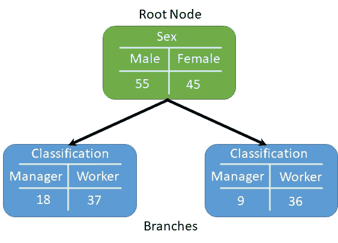
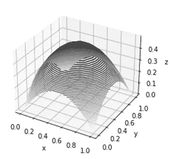
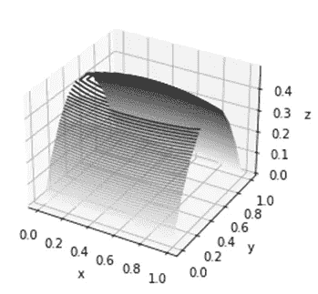
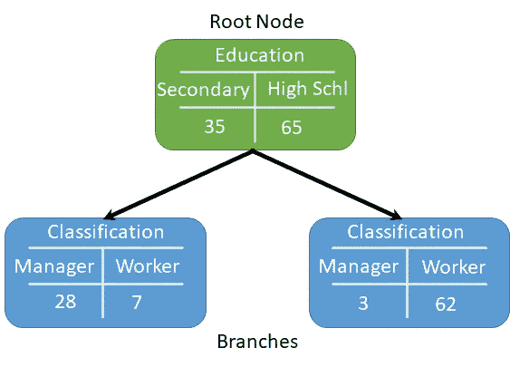
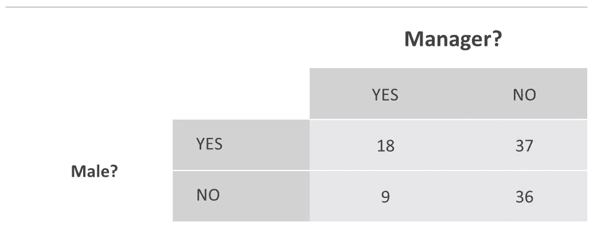
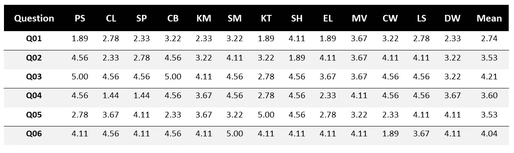
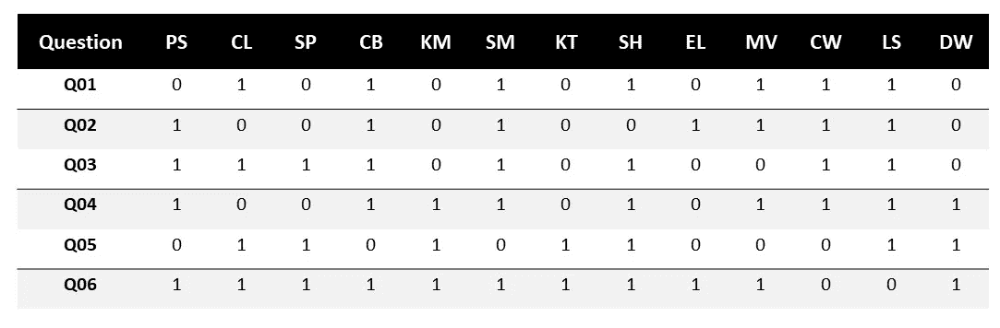
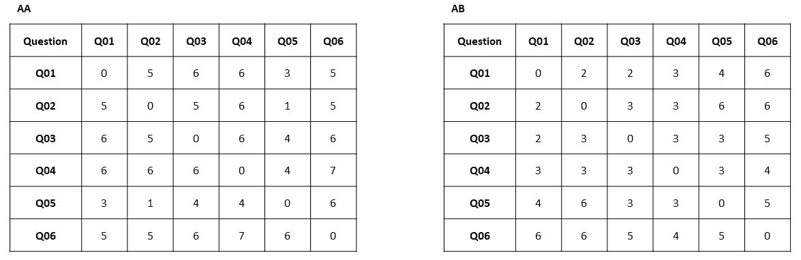
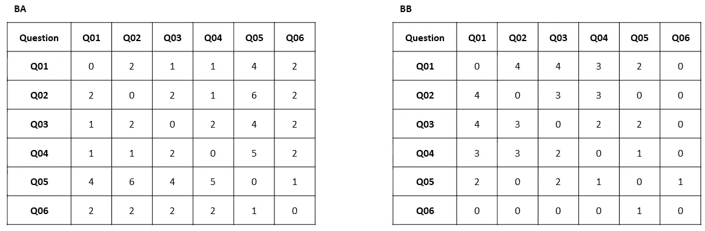
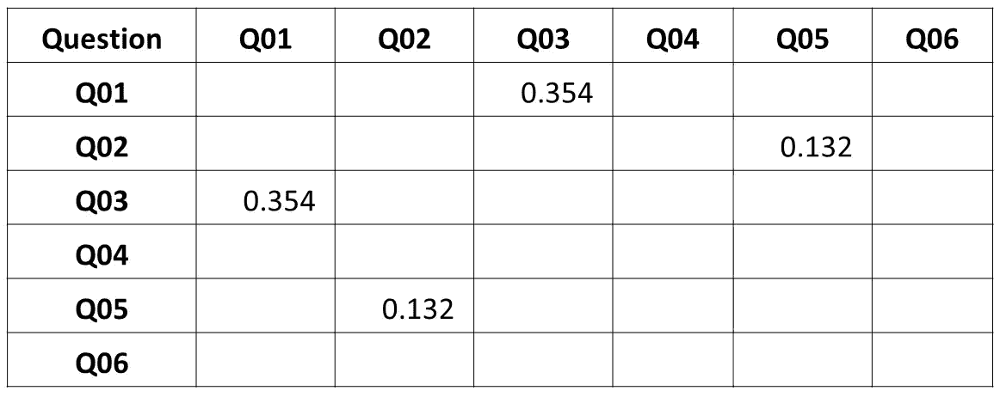

# 使用基尼指数函数的员工调查分析

> 原文：<https://medium.com/analytics-vidhya/employee-survey-analysis-using-the-gini-index-function-5d9989686e17?source=collection_archive---------3----------------------->


图像显示一条横幅，上面写着“我们听到了”。途经[https://unsplash.com/@jontyson](https://unsplash.com/@jontyson)

## 基于 Python 的将基尼指数函数应用于员工调查数据的方法

虽然基尼指数函数(又名基尼不纯函数)通常用于决策树算法**【1】的实现中，但是它在该应用之外的用途并没有得到广泛的重视。本文展示了一个 Python 程序，该程序反复应用基尼指数函数来查找员工调查答复之间的关联强度。**

****为什么使用基尼指数函数？****

**因为基尼函数是一种分类工具，而不是统计工具，所以在员工调查方面，它比皮尔逊和其他统计函数有重要优势。统计工具测量成对变量之间的依赖强度；因此，它们的有效性取决于原始数据的获取。然而，为了保护受访者的匿名性，原始员工调查数据并不总是可用的。事实上，许多公开的员工调查数据集只包含汇总数据。[2] [3].相比之下，基尼指数函数不需要原始数据；它可以用来发现群体的总体属性之间的关联，这种处理群体数据的能力保护了调查受访者的匿名性。**

****了解基尼指数****

**要了解基尼指数函数如何重新用于员工调查，我们必须首先了解它在决策树中是如何工作的。在决策树中，基尼指数函数通过对树的每个分支应用一个规则来构造决策树，直到它到达出现数据分布的叶节点。该规则可以被认为是一个筛子，通过将数据分类到叶节点中的类别来净化数据。数据分配得越公平，据说就越不纯。如果规则提纯了数据，那么分支的杂质应该低于根的杂质；换句话说，分支节点中的数据分布应该比根节点中的*更少*公平(并且在这个意义上更纯粹)。[4]**

**下面是一个典型的决策树节点，它应用了左分支=男性，右分支=女性的规则:**

****

**以性别为根、经理/员工为分支的决策树节点**

**基尼指数是对节点上任何感兴趣的属性的杂质的度量，由下式给出:**

**2 **p**(1-*p*0<p1。。。。。。。。。。。。。。。。。。。。.1)**

**其中 *p* 是节点或分支处感兴趣的属性的比例。**

**因此，上图中根节点的基尼指数为:**

**2*55/100*(1–55/100) = 0.495**

**等式 1)产生了在基尼系数函数的许多讨论中看到的马蹄形曲线。需要调整系数 2，因为否则最大值是 0.25，并且按照惯例，基尼系数最大值是 0.5。**

**具有两个分支的节点的基尼系数仅仅是它们各自基尼系数的加权和:**

**2 *[*r***p**(1-*p*)+(1-*r*)**q**(1-*q*)】0<*p*<1，0 < *q* < 1，0 < *r* < 1。。。。。。。。。。。.2)**

**其中:**

***p* 是给定的感兴趣财产在左分支中的比例，
*q* 是同一感兴趣财产在右分支中的比例，
*r* 是左分支的相对权重。**

**不幸的是，等式 2)是一条四维曲线，所以即使在三维空间也无法绘制。然而，我们可以通过将 *r* 固定在 0.5 和 0.1 并使用 matplotlib 绘制结果曲线来了解它的样子。曲线呈凸起状，而不是马蹄形，如下所示。请注意，凸起的峰值出现在 0.5 处，尽管这在 60 度视角下可能不清楚。**

****

**r = 0.5 时方程 2 的曲线)**

****

**r = 0.1 时方程 2 的曲线)**

**因此，当根节点处的经理/工人属性由两个分支节点处的男性/女性属性限定时，为了计算根节点处的基尼指数，我们有:**

**p = 18/55**

***q* = 9/45**

***r* = 55/100**

**因此，代入等式 2)，我们看到根节点的合格基尼指数将为:**

**2*[55/100*18/55*(1–18/55) + (1–55/100)*9/45*(1–9/45)] = 0.386**

**等式 2)可以应用于另一组相关的数据，让我们决定性与成为经理的关系有多密切。**

**让我们假设我们使用一个基于教育水平的根节点来代替性，比如说中学教育和高中教育，如下图所示。**

****

**以教育为根、经理/员工为分支的决策树节点**

**通过观察可以看出，当教育属性出现在根节点中时，分支比性属性出现在根节点中时要“纯净”得多，这反映在低得多的基尼指数中:**

**2*[31/100*24/31*(1–24/31) + (1–31/100)*3/69*(1–3/69)] = 0.166**

**因此，基于这一分析中使用的伪数据，决定将是管理地位更多地取决于教育水平，而不是性别。**

****将基尼指数函数应用于员工调查****

**现在让我们考虑如何转换等式 2 ),以便为员工调查中的任何两个问题提供基尼指数。在这种情况下，两个调查问题可能是:**

**Q01:你是经理吗**

**问题 02:你是男性吗？**

**这是两个简单的问题，不会出现在任何实际的调查中，但仍然符合我们的目的，正如我们将看到的。出于调查分析的目的，我们将做出的决定是分支节点是否足够纯净，以表明问题之间的关联。**

**下表总结了出现在带有性根节点的决策树分支中的聚合数据。**

****

**敏锐的读者可能会想，为什么我们忽略了根节点中感兴趣的属性的比例。如我们将在下面的推导中所示，只有分支节点的纯度是重要的，并且事实上，根节点的选择与基尼系数的值无关:**

**如果我们让 *Y* =是并且 *N* =否，这将产生四个参数:**

***YY* = 18， *YN* = 3， *NY* = 9， *NN* = 36**

**因此，推导任何两个调查问题的基尼指数方程的第一步是将方程 2)转换成利用这四个参数的方程，这并不困难。**

***p = YY/(YY + YN)***

***p—*1*= YN/(YY+YN)***

***q = NY/(NY + NN)***

***q—*1*= NN/(NY+NN)***

***r =(YY+YN)/(YY+YN+NY+NN)***

***r—*1*=(NY+NN)/(YY+YN+NY+NN)***

**因此通过替换和简化，等式 2)变成:**

**基尼指数= 2*/(YY+YN+NY+NN)*【YY * YN/(YY+YN)+NY * NN/(NY+NN*)】**

**. . . . . . . . . . . . . . . . . . . . . . . . . . . . . . . . . . . . . . . . . . . . . 3)**

**等式 3)提供了给定出现在分支节点中的总分数的任意两个问题的关联的基尼指数。**

**当我们用这些分支节点参数尝试等式 3)时，我们看到它给出了与等式 2)相同的结果，其中也出现了根节点参数:**

**2/(18+37+9+36) * [18 * 37/(18+37) + 9 * 36/(9+36)] = 0.386**

**因为基尼函数是一种分类工具，所以总分数必须是二元属性的计数(例如，是与否)。如果响应是标量而不是二进制的，则在计算总分数之前，需要将响应转换成二进制属性，例如高于平均值( *A* )对低于平均值( *B* )，在这种情况下，等式 3)变为:**

**基尼系数= 2/(*AA+a b+ BA+BB)*【AA * AB/(AA+AB)+BA * BB/(BA+BB)*]**

**. . . . . . . . . . . . . . . . . . . . . . . . . . . . . . . . . . . . . . . . . . . . . 4)**

**这是一些来自员工调查的标量伪数据。让我们试试方程式 4)吧。列标题是员工组的缩写；如 PS =心理服务，CL =文书。这些数据由这些组中员工的五点李克特分数的平均值组成。**

****

**来自员工调查的李克特总分**

**因为，如上所述，基尼指数与属性而不是标量值一起工作，我们需要将分数转换为属性指标。这可以通过如果分数高于平均值则分配布尔值 1，如果分数低于平均值则分配布尔值 0 来实现。**

****

**李克特分数转换为布尔值。1 =高于平均值，0 =低于平均值**

**然后，可以对数据文件运行以下 Python 代码，以评估每对问题的基尼指数。**

```
# Imports
import pandas as pd 
import numpy as np#Read Datafile
datafile='YourBooleanEmployeeSurveyData.xlsx'
df = pd.read_excel(datafile, 0)
df = df.dropna(how='all')
df.set_index('Question', inplace=True)# Define inverse Boolean df
df_crib = df.astype(int) # Prepare for conversion to bool
df_boolean_crib = df_crib.astype(bool) # Bool is required for inversiondf_crib_inv = ~df_boolean_crib# Create a square template of zeros with question names as rows and columnscolumnsNamesArr = df_crib.transpose().columns.values
arr_len_int=len(columnsNamesArr)
zeros=np.zeros((arr_len_int,arr_len_int),dtype=np.int)
template = pd.DataFrame(zeros,columns=columnsNamesArr)

# Insert column with question names
template.insert(loc=0, column='Question', value=columnsNamesArr)
template.sort_values(by='Question', inplace=True)
template.set_index("Question",inplace=True)# Create copies of the template to fill with counts of correlated responses# A is above mean and B is below meandef get_named_templates(template, list_of_names):
    results = []
    for c,value in enumerate(list_of_names):
    tmp = template.copy() tmp.name = value results.append(tmp)
    return resultslist_of_names = ['AA', 'AB', 'BA', 'BB']
[AA, AB, BA, BB] = get_named_templates(template, list_of_names)# Take dot product of rows and columnsdef dot_fill_row(df,row):
    for column in range(len(template)):
        if df.name == 'AA':
           df.iat[row,column] = np.dot(np.array(df_crib.iloc[row , : ]).astype(int),np.array(df_crib.iloc[column, : ]).astype(int))
        elif df.name == 'AB':
           df.iat[row,column] = np.dot(np.array(df_crib.iloc[row , : ]).astype(int),np.array(df_crib_inv.iloc[column, : ]).astype(int))
         elif df.name == 'BA':
           df.iat[row,column]=np.dot(np.array(df_crib_inv.iloc[row , : ]).astype(int),np.array(df_crib.iloc[column, : ]).astype(int))
          elif df.name == 'BB':
            df.iat[row,column]=np.dot(np.array(df_crib_inv.iloc[row , : ]).astype(int),np.array(df_crib_inv.iloc[column, : ]).astype(int))
    returndef dot_fill_all(df):
    for row in range(df_crib.shape[0]):
        dot_fill_row(df,row)
    return dfAA = dot_fill_all(AA)
AB = dot_fill_all(AB)
BA = dot_fill_all(BA)
BB = dot_fill_all(BB)# Create symmetrical AB and BA matrices
# The dot_fill_row function fills top and bottom AB and BA triangles with complementary values
# This code corrects so that values across the diagonal are the same for matching indicesUABBot = np.tril(np.array(AB), k=0)
UABUpp = np.triu(np.array(AB), k=0)
UBABot = np.tril(np.array(BA), k=0)
UBAUpp = np.triu(np.array(BA), k=0)
BAarr = UABUpp+UBABot
ABarr = UABBot+UBAUppAB=pd.DataFrame(data=ABarr,index=columnsNamesArr,columns=columnsNamesArr)
BA=pd.DataFrame(data=BAarr,index=columnsNamesArr,columns=columnsNamesArr)0# Gini formula: 2/N[AAxAB/(AA+AB)+BBxBA/(BB+BA)
# Apply formula and set cells that are above the maximum Gini score to blankdef gini(TT,TB,BT,BB):
    topscore = (2/(TT+TB+BT+BB))*np.multiply(TT,TB)/(TT+TB)
    botscore = (2/(TT+TB+BT+BB))*np.multiply(BT,BB)/(BT+BB)
    score = topscore+botscore
    return scorescore = gini(AA,AB,BA,BB)# Set acceptable gini index to 0.37df_score=score.applymap(lambda x: np.where(x<=0.37,round(x,3) , ''))
np.fill_diagonal(df_score.values, '')# Write results to Excel filewriter = pd.ExcelWriter("YourResults.xlsx", engine='xlsxwriter')
df_score.to_excel(writer,sheet_name='Ginis')
writer.save()
writer.close() # Close writer
```

**该程序生成四个临时表，如下所示:**

********

**显示点积结果的临时表格**

**最终结果如下表所示。基尼系数临界值为 0.37，因此只出现两个基尼系数值。这些值足够小，可以指示 Q01 和 Q03 之间的关联，以及 Q02 和 Q05 之间跨不同员工组的关联。有趣的是，快速检查中期表可以发现，Q02 和 Q05 之间的关联是非常负的，大多数计数出现在 BA 和 AB 中。**

****

**基尼系数为 0.37 的相关问题**

**如何看待这些结果？**

**尽管有这些迷人的结果，但意识到它们的局限性是很重要的。首先，它们不具有通过使用需要访问原始数据的统计函数如 Pearson 可能实现的有效性；第二，与可用于发现普遍适用的相关性的统计有效方法不同，这些结果仅表明在进行调查的特定组织内感兴趣的关联。事实上，如果任何结果与普遍接受的人类绩效管理模型相冲突，这将是拒绝它们的一个很好的理由。**

**Q02 和 Q05 之间强烈的负相关关系表明，应尽一切努力减少组织团体中 Q02 和 Q05 响应分数的差异。这将有助于确保所有群体享有同样公平和公正的工作条件。**

**就 Q01 和 Q03 而言，虽然关联性较弱，但这种关系的强度确实表明，如果一个群体在 Q01 和 Q03 中的回答分数都较低，则可以通过将其中一个回答视为原因的指示，而将另一个回答视为结果的指示，来努力提高这些分数。因此，例如，如果 Q01 表示对更多协作的偏好，而 Q05 表示相信工作组内存在重要知识的倾向，那么增加工作组内对知识的意识可能会增加对协作的偏好。**

**最后，这些结果通过与员工和组织工作小组的经理一起工作，为下一阶段的探索和确认提供了指导。事实上，如果这篇文章引起了足够的兴趣，我计划写一篇后续文章，展示如何进一步完善从基尼系数分析中获得的结果，以提供明确的指导，说明优先问题在哪里，以及哪些员工群体最需要干预。**

****参考文献****

**[1] Eligijus Bujokas，[Python 中的决策树算法从无到有](https://towardsdatascience.com/decision-tree-algorithm-in-python-from-scratch-8c43f0e40173) (2021)，走向数据科学**

**[2]美国人事管理局，[联邦雇员观点调查](https://www.opm.gov/fevs/public-data-file/) (2020)**

**[3]加拿大政府，[公共服务雇员调查](https://open.canada.ca/data/en/dataset/4301f4bb-1daa-4b50-afab-d1193b5d2284) (2020)**

**[4] Arif R，[决策树的基础知识](https://medium.datadriveninvestor.com/the-basics-of-decision-trees-e5837cc2aba7) (2020)，数据驱动投资者**