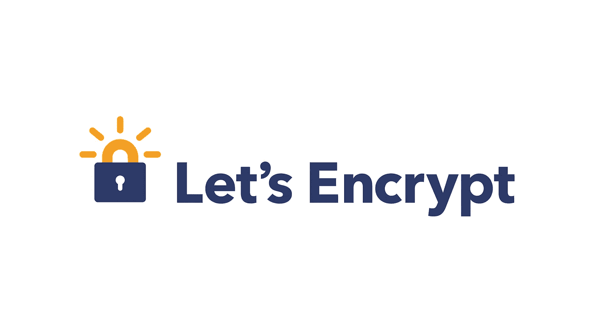

# 启用 HTTPS 并使用“让我们加密”保护您的网站

> 原文：<https://medium.com/analytics-vidhya/enabling-https-and-securing-your-website-using-lets-encrypt-9b25f825ab2?source=collection_archive---------21----------------------->

谷歌图片

# 你为什么要保护你的网站？

不安全的网站在 URL 的开头有 HTTP。以 HTTPS 开头的网站是安全的，而“s”代表安全。

你一定见过有时你的浏览器给出网站不安全的通知；这些网站以 http 开头…