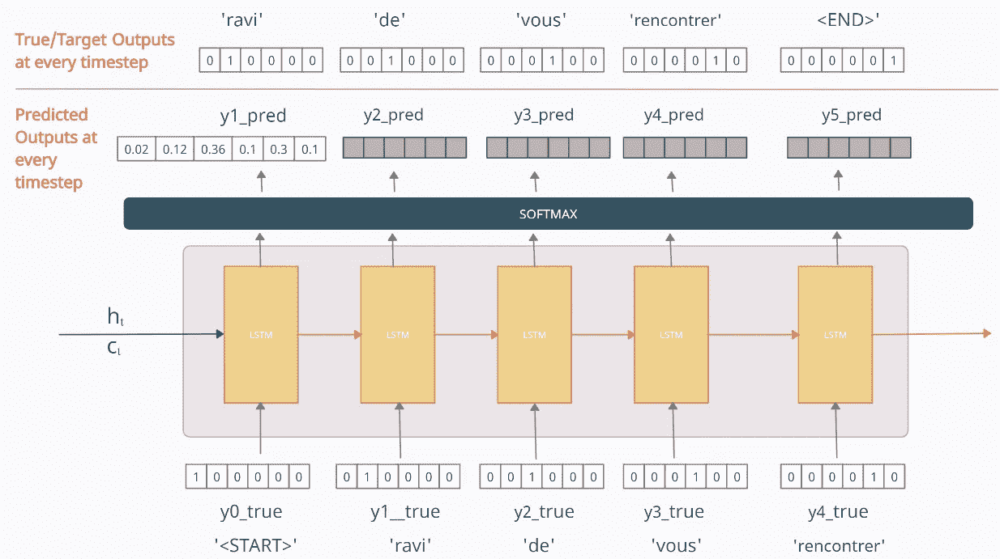

# 编解码 Seq2Seq 型号，讲解清楚！！

> 原文：<https://medium.com/analytics-vidhya/encoder-decoder-seq2seq-models-clearly-explained-c34186fbf49b?source=collection_archive---------1----------------------->

## 详细了解编码器-解码器序列到序列模型的分步指南！

图片来自 [Pixabay](https://pixabay.com/?utm_source=link-attribution&utm_medium=referral&utm_campaign=image&utm_content=5233295) 的[coxinafotos](https://pixabay.com/users/coxinhafotos-3726685/?utm_source=link-attribution&utm_medium=referral&utm_campaign=image&utm_content=5233295)

# 目录

1.  介绍
2.  动机
3.  先决条件
4.  序列建模问题
5.  编码器-解码器模型的结构
6.  培训和测试阶段:进入张量
7.  “苏茨基弗模式”
8.  图像字幕直觉
9.  进一步阅读
10.  参考

# 介绍

> 传统的深度神经网络(DNNs)是强大的机器学习模型，在语音识别和视觉对象识别等困难问题上取得了优异的性能。但是它们只能用于大的标记数据，其中输入和目标可以用固定维度的向量进行合理的编码。它们不能用于序列到序列的映射(例如机器翻译)
> 
> [用神经网络进行序列对序列学习](https://arxiv.org/abs/1409.3215) [1]

这是提出一种可以解决一般序列间问题的架构的动机，因此编码器-解码器模型诞生了。

在本文中，我的目标是详细解释编码器-解码器序列到序列模型，并帮助您建立其工作背后的直觉。为此，我采取了一步一步的方法，试图直观地解释这些概念。我将主要参考 Ilya Sutskever 等人的开创性研究论文[Sequence to Sequence Learning with Neural Networks](https://arxiv.org/abs/1409.3215)[，该论文实现了用于神经机器翻译的编码器-解码器模型。最后，我还将在安德烈·卡帕西、李菲菲等人的论文](https://arxiv.org/abs/1409.3215)[用于生成图像描述的深度视觉语义对齐中给出用于图像字幕的编码器-解码器的改进版本背后的直觉](https://arxiv.org/abs/1412.2306)

# 动机

编码器-解码器架构相对较新，已在 2016 年底被用作谷歌翻译服务的核心技术。它构成了高级序列到序列模型的基础，如注意力模型、GTP 模型、变形金刚和 BERT。因此，在进入高级机制之前，理解它是非常重要的。

# 先决条件

这篇文章假设你熟悉神经网络，尤其是 RNNs/lstm 的工作原理。如果你不确定，那么我强烈建议你去看看克里斯多佛·奥拉的博客[图文并茂的循环神经网络指南](https://towardsdatascience.com/illustrated-guide-to-recurrent-neural-networks-79e5eb8049c9)**迈克尔·皮*和* [了解 LSTM 网络](https://colah.github.io/posts/2015-08-Understanding-LSTMs/)。**

# **序列建模问题**

**序列建模问题是指输入和/或输出是数据序列(单词、字母等)的问题。)**

**考虑一个预测电影评论是正面还是负面的非常简单的问题。这里我们的输入是一个单词序列，输出是一个介于 0 和 1 之间的数字。如果我们使用传统的 DNNs，那么我们通常必须使用 BOW、Word2Vec 等技术将输入文本编码成固定长度的向量。但是请注意，这里单词的顺序没有保留，因此当我们将输入向量输入到模型中时，它不知道单词的顺序，因此它丢失了关于输入的一条非常重要的信息。**

**因此，为了解决这个问题，RNNs 应运而生。本质上，对于具有可变数量特征的任何输入 X = (x₀，x₁，x₂，… xₜ)，在每个时间步，RNN 单元将一个项目/令牌 **xₜ** 作为输入，并产生一个输出 **hₜ** ，同时将一些信息传递到下一个时间步。可以根据手头的问题使用这些输出。**

****

**克里斯托弗·奥拉的《了解 LSTM 网络》。**

**电影评论预测问题是一个非常基本的序列问题的例子，称为多对一预测。对于不同类型的序列问题，使用这种 RNN 体系结构的修改版本。**

**序列问题可以大致分为以下几类:**

****

**[递归神经网络的不合理有效性](http://karpathy.github.io/2015/05/21/rnn-effectiveness/)作者 Andrej Karpathy**

> **每个矩形是一个向量，箭头代表函数(如矩阵乘法)。输入向量是红色的，输出向量是蓝色的，绿色向量代表 RNN 状态(稍后会有更多介绍)。从左至右: **(1)** 没有 RNN 的香草处理模式，从固定大小的输入到固定大小的输出(例如图像分类)。 **(2)** 顺序输出(如图像字幕拍摄图像，输出一句话)。 **(3)** 序列输入(例如，情感分析，其中给定句子被分类为表达积极或消极情感)。 **(4)** 顺序输入和顺序输出(比如机器翻译:一个 RNN 读一句英文，然后输出一句法文)。 **(5)** 同步序列输入和输出(例如，视频分类，其中我们希望标记视频的每一帧)。请注意，在每种情况下，长度序列都没有预先指定的约束，因为递归转换(绿色)是固定的，可以应用任意多次。**
> 
> **— Andrej Karpathy，[递归神经网络的不合理有效性](http://karpathy.github.io/2015/05/21/rnn-effectiveness/) [5]**

## **序列间问题**

**序列对序列(Seq2Seq)问题是一类特殊的序列建模问题，其中输入和输出都是序列。编码器-解码器模型最初是为了解决这样的 Seq2Seq 问题而构建的。在这篇文章中，我将使用神经机器翻译(NMT)的多对多类型问题作为运行示例。稍后，我们还将看到它们如何用于图像字幕(一对多示例)。**

# **编码器-解码器模型的结构**

**我的主要目标是帮助您理解 Ilya Sutskever 等人的论文中使用的架构。这是第一篇介绍机器翻译的编码器-解码器模型和更一般的序列到序列模型的论文之一。该模型被应用于英语到法语的翻译。**

*****注:为了得到最终的模型，我将试图简化事物并逐一介绍概念，希望人们在没有太多深入的主题知识的情况下更容易理解，并在需要时填补空白。*****

## **神经机器翻译问题**

**为了帮助你更好地理解，在这篇文章中，我将把神经机器翻译作为一个运行的例子。在神经机器翻译中，输入是一系列单词，一个接一个地处理。同样，输出是一系列单词。**

**任务:预测每个用作输入的英语句子的法语翻译。**

**为了简单起见，让我们考虑在我们的数据语料库中只有一个句子。所以让我们的数据是:**

*   ****输入:英语句子:“很高兴见到你”****
*   ****输出:法文翻译:《ravi de vous ren conter》****

## *****术语使用*****

**为避免任何混淆:**

*   **我将输入句子**“很高兴见到你”**称为**X/输入序列****
*   **我会把输出句子 **"ravi de vous rencontrer"** 称为**Y _ true/target-sequence**→这是我们希望我们的模型预测的(地面真实)。**
*   **我将把模型的预测输出句子称为**Y _ pred/预测序列****
*   **英语和法语句子中的单个单词被称为**标记****

**因此，给定输入序列“很高兴见到你”，我们希望我们的模型预测目标序列/Y_true，即“ravi de vous rencontrer”**

## **高级概述**

**在非常高的水平上，编码器-解码器模型可以被认为是两个块，编码器和解码器通过我们将称为“上下文向量”的向量连接。**

****

**作者图片**

*   ****编码器**:编码器处理输入序列中的每个令牌。它试图将关于输入序列的所有信息塞进一个固定长度的向量，即“上下文向量”。在遍历完所有的令牌后，编码器将这个向量传递给解码器。**
*   ****上下文向量**:向量是以这样一种方式构建的，它被期望封装输入序列的全部含义，并帮助解码器做出准确的预测。我们稍后会看到，这是我们的编码器模块的最终内部状态。**
*   ****解码器**:解码器读取上下文向量，并尝试逐个令牌地预测目标序列。**

****

**作者图片**

## **引擎盖下是什么？**

**这两个块的内部结构如下所示:**

****

**作者图片**

**就建筑而言，这很简单。这个模型可以被认为是两个 LSTM 细胞，它们之间有某种联系。这里最重要的是我们如何处理输入和输出。我将逐一解释每一部分。**

## **编码器模块**

**编码器部分是一个 LSTM 单元。随着时间的推移，它被输入到输入序列中，并试图封装其所有信息，并将其存储在其最终的内部状态 **hₜ** (隐藏状态)和 **cₜ** (单元状态)。内部状态然后被传递到解码器部分，它将使用该部分来尝试产生目标序列。这就是我们之前提到的“上下文向量”。**

**编码器部分的每个时间步长的输出都被丢弃**

****

**作者图片**

***注意:上图是我们在时间轴上展开 LSTM/GRU 细胞时的样子。即，单个 LSTM/GRU 单元在每个时间戳获取单个字/令牌。***

***在论文中，他们使用了 LSTMs 而不是传统的 rnn，因为它们更适合长期依赖关系。我也见过有人使用 GRUs。***

## **解码器模块**

**因此，在读取整个输入序列后，编码器将内部状态传递给解码器，这就是输出序列预测的开始。**

****

**作者图片**

**解码器模块也是一个 LSTM 单元。这里要注意的主要是解码器的初始状态 **(h₀，c₀)** 被设置为编码器的最终状态 **(hₜ，cₜ)** 。这些作为“上下文”向量，帮助解码器产生所需的目标序列。**

**现在解码器的工作方式是，它在任何时间步 **t** 的输出是应该是目标序列中的 **tᵗʰ** 字/y _ true(“ravi de vous ren controller”)。为了解释这一点，让我们看看在每个时间步发生了什么。**

****在时间步长 1****

**在第一时间步馈送到解码器的输入是特殊符号**<开始>**。这用于表示输出序列的开始。现在，解码器使用该输入和内部状态 **(hₜ，cₜ)** 来产生第一时间步中的输出，该输出应该是目标序列中的第一个字/标记，即**【ravi】**。**

****在时间步 2****

**在时间步骤 2，来自第一时间步骤**“ravi”**的输出作为输入馈入第二时间步骤。第二时间步中的输出应该是目标序列中的第二个字，即**【de】****

**类似地，每个时间步长的输出被作为输入馈送到下一个时间步长。这一直持续到我们得到“<end>”符号，这也是一个用于标记输出序列结束的特殊符号。解码器的最终内部状态被丢弃。</end>**

***注意，这些特殊符号不一定必须是“* <开始>”和“<结束>”*。这些可以是任何字符串，只要这些字符串不在我们的数据语料库中，因此模型不会将它们与任何其他单词混淆。在论文中，他们使用了符号*<【EOS】>*，并且使用了稍微不同的方式*。*稍后我会详细介绍这一点。***

****注:**上面提到的过程就是**理想**解码器在测试阶段的工作方式。但是在训练阶段，需要稍微不同的实现，以使它训练得更快。我将在下一节解释这一点。**

# **培训和测试阶段:进入张量**

## **向量化我们的数据**

**在进入细节之前，我们首先需要对数据进行矢量化。**

**我们拥有的原始数据是**

*   ****X =** **“很高兴见到你”→Y _ true = " ravi de vous ren conter "****

**现在我们将特殊符号“<start>”和“<end>”放在目标序列的开始和结束处</end></start>**

*   ****X =** **“很高兴见到你”→Y _ true = "<START>ravi de vous ren contrer<END>"****

**接下来，使用一次热编码(ohe)对输入和输出数据进行矢量化。让输入和输出表示为**

*   ****X = (x1，x2，x3，x4) → Y_true = (y0_true，y1_true，y2_true，y3_true，y4_true，y5_true)****

**其中和易分别代表输入序列和输出序列的 ohe 向量。它们可以表现为:**

****为输入 X****

**‘不错’→x1:[1 0 0 0]**

**to' → x2 : [0 1 0 0 ]**

**'满足'→x3 : [0 0 1 0]**

**你'→ x4 : [0 0 0 1]**

****为输出 Y_true****

**<start>'→y0 _ true:[1 0 0 0 0]</start>**

**拉维'→ y1_true : [0 1 0 0 0 0]**

**de' → y2_true : [0 0 1 0 0 0]**

**vous' → y3_true : [0 0 0 1 0 0]**

**rencontrer' → y4_true : [0 0 0 0 1 0]**

**<end>'→y5 _ true:[0 0 0 0 1]</end>**

**注意:为了便于解释，我使用了这种表示法。术语“真实序列”和“目标序列”都被用来指代我们希望我们的模型学习的同一个句子“ravi de vous rencontrer”。**

## **编码器的培训和测试**

**编码器的工作在训练和测试阶段是相同的。它一个接一个地接受输入序列的每个标记/单词，并将最终状态发送给解码器。其参数随时间使用反向传播来更新。**

****

**作者图片**

## **培训阶段的解码器:教师强迫**

**与编码器部分不同，解码器的工作在训练和测试阶段是不同的。因此，我们将两者分开来看。**

**为了训练我们的解码器模型，我们使用一种称为“**教师强制”**的技术，其中我们将来自前一时间步的**真实**输出/令牌(以及**而不是预测的**输出/令牌)作为输入馈送到当前时间步。**

**为了解释，我们来看看训练的第 1 次迭代。这里，我们将输入序列输入到编码器，编码器对其进行处理，并将最终的内部状态传递给解码器。现在对于解码器部分，参考下图。**

****

**作者图片**

**在继续之前，注意在解码器中，在任何时间步 **t** ，输出 **yt_pred** 是通过使用 Softmax 激活函数生成的输出数据集中整个词汇的概率分布。具有最大概率的单词被选为预测单词。**

**例如，参考上图，y1 _ pred =[0.02 0.12 0.36 0.1 0.3 0.1]告诉我们，我们的模型认为输出序列中第一个令牌为'<start>'的概率是 0.02，' ravi '是 0.12，' de '是 0.36 等等。我们将预测的单词作为概率最高的单词。因此，这里预测的单词/单词是概率为 0.36 的**‘de’**</start>**

**继续前进...**

****在时间步长 1****

**单词'<start>'的向量[1 0 0 0 0 0]作为输入向量。现在，我希望我的模型预测输出为 y1_true=[0 1 0 0 0 0],但由于我的模型刚刚开始训练，它将随机输出一些内容。假设时间步长 1 处的预测值为 y1 _ pred =[0.02 0.12 0.36 0.1 0.3 0.1]意味着它预测第一个令牌为**‘de’**。现在，我们是否应该使用这个 y1_pred 作为时间步长 2 的输入？。我们可以做到这一点，但在实践中，这导致了收敛缓慢、模型不稳定和技能低下等问题，如果你认为这是很合理的。</start>**

**于是，**老师强制**就被引入来纠正这一点。其中我们将前一时间步的真实输出/令牌(而不是预测输出)作为输入提供给当前时间步。这意味着时间步长 2 的输入将是 y1_true=[0 1 0 0 0 0]而不是 y1_pred。**

**现在，时间步长 2 的输出将是某个随机向量 y2_pred。但是在时间步长 3，我们将使用 input 作为 y2_true=[0 0 1 0 0 0]而不是 y2_pred。同样，在每个时间步，我们将使用前一个时间步的真实输出。**

**最后，根据每个时间步的预测输出计算损失，误差随时间反向传播以更新模型参数。所使用的损失函数是目标序列/ **Y_true** 和预测序列/ **Y_pred** 之间的分类交叉熵损失函数，使得**

*   **Y_true = [y0_true，y1_true，y2_true，y3_true，y4_true，y5_true]**
*   **Y_pred = [' <start>'，y1_pred，y2_pred，y3_pred，y4_pred，y5_pred]</start>**

**解码器的最终状态被丢弃**

## **测试阶段的解码器**

**在实际应用中，我们没有 Y_true，只有 x。因此，我们不能使用我们在训练阶段所做的，因为我们没有 target-sequence/Y_true。因此，当我们测试我们的模型时，来自前一时间步的预测输出(而不是与训练阶段不同的真实输出)被作为输入提供给当前时间步。休息和训练阶段一样。**

**假设我们已经训练了我们的模型，现在我们用我们训练过的单个句子来测试它。**现在，如果我们对模型进行了很好的训练，并且只对一个句子进行了训练，那么它应该表现得几乎完美，但为了解释起见，假设我们的模型没有经过很好的训练或部分训练，现在我们对其进行测试。下面的图表描绘了这个场景****

****

**作者图片**

****在时间步长 1****

**y1_pred = [0 0.92 0.08 0 0 0]表明该模型预测输出序列中的第一个单词/词以 0.92 的概率为“ravi”，因此现在在下一个时间步，该预测的单词/词将仅用作输入。**

****在时间步长 2****

**第一时间步的预测单词/单词**“ravi”**在此用作输入。这里，模型以 0.98 的概率预测输出序列中的下一个单词/标记为**‘de’**，然后在时间步骤 3 将其用作输入**

**并且在每个时间步重复类似的过程，直到到达“<end>”标记</end>**

**更好的可视化效果是:**

****

**作者图片**

**因此，根据我们训练的模型，测试时的预测序列是“ravi de rencontrer rencontrer”。因此，尽管模型在第三次预测时是不正确的，我们仍然将其作为输入输入到下一个时间步。模型的正确性取决于可用数据的数量和训练的好坏。该模型可能预测错误的输出，但是，相同的输出仅被馈送到测试阶段的下一个时间步。**

## **嵌入层**

**我之前没有告诉你的一个小细节是，解码器和编码器中的输入序列都通过嵌入层，以降低输入单词向量的维度，因为在实践中，一次性编码的向量可能非常大，而嵌入的向量是单词的更好表示。对于编码器部分，这可以在下面示出，其中嵌入层将字向量的维度从四个减少到三个。**

****

**作者图片**

***该嵌入层可以像 Word2Vec 嵌入一样进行预训练，也可以使用模型本身进行训练。***

## **测试时的最终可视化**

**试图在一张图中捕捉一切**

****

**作者图片**

***您可能会发现不同地方的实现略有不同，但主要思想是相同的。***

# **“苏茨基弗模式”**

**Ilya Sutskever 等人的论文[Sequence to Sequence Learning with Neural Networks*是介绍机器翻译的编码器-解码器模型以及一般 Seq2Seq 建模的先驱论文之一。*](https://arxiv.org/abs/1409.3215)**

***这里，我将提到论文中的要点，以及它们的实现与我们所学的玩具示例有何不同。***

*   ***该模型应用于英语到法语的翻译***
*   ***每个句子都以一个特殊的句尾符号“<eos>结束</eos>***

> ***请注意，我们要求每个句子以一个特殊的句尾符号“<eos>”结束，这使模型能够定义所有可能长度的序列的分布[1]</eos>***

***在文中，为了解释，他们把输入序列看作“A B C ”,把目标序列看作“W X Y Z”***

******

***[https://www . slide share . net/Quang TTA/sequence-to-sequence-learning-with-neural-networks](https://www.slideshare.net/quangntta/sequence-to-sequence-learning-with-neural-networks)***

*   *****数据集详情*****

> ***“我们在 1200 万个句子的子集上训练我们的模型，这些句子包括 3.48 亿个法语单词和 3.04 亿个英语单词，这是从[29]中“精选”出来的干净子集。我们选择这个翻译任务和这个特定的训练集子集，是因为一个标记化的训练和测试集以及来自基线 SMT 的 1000 个最佳列表的公共可用性[29]。由于典型的神经语言模型依赖于每个单词的向量表示，我们对两种语言都使用了固定的词汇。我们对源语言使用了 160，000 个最常用的单词，对目标语言使用了 80，000 个最常用的单词。每一个不在词汇表中的单词都被替换成一个特殊的“UNK”符号[1]***

*   *****输入序列被颠倒。*****

> ***“虽然 LSTM 能够解决长期依赖的问题，但我们发现，当源句颠倒时(目标句不颠倒)，LSTM 学得更好”[1]***

*   ***使用 1000 维的单词嵌入层来表示输入单词。Softmax 用于输出层。***
*   ***输入和输出模型有 4 层，每层 1000 个单元。***

******

***[https://www . slide share . net/Quang TTA/sequence-to-sequence-learning-with-neural-networks](https://www.slideshare.net/quangntta/sequence-to-sequence-learning-with-neural-networks)***

*   ***达到了 34.81 的 BLEU 分数。***

> ***“……我们获得了 34.81 的 BLEU 分数[……]这是迄今为止通过大型神经网络直接翻译获得的最好结果。作为比较，该数据集上 SMT 基线的 BLEU 得分为 33.30”[1]***

***这里有一篇谈在同一篇论文上，供你参考。***

***[https://www.youtube.com/watch?v=-uyXE7dY5H0](https://www.youtube.com/watch?v=-uyXE7dY5H0)***

# ***图像字幕直觉***

***由安德烈·卡帕西、李菲菲等人 撰写的论文[用于生成图像描述的深度视觉语义对齐使用了不同版本的图像字幕编码器-解码器模型。图像字幕是生成图像文本描述的过程。](https://arxiv.org/abs/1412.2306)***

***在他们提出的模型中，图像被输入你选择的 CNN 网络。然后，最后一个密集层被送入 LSTM 网络。这一层在某种意义上充当了上下文向量，因为它捕捉了图像的本质。***

******

***[用于生成图像描述的深度视觉语义对齐](https://arxiv.org/pdf/1412.2306.pdf)***

# ***进一步阅读***

***如果你找到了来这里的路，那么恭喜你！！我希望你已经发现这是有用的。因为这是我第一次尝试写博客，我希望读者能原谅和忽略我可能犯的任何小错误。如果你想更深入地了解这个话题，我会提供更多的资源。***

1.  ***我建议你自己看一遍我们讨论过的 Ilya Sutskever 等人的 关于神经网络的 [**序列到序列学习的论文。**](https://arxiv.org/abs/1409.3215)***
2.  ***没有什么比亲自实践更能帮助你理解一个概念了。我发现了这个惊人的博客 [**神经机器翻译与 Keras**](https://towardsdatascience.com/neural-machine-translation-using-seq2seq-with-keras-c23540453c74) ，其中一个编码器-解码器模型被从头开始训练，用于英语到法语的翻译。***
3.  ***如前所述，针对 Seq2Seq 建模，针对编码器-解码器模型开发了许多高级技术。对于它们，我强烈建议您按顺序参考以下内容***

*   ***注意机制→ *杰伊·阿拉玛，* [**可视化一个神经机器翻译模型**](https://jalammar.github.io/visualizing-neural-machine-translation-mechanics-of-seq2seq-models-with-attention/) 博文，2018。***
*   **变形金刚→ *杰伊·阿拉玛，* [**图文并茂的变形金刚**](https://jalammar.github.io/illustrated-transformer/) 博文*，* 2018。**
*   **伯特→杰·阿拉玛， [**图文并茂伯特**](http://jalammar.github.io/illustrated-bert/) 博文，2018。**

# **参考**

**[1][Ilya Sutskever 等人](https://arxiv.org/abs/1409.3215)利用神经网络进行序列间学习**

**[2] [安德烈·卡帕西、李菲菲等人](https://arxiv.org/abs/1412.2306)用于生成图像描述的深度视觉语义比对**

**[3][https://towards data science . com/illustrated-guide-to-recurrent-neural-networks-79 E5 EB 8049 c 9](https://towardsdatascience.com/illustrated-guide-to-recurrent-neural-networks-79e5eb8049c9)**

**[https://colah.github.io/posts/2015-08-Understanding-LSTMs/](https://colah.github.io/posts/2015-08-Understanding-LSTMs/)**

**[http://karpathy.github.io/2015/05/21/rnn-effectiveness/](http://karpathy.github.io/2015/05/21/rnn-effectiveness/)**

**[6][https://machine learning mastery . com/encoder-decoder-recurrent-neural-network-models-neural-machine-translation/](https://machinelearningmastery.com/encoder-decoder-recurrent-neural-network-models-neural-machine-translation/)**

**[7][https://www . slide share . net/Quang TTA/sequence-to-sequence-learning-with-neural-networks](https://www.slideshare.net/quangntta/sequence-to-sequence-learning-with-neural-networks)**

**帖子中的图表是使用 [creately](https://creately.com/) 制作的**

**PS:如果你认为他们可以改进这个博客，请随时提供意见/批评，我一定会努力做出必要的修改。**