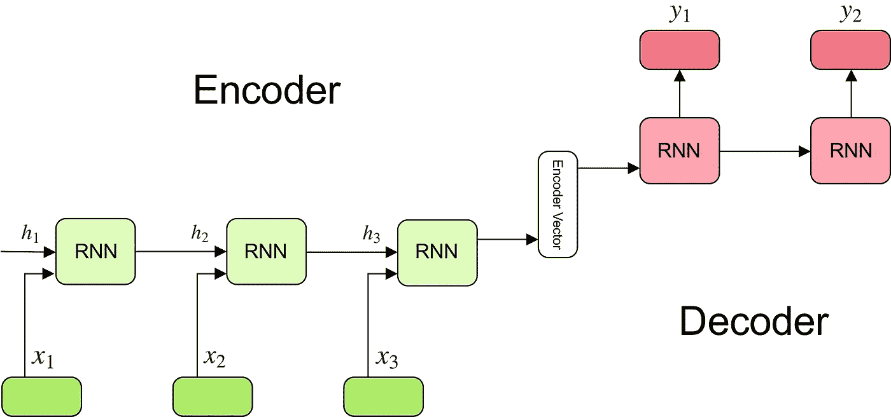
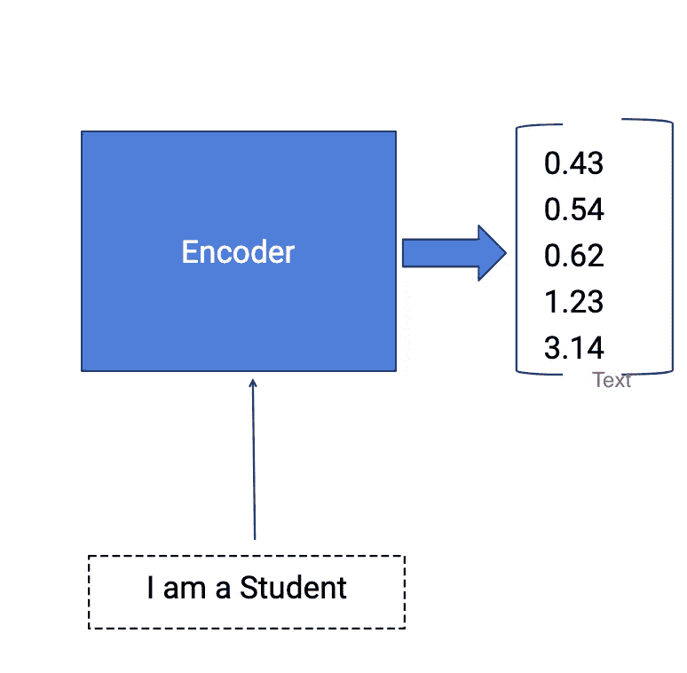
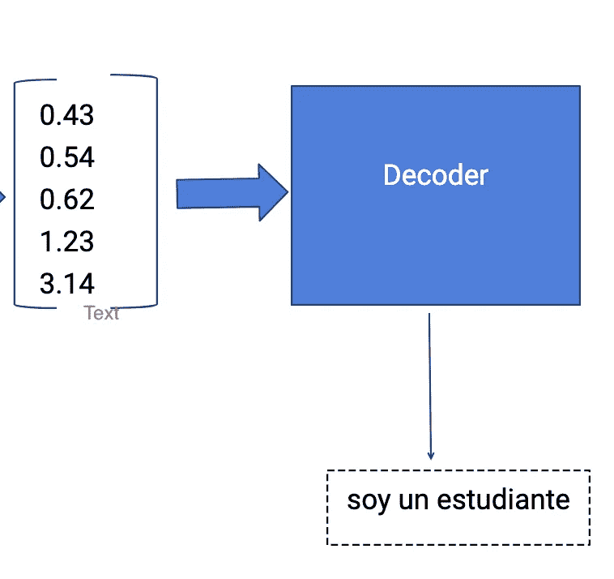
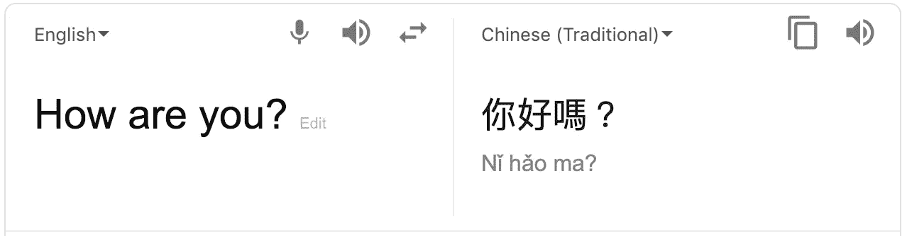

# 编码器-解码器，序列到序列架构。

> 原文：<https://medium.com/analytics-vidhya/encoders-decoders-sequence-to-sequence-architecture-5644efbb3392?source=collection_archive---------0----------------------->

理解深度学习中的编码器-解码器、序列到序列架构。

从一种语言翻译成另一种语言。

在深度学习中，很多复杂的问题可以通过构建更好的神经网络架构来解决。RNN(递归神经网络)及其变体在序列对序列学习中非常有用。RNN 变体 LSTM(长短期记忆)是 seq-seq 学习任务中使用最多的细胞。

> 递归神经网络的编码器-解码器架构是标准的神经**机器翻译方法**，它可以与经典的统计机器翻译方法相媲美，在某些情况下甚至更胜一筹。

这种架构非常新，仅在 2014 年被开发出来，尽管它已经被用作[谷歌翻译服务](https://translate.google.com/)的核心技术。

# 编码器-解码器模型

编码器-解码器模型中有三个主要模块，

*   编码器
*   隐藏向量
*   解码器

编码器会将输入序列转换成一维向量(隐藏向量)。解码器将把隐藏向量转换成输出序列。

> 编码器-解码器模型被联合训练以在给定输入序列的情况下最大化目标序列的条件概率。

# 序列对序列模型如何工作？

为了充分理解模型的基本逻辑，我们将浏览下图:

编码器-解码器序列到序列模型

# 编码器

*   多个 RNN 单元可以堆叠在一起形成编码器。RNN 按顺序读取每个输入
*   对于每个时间步长(每个输入)t，隐藏状态(隐藏向量)h 根据该时间步长 X[i]处的输入进行更新。
*   在编码器模型读取所有输入之后，模型的最终隐藏状态表示整个输入序列的上下文/摘要。
*   示例:考虑要编码的输入序列“我是学生”。编码器模型总共有 4 个时间步长(4 个令牌)。在每个时间步长，隐藏状态 h 将使用先前的隐藏状态和当前输入来更新。

示例:编码器

*   在第一时间步 t1，先前的隐藏状态 h0 将被认为是零或随机选择的。所以第一个 RNN 单元将用第一个输入和 h0 更新当前隐藏状态。每一层输出两件事—更新的隐藏状态和每个阶段的输出。每一级的输出都被拒绝，只有隐藏状态将被传播到下一层。
*   隐藏状态 *h_i* 使用以下公式计算:

*   在第二时间步 t2，隐藏状态 h1 和第二输入 X[2]将作为输入给出，并且隐藏状态 h2 将根据这两个输入更新。那么隐藏状态 h1 将用新的输入更新，并将产生隐藏状态 h2。在所举的例子中，所有四个阶段都会发生这种情况。
*   几个循环单元(LSTM 单元或 GRU 单元，性能更好)的堆栈，其中每个单元接受输入序列的单个元素，收集该元素的信息，并将其向前传播。
*   在问答问题中，输入序列是问题中所有单词的集合。每个单词被表示为 *x_i* ，其中 *i* 是该单词的顺序。

> 这个简单的公式代表了普通递归神经网络的结果。正如你所看到的，我们只是将适当的权重应用到先前隐藏的状态 *h_(t-1)* 和输入向量 *x_t.*

# 编码器向量

*   这是从模型的编码器部分产生的最终隐藏状态。它是用上面的公式计算的。
*   该向量旨在封装所有输入元素的信息，以帮助解码器做出准确的预测。
*   它充当模型解码器部分的初始隐藏状态。

# 解码器

*   给定隐藏状态 ht，解码器通过预测下一个输出 Yt 来产生输出序列。
*   解码器的输入是在编码器模型结束时获得的最终隐藏向量。
*   每一层将有三个输入，来自前一层的隐藏向量 ht-1 和前一层输出 yt-1，原始隐藏向量 h。
*   在第一层，编码器的输出向量和随机符号开始，空隐藏状态 ht-1 将作为输入给出，获得的输出将是 y1 和更新的隐藏状态 h1(输出的信息将从隐藏向量中减去)。
*   第二层将更新的隐藏状态 h1 和先前的输出 y1 以及原始隐藏向量 h 作为当前输入，产生隐藏向量 h2 和输出 y2。
*   解码器每个时间步长的输出是实际输出。模型将预测输出，直到结束符号出现。
*   几个循环单元的堆栈，每个循环单元在一个时间步 *t* 预测一个输出 *y_t* 。
*   每个递归单元接受前一个单元的隐藏状态，并产生一个输出和它自己的隐藏状态。
*   在问答问题中，输出序列是答案中所有单词的集合。每个单词表示为 *y_i* ，其中 *i* 是该单词的顺序。

例如:解码器。

*   任何隐藏状态 *h_i* 都是使用公式计算的:

如你所见，我们只是使用前一个隐藏状态来计算下一个。

# 输出层

*   我们在输出层使用 Softmax 激活函数。
*   它用于从具有高概率目标类的值向量中生成概率分布。
*   使用以下公式计算时间步长 *t* 的输出 *y_t* :

我们使用当前时间步长的隐藏状态以及相应的权重 W(S)来计算输出。Softmax 用于创建一个概率向量，该向量将帮助我们确定最终输出(例如问答问题中的 word)。

这个模型的强大之处在于它可以将不同长度的序列相互映射**。**如您所见，输入和输出不相关，它们的长度可能不同。这开启了一系列全新的问题，现在可以使用这种架构来解决。

# 应用程序

它拥有许多应用，例如

*   谷歌的机器翻译
*   问答聊天机器人
*   语音识别
*   时间序列应用等。,

# 序列对序列模型的用例

您每天面对的众多系统背后都有一个序列对序列模型。例如，seq2seq 模型支持谷歌翻译、语音设备和在线聊天机器人等应用。一般来说，这些应用程序包括:

*   *机器翻译* —谷歌 2016 年的一篇[论文](https://arxiv.org/pdf/1409.3215.pdf)展示了 seq2seq 模型的翻译质量如何“接近或超过目前所有公布的结果”。

谷歌翻译截图。

# 摘要

在这篇文章中，你发现了神经机器翻译的编码器-解码器模型。编码器和解码器模型如何工作

你有什么问题吗？
在下面的评论里提出你的问题，我会尽力回答。

# 进一步阅读

如果您想更深入地了解这个主题，本节提供了更多的资源。

*   [谷歌的神经机器翻译系统:弥合人类与机器翻译的鸿沟](https://arxiv.org/abs/1609.08144)，2016。
*   [用神经网络进行序列对序列学习](https://arxiv.org/abs/1409.3215)，2014。
*   [用神经网络进行序列到序列学习的演示](https://www.youtube.com/watch?v=-uyXE7dY5H0)，2016。
*   [伊利亚·苏茨科夫主页](http://www.cs.toronto.edu/~ilya/)
*   [使用统计机器翻译的 RNN 编码器-解码器学习短语表示](https://arxiv.org/abs/1406.1078)，2014 年。
*   [联合学习对齐和翻译的神经机器翻译](https://arxiv.org/abs/1409.0473)，2014。
*   [关于神经机器翻译的性质:编码器-解码器方法](https://arxiv.org/abs/1409.1259)，2014。
*   [京畿道町主页](http://www.kyunghyuncho.me/)
*   GPU 神经机器翻译入门( [part1](https://devblogs.nvidia.com/parallelforall/introduction-neural-machine-translation-with-gpus/) 、 [part2](https://devblogs.nvidia.com/parallelforall/introduction-neural-machine-translation-gpus-part-2/) 、 [part3](https://devblogs.nvidia.com/parallelforall/introduction-neural-machine-translation-gpus-part-3/) )，2015。