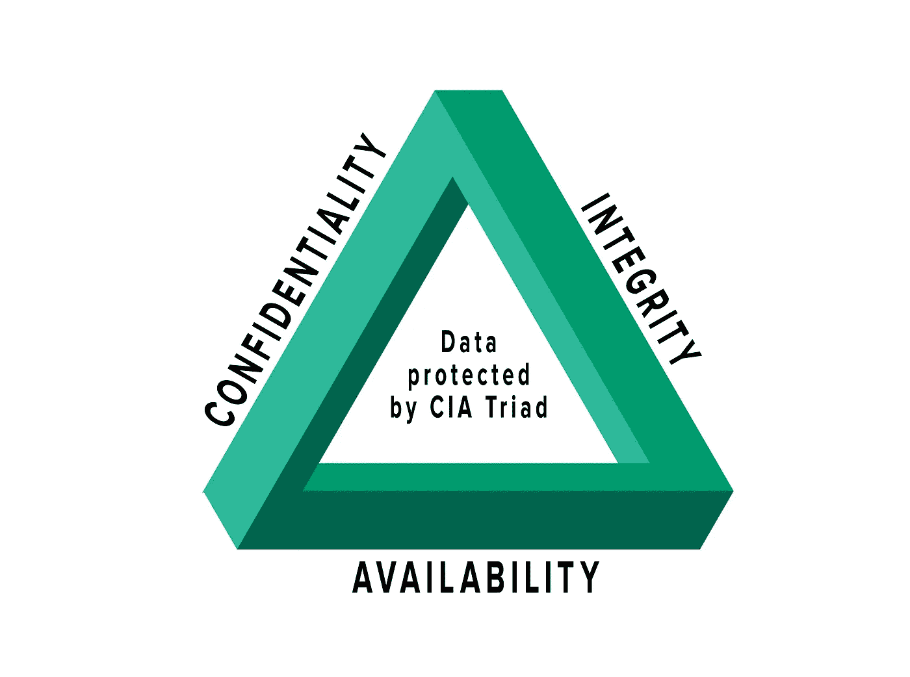
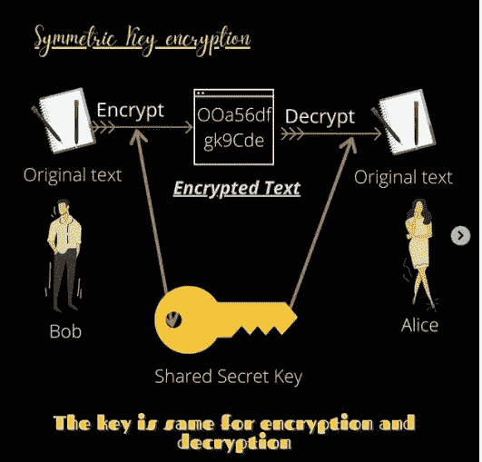
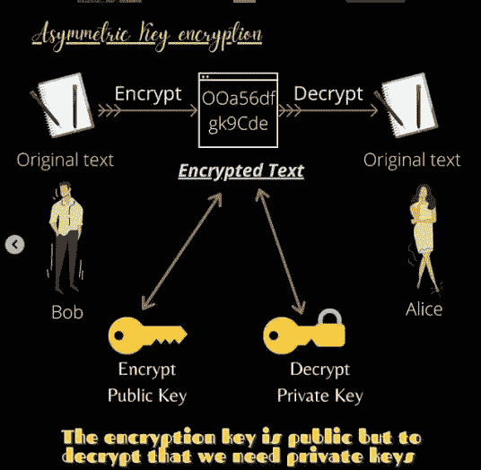

# 加密—概述

> 原文：<https://medium.com/analytics-vidhya/encryption-an-overview-c7e26eefed12?source=collection_archive---------17----------------------->

加密是一种保护数据的方式，这样除了发送方和接收方，没有人有权查看消息或消息内容。在深入研究加密之前，让我们先来看一下**中情局三重奏。**

CIA 代表机密性、完整性和可用性。简单来说，当你和你的朋友通过手机聊天时，如果有人窃听了信息，那么保密性就被破坏了，所以它会保护你传输的数据。假设你发送一条消息说你好约翰！约翰收到了 Hi！那么完整性就丧失了，现在的问题是你发送一条信息，而其他人收到的正是你发送的内容，没有任何修改。几个小时后，如果你想看到你们分享的消息，如果没有，那么就失去了可用性。这是为了确保数据在授权用户需要的时候可用。

**什么是密文和密钥？**

密文是一种加密的文本，它是使用加密算法从纯文本中派生出来的，我们将在后面的部分中讨论加密算法。仅使用一个 ***密钥*** 就可以将其转换回明文。密钥是一个变量值，我们使用某种方法将它应用到明文中以生成加密文本。它越长越安全。

两种类型的密钥: ***私钥和公钥。私钥是你特有的东西，或者是你唯一拥有的密钥。公钥是每个人共享的，顾名思义，它是对所有人开放的。***

有许多不同的密码，如凯撒密码，莫尔斯电码，替代密码等。

**加密类型**

***对称加密—*** 为了理解这一点让我们以两个用户爱丽丝和鲍勃为例。Alice 想给 bob 发送一条消息，因此她通过算法和使用密钥将自己的普通消息转换为密文。然后 bob 收到消息，并通过密钥解密消息。现在，两个密钥应该匹配，所以关键是在对称密钥加密中，密钥通常在两个用户之间共享，所以您还必须传输密钥，这有时可能会导致密钥泄漏。

***非对称加密—*** 与对称加密不同，我们不必为了加密和解密而拥有一个公共的共享密钥。这里，Alice 有一个公开的密钥，对每个人都公开，她用这个密钥加密并发送给 Bob。那么现在鲍勃可以用他自己的私钥解密。现在钥匙不同了

**加密算法**

*   ***MD5 —*** 消息摘要算法是一种加密哈希函数。它用于检查被哈希处理的消息或文件的完整性。该算法以循环方式使用四个 32 位长度的变量来创建一个值，然后使用该值来生成哈希。主要用途是存储密码，也涉及文件的校验和。
*   ***AES —*** 高级加密标准(AES)是被美国政府信任为标准的算法。它也包含 128 位、192 位和 256 位的密钥。最流行的是 256 位密钥，因为它需要最长的时间来破解，这就是为什么它被称为最安全的加密技术。它使用对称密钥方法，加密和解密都很快。
*   ***RSA —*** RSA 是一种公钥加密算法，是加密通过互联网发送的数据的标准。它使用非对称加密方法，因此我们需要一对密钥来加密和解密，因此加密和解密需要一些时间，但对于攻击者来说，破解加密代码需要大量的处理能力。
*   ***Triple DES—***Triple DES 是为了取代原有的数据加密标准(DES)算法而设计的，该算法有漏洞可供黑客破解。它使用三个单独的 56 位密钥。总密钥长度总计为 168 位，但最推荐的是 112 位。它在硬件加密技术中最为常见。

**通过加密保护数据的最佳方式**

1.  了解法律法规，如 PCI-DSS，以确保银行信息安全等
2.  评估数据，提出结论性的推理陈述以及保护方法
3.  确定所需的加密级别
4.  关于数据传输和 ACL(访问控制列表)的注意事项
5.  记下组织使用的第三方服务的所有详细信息，以便在基础架构和数据保护方面提供更高效的解决方案

*在 Instagram 上关注@analysta02 了解更多详情*