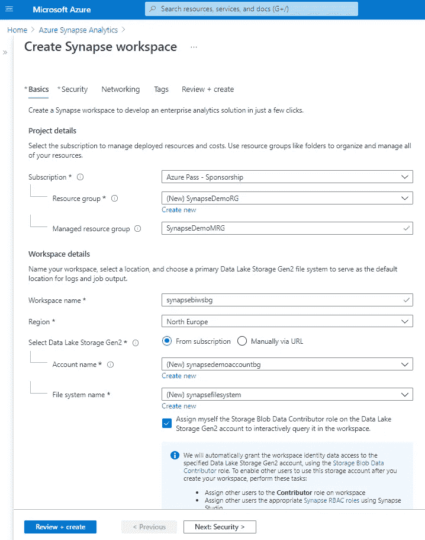

# 使用 Azure Synapse Analytics 的端到端商业智能流程

> 原文：<https://medium.com/analytics-vidhya/end-to-end-business-intelligence-process-with-azure-synapse-analytics-ad0bc1535a38?source=collection_archive---------9----------------------->

我们谈到了[微软 Azure Synapse Analytics](https://busraguner.medium.com/microsoft-azure-synapse-analytics-nedir-u%C3%A7tan-uca-veri-analiti%C4%9Fi-projeleri-i%C3%A7in-synapse-9a80a1d9c1d9) 服务及其优势。

让我们检查组件并执行一个*端到端的样本流程*！

当我们想要体验 [Azure Synapse Analytics](https://azure.microsoft.com/tr-tr/free/synapse-analytics/) 时，我们有 30 天的访问和消费限制。

如下定义*资源组*和*工作区名称*后，我们就可以创建服务了。

然后，我们从 *Open Synapse Studio* 区域被定向到*工作区*界面。

> 这个接口实际上类似于 Azure Data Studio，在我看来，也是因为这个原因，也许随着未来的发展，Synapse 接口可以集成到 Data Studio 中，或者 Synapse Studio 可以像 Data Studio 一样以桌面格式使用。

借助 Synapse Studio，我们可以通过单一界面访问数据仓库或机器学习项目中使用的所有数据传输、代码版本控制、数据可视化和预测组件。

我们通过屏幕左侧的菜单访问所有步骤。通过此菜单，我们可以访问 ***管道*** 和 ***数据中心、数据工厂等开发环境。***

在我们的示例中，准备好环境后，我们将首先把数据从本地 SQL 数据库传输到 Synapse 上的 Azure。然后我们将使用 Power BI 对我们的数据进行建模，并在 Synapse 中体验端到端的流程。

[https://mrpaulandrew . com/2020/10/20/an-idea-for-self-service-using-azure-synapse-analytics/](https://mrpaulandrew.com/2020/10/20/an-idea-for-self-service-using-azure-synapse-analytics/)

首先，我们需要安装一个网关，它将提供对我们本地的访问，即 ***集成运行时*** 。我们可以从集成运行时选项卡下的 ***管理*** 菜单下载安装文件。我们显示 AutoResolveIntegrationRuntime，它是在服务发生时自动为我们的 Azure 访问提供的。我们想创建一个 ***(本地/私有网络)*** ，用于使用新按钮进行本地访问。

当我们命名它并单击 Create 按钮时，它允许我们下载一个。exe 文件，并执行自动安装。安装完成后，我们现在可以使用这个组件访问本地服务器上的资源。

那么我们如何提取数据呢？

当我们想用*菜单定义一个新的流程时，它给了我们两个选项。有了 ***流水线*** ，我们就可以像在数据工厂里使用的那样，用一个接口手动工作。使用**复制数据工具，**我们可以在向导逻辑指导的屏幕上设置流程。*

*让我们用 ***复制数据工具*** 快速创建一个从本地提取数据的流程。*

*在选择了名称定义和特性之后，我们可以使用参考资料部分中现有的链接，或者创建一个新的资源。我们可以使用自托管集成运行时来访问我们的资源，这是通过选择 Sql Server 资源来创建的。在使用类似的流程创建和选择我们的源和目标连接之后，屏幕出现，在这里将自动创建表以及如何处理它们。如果我们愿意，可以将它与现有的表相匹配。*

**

*在完成复制数据工具过程后，我们看到，由于 Data Factory 屏幕上的 For Each 中的向导，已经创建了一个管道。我们的本地表被移动到 SQLPoolDedicated 中，我们将它显示为目标。*

**

*我们从本地获取数据，实际上创建了一个暂存环境。在这个阶段之后，我们现在可以继续到 DWH 池阶段，在那里我们将创建我们的 Dim 和 Facts，就像我们在数据工厂或 SSIS 所做的那样。我们可以用任何我们想要的方式创建 Dim 和事实表。因为我们的主题是在 Synapse 上传输流程，所以我们通过将表命名为 Dim 和 Fact 来将它们直接传输到 DWH 池，而不详细讨论数据工厂的使用。同样，我们使用复制数据工具组件。*

**

> *在这里，我们实际上是使用 Synapse 端的数据工厂或管道功能来传输数据的。然而，这也有其他的技术。可以使用不同的技术，如 PowerShell、Visual Studio、AzCopy、Polybase Engine 和 Copy Statement。*

*在最后阶段，我们需要 ***Power BI*** 访问 Azure Synapse 上的报告阶段。同样，我们可以通过在 ***管理*** 菜单中的链接服务选项卡中单击新建来创建我们的 Power BI 连接。*

**

*它要求我们转到为我们的用户定义的 ***租户*** ，我们连接到 Azure Synapse 并在那里的 ***工作区*** 上进行选择。*

**

*当我们完成配置时，我们可以在我们的连接中看到它作为链接服务。*

*现在我们可以访问 Power BI，我们可以使用 Synapse Workspace 开发报告或访问现有报告。*

*我们希望创建一个报告，其中将使用我们为此流程创建的 DWH 池，我们希望定义端到端。为此，我们可以通过单击开发菜单下的 Power BI 数据集和新建按钮来创建资源。*

*对于资源创建和报告可视化，浏览器内管理的方法不是首选。也许我们可以说，这种发展现在还没有实现。*

*当您想要在下面的屏幕上创建一个带有新数据集的报告时，当您单击相关源旁边的“Download.pbids file”按钮时，一个带有源链接的 ready Desktop 文件会下载到您的本地。*

**

*在我们建立模型之后，我们可视化我们的报告并 ***发布*** 给我们相关的租户和工作空间。*

**

*当我们在 Workspace 中查看报告时，我们实际上会进入一个屏幕，在这里我们可以像在 Power BI 门户上一样编辑报告。*

> ****详细审核建议****

*要获取文章内容的详细技术解释和应用，您可以通过[链接](https://www.youtube.com/watch?v=KGKvLpYOZO8)访问我们在 2 月份举办的网络研讨会。
我们可以通过 Azure Synapse Analytics 提供的五个[技术视频](https://azure.microsoft.com/tr-tr/synapse-analytics/demo/details/)获得更详细的信息。*