# 端到端机器学习项目

> 原文：<https://medium.com/analytics-vidhya/end-to-end-machine-learning-project-a3543c89f6eb?source=collection_archive---------0----------------------->

提高一个人在某个特定领域的技能的最好方法是通过在真实世界场景中使用该技能来练习该技能。我已经尝试使用我的技能，旨在创建一个 web 应用程序，该应用程序基于用户使用为特定城市训练的机器学习模型给出的输入，给出特定城市的特定地点的租金价格的估计。

## 项目背后的动机

到目前为止，我已经注意到，就印度的情况而言，在房地产领域使用机器学习做的工作并不多，现有的网站，如[magicbricks.com](https://www.magicbricks.com/)、[makaan.com](https://www.makaan.com/)等都过于精细，需要用户提供大量输入，而计划迁移到特定城市的用户可能不知道。

该项目的主要动机是创建一个使用机器学习的 web 应用程序，并根据给定的输入给出租金价格的良好估计。这个 web 应用程序的主要焦点是提供一个简单的用户界面以及准确的结果。

## 获取数据

为了这个项目的目的，我使用了来自 [Kaggle](https://www.kaggle.com/) 的数据集。该数据集包含印度 8 个不同城市的房价

1.  孟买
2.  德里
3.  加尔各答
4.  班加罗尔
5.  海得拉巴
6.  金奈
7.  艾哈迈达巴德
8.  浦那

这个项目中使用的数据是从[makaan.com](https://www.makaan.com/)网上搜集的，数据的原始来源是上传到 Kaggle 上的一个数据集，名为[印度大城市的房屋租金价格](https://www.kaggle.com/saisaathvik/house-rent-prices-of-metropolitan-cities-in-india/)。

## 初始设置

出于这个项目的目的，我使用了 AWS 免费层帐户中的两个资源

1.  从 EC2 释放 t2.micro 层实例以维护服务器
2.  免费层 RDS 数据库，具有最少的配置和禁用的自动备份，用于在云上维护动态数据库

在创建资源时，您可能需要注意以下几点

在 SQL 数据库中授权您在 google cloud 上创建的个人计算机和服务器的公共 IP 地址，以便您可以从 PC 或服务器连接

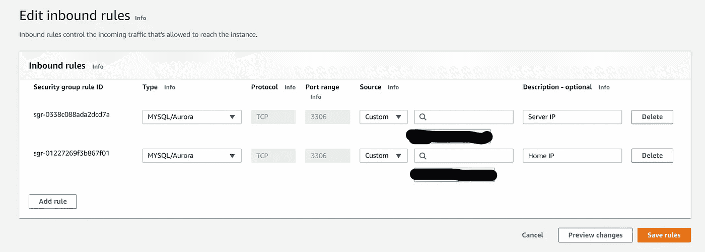

您可能希望创建一个单独的安全组，并授权一些设备来保护您的数据库和服务器免受不必要的连接

## 数据预处理

出于这个项目的目的，我使用了 _All_Cities_Cleaned.csv 文件，该文件可以从 Kaggle 的数据集中获得

尽管该文件已被清理，但仍需要进一步的预处理。

在清理和预处理文件之后，我创建了两个 SQL 文件，其中包含对 SQL 的插入查询，这样就可以动态地读取数据，并相应地更新模型。

最初，我需要在 MySQL workbench 中运行 SQL 文件来加载数据，但是后来，通过使用 insert 查询将来自用户的输入插入到表中，以便模型在更新的数据上进行训练

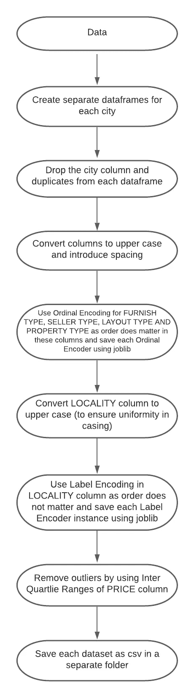

数据预处理流水线

用于预处理的 Python 代码

## 探索性数据分析

出于 EDA 的目的，我已经从 SQL 加载了经过清理和预处理的数据。

然后，我在每个数据框架后添加了城市一栏，以表示数据来自的城市，并添加了可负担性一栏(由价格/面积给出)，以表示每个城市房屋的可负担性

然后我继续分析每个城市出租的房屋数量，发现大部分房屋是在孟买、德里和浦那出租的，这可能是因为孟买是印度的金融中心，德里是印度的政治中心，浦那因其教育机构而被誉为东方牛津

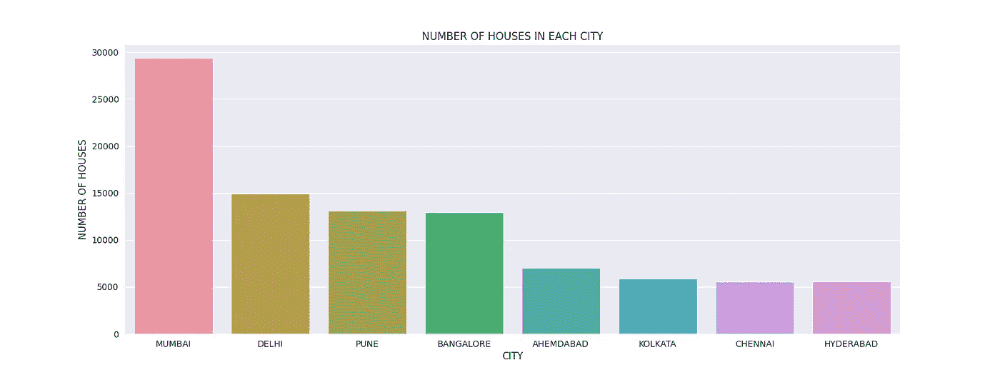

每个城市出租的房屋数量

然后我画出每个城市的平均房价，找出哪个城市的房价最贵，我发现德里和孟买的房价最贵

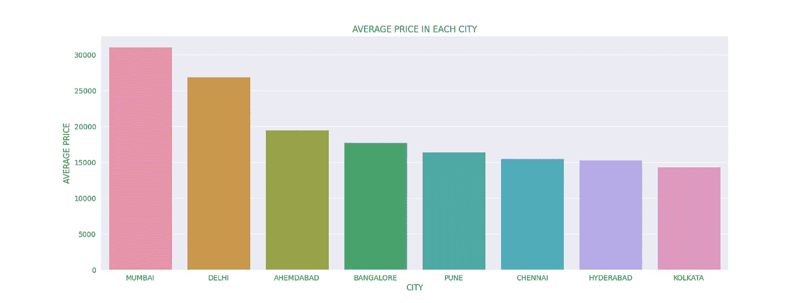

各城市出租房屋平均价格

然后我决定把每个城市的房子平均面积画出来，看看每个城市的房子按照面积定价是否合适。我发现德里、艾哈迈达巴德和海德拉巴的房子是最宽敞的房子

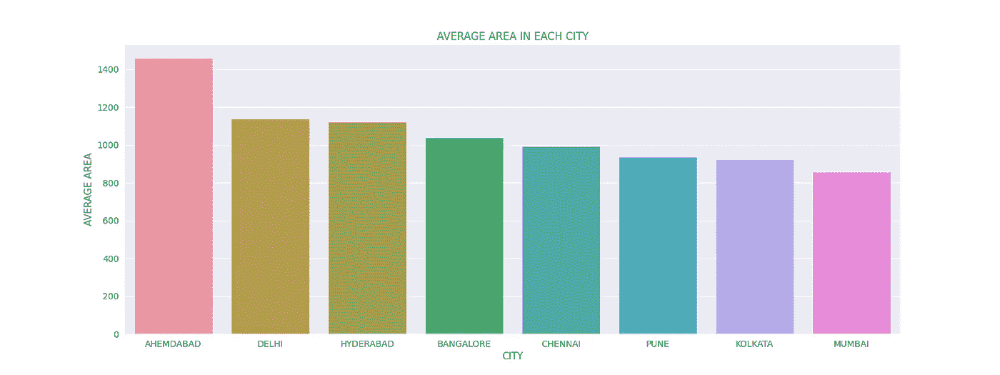

每个城市的平均住房面积

在绘制了每个城市的房价和房屋面积后，我决定绘制每个城市的房屋可负担性，以找出数据集中最可负担的城市，每平方英尺的价格越低，该城市的房屋越可负担。在绘制了每个城市的房价后，我发现艾哈迈达巴德、加尔各答和海得拉巴是数据集中房价最低的城市

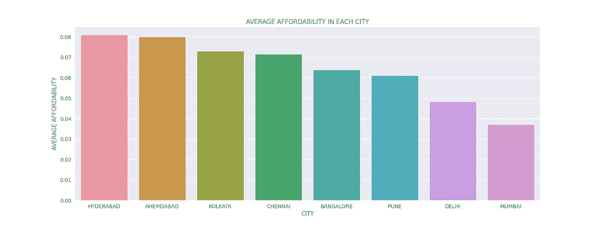

每个城市的住房负担能力

然后，为了在更深的层次上分析数据，我绘制了分类/文本列['卖家类型'，'布局类型'，'物业类型'，'家具类型']作为饼图，以查看每个城市中每个列的每个类别的比例，作为一个 2x2 的图，旁边有文本注释

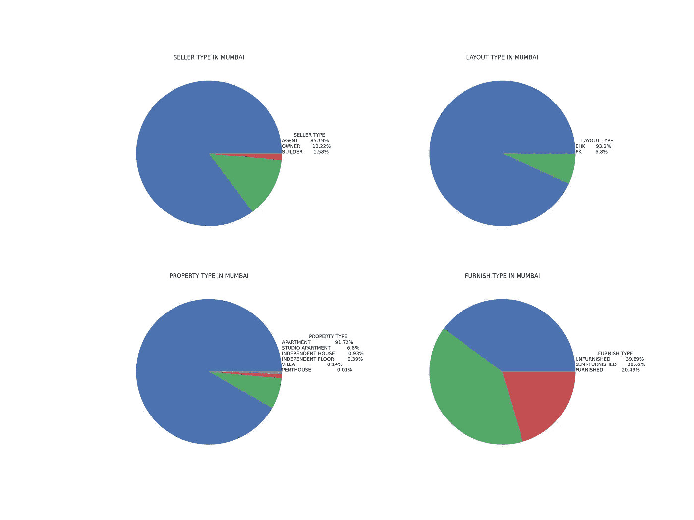

孟买市的饼图

然后，我决定将数字列绘制为 2x2 的网格，其中顶行是该城市房价和房屋面积的分布，底行是每个城市卧室数量和浴室数量的直方图。

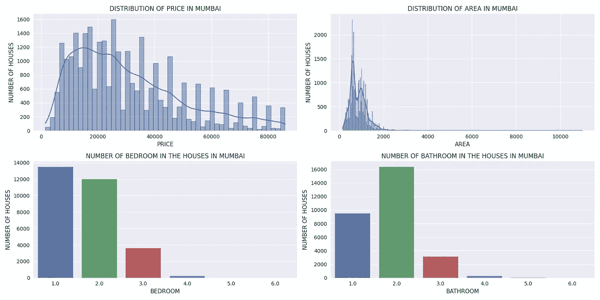

孟买市的数值分析

然后我决定在每个城市并排标出 10 个最便宜的地方和 10 个最不便宜的地方。大多数和最不负担得起的地点的标准是按地点分组的特定城市的数据中负担能力一栏的平均值

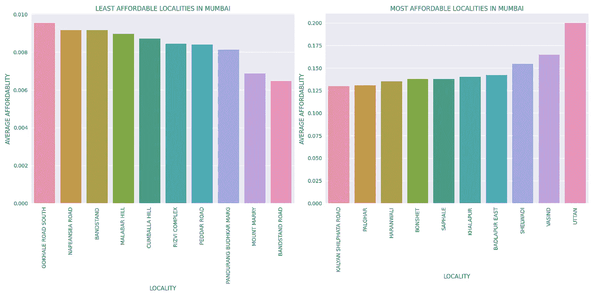

孟买市房屋的可负担性

然后，我决定在每个城市并排标出 10 个最宽敞的地方和 10 个最不宽敞的地方。最宽敞和最不宽敞地点的标准是按地点分组的特定城市数据中面积列的平均值。

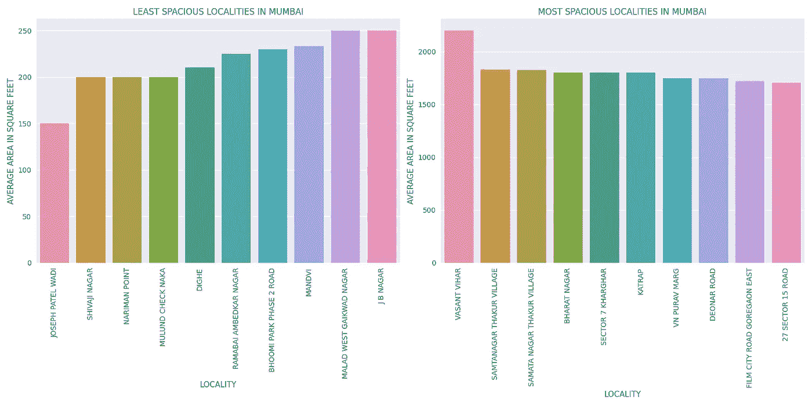

孟买市宽敞的房屋

用于探索性数据分析的 Python 代码

## 模型结构

既然我们已经对数据进行了预处理和分析，我们现在准备继续进行项目的主要部分，即构建机器学习模型，然后在后端为我们的 web 应用程序提供动力。

为了这个项目的目的，因为这个问题是一个回归问题，我已经分析了我的模型的基础上 R2 评分和平均绝对误差

我已经为这个项目尝试了以下模型

1.  线性回归
2.  决策树回归
3.  随机森林回归
4.  Adaboost 回归
5.  梯度推进回归
6.  XGBoost 回归

从下面的模型中，我发现 XGBoost 回归器是在训练集和测试集上具有最小平均绝对误差和最大 R2 分数的模型

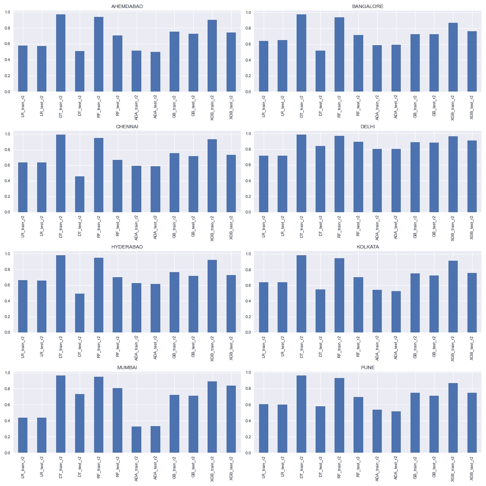

每个城市所有模型在训练集和测试集上的 R2 得分

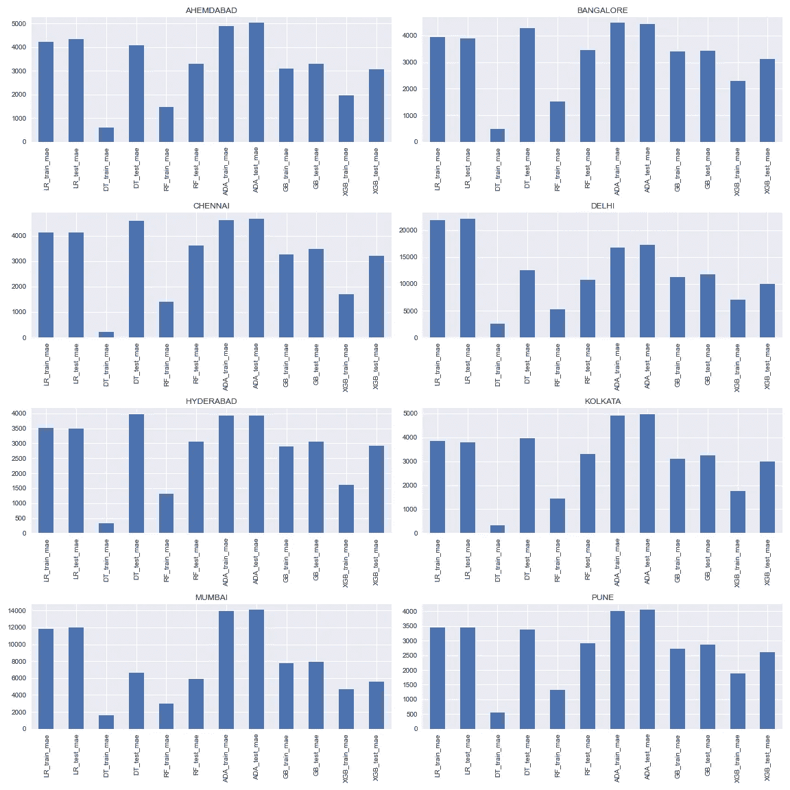

每个城市所有模型在训练集和测试集上的 MAE 分数

由于 XGBoost 是最佳模型，我们将尝试在 XGBoost 回归模型上进行超参数调优。

在尝试超参数调优之后，我们发现经验证的模型并没有显示出太多的改进，因此我们将使用原始的 XGBoost 模型

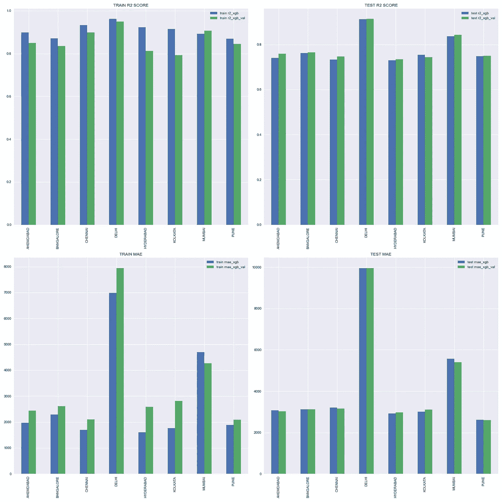

超参数调整前后的模型比较

用于模型构建的 Python 代码

## 将所有组件放在一起

既然现在我们已经创建了模型，我们现在将创建一个具有各种端点的 web 应用程序，以向最终用户显示关于每个城市的分析和信息，并将提供一个具有我们精确的机器学习模型的简单用户界面。

使用 Flask 创建 web 应用程序的 Python 代码

## 重新训练模型

由于现在我们已经对模型进行了一次训练，因此每个月都需要根据新数据对模型进行持续的重新训练，为此，我创建了一个 python 脚本来重新训练模型并覆盖更新的图形

用于重新训练模型的 Python 代码

## 部署

为了部署模型，我在 Linode 上创建了一个服务器，使用 nginx 和 gunicorn 部署了应用程序，然后使用 [namecheap](https://namecheap.com/) 将其链接到一个域。

要获得域名，您需要从任何域名提供商处购买域名，然后根据您使用的服务器提供商配置域名服务器，然后您需要配置 DNS 记录以将域名指向您的服务器(基本上，您需要配置 2 台主机— www 和空白主机，以便任何人进入 www。YOUR_DOMAIN_NAME.com 或 YOUR_DOMAIN_NAME.com，用户将被重定向到您的服务器的 IP 地址)

为了获得 SSL 证书，我使用了免费的非盈利证书提供商[让我们加密](https://letsencrypt.org/)。然后为了每个月重新训练模型，我使用了 Ubuntu 中的 crontab 实用程序。

以下是我使用的一些命令

[源代码](https://github.com/aayush1036/housing-rent-prediction)