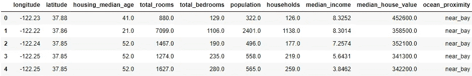
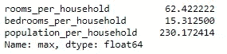
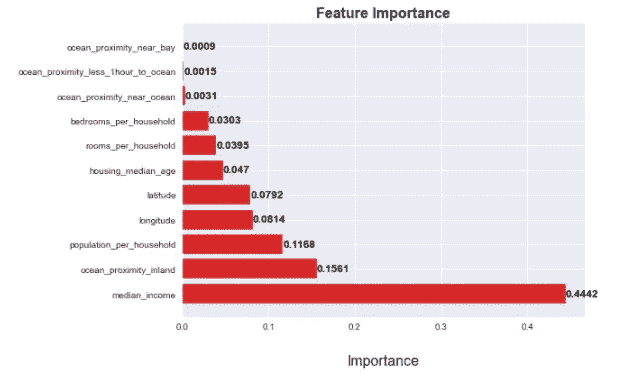

# 端到端机器学习项目:预测加州房价

> 原文：<https://medium.com/analytics-vidhya/end-to-end-maching-learning-project-predicting-house-prices-in-california-2e95171d49cc?source=collection_archive---------0----------------------->


马丁·范·登·霍维尔在 [Unsplash](https://unsplash.com?utm_source=medium&utm_medium=referral) 上的照片

欢迎来到加州房价分析！在这个项目中，我们将使用 1990 年加州人口普查数据集来研究并试图理解不同的属性如何使房价变高或变低。位置如何影响？房子的大小怎么样？年龄？

这个数据集有很多信息可以帮助我们。主要目标是在 python 中建立一个机器学习模型，该模型可以从这些数据中学习，并在给定数据集中提供的所有其他指标的情况下，预测任何地区的房屋价格。

该项目将分为两个主要部分:首先，我们将深入研究数据，清理数据，并制作一个大型 EDA 来收集见解并创建可能对模型有帮助的假设。

在此之后，我们将通过重重困难来创建一个能够对房价做出最佳预测的 ML 模型:我们将测试不同的模型，检查所阐述的假设，尝试创建新的特征，优化超参数等等。

数据集、文档和 jupyter 笔记本可以在我的 [github 页面](https://github.com/DanielEliezer/california_housing)找到

我们走吧！

# **先看数据**

让我们来看看从 1990 年加利福尼亚人口普查中收集的原始数据集。它包含 20640 行，每行存储一个特定块的信息。



数据集的前几行

我们有以下变量，下面的描述收集在 kaggle 的 dataset [page](https://www.kaggle.com/camnugent/california-housing-prices) 中。

*   经度:衡量一所房子向西多远的尺度；更高的值在更西边
    **纬度:**一个测量房子有多北的尺度；更高的值是更北
    **住房 _ 中位数 _ 年龄:**一个街区内房屋的中位数年龄；较低的数字是较新的建筑
    **总房间数:**一个街区内的总房间数
    **总卧室数:**一个街区内的总卧室数
    **人口数:**居住在一个街区内的总人数
    **户数:**总户数，居住在一个家庭单元内的一组人， 对于一个街区
    **中值 _ 收入:**一个街区内家庭的中值收入(以万美元计)
    **海洋 _ 邻近度:**房子的位置 w.r.t 海洋/海洋
    **中值 _ 房子 _ 价值:**一个街区内家庭的中值房子价值(以美元计)

好的，现在我们有一个小障碍。我们的目标变量是“中值房屋价值”，即给定街区中一栋房屋**的中值。但是，一些指标与整个街区相关(房间总数、卧室总数和人口)。**我们可能需要创建一些新的特性来保证它们在同一个“单元”中。****

# 清理数据

在进行上述更改之前，让我们先检查一下空值

**空值处理**

```
# df.isnull().sum()
```


具有空值的变量

我们有 207 个“总卧室”缺失值的记录。这个数字非常小，丢失的值不会危及模型:几乎每个“经典”的解决方案，如删除行，用均值/中值填充等。将在最终模型中给出类似的结果。

但是出于教学的目的，让我们做一个更好的解决方案:

想法是在将空值分组为更小的子集后，用中值填充空值。这个解决方案很有趣，因为对整个数据集只使用一个值可能会有问题，因为这些数字离中值越来越远。以更小的间隔对数据集进行分组保证了我们输入的是更接近极值的中值。

解决方案:首先，检查相关矩阵，与“卧室总数”最相似的度量是“住户”。因此，我们可以在用中位数填充之前，用它们**对记录进行分组。这种分组将以 20 个单元为一组(例如，1~19 户的➡组 1，20 ~ 39 户的➡组 2，等等)**

```
## Grouping the data in blocks of 20 values
df["households_gp"] = df["households"]//20## Filling the null values with the median
df["total_bedrooms"] = df["total_bedrooms"].fillna(df.groupby("households_gp")["total_bedrooms"].transform('median'))
```

很好，我们没有空值了。

**改变变量“单位”**

现在，让我们进行前面提到的更改:我们需要创建新的变量，以确保关于房间、卧室和人口的信息与我们的目标在同一个“单元”中。

```
## Creating useful featuresdf["rooms_per_household"] = df["total_rooms"]/df["households"]
df["bedrooms_per_household"] = df["total_bedrooms"]/df["households"]
df["population_per_household"] = df["population"]/df["households"]
```


新创建变量的统计数据

查看新变量的描述性统计数据，我们可能会发现另一个问题:“每户人口”和“每户房间”的最大值远远高于预期。再深入一点，我们确定了一些具有这些极值的行，**，并将在下一步中删除它们**。

这里我们将非常保守:许多记录看起来有很高的价值，但是我们仍然假定它们是无辜的，并把它们保存在我们的数据中。

```
# Dropping outliers
df_cleaned = df.drop([1914,1979,3364,16669,19006]).reset_index(drop = True)
```



更改后的最大值

好吧，即使新的最大值仍然很高，他们似乎更合理。我们继续吧。

**探索变量之间的关系**

现在，让我们试着理解变量之间的关系。为此，**我们将使用 AutoViz 库**，它自动为我们绘制所有关系，类似于 Sweetviz、pandas profiling 等

```
# Checking the distributions of our main variables 
AV = AutoViz_Class()
dft = AV.AutoViz(“”, dfte=df, depVar = ‘median_house_value’)
```


AutoViz 报告的一小部分

看一下 Autoviz 的报告，一些事情引起了我们的注意:让我们更仔细地看看收入中位数和房屋价值中位数之间的关系。


我们似乎对房屋价值中值有一些问题:首先，最高房屋价值明确设定为 500.000 美元，所有比这更贵的房屋都“收到”这一金额。**这些记录应该被删除，因为它们的目标值不正确，可能会扰乱模型。**

第二个问题是我们可以在一些具体的点上看到一些水平线，比如 450.000，350.000，350.000，275.000$。这看起来很不自然，这些值可能放错了地方。这里有两个选择:我们可以简单地删除所有具有这些值的记录，或者我们可以尝试为这些怪癖中的每一个确定一个阈值，在该点之后，数据似乎是不正确的。

由于数据集足够大，这些值只代表数据的一小部分(大约 1%)。我们就放弃吧。


变化后的相同关系

这看起来更自然！

这就是目前所有的清洁工作，让我们在我们的 EDA 中挖一个小挖掘机。

# 探索性数据分析

## 地理空间数据

首先，让我们看看我们的目标在地图中的行为。地段对决定房子价值中位数有多重要？

我们将使用 plotly 和 [mapbox API](https://www.mapbox.com/) 。你需要创建一个 mapbox 帐户来免费获取访问令牌。

```
## Plotting the map, using the mapbox api
mapbox_access_token = <YOUR_TOKEN>
px.set_mapbox_access_token(mapbox_access_token)
fig = px.scatter_mapbox(small_df, lat=”latitude”, lon=”longitude”, zoom=4, color=”median_house_value”,
 color_continuous_scale=px.colors.diverging.RdBu_r, opacity = 0.2)
fig.show()
```

从地图上，我们可以看到一些有趣的事情:

几乎所有的红点(标记更昂贵的房子)都相对靠近海洋，这在我们的分析中突出了海洋邻近性的重要性。
洛杉矶，海湾附近的城市(尤其是西区)，圣巴巴拉，圣地亚哥有很多街区都有昂贵的房子。
尽管该州的首府是萨克拉门托，但该市的大部分街区都有廉价房。
随着我们从海洋走向内陆，房价大幅下跌。中西部有许多山区的事实可能会导致这种行为。这个州的北部几乎没有红斑，即使是在靠近海洋的地方。

## 分类值:海洋邻近度

我们能够在地图上非常清楚地看到地理位置在确定房子价值中的重要性。在我们的模型中，分类值“海洋接近度”也很有帮助，因为一些模型很难从纬度/经度中学习。让我们看看房屋的价格与这几类有关:


每类住房价值

总的来说，我们可以看到“靠近海湾”、“靠近海洋”和“靠近海洋”的房子比内陆的房子更贵。此外，这些类别的价格范围更广。

但是我们能做得更好吗？

我们在地图上注意到，我们在整个海岸都有红色斑点…除了该州的北部，那里甚至在海岸上也有更便宜的房子。

**让我们创建新的类别来将北海岸与其他地区分开:**在纬度 38.20 以上，我们将为“near_ocean”和“less_1h_to_ocean”创建新的类别。


变动后每一类别的住房价值

那很好。对于这两个新类别，我们可以看到北方数据和南方数据之间的巨大差异。

我们将把这些变化保存在一个单独的数据集中，看看它是否能帮助机器学习模型。

## 数据

让我们画出相关矩阵，看看数值变量是如何相互关联的

```
## Checking the correlation matrixcorr_mat = df_cleaned.corr().round(2)
f, ax = plt.subplots(figsize=(7,7))
mask = np.zeros_like(corr_mat,dtype=np.bool)
mask[np.triu_indices_from(mask)] = True
sns.heatmap(corr_mat,mask=mask,vmin=-1,vmax=1,center=0, 
 cmap='RdYlBu',square=False,lw=2,annot=True,cbar=False);
plt.title("Correlation Matrix", fontsize = 18, fontweight = 'bold')
plt.show()
```


看看我们的相关矩阵，没有太多大的发现。所有的强关系都是显而易见的，我们可以预见它的到来:一个街区住的人越多，房间就越多。一个街区的住户越多，卧室就越多，等等。我们能提取的最有用(但也有点明显)的信息是:**家庭收入中值越高，房子就越贵。**

## 快速括号

让我在这里插一句:一个有趣的事情是，房子年龄中位数和房子价值中位数的系数略为正:房子越老，越贵。当然，知道了上下文，我们可能会怀疑这实际上没有意义。如果有人买了一栋全新的房子，我们应该预料到如果房子是旧的，而不是全新的，她的价值会更高？大概不会。

再深入一点，我们可以看到为什么会发生这种情况:


房子越新，它位于“内陆”的可能性就越大，我们已经注意到，内陆的房子不如靠近海洋或海湾的房子昂贵。这就是为什么我们会有越老的房子越贵的想法。考虑到同一街区的房屋，这种相关性不太可能成立。

这凸显了这种探索性数据分析的难度。有时很难在我们的数据中找到隐藏的模式，了解业务是收集见解的一个非常好的方法。

## 继续我们的 EDA

让我们再来看看收入中值和房价中值之间的关系，因为它们有很强的关系。


变化后的相同关系

我们可以发现一个对线性模型不太好的“锥形”形式。这种效应也出现在其他关系中。在这些情况下，**使用特征的对数可以帮助模型做出更好的预测**。让我们创建一个单独的数据框架，以检查这些新的日志转换功能是否有所帮助。

```
# Creating a log dataframe 
list_log = [‘housing_median_age’, ‘median_income’,
 ‘median_house_value’,’rooms_per_household’,’population_per_household’,’bedrooms_per_household’]df_with_log = df_cleaned.copy()
for col in list_log:
 name_log = 'log_' + str(col)
 df_with_log[name_log] = np.log(df_with_log[col] + 1)
```


对数变换后的新关系

```
## Comparing the pearson correlation coefficient with and without the log
df_with_log.corr().loc[[‘median_house_value’,’log_median_house_value'], [‘median_income’,’log_median_income’]]
```


对于对数特征，皮尔逊系数略好。我们将在接下来的步骤中检查使用这些方法是否会对我们的模型产生积极影响。

# 构建我们的第一个机器学习模型

在本节课中，我们将尝试给出一些答案:

我们的问题的最佳模型是什么(线性、基于树、SVR、基于邻居)？
在我们的数字数据中应用日志增强了模型？如果变量被缩放会怎样？

**现在，我们将选择每种类型的一个模型(在线性、基于树的、邻居和 SVR 之间),看看哪种模型的性能更好，以及性能如何随着一些变换(对数变换和变量标准化)而变化。**

为了监控这些步骤的结果，我们将主要使用 R 平方度量(R ),因为这个度量是自解释的，并且是回归中最常见的度量。有时，我们还会使用 RMSE(均方根误差)来更好地了解我们的误差(单位为美元)。

```
dict_modelos ={
 ‘LinearRegression’:LinearRegression, # linear model
 ‘KNeighbors’: KNeighborsRegressor, # neighbors
 ‘RandomForest’: RandomForestRegressor, # tree-based
 ‘SVR’:svm.SVR # SVR
 }
# creating dict to store the results from each model, with the transformations
result_models = {}
result_models_std = {}
result_models_log = {}
result_models_std_log = {}# no log and no std_scaler
for key, value in dict_modelos.items():
 r2, mse = run_and_evaluate_model(df_cleaned, value, std_scaler = False)
 result_models[key] = r2# no log and with std_scaler
for key, value in dict_modelos.items():
 r2, mse = run_and_evaluate_model(df_cleaned, value, std_scaler = True)
 result_models_std[key] = r2# with log and no std_scaler
for key, value in dict_modelos.items():
 r2, mse = run_and_evaluate_model(df_with_log, value, std_scaler = False, log = True)
 result_models_log[key] = r2# with log and with std_scaler
for key, value in dict_modelos.items():
 r2, mse = run_and_evaluate_model(df_with_log, value, std_scaler = True, log = True)
 result_models_std_log[key] = r2# joining the results in a single df
df_results = pd.DataFrame([result_models, result_models_std, result_models_log, result_models_std_log])
df_results.index = [‘no_std_no_log’, ‘with_std_no_log’, ‘no_std_with_log’, ‘with_std_with_log’]
df_results
```


结果表

查看结果，我们可以看到线性模型不是很好。我们尝试在数值变量中使用对数确实改进了模型，但是 R 值远远落后于其他选项。

使用标准缩放对于某些类型的模型非常重要，如 SVR 和 KNeighbors。在线性和基于树的情况下，这似乎没有太大的区别。

**性能最好的模型是基于树的模型**。我们能提高到什么程度？

# 优化机器学习模型

现在，我们的目标是提高基于树的模型的性能，而不管它看起来如何。

我们将尝试获得更好的结果:删除变量，创建新的变量，并执行超参数优化。最后，我们将检查是否有其他基于树的模型可以胜过随机森林。

*注意:现在我们将使用交叉验证来评估模型，因为我们寻求更多的可靠性，即我们的改变有助于模型，这不是由于随机性。因此，我们必须重新评估模型，以获得交叉验证的新基线。*

```
# New baseline
>> The R² of the model is: 0.8
>> The RMSE is $43047
```

## **移除特征**

首先，让我们检查哪些特征对随机森林模型更重要，以评估结果。我们可以试着去掉最不重要的，看看是否能改进模型。



特征对随机森林模型的重要性

```
# Removing least important features
run_and_evaluate_model_cv(df_cleaned.drop(['ocean_proximity_near_bay','ocean_proximity_less_1hour_to_ocean','ocean_proximity_near_ocean'], axis = 1), RandomForestRegressor(random_state = seed))>> The R² of the model is: 0.799
```

有时，删除最不重要的特征会给模型带来更好的结果。这里的情况并非如此:在移除一些特性组合(移除最差的、移除第二差的、移除两者等等)之后评估模型之后，**我们无法获得比基线更好的结果。**我们将继续使用所有的原始功能。

## 创建新功能

现在，让我们看看随机森林模型在“df_cleaned_ocean_loc”数据集中的表现，我们为海洋邻近度数据创建了附加类别，将其他州的北部分开，如前所述。

```
df_cleaned_ocean_loc = pd.get_dummies(df_cleaned_ocean_loc, columns=['ocean_proximity_new']).drop('ocean_proximity_new_island', axis = 1)
run_and_evaluate_model_cv(df_cleaned_ocean_loc, RandomForestRegressor(random_state = seed))
```

>>模型的 R 为:0.8

这不是我们所期待的。**这些变化似乎并没有改善基于树的模型**(尽管它改善了线性模型)

也许我们可以做得更好:**让我们尝试使用 K-Means 对数据进行聚类，并用这些结果创建一个新的‘cluster’变量来改进模型。**

## 创建地理聚类要素

因为这里的主要目标是用地理空间数据帮助模型，所以我们将只使用纬度和经度值来拟合算法。这样，不同的聚类就不会在地图上重叠。

在这一点上，我们将面临一些技术挑战:我们需要建立一个管道，以防止数据泄漏(当训练集以外的信息用于创建模型时)。不仅如此，**拥有一个管道将使优化超参数**变得更加容易，因为我们将尝试从 KMeans 模型和回归模型本身获得参数之间的最佳组合。

为了使用来自 sklearn 的管道，我们需要创建一个使用 KMeans 作为转换步骤的类，该转换步骤将创建一个传递给主模型的新特性。我们要超有创意，叫它 KMeansTransformer。

```
class KMeansTransformer(BaseEstimator, TransformerMixin):

 def __init__(self, n_clusters=25, max_iter = 200, random_state = seed):
 self.n_clusters = n_clusters
 self.max_iter = max_iter
 self.random_state = seed
 self.model = KMeans(n_clusters, random_state = seed, max_iter = max_iter)def fit(self,X,y=None):
 self.model.fit(X[[‘latitude’,’longitude’]])

 def transform(self,X,y=None):
 X[‘cluster’]= self.model.predict(X[[‘latitude’,’longitude’]]).reshape(-1,1)
 return X

 def fit_transform(self, X, y=None):
 self.fit(X[[‘latitude’,’longitude’]])
 return self.transform(X)
```

现在，评估模型:

```
pipe = Pipeline([(“clusterization”, KMeansTransformer(random_state = seed)),
 (“regressor”, RandomForestRegressor(random_state = seed))])
run_and_evaluate_model_cv(df_cleaned, pipe)
```

>>模型的 R 为:0.804

这是个好消息！使用 KMeans 创建一个“集群”列似乎有助于模型！出于好奇，让我们看看这些星团在地图上是什么样子。我们建立了 25 个簇的初始数目，在优化过程中，该数目可能会改变。

地图上的集群

## 超参数优化

现在让我们试着用贝叶斯优化来优化它。在这种方法中，我们将为模型提供一系列我们想要调整的超参数值，它将随机搜索给出最佳结果的值的组合。在一些随机迭代之后，我们将找到最佳组合，算法将使用高斯过程继续搜索该点附近的值。

首先，我们将尝试调整随机森林模型的超参数。这个过程需要几个小时。完成后，我们将得到一个优化的超参数列表，然后可以传递给我们的管道。

```
def train_model(params):
 n_clusters = params[0]
 n_estimators = params[1]
 min_samples_leaf = params[2]
 max_depth = params[3]
 max_features = params[4]

 print(params, ‘\n’) mdl = Pipeline([(“clusterization”, KMeansTransformer(n_clusters = n_clusters)),
 (“regressor”, RandomForestRegressor(n_estimators = n_estimators,
 min_samples_leaf = min_samples_leaf,
 max_depth = max_depth,
 max_features = max_features))])
 mdl.fit(X, y)
 folds = KFold(n_splits = 4, shuffle = True, random_state = seed)
 scores = cross_val_score(mdl, X, y, cv=folds)
 return -round(np.mean(scores),3)space = [[10,15,20,25,30,35, 40], # n_cluster
 [100,200,400,800,1200,1600,2000,2400, 2700], # n_estimators
 [1,2,3,4,5,10,15,22,30], # min sample leaf
 [None], # max_depth
 [‘auto’,’sqrt’,’log2']] # max_features resultados_gp = gp_minimize(train_model, space, random_state=seed, verbose=1, n_calls=37, n_random_starts=25) resultados_gp.x
```

基于上面的过程，我们得到了下面的管道:

```
pipe_rf = Pipeline([(“clusterization”, KMeansTransformer(random_state = seed, n_clusters = 25)),
 (“regressor”, RandomForestRegressor(random_state = seed, 
 n_estimators = 800,
 min_samples_leaf = 1,
 max_depth = None,
 max_features = ‘log2’))])run_and_evaluate_model_cv(df_cleaned, pipe_rf)
```

>>模型的 R 为:0.825

这是一个非常有意义的进步:我们的 R 从 0.804 降到了 0.825！

# 尝试另一种模式

让我们看看使用 XGBoost 是否能返回更好的结果。同样，我们将使用贝叶斯优化。

```
def train_model_xgb(params):
    n_clusters = params[0]
    n_estimators = params[1]
    learning_rate = params[2]
    max_depth = params[3]
    min_child_weight = params[4]
    subsample = params[5]
    num_parallel_tree = params[6]

    print(params, '\n') mdl = Pipeline
([("clusterization", KMeansTransformer(n_clusters = n_clusters)),
("regressor", XGBRegressor(
n_estimators = n_estimators,
learning_rate = learning_rate,                                           max_depth = max_depth,                                           min_child_weight = min_child_weight,                                           subsample = subsample,                                           num_parallel_tree = num_parallel_tree))])mdl.fit(X, y)
    folds = KFold(n_splits = 4, shuffle = True, random_state = seed)
    scores = cross_val_score(mdl, X, y, cv=folds)
    return -round(np.mean(scores),3) space_xgb = [list(range(15, 40)), # n_cluster 
          list(range(100, 2400)), # n_estimators
          loguniform.rvs(1e-3, 1, size=1000, random_state=seed), # learning_rate
          list(range(2, 7)), # max_depth
          list(range(2, 30)), # min_child_weight
          np.linspace(0.05, 1).tolist(), # subsample
          list(range(2, 5))] # num_parallel_treeresultados_gp = gp_minimize(train_model_xgb, space_xgb, random_state=seed, verbose=1, n_calls=60, n_random_starts=40)
resultados_gp.x
```

现在，使用优化的参数运行新管道:

```
pipe_xgb_tuned = Pipeline([(“clusterization”, KMeansTransformer(n_clusters = 32)),
 (“regressor”, XGBRegressor(
 random_state = seed,
 n_estimators = 1085,
 learning_rate = 0.10595107822603367,
 max_depth = 5,
 min_child_weight = 15,
 subsample = 0.786734693877551,
 num_parallel_tree = 3))])run_and_evaluate_model_cv(df_cleaned, pipe_xgb_tuned)
```

>>模型的 R 为:0.844

**我们有了最终的模型！XGBoost 比随机森林有更好的性能。**

所有的变化之后，RMSE 从 43047 美元涨到了 38059 美元。这是一个很大的进步！

# 哪种功能更有帮助？

最后，我们有了最终的模型。出于好奇，让我们看看什么样的特征对做出预测更重要:关于地理位置的特征？关于房子和居民人数？家庭的收入？

我们将在这三个场景中运行模型，在每个场景中，我们将删除相关的功能。

1.  **没有房子的信息**

```
## no info about the housedf_without_house_info = df_cleaned.drop(["housing_median_age",
 "rooms_per_household", "bedrooms_per_household",
 "population_per_household"], axis = 1)
```

>>模型的 R 为:0.823

**2。没有家庭收入的信息**

```
## no info about the incomedf_without_income_info = df_cleaned.drop(['median_income'], axis = 1)
```

>>模型的 R 为:0.832

**3。没有关于房子位置的信息**

```
## no info about the locationdf_without_location = df_cleaned.drop(['latitude','longitude','ocean_proximity_inland',
 'ocean_proximity_less_1hour_to_ocean', 'ocean_proximity_near_bay',
 'ocean_proximity_near_ocean'], axis = 1)
```

>>模型的 R 为:0.621

这就好奇了！这些实验表明，房子的位置是解释其价格的最重要的因素。尽管家庭收入和房价之间的相关性非常高，但最终这个属性并不那么重要。

感谢阅读！