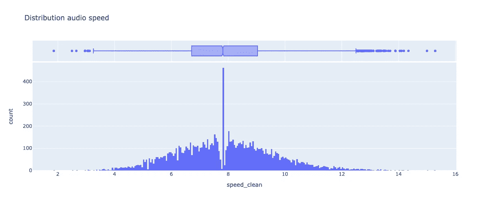

# 基于张量流的阿姆哈拉语端到端语音识别模型

> 原文：<https://medium.com/analytics-vidhya/end-to-end-speech-recognition-model-for-amharic-using-tensorflow-e72e60775bd9?source=collection_archive---------5----------------------->

深度学习通过引入端到端模型，改变了语音识别领域的游戏规则。这些模型接收音频信号并直接输出转录。在这篇博客中，我们将为阿姆哈拉语建立一个端到端的自动语音识别管道。我们完成的管道将接受原始音频作为输入，并返回预测的口语转录。

阿姆哈拉语是一种埃塞俄比亚闪米特语言，是亚非语系闪米特分支的一个分支。根据维基百科，该语言有 3200 万母语使用者和 2500 万 L2 使用者。这个数字可能不准确。我只是把它放在这里作为背景。

# GitHub 链接

 [## GitHub-10a CAD-group 3/speech _ recognition

### 在这个项目中，我们将建立深度学习模型来处理和转换非洲语言(阿姆哈拉语)…

github.com](https://github.com/10acad-group3/speech_recognition) 

# 数据

在这个项目中， [ALFFA_PUBLIC](https://github.com/getalp/ALFFA_PUBLIC) 数据集用于模型的训练和验证。数据包含大约 11k 个音频剪辑，总计大约 18 个小时的阿姆哈拉语语音。每个音频剪辑持续几秒钟，并附带其转录。

数据特征

*   输入特征(X):口语的音频剪辑
*   目标标签(y):所说内容的文本副本

# 预处理

数据是语音识别最重要的方面之一。数据预处理在开发有效的自动语音识别系统中起着至关重要的作用。

数据集包含“中的音频文件。wav”格式，采样率为 16 kHz。对于大多数基本的语音识别系统，8kHz 就足够了。因此，我开始以 8kHz 的频率对音频信号进行重新采样。然后，我准备了元数据，其中包含音频文件的名称、相应的转录、每个转录的字符长度以及以秒为单位的音频长度。这是元数据的概述。

## **均值归一化**

标准化将减少信号中不需要的噪声，给我们一个干净的音频文件。该图显示了来自训练集的之前和之后的样本音频文件。

## **分裂**

我们将使用 Libros 来消除音频信号中的静音。Libros split 函数返回一个包含音频信号中非无声区间的 NumPy 数组。该函数不返回任何音频，只返回音频中非无声片段的开始点和结束点。通过连接非静音段，我们可以减少每个音频信号中的静音。

## 极端值

异常值是偏离其他数据观察值的极端值，它们可能表示测量值的可变性、实验误差或新奇事物。换句话说，异常值是偏离样本总体模式的观察值。在我们的数据集中，我们将根据持续时间、字符长度和速度来寻找异常值。

我们可以看到大多数音频都在 4 到 8 秒之间。我已经删除了短于 2 秒和长于 14 秒的音频。这导致大约 2%的数据丢失。

大多数抄本的长度在 30 到 70 个字符之间。这包括没有转写的行和转写长度超过 150 个字符的行。删除转录长度小于 10 且大于 125 的行后，数据丢失小于 1%。

我尝试过用字符长度除以持续时间来估算音频速度。我们之所以能够做到这一点，是因为我们已经消除了音频信号中大部分额外的静音。上面的分布图显示了速度为零和大于 16 的行。我把速度小于四或者大于十二的行都去掉了。这也导致了大约 2%的数据丢失。

# 数据扩充

接下来，我们可以对原始音频信号进行数据扩充，方法是改变音高或音频速度，并随机添加噪声。数据扩充为我们的输入数据增加了更多种类，并有助于模型对更广泛的输入进行归纳。

# 特征

任何机器学习方法的关键是从数据中提取特征。特征表示数据，并作为模型的输入。这里我们将使用 Mel 频谱图从音频信号中提取特征。

频谱图是时间和频率之间的 2D 图，其中图中的每个点根据颜色强度表示特定时间特定频率的幅度。简单来说，光谱图是一个随时间变化的频谱(颜色范围很广)。

Mel 频谱图相对于绘制频率与时间关系的常规频谱图有两个重要变化。它使用 Mel 标度而不是 y 轴上的频率，并使用分贝标度而不是振幅来指示颜色。

有一篇文章是关于如何用 TensorFlow 在你的 GPU 上轻松处理音频的，作者是 David Schwertfeger。本文描述了如何利用 GPU 的能力，使用 TensorFlow 信号处理器处理音频数据。你可以从博客上阅读更多关于如何从音频信号生成 Mel 声谱图的细节。

# 数据生成程序

现在我们已经完成了所有的预处理步骤，我们将使用 Keras 定义一个定制的数据生成类。

而不是通过用静音填充来调整所有音频样本的大小以使其具有相同的长度。该课程将根据批次中最长的填充音频和转录。因为填充会影响网络的工作方式，并对模型的性能和精度产生很大影响。根据持续时间对我们的数据进行排序，并用小填充生成每个巴赫，这将允许我们最小化填充的负面影响。

该类为单个音频文件返回三个增强版本。因为我们每次都在增加音频，而不是保存增加的文件，所以我们的数据会在每批中随机变化。例如，音频的速度可以随机加快或减慢。这将大大增加我们输入数据的可变性。

# 同ＣIＴＹ ＴＥＣＨＮＯＬＯＧＹ ＣＯＬＬＥＧＥ

我们将使用 CTC 损失作为我们模型的基本损失函数。当输入是连续的而输出是离散的，并且没有清晰的元素边界可用于将输入映射到输出序列的元素时，CTC 用于对齐输入和输出序列。

Keras CTC loss 函数需要 y_true、y_pred、input_length 和 label_length 作为参数。问题是我们数据中每一批的输入长度都有变化。我们可以通过将音频长度除以跳数来计算输入长度。

另一点是，如果我们在模型中使用卷积或最大池层，我们需要重新计算输入长度，因为它们可以减少特征图的维度。

要记住的最后一点是输入长度(时间片的数量)应该大于两倍转录长度加一。反恐委员会的文件中提到了这一点。除此之外，我们可以根据 Keras 的文件计算 CTC 损失。

# 模型

我将使用与 Deep Speech 2 架构类似的模型。该模型将有两个主要的神经网络模块。三层残差卷积神经网络学习相关的音频特征。然后，一组双向递归神经网络利用所学习的音频特征。让我们使用 Keras 来研究模型的实现。

这种可视化显示了模型在一段时间内的性能。仅使用一个 GPU 进行了大约 8 个小时的培训。我继续训练这个模型，但是验证损失并没有改善多少。在查看时要记住的一点是，损失不仅是针对干净数据计算的，也是针对增强版本计算的。

# 结果

我们可以看到该模型在短句上表现良好

句子越长，单词错误率越高。然而，结果是有希望的，因为我们只根据 18 小时的数据训练了模型。

[1]: David Schwertfeger:如何用 TensorFlow 在你的 GPU 上轻松处理音频。[https://towards data science . com/how-to-easy-process-on-your-GPU-tensor flow-2d9d 91360 f 06](https://towardsdatascience.com/how-to-easily-process-audio-on-your-gpu-with-tensorflow-2d9d91360f06)

[2]:Derrick mwi ti:2019 年自动语音识别指南。[https://heart beat . fritz . ai/a-2019-自动语音识别指南-f1e1129a141c](https://heartbeat.fritz.ai/a-2019-guide-for-automatic-speech-recognition-f1e1129a141c)

[3]:Derrick mwi ti:2019 年自动语音识别指南。[https://heart beat . fritz . ai/a-2019-自动语音识别指南-f1e1129a141c](https://heartbeat.fritz.ai/a-2019-guide-for-automatic-speech-recognition-f1e1129a141c)

[4]: Michael Nguyen:在 PyTorch 中构建端到端的语音识别模型。[https://www . assembly ai . com/blog/端到端语音识别-pytorch](https://www.assemblyai.com/blog/end-to-end-speech-recognition-pytorch)

[5]:柯坦**Doshi:让音频深度学习变得简单。[https://towards data science . com/audio-deep-learning-made-simple-automatic-speech-recognition-ASR-how-it-works-716 cfce 4c 706](https://towardsdatascience.com/audio-deep-learning-made-simple-automatic-speech-recognition-asr-how-it-works-716cfce4c706)**