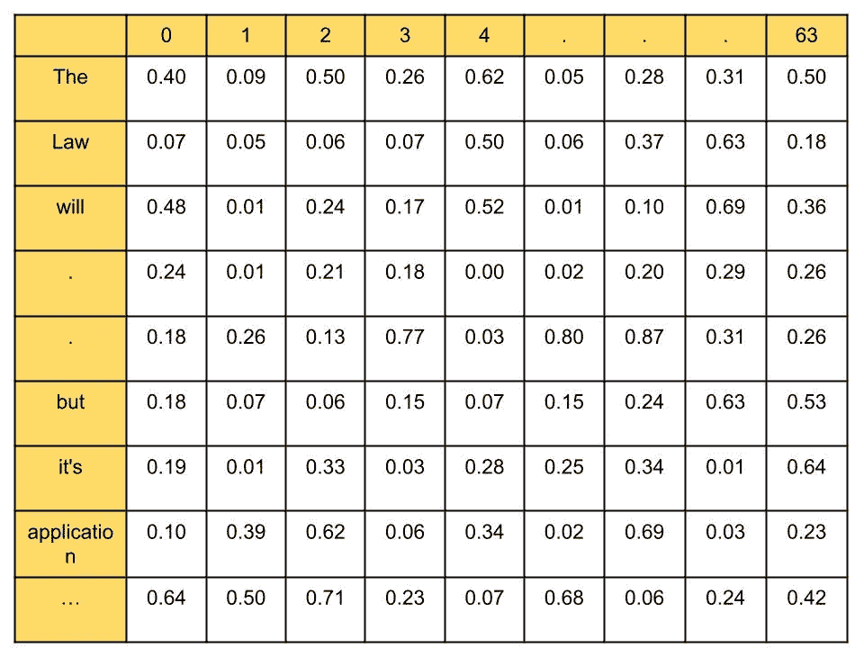

# 端到端变压器架构—编码器部分

> 原文：<https://medium.com/analytics-vidhya/end-to-end-transformer-architecture-encoder-part-657df6975e33?source=collection_archive---------4----------------------->

# 你只需要一点点注意力就能理解‘你需要的注意力’这篇论文

阿瑟尼·托古列夫在 [Unsplash](https://unsplash.com?utm_source=medium&utm_medium=referral) 上的照片

各位学者好，

在几乎所有最新的 NLP 模型中，如 Bert、GPT、T5 以及许多变体中，都使用了变压器。有时我们只使用变压器的编码器(Bert)或解码器(GPT)。

为了首先理解这些模型，我们应该深入了解 Transformer 的工作原理及其元素的作用。

图 1—【https://arxiv.org/pdf/1706.03762.pdf 

RNN 和 LSTM 网络用于机器翻译、下一个单词预测、文本生成等顺序任务。但是这些模型的问题是它们不能捕捉到长期的依赖性。

《变形金刚》通过一种叫做“自我关注”的特殊类型的关注克服了 LSTM 和 RNN 的这种局限。

假设，我们想将英语句子(源句子)转换成印地语句子(目标)。我们将源句子作为输入输入到编码器。编码器学习英语句子的表达，并把它交给解码器。解码器获取该表示并生成一个印地语句子。

这里的问题是编码器和解码器如何将句子从一种语言转换成另一种语言。要理解这一点，我们首先要详细了解编码器和解码器。

# 编码器

在这里，我们将只了解编码器。

转换器包含 N 个编码器的堆栈，这些编码器相互堆叠。每一个都将输出发送到上面，最终的编码器生成单词的表示。

在论文中，作者使用 N=6，但在“Bert base”中我们使用 12 个编码器，在“Bert large”中使用 24 个，而“DistilBERT”使用 6 个编码器。即我们可以尝试不同数量的编码器值。

> 编码器的主要优势之一是它们的语义表示，即使是对于相同的拼写单词。

在句子*‘学蟒蛇容易’*和*‘蟒蛇咬了有毒’*。像谷歌的“Word2Vec”和 facebook 的“FastText”这样的算法将在两个句子中创建相同的“python”嵌入(表示)。但是基于 transformer 模型理解它与单词的关系，并在两个句子中创建不同的嵌入。也就是说，单词“python”在句子 1 和 2 中的表示是不同的。

好吧，但是变压器是怎么做到的呢？

这就是注意力层的魔力。现在让我们详细了解一下‘自我关注’。考虑下面一篇研究论文中的句子。

## *‘法律永远不会完美，但它的应用应该是’*

在上面的句子中，发音“its”指的是*“法律”*，我们可以通过阅读句子清楚地理解这一点，但是模型将如何理解这一点呢？答案是自我关注。

这里，我们的模型首先计算单词*‘The’*的表示，然后计算单词*‘Law’*的表示，以此类推所有其他单词。然后，它将每个单词的表示与所有其他单词联系起来。所以经过计算表示，单词*‘其’*与单词*‘法’*更有关联。这是它理解关系的方式。

> 好吧…我明白这一点，但你能解释一下这个模型是如何从数学上做到这一点的吗？

首先，我们将所有单词转换成嵌入。x1 将是单词*‘The’*的嵌入，x2 是单词*‘Law’*的嵌入，以此类推。我们称之为输入矩阵，输入矩阵的大小为(字数 X 512)，因此在这种情况下，大小为 11 X 512。

11 X 512 输入嵌入矩阵

请注意，这是我们可以随机生成的，因为我们的模型将在训练时学习和更新。

现在，根据这个输入矩阵，我们必须创建 Q、K 和 V 矩阵。为了创建这些，我们需要 Wq 矩阵、Wk 矩阵和 Wv 矩阵。Wq、Wk 和 Wv 的大小为 512 X 64。

现在，我们将输入矩阵乘以 Wq、Wk 和 Wv，分别生成 Q、K 和 V。

Q == >输入嵌入 X Wq = = >(11×512)。dot(512 X 64) ==> (11 X 64)

K == >输入嵌入 X Wk ==>(11 X 512)。dot(512 X 64) ==> (11 X 64)

V== >输入嵌入 X Wv ==>(11 X 512)。dot(512 X 64) ==> (11 X 64)

所以 Q，K 和 V 矩阵的形状是 11 X 64。

Q、K 和 V 的(11 X 64)矩阵应该是这样的

为了理解每个单词与句子中其他单词的关系，我们使用 Q、K 和 V 矩阵来研究自我注意。

> S **tep1:** 计算 Q.dot(K^T)就是矩阵 q 和矩阵 k 的转置的点积

我们知道例子中每个矩阵的大小是(11 X 64)，所以我们取点积= = > q.dot(k^t = = >(11 x64)。dot((11X64)^T)

(11 X 64)。dot(64 X 11) ==> (11 X 11)

(11 X 11) Q.K^T 矩阵

这里第一行表示单词*‘The’*与句子中所有其他单词的关系，倒数第二行表示单词*‘it’*与句子中所有其他单词的关系，依此类推。

这里我们可以看到，单词*、*与自身的关系比其他单词高，同样，单词*、*和*、*与其他单词的关系也比其他单词高。

> **第二步:**将 Q.dot(K^T 除以 q(列数)的维数的平方根。
> 
> (q.dot(k^t)/sqrt(q 的维数) )

这里我们将刚刚计算的(11×11)矩阵除以 8。64 是 Q、K 和 V 矩阵的维数，64 的平方根是 8，因此我们除以 8 得到稳定的梯度。

> **第三步**:为了归一化第二步的结果，我们取 softmax。

(11 x 11)sqrt((q.dot(k^t)/sqrt(q 的维数) ))

我们知道 softmax 值的列相加应该等于 1。由此我们可以说，单词*‘it’s 与单词*‘Law’*有 4* 0%相似。

> **第四步:**计算最终的注意力矩阵。

注意力矩阵“Z”是通过由分数加权的值向量(V)的总和来计算的(步骤 3 的结果)。步骤 4 的输出是(句子长度 X 64) ie 11 X 64

第一排将是

Z1 是单词“the”的表示。其尺寸为(1×64 ),包含来自“the”向量的值的 90 %。

类似地，我们将计算所有单词的表示。即直到 Z11。例如，Z2(它是单词“Law”的表示)包含来自向量“it”的值的 40 %。

这就是我们的模型如何理解单词“法律”和“它”是相似的。

> 到目前为止，我们已经看到了自我关注，现在让我们看看多头关注。

无论我们在自我关注层做了什么，我们只是做了 N 次，并连接 N 的结果，乘以权重向量 W0。其中 N 是注意头的数量。

这在一个单词可能有多种含义的情况下很有用。在句子*中，“法律永远不会完美，但它的应用应该是”*

单词*‘it’s’*的关注值，就是单词*‘Law’*的值向量。在这里，实际单词' *it's* 的注意力值是由单词' *Law* 支配的。但这在这里没问题，因为单词“it's”的意思是模糊的，因为它可能指的是“ *Law* ”。

因此，如果其他单词的值向量在前面的示例中所示的情况下支配实际单词，其中实际单词是模糊的，那么这种支配是有用的，否则，它将导致理解单词的正确含义的问题。因此，为了确保我们的结果是准确的，我们将计算多个注意力矩阵，然后连接它们的结果，而不是计算单个注意力矩阵。

使用多头注意力背后的想法是，如果我们使用多个注意力头，而不是使用单个注意力头，那么我们的注意力矩阵将更加准确

您一定想知道，我们看到了一种叫做位置编码的东西，它增加了输入嵌入，但是我们还没有介绍它。现在你已经理解了编码器的大部分，所以是时候介绍它了。

别担心，在这里

> **位置编码:**

在 RNN 和 LSTM，我们一个字一个字地传递我们的输入，也就是说，在我们的例子中，我们必须传递一个字*、*，然后传递一个字*、【法律】、*，等等。这就叫递归。但是在 transformer pass 中，所有的单词都是并行的，即不遵循递归。

但这里的一个问题是，如果我们平行地输入一个句子，那么它如何理解语序，因为要理解句子的意思，知道语序是非常重要的。因此，我们不是直接输入嵌入，而是添加一些指示单词位置的信息。

所以现在输入矩阵不仅仅是嵌入，它还嵌入了位置信息。

**由于我们将位置嵌入矩阵添加到输入嵌入中，它必须与输入嵌入的大小相同(11×512)。**

如何计算位置嵌入矩阵？

“pos”表示单词在句子中的位置，“I”表示嵌入的位置。“三维模型”是模型的维度(512)

“位置”的范围从 0 到 10，“I”的范围从 0 到 255。

位置嵌入矩阵的维数与输入嵌入矩阵的维数相同。如果我们设 pos=0，i=0，那么对于 P(pos，2i) => P(0，0) = 0，对于 P(pos，2i+1) => P(0，1) = cos(0) = 1

类似地，如果我们把所有的‘位置’和‘I’值放在一起，那么我们得到(11×512)矩阵。这就是我们如何计算整个 11×512 矩阵。

> **前馈网络:**

前馈网络由两个具有 ReLU 激活的密集层组成。前馈网络的参数在句子的不同位置上是相同的，而在编码器块上是不同的。

> **添加和定额组件:**

1.  将多头注意力子层的输入连接到其输出
2.  将前馈子层的输入连接到其输出。

层规范化通过防止每个层中的值变化太大来促进更快的训练。

现在，我们已经了解了所有组件及其用途，现在让我们看看如何将所有组件放在一起。

大家总结一下。

1.  将一个句子的所有单词转换成输入嵌入，并在其中加入位置嵌入。
2.  通过输入嵌入与 Wq、Wk 和 Wv 的点积计算 Q、K 和 V 矩阵。***【W】***
3.  我们计算查询矩阵和关键矩阵**(q.dot(k^t)**之间的点积，并获得相似性分数。
4.  接下来，我们将(Q.dot(K^T))除以关键向量的维数的平方根==> **(Q*K^T)/sqrt(dk)**
5.  然后，我们应用 softmax 函数来归一化分数并获得分数矩阵。**softmax(q*k^t)/sqrt(dk)**
6.  我们通过将得分矩阵乘以值矩阵 v 来计算关注矩阵 z。**v * softmax(q*k^t)/sqrt(dk)**
7.  无论我们在自我关注层做了什么，我们只是做了 N 次，并连接 N 的结果，乘以权重向量 W0。
8.  我们将注意力矩阵作为输入馈送到下一个子层，即前馈网络。前馈网络将注意力矩阵作为输入，并将编码器表示作为输出返回。
9.  接下来，我们将从编码器 1 获得的输出作为输入馈送给它上面的编码器(编码器 2)。
10.  编码器 2 将其传送到下一个编码器，最后，最后一个编码器(第 6 个)返回给定输入句子的编码表示作为输出。

参考:

1.  [https://arxiv.org/pdf/1706.03762.pdf](https://arxiv.org/pdf/1706.03762.pdf)(论文)
2.  我从这本伯特的书(【https://amzn.to/3e2ALt1】)中学到了很多