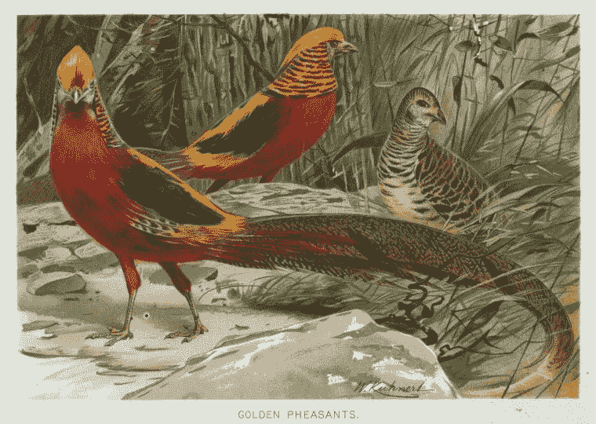

# 参与 ML 跟踪和可视化:坐下来放松

> 原文：<https://medium.com/analytics-vidhya/engaging-ml-tracking-and-visualization-sit-back-and-relax-3a86186ae2dd?source=collection_archive---------8----------------------->

第 1 章— [W & B](https://medium.com/u/d81e29d20045?source=post_page-----3a86186ae2dd--------------------------------)

**学点新东西:**金雉俗称“中国雉鸡”，因为它们原产于中国西部和中部，主要生活在山区森林中。来自纽约公共图书馆—**[https://on.nypl.org/3zwIhFJ](https://on.nypl.org/3zwIhFJ)**

**机器和深度学习(ML & DL)的世界正在以惊人的速度增长。正如“2021 年人工智能指数年度报告”中所示，在 2020 年，仅美国研究人员就在 arXiv 上提交了超过 11，000 篇人工智能相关的出版物。结合来自欧盟和中国等其他地方的数据，人工智能和它的…**