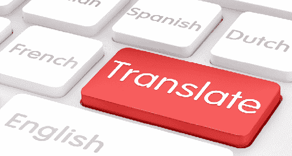

# Python 中的英法机器翻译系统

> 原文：<https://medium.com/analytics-vidhya/english-to-french-machine-translation-system-in-python-a69b7b34fc0?source=collection_archive---------2----------------------->

自然语言处理任务

在本文中，我们将学习如何构建一个机器翻译系统，该系统获取输入的英语单词并将其转换为相应的法语单词。