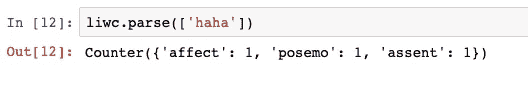

# 文本上的九型人格分类

> 原文：<https://medium.com/analytics-vidhya/enneagram-personality-classification-on-text-ab3efa48e897?source=collection_archive---------25----------------------->

嗨~我是芬恩！这是我第一次在 NLP 上写作。这基本上是我硕士论文的简要总结。

总体而言:那么，我的目标是什么？简而言之，我试图根据用户在社交媒体上的言论/文字对他们的个性进行分类。

如果你不熟悉这个话题，我还不想吓跑你。这里你需要明白的唯一一件事是，我想*告诉*他/她属于*哪种人格，基于他们写作的统计。*。就是这样！简单吧？:D

对于熟悉性格分类话题的人来说，你大概看过很多大五(很多！)和 MBTI(越来越受欢迎)理论，想知道为什么我选择了**九形图**？第一个诚实的理由，是我纯粹的兴趣*笑*(希望我的顾问没有在读这篇*干笑*)。其次，据我所知，还没有人用这种人格理论做过文本挖掘(如果你找到了，请请告诉我！).其中一个原因可能是因为数据的可用性，另一个原因是九型图比其他两种理论要复杂得多。

关于九型人格图，该理论谈到了 9 种不同的人格类型，它们被分成了个人的 3 个核心焦点区域，称为“智力中心”。由于不平衡数据集的问题，我决定把重点放在 3 个中心，而不是 9 个类型。这些中枢由思维中枢、感觉中枢和本能中枢组成。

完成实验后，我可以说，仅仅根据人们书面表达的内容直接识别九型图要有挑战性得多。但是不要气馁，因为生活是关于旅程，而不是目的地。我们在实验过程中发现了一些有趣的事情，如果你准备好了..让我们开始我们的旅程吧！

以下是旅程的日程安排

1.  数据集和预处理
2.  特征提取
3.  我的实验

# 数据集和预处理

**数据集:**我从用户公开提供他们九型人格的两个人格社区网站上抓取数据。因此，我处理了 2 个主要数据:1)用户的九型图类型(作为我们的标签)和 2)用户在网站论坛中的帖子/评论(作为我们的训练数据)。下面是我们数据集的简要统计。

每个中心每个网站的帖子数量

数据集的例子

对于**预处理**步骤，我经历了许多试验和错误，最终完成了所有列出的过程。我做过一些事。删除标点符号或单词的词条，但结果更糟，所以我决定保持这种方式。我从一般的数据清理开始，包括删除换行符、制表符和将多个空格减少为一个空格，并继续下面的具体步骤。

1.  概括引用、用户提及、用户名、图片、标签和 url 链接。给他们一个标签名。
2.  将表情分为 12 类
3.  群体人格相关参考(如 INFP、9w1、sp/so、Te、Si)。在这里，我们主要有 MBTI，九型图，九型图的子类型，三型和翅膀，还有更多荣格的认知功能和弗洛伊德的本我，自我，超我。
4.  消除对识别用户和个性产生偏见的其他独特噪音/模式。

这是数据在清理前的样子。

> @XgraceRA 7s 在床上比 2s 强？？真的吗？无红利(ex-dividend)

清洁后

> 提个性 _REF 在床上比个性 _REF 好？？真的吗？笑 _ 表情

我的实验属于监督学习，我们需要数据的“标签”。我将“用户的人格类型”转换为“智力中心”,这是基于他们个人资料中列出的主要数字，而不考虑他们的翅膀、子类型和三重类型。8，9，1 是本能中枢(又名内脏)，2，3，4 是感觉中枢(又名心)，5，6，7 是思维中枢(又名头)。所以，我们会得到类似..

清理之后，我对每个中心做了一点数据探索。这里是云这个词。

思维、感觉和本能是单词云的中心

# 特征提取

分类有 5 个主要特征，包括

1.  单词包(TF-IDF)-任何从事文本挖掘工作的人的基本功能。更多信息[这里](/greyatom/an-introduction-to-bag-of-words-in-nlp-ac967d43b428)我觉得他的文章很好理解。
2.  LIWC —语言查询和字数统计包含一组内置词典。有一万多个单词被分成两大类；语言过程和心理过程。LIWC 主网站可以在这里找到。

LIWC 的例子

我们可以看到，例如“哈哈”这个词可以分为三类:喜爱、积极情绪(又名 posemo)和同意(基本上是同意的意思)。这里我们必须小心的是子类，在这个例子中*波塞莫*是*情感的子类。*这可能会造成偏差/输入重复，因此当您处理输入选择时，根据您的实验目的，请注意这一点。

3.词性标注—词性标注是文本挖掘的另一个众所周知的功能，因为它提供了基本的语言模式和语言的基本形式。我使用了总共提供了 37 个 pos 标签的 NLTK 库。点击了解有关此功能[的更多信息。](/greyatom/learning-pos-tagging-chunking-in-nlp-85f7f811a8cb)

POS 标签示例

4.表情符号——我参考了来自[维基百科](https://en.wikipedia.org/wiki/List_of_emoticons)的表情符号模式，并手动探索了数据集，然后添加了我发现的内容。

5.一般统计——这也是通过解释每篇帖子的元统计手动完成的，包括 1)字数统计 2)句子统计 3)换行统计 4)引用统计 5)提及统计和 6)个性引用统计。

特征的数量相应地为 10，000、64、37、12 和 6。我还有另一个特性，组合统计量，又名“stat_all”，它基本上是除 TF-IDF 之外的所有特性的组合。它的特征数量是 119。

最后，所有的特征都被转换成数字表示，然后我们就可以开始摇滚了！

# 实验

我联合和分别利用了来自每个网站的数据，也联合和分别应用了每个功能。为了简单的解释，我将简单的谈谈每个实验的条件，然后是结果。这里使用了 4 种机器学习模型，包括逻辑回归(LR)、多项式朴素贝叶斯(MNB)、支持向量机(SVM)和极端梯度推进(XGBoost)。

## 1.多类分类

先说基础的。因为我们有 3 个不同的类别/标签(本能、感觉和思考)，我从多类别分类开始。两个数据集被合并，然后我以 85:15 的比例分割训练和测试数据。这是我们的结果示例。

来自 sklearn 的 KFold 用于验证分数。

我将 seaborn 用于我们的即时可爱图表，以显示我们的多类实验的整体性能。正如所料，TF-IDF 完成了其余的功能。在这种情况下，特征的数量会影响结果。从 TF-IDF(10000)>组合统计(119)> LIWC (64) /POS Tag (37)>表情(12) /Stat (6)我们可以看到准确率是与特征数量平行递减的。

测试集准确度

## 2.二元分类

二分分类法是为了将每个中心从其他两个中心中分离出来。我们有相似的功能和 ML 模型，我也**将**一些功能与表情符号结合起来(第二个图)，但结果不是很有特色。

## 思维中心

正常特征

主要功能与表情符号功能的组合

## 感觉中枢

主要功能与表情符号功能的组合

## 本能中枢

主要功能与表情符号功能的组合

## 3.二元分类:跨网站

与上面的两个实验不同，我将数据使用分开。**个性咖啡馆**数据被用作**训练数据**和**类型学中心**数据被用作**测试数据**。通过分离不同的网站用于训练和测试集，我们可以测试我们的训练数据的通用性和健壮性。我个人认为这个实验是最有趣的，正如我们在下面的结果中看到的。

测试数据的准确性在所有模型、特征和每个中心都是稳定的。与上述实验相比，TF-IDF 并没有优于其他特性，实际上，特别是在 LR 模型中还稍差。

事实上，这些并不是我做的所有事情，但是其余的更详细，我认为最好保持这样。为了总结上面显示的内容，我将大的部分分成

1.  数据集和预处理，我向你们展示了我使用的一些清理和处理技术
2.  特征提取包括鞠躬(TF-IDF)、LIWC、位置标签、表情和一般统计
3.  我的实验是多分类，正常二分类和跨网站二分类。

老实说，我认为我的实验结果没有达到我满意的程度。一个复杂的问题是，当数据集和人们发表评论的环境不受控制时，个性不能仅仅通过写作风格来识别。他们如何写作取决于他们的母语、当前的情绪状态、他们对英语的了解程度等等。然而，我很高兴我至少开始了更多的探索，并与你分享这些经历。非常欢迎评论、提问、建议！我很乐意讨论更多的其他可能性！