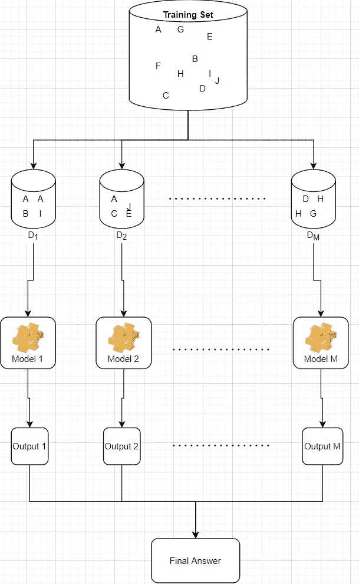
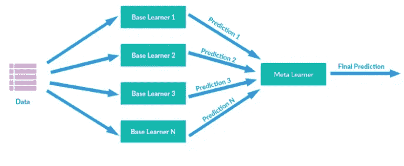
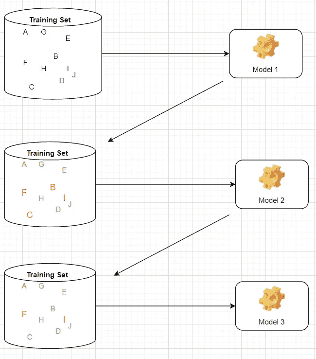

# 面向所有人的集成学习方法

> 原文：<https://medium.com/analytics-vidhya/ensemble-learning-methods-for-everyone-4db66cc4f8f6?source=collection_archive---------29----------------------->

大家好🙌。

今天我们将讨论一种非常强大的机器学习算法，这种算法一直主导着 Kaggle 竞赛，即集成学习。

集成学习有多种方法，因此今天我们将在一个高层次上检查每一种方法，以便非技术人员也能理解它。

那么，什么是集成学习呢？

> 合奏——作为一个整体行动或集合在一起的一群事物或人，尤其是经常在一起演奏的一群音乐家。

以上定义直接取自剑桥词典。

只是用机器学习模型代替音乐家，这就是整体学习。因此，这是一组机器学习模型(通常称为基础模型)一起工作以获得最终答案。这符合 C.S.Lewis 的名言(系综可以有两个以上的模型):

> "三个臭皮匠胜过一个诸葛亮，不是因为两个人都不会犯错，而是因为他们不太可能在同一个方向上出错。"

注意，拥有相似的模型与拥有一个模型是一样的，因为它会有相似的观点，集成学习的首要目标是尽可能地使用彼此独立的模型。

**独立性↑方差↓**

以下是实现第一个目标的不同方法:

1.  使用不同的模型(例如:SVM，决策树，逻辑回归。)
2.  使用不同的数据子集

集成学习有两种主要类型，

1.  集合多个模型做最终决定**(装袋/粘贴)**
2.  按顺序一次使用一个型号。在每一步，下一个模型都试图最小化前一个模型所犯错误。**(增压)**

# 装袋/粘贴

*   将**子集**的数据用于每个基本型号。
*   装袋→数据子集通过替换进行采样
*   粘贴→对数据子集进行采样而不替换

子集的数量取决于要组合的基础模型的数量。假设您想要使用 M 个模型，那么您需要从训练数据集中采样 M 个子集。每个子集，通常称为包，必须小于训练集的大小，经验法则是每个包使用大约 60%的训练数据集。

下面是装袋的示意图。请注意，在 D1 子集中存在相同的数据 A，因为我们选择一个数据，替换它，然后选择另一个，这个过程重复，直到子集中的所有数据都被采样，然后对所有子集重复这个过程。

装袋示例

对于粘贴，除了取样部分，每个过程都是相同的。因为它是在没有替换的情况下完成的，所以在一个子集中不能有相同的数据，在任何其他子集中也不能有相同的数据，一旦你选择了一个，你就不能再选择相同的一个。

在你创建了 M 个子集之后，你在每个子集上训练一个模型，模型可以是相同的也可以是不同的。用决策树训练所有子集被称为“随机森林”,随机森林的一个特殊之处是，它不仅接受行的子集，而且每棵树只使用特征(列)的子集。

一旦每个模型在数据子集上被训练，每个模型输出单独的答案，在那里它们被聚集以做出最终答案。

在分类中，个人答案有三种汇总方式:

1.  硬投票——选择投票最多的类别。例如，如果您有 3 个模型，其中一个将数据分类为 A 类，另外两个分类为 B 类，那么最终答案将是 B 类，因为它得到了 2/3 的投票。
2.  软投票——选择平均概率最高的类别。假设您有 3 个模型，模型 1: [40%，60%]，模型 2:[45%，55%]，模型 3:[95%，5%]，其中列表中的项目表示类别的概率→`[% of data belonging to class A, % of data belonging to class B]`。现在，您计算平均类别概率[(40+45+95)/3，(60+55+5)/3] = [60%，40%]，平均概率较大的类别是最终答案，因此在软投票中，我们将数据识别为属于类别 a。

对于回归问题:

1.  取所有输出的**平均值**。因为单个模型的所有答案都是连续值。
2.  取所有输出的**中值**。

最后，从多基础模型中汇总答案的第三种方法称为:

3.**堆叠** —每个模型的输出被传递到另一个模型。下图是堆叠的非常简单的版本，其中所有基本模型输出回答一个元模型，但是堆叠可以有多个层和多个元模型。

图片来自[http://supunsetunga.blogspot.com/](http://supunsetunga.blogspot.com/)

# 助推

顺序学习法，在每个阶段，模型从以前的错误中学习(以前的模型所犯的错误)。

*   减少**偏差**的好方法。

请注意，第一个模型的输出被标记为绿色和红色(错误)。现在红色的**比绿色的**更重，它被传递给下一个模型，因此它更关注之前出错的部分，并重复这个过程。

升压示例

有多种类型的增强方法，如 AdaBoost、Gradient Boost、XGBoost 等。它们之间的差异取决于它们如何使用以前的输出来更好地预测下一个模型。

今天到此为止！希望它对非技术人员和技术人员有帮助，这个博客旨在帮助任何人，即使没有数学背景。对于那些想知道每种方法实际上是如何在幕后工作的人，我将为每种深入内部工作的方法创建一个博客。

感谢您的阅读！反馈是非常受欢迎的，请评论，如果有任何错误信息，我会尽快纠正他们！

参考资料:

*   [Python 机器学习第 3 版第 7 章](https://www.packtpub.com/product/python-machine-learning-third-edition/9781789955750)
*   [探索机器学习第 13 章](/@yuezhuge/newly-published-book-the-quest-for-machine-learning-4c4ebd1020d3) →不确定是否有英文版。
*   [斯坦福 CS229 第 10 讲——决策树和集成方法](https://www.youtube.com/watch?v=wr9gUr-eWdA&ab_channel=stanfordonline)
*   [合奏技法视频](https://www.youtube.com/watch?v=KIOeZ5cFZ50&ab_channel=KrishNaik)
*   [自举聚合视频](https://www.youtube.com/watch?v=2Mg8QD0F1dQ&ab_channel=Udacity)