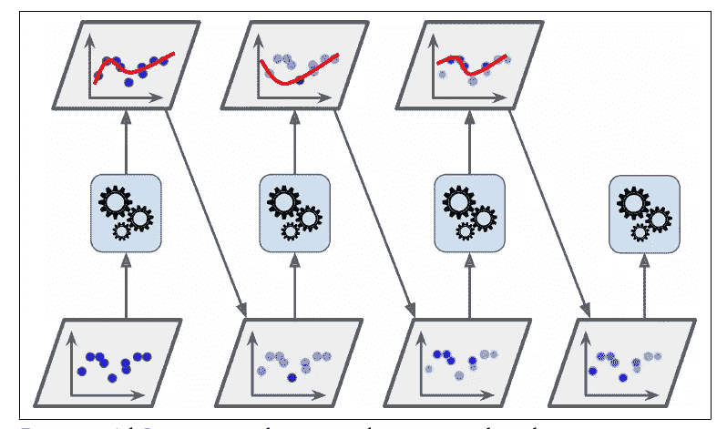
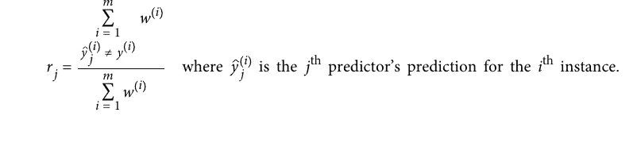
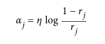
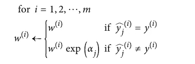
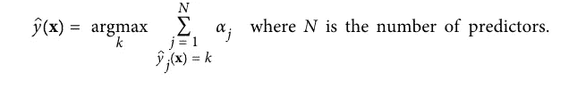

# 集成方法:AdaBoost

> 原文：<https://medium.com/analytics-vidhya/ensemble-method-adaboost-712547c7e2c7?source=collection_archive---------11----------------------->

在本文中，您将了解什么是 boosting 以及 AdaBoost 的工作原理。


# 什么是助推？

Boosting 也称为假设 Boosting，是一种将几个弱学习器组合成一个强学习器的集成方法。boosting 背后的主要逻辑是每个模型/学习者都试图纠正其前任。

有许多可用的升压方法，但最常用的是:

1.  AdaBoost。
2.  梯度推进。

# adaboost 算法

AdaBoost 是如何工作的？正如我们所知，对于 boosting，学习者试图纠正其前任，一种方法是给予前任不适合的训练实例更多的关注。

在 Adaboost 中，每个训练实例和每个学习者/模型都被分配了权重，我们将在本节的后面查看权重是如何分配和更新的。

例如，为了构建 AdaBoost 分类器，第一基本分类器被训练并用于对训练集进行预测。然后增加错误分类的训练实例的相对权重。使用更新的权重训练第二分类器，并且再次对训练集进行预测，权重被更新，等等。



adaboost 算法

上图显示了 moons 数据集上五个连续预测因子的决策边界。第一个分类器在训练集训练后得到一些错误的预测，所以我们提高它们的权重。第二个分类器在这些情况下做得更好，依此类推。

一旦训练了所有预测器，集成就可以进行非常类似于打包或粘贴的预测，除了预测器根据它们在加权训练集上的整体准确性而具有不同的权重。

## 权重是如何分配和更新的？

让我们仔细看看 Adaboost 算法。每个实例权重 *w(i)* 初始设置为 *1/m* (m 为实例数)。训练第一预测器，并在训练集上计算其加权误差率 *r1* 。



权差

加权误差(r)是寻找模型/学习器的权重和更新权重的最重要的项。

预测器的权重 *αj* 然后使用下面所示的等式来计算:



预测权重

其中 *η* 是学习率超参数(默认为 1)。预测器越精确，其权重就越高。如果只是随机猜测，那么它的权重将接近于零。然而，如果它经常是错误的(即，不如随机猜测准确)，那么它的权重将是负的。

接下来，使用下面的等式更新实例权重，提升错误分类的实例:



实例权重更新

然后，所有实例权重被归一化，即除以所有实例权重的总和。

最后，使用更新的权重训练新的预测器，并且重复整个过程。

为了进行预测，AdaBoost 只需计算所有预测器的预测值，并使用预测器权重αj 对它们进行加权。预测类是获得大多数加权投票的类。



预测值

下面的代码使用 Scikit-Learn 的 **AdaBoostClassifier** 类(正如您所料，还有一个 **AdaBoostRegressor** 类)基于 200 个决策树桩训练一个 AdaBoost 分类器。决策树桩是一棵 max_depth=1 的**决策树**——换句话说，一棵由一个决策节点和两个叶节点组成的树。这是 AdaBoostClassifier 类的默认基本估计量:

```
from sklearn.ensemble import AdaBoostClassifierada_clf = AdaBoostClassifier(
DecisionTreeClassifier(max_depth=1), n_estimators=200,
algorithm="SAMME.R", learning_rate=0.5)ada_clf.fit(X_train, y_train)
```

# 关于作者

我是 Mustafa Sidhpuri，一名积极上进的数据科学家，有着自由职业数据科学家的经历。热衷于构建解决问题的模型。相关技能包括**机器学习、解决问题、编程和创造性思维**。

[](https://github.com/Mustisid13) [## Mustisid13 -概述

### 学习计算机科学和工程(最后一年)在 ITM 宇宙 Vadodara 块或报告六月七月八月九月十月十一月…

github.com](https://github.com/Mustisid13) [](https://www.linkedin.com/in/mustafa13/) [## 穆斯塔法·西德普里- ITM 宇宙-印度古吉拉特邦| LinkedIn

### 查看 Mustafa Sidhpuri 在全球最大的职业社区 LinkedIn 上的个人资料。穆斯塔法的学历在列…

www.linkedin.com](https://www.linkedin.com/in/mustafa13/)