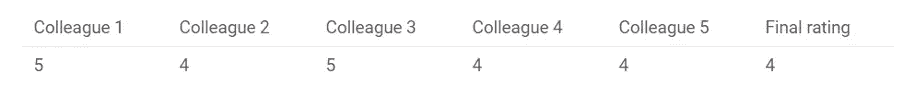
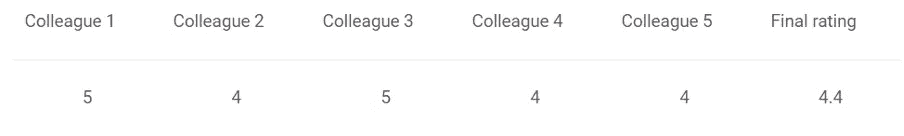

# 集成方法

> 原文：<https://medium.com/analytics-vidhya/ensemble-methods-a25b6ebaaa12?source=collection_archive---------0----------------------->

集成方法是一种机器学习技术，它将多个基本模型组合成一个最佳预测模型。集成技术是用于获得更好结果的多模型方法。在大多数情况下，集合技术比单一模型产生更准确的结果。在许多机器学习竞赛中，获胜的解决方案使用了集成方法。网飞大众竞赛的获胜者采用集成方法创建了一个强大的协同过滤系统。

让我们主要利用决策树来概述集合方法的定义和实用性。

决策树基于一系列问题和条件来确定预测值。例如，这个简单的决策树决定了一个人是否应该出去玩。该树考虑了几个天气因素，并给每个因素做出决定或提出另一个问题。在这个例子里，每次阴天的时候，我们都会在外面玩。但是，如果下雨了，一定要问有没有风？如果刮风，我们就不玩了。但是如果没有风，把鞋带系紧，因为我们要出去玩。

决策树也可以用同样的格式解决定量问题。在左边的树中，我们想知道是否投资商业房地产。是写字楼吗？一个仓库？一栋公寓楼？经济条件好？经济条件差？一项投资会有多少回报？这些问题都是用这个决策树来回答和解决的。

当制作决策树时，有几个因素我们必须考虑:我们根据什么特征做决策？将每个问题分类为是或否答案的阈值是什么？在第一个决策树中，如果我们想问自己是否有朋友一起玩呢？如果我们有朋友，我们每次都会玩。如果不是，我们可能会继续问自己关于天气的问题。通过添加一个额外的问题，我们希望更好地定义是和否类。

这就是集合方法派上用场的地方！集成方法允许我们考虑决策树的样本，计算在每次分裂时要使用的特征或要问的问题，并基于样本决策树的聚合结果做出最终预测，而不是仅仅依赖于一个决策树并希望我们在每次分裂时做出正确的决策。

**简单的合奏技巧:**

主要有三种集成技术。

1)最大投票

2)平均

3)加权平均

**1)** **Max 投票:-**

最大投票法一般用于分类问题。

在这种技术中，使用多个模型来预测每个数据点。

每个模型的预测被认为是一次“投票”。我们从大多数模型中得到的预测被用作最终预测。

例如，当你让你的 5 位同事给你的电影打分时(满分 5 分)；我们假设其中三人给它打了 4 分，而两人给了 5 分。由于大多数人给了 4 分，所以最终的评分将为 4 分。你可以认为这是所有预测的模式。

最大值投票的结果将是这样的:

**2)** **平均:-**

在平均中，对平均中的每个数据点进行多次预测。

在这种方法中，我们取所有模型预测的平均值，并用它来进行最终预测。

平均可用于回归问题中的预测或计算分类问题的概率。

例如，在下面的情况中，平均方法将取所有值的平均值。

即(5+4+5+4+4)/5 = 4.4

**3)** **加权平均:-**

这是平均法的延伸。

所有模型被赋予不同的权重，定义每个模型对于预测的重要性。

例如，如果你的两个同事是批评家，而其他人没有这方面的经验，那么这两个朋友的回答比其他人更重要。

结果计算为[(5 * 0.23)+(4 * 0.23)+(5 * 0.18)+(4 * 0.18)+(4 * 0.18)]= 4.41。

**高级合奏技术:**

**1)** **堆叠:-**

堆叠是一种集成学习技术，它使用来自多个模型(例如决策树、KNN 或 SVM)的预测来构建新模型。该模型用于对测试集进行预测。

下面是简单堆叠系综的分步解释:

1.  列车组分为 10 个部分。

2)基础模型(假设决策树)适合 9 个部分，并对第 10 部分进行预测。对列车组的每个部分都要这样做。

3)然后，基础模型(在这种情况下，决策树)适合整个训练数据集。

4)使用该模型，对测试集进行预测。

5)对另一个基本模型(比如 KNN)重复步骤 2 到 4，得到训练集和测试集的另一组预测。

6)来自训练集的预测被用作建立新模型的特征。

7)该模型用于对测试预测集进行最终预测。

**2)** **混合:-**

混合遵循与堆叠相同的方法，但仅使用训练集中的维持(验证)集来进行预测。

换句话说，与堆栈不同，预测仅针对维持集进行。

维持集和预测用于构建在测试集上运行的模型。以下是混合过程的详细说明:

1.  训练集被分成训练集和验证集。

2)在训练集上拟合模型。

3)在验证集和测试集上进行预测。

4)验证集及其预测被用作建立新模型的特征。

5)该模型用于对测试和元特征进行最终预测。

**3)** **装袋:-**

Bagging 是一种合并各种模型(例如，所有决策树)的输出以产生更通用的输出的技术。我有一个问题:在同一组数据上开发所有模型并整合它们会有用吗？给定相同的输入，这些模型很可能会产生相同的结果。

Bootstrapping 是一种采样技术，在这种技术中，我们通过替换从原始数据集创建观察值子集。子集的大小与原始集的大小相同。

bagging(或 Bootstrap Aggregating)技术使用这些子集(包)来获得分布的公平概念(完整集)。为打包创建的子集的大小可能小于原始集。

1)从原始数据集创建多个子集，选择具有替换的观察值。

2)在这些子集的每一个上创建基础模型(弱模型)。

3)模型并行运行，相互独立。

4)通过组合来自所有模型的预测来确定最终预测。

**4)** **助推:-**

在我们继续之前，我想问你一个问题:如果第一个模型错误地预测了一个数据点，合并第一个模型和下一个模型(可能是所有模型)的预测会产生更好的结果吗？升压就是用来处理这类问题的。

升压是一个连续的过程，其中每个后续模型都试图纠正前一个模型的错误。后续模型依赖于前一个模型。让我们在下面的步骤中了解升压的工作方式。

1)从原始数据集创建子集。

2)最初，所有数据点被赋予相等的权重。

3)在该子集上创建基础模型。

4)该模型用于对整个数据集进行预测

5)使用实际值和预测值计算误差。

6)不正确预测的观察值被给予较高的权重。

(这里，三个错误分类的蓝色加分将被赋予更高的权重)

7)创建另一个模型，并对数据集进行预测。

(这个模型试图纠正前一个模型的错误)

8)类似地，创建多个模型，每个模型校正前一个模型的误差。

9)最终模型(强学习者)是所有模型(弱学习者)的加权平均值。

因此，增强算法将多个弱学习器结合起来形成一个强学习器。单个模型在整个数据集上表现不佳，但在数据集的某些部分表现良好。因此，每个模型实际上都提高了整体的性能。

解释至少两种不同的类型，以及何时应用它们。

**解决方案:**

基于 Bagging 和 Boosting 的算法:Bagging 和 Boosting 是两种最常见的集成学习策略。对于每一种策略，下面是一些最常用的算法。在不久的将来，我将为这些算法中的每一个制作单独的条目。

**装袋算法:**

随机森林

Bagging 元估计量

**升压算法:**

adaboost 算法

梯度推进机

XGBoost

轻型 GBM

CatBoost

**随机森林:**

另一种使用 bagging 技术的集成机器学习算法是随机森林。

它是 bagging 估计算法的扩展。

随机森林使用决策树作为它的基本估计器。

与 bagging 元估计器不同，随机森林随机选择一组特征来确定决策树每个节点的最佳分割。

总而言之，随机森林随机选择数据点和特征，并构建多棵树(森林)。

**AdaBoost:**

AdaBoost 或自适应增强是最基本的增强算法之一。

建模通常用决策树来完成。

构建了多个序列模型，每个模型都纠正了前一个模型的缺陷。

AdaBoost 将权重添加到预测不佳的观察值中，以下模型尝试准确预测这些值。

AdaBoost 的运行示例:

**XGBoost:**

极端梯度增强(XGBoost)是梯度增强方法的更高级版本。

XGBoost 已被证明是一种强大的机器学习算法，已被广泛用于竞赛和黑客马拉松。

XGBoost 比其他梯度增强方法快大约 10 倍，并且具有良好的预测潜力。

它还包括各种正则化，减少过度拟合，提高整体性能。因此，它也被称为“正则化提升技术”。

**轻型 GBM:**

在我们进入 Light GBM 是如何工作的之前，让我们先来看看为什么在有这么多其他的(就像我们上面看到的那些)的时候，我们首先需要它。

当数据集非常大时，轻量级 GBM 优于所有其他技术。

与其他算法相比，轻量级 GBM 在大型数据集上运行所需的时间更少。

LightGBM 是一个梯度推进框架，它采用基于树的算法并使用基于叶的方法，而其他技术使用基于层的方法。

下面的图表可以帮助你更好地理解不同之处。

**装袋和增压有一些相似之处:**

1.这两种策略都是用于从单个学习者生成 N 个学习者的集成方法。

2.两者都使用随机抽样来生成许多训练数据集。

3.通过平均 N 个学习者，两者都得到最终选择(或者取他们中的大多数，即多数投票)。

两者都可以有效地降低方差和增加稳定性。

**何时使用装袋增压:**

Bagging 是一种通过从数据集产生用于训练的附加数据来减少预测方差的技术，该数据集通过将重复与组合相结合来创建多组原始数据。

提升是一种迭代策略，用于根据之前的分类调整观察的权重。

如果观察值被错误地分类，Boosting 试图增加观察值的权重。

总体而言，助推创造了良好的预测模型。

**结论:**集合建模可以极大地提高你的模型的性能，甚至可以成为第一名和第二名的区别！