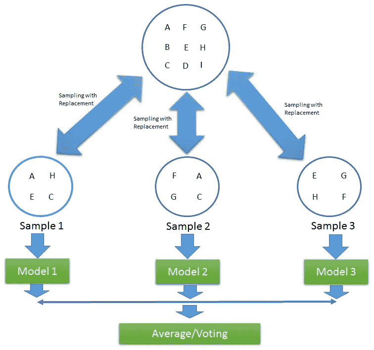
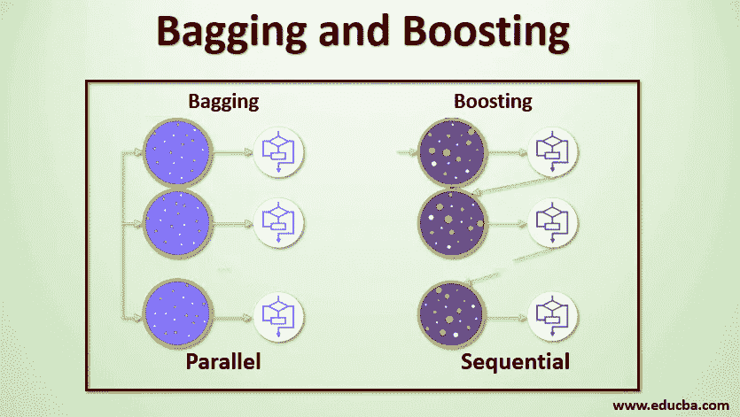
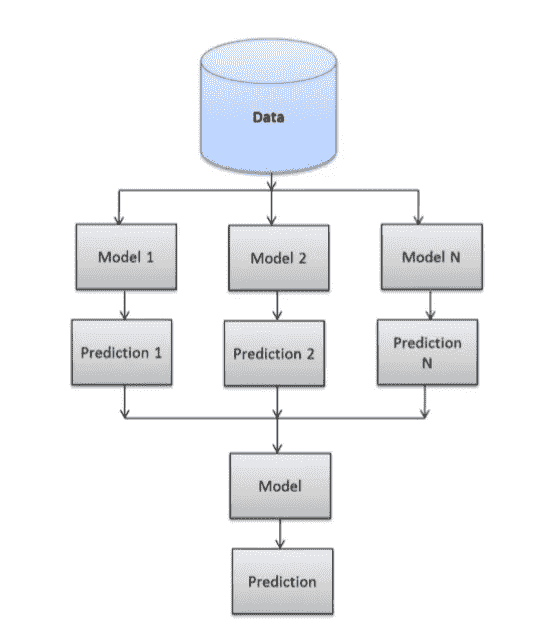

# 整体方法——装袋、增压和堆叠

> 原文：<https://medium.com/analytics-vidhya/ensemble-methods-bagging-boosting-and-stacking-28d006708731?source=collection_archive---------1----------------------->

## 整体学习综合指南*。*

在这篇文章中，我将给出一个关于什么是集成学习和集成方法的常见类型的理论解释。

我们经常在电视上看到许多游戏节目，你一定注意到了“观众投票”选项。大多数情况下，参赛者会选择观众投票最高的选项，大多数情况下他们会赢。我们也可以在现实生活中推广这一点，在现实生活中，听取大多数人的意见比听取一个人的意见更受欢迎。集成技术具有类似的基本思想，其中我们从一组预测器(可以是分类器或回归器)聚集预测，并且大多数时候预测比使用单个预测器获得的预测更好。

**定义:** —集成学习(Ensemble learning)是一种机器学习范式，其中多个模型(通常称为“**弱学习者**”)被训练来解决同一个问题，并组合起来以获得更好的结果。主要假设是，当弱模型被正确组合时，我们可以获得更精确和/或更稳健的模型。

*弱学习器:“弱学习器”是任何一种 ML 算法(用于回归/分类),它提供的准确度比随机猜测稍好。*

在集成学习理论中，我们将**称为弱学习者**(或**基础模型**)模型，这些模型可以作为构建模块，通过组合其中的几个来设计更复杂的模型。大多数时候，这些基本模型本身表现不佳，要么是因为它们有很高的偏差，要么是因为它们有太多的方差而不够稳健。然后，集成方法的思想是试图通过将这些弱学习者中的几个组合在一起来创建实现更好性能的**强学习者**(或**集成模型**)来减少这些弱学习者的偏差和/或方差。

假设我们有“n”个预测器/模型:

Z1，Z2，Z3，…。，Zn，标准差为σ

方差(z) = σ

如果我们使用单一预测器 Z1，Z2，Z3，…。，Zn 与每一个相关的方差将是σ，但是期望值将是所有预测值的平均值。

让我们考虑一下预测值的平均值:

= (Z1 + Z2 + Z3+……。+锌)/氮

如果我们将用作预测值，则期望值保持不变，但现在可以看到方差:

方差()= σ /n

因此，当我们使用所有预测值的平均值时，期望值保持不变，但是方差减小了。

这就是为什么取平均值比使用单一预测值更可取的原因。

集成方法采用多个小模型，并结合它们的预测，以获得更强大的预测能力。

有几个非常流行的技术，我们将详细讨论，如装袋，助推和堆叠。

**1。** **装袋**

Bagging 代表**自举聚合**。

在现实生活中，我们没有多个不同的训练集来分别训练我们的模型，并在最后合并它们的结果。在这里，自举进入了画面。

Bootstrapping 是一种通过使用替换从给定的训练集中对不同的数据集进行采样的技术。在引导训练数据集之后，我们在所有不同的数据集上训练模型，并聚集结果。这种技术被称为引导聚合或 Bagging。

**定义:—** Bagging 是一种集成技术，在这种技术中，对训练数据的不同子集使用单一训练算法，其中子集采样通过替换(引导)来完成。一旦在所有子集上训练了该算法，bagging 就通过聚集该算法在不同子集上做出的所有预测来进行预测。

为了聚集基础学习者的输出，bagging 使用多数投票(所有预测中最频繁的预测)进行分类(T9)和使用平均(所有预测的平均值)进行回归(T11)。

装袋视觉表现:

图片提供:谷歌

**装袋模式的优势:**

1.装袋显著降低了方差而不增加偏倚。

2.Bagging 方法工作得如此之好是因为训练数据的多样性，因为采样是通过自举完成的。

3.此外，如果训练集非常大，它可以通过在相对较小的数据集上训练模型来节省计算时间，并且仍然可以提高模型的准确性。

4.也适用于小型数据集。

**装袋模型的缺点:**

1.bagging 的主要缺点是，它以牺牲可解释性为代价提高了模型的准确性，也就是说，如果一棵树被用作基础模型，那么它会有一个更有吸引力和更容易解释的图表，但是随着 Bagging 的使用，这种可解释性就丧失了。

2.Bootstrap 聚合的另一个缺点是，在采样期间，我们无法解释选择了哪些特征，也就是说，有些特征可能永远不会被使用，这可能会导致重要信息的丢失。

**袋外评估:-** *在装袋中，当收集不同的样本时，没有样本包含所有数据，而是包含原始数据集的一部分。可能有一些数据根本没有被采样。未被采样的剩余数据被称为包外实例。*

**随机森林方法**是一种装袋方法，其中**深树**(决策树)，适合 bootstrap 样本，被组合以产生具有较低方差的输出。

**2。增压**

*助推型号* 落在本家族的*合奏方法之内。*

Boosting 最初被命名为*假设增强*，包括对用于训练我们弱学习者团队的数据进行过滤或加权的想法，以便每个新学习者给予更多的权重，或者只使用先前学习者分类不佳的观察值进行训练。*。*

通过这样做**，我们的模型团队**学会了对各种数据做出准确的预测，而不仅仅是对最常见或最简单的观察。此外，如果其中一个单独的模型非常不擅长根据某种观察结果做出预测，这也没关系，因为其他 N-1 个模型很可能会弥补这一点。

**定义:——**术语“增强”指的是将弱学习者转化为强学习者的一系列算法。Boosting 是一种集成方法，用于改进任何给定学习算法的模型预测。boosting 的思想是按顺序训练弱学习者，每个人都试图纠正其前任。弱学习者被他们的前辈依次纠正，在这个过程中，他们被转化为强学习者。

图片提供:谷歌

此外，**在 boosting 中，数据集被加权**(由数据点的不同大小表示)，从而被分类器 *n* 错误分类的观察值在模型 *n + 1* 的训练中被赋予更大的重要性，而**在装袋中，训练样本从整个群体中随机选取**。

在 bagging 中，使用随机性并行训练弱学习器，**在 boosting 中，顺序训练学习器**，使得每个后续学习器旨在减少先前学习器的错误。

像 bagging 一样，Boosting 可以用于回归以及分类问题。

升压是**主要是降低偏置**。

任何算法都可以用作 boosting 技术的基础，但是选择树的原因是:

**亲的**

计算的可扩展性，

处理缺失值，

对异常值稳健，

不需要特征缩放，

可以处理不相关的输入，

可解释的(如果小的话)，

处理混合预测值(定量和定性)

**骗局**

无法提取特征的线性组合

高方差导致小的计算能力

这就是助推的用武之地。它通过考虑各种树的结果来最小化方差。

**增压模型的优点:**

1.增强是一种弹性方法，可以轻松抑制过度拟合。

2.证明有效

3.多用途—可应用于各种各样的问题。

**增压模型的缺点:**

1.boosting 的缺点是对异常值敏感，因为每个分类器都必须修复前一个分类器中的错误。因此，该方法过于依赖异常值。

2.另一个缺点是这种方法几乎不可能扩大规模。这是因为每一个估计量的正确性都是建立在先前预测量的基础上的，因此使得这个过程很难简化。

Ada 增强(自适应增强)、梯度增强、XG 增强(极限梯度增强)是增强技术的几个常见例子。

**3。堆叠**

**Stacked Generalization** 或简称“Stacking”是一种集成机器学习算法。

堆垛与装袋和助推主要有两点不同。第一次堆叠通常考虑**异质弱学习者**(组合不同的学习算法)，而 bagging 和 boosting 主要考虑同质弱学习者。第二，堆叠学习使用元模型来组合基本模型，而打包和提升遵循确定性算法来组合弱学习器。

**定义:——**Stacking**是一种集成学习方法，通过 ***元学习*** *，*将多种机器学习算法结合起来，其中基于完整的训练数据集训练基层算法，元模型基于所有基层模型的最终结果作为特征进行训练。我们有一个处理偏差和方差的打包和提升方法。现在，我们可以学习堆叠，这是提高您的模型预测精度。**

**堆叠综合的可视化表示:**

****

**图片提供:谷歌**

**在上图中，我们可以看到，训练数据没有采取不同的样本来训练分类器。我们不是采用整个数据集来训练每个单独的分类器。在这个过程中，每个分类器都是独立工作的，这允许分类器具有不同的假设和算法。例如，我们可以在线性回归分类器、决策树和随机森林上训练我们的模型，然后我们可以使用支持向量机来组合它们的预测。**

**就像其他集成技术一样，堆叠试图通过使用不太好的模型的预测来提高模型的准确性，然后使用这些预测作为更好模型的输入特征。**

****堆叠概括模型的优点:****

**1.堆叠的好处在于，它可以利用一系列表现良好的模型在分类或回归任务中的能力，并做出比集合中任何单个模型都更好的预测。**

**2.叠加提高了模型预测的准确性。**

****堆叠概括模型的缺点:****

**1.由于我们采用整个数据集来训练每个单独的分类器，因此在大型数据集的情况下，计算时间会更多，因为每个分类器都独立地在大型数据集上工作。**

****结论:****

**最后，我们想提醒您，集成学习是关于组合一些基本模型以获得具有更好性能/特性的集成模型。因此，即使装袋、助推和堆叠是最常用的集成方法，也可能有变体，并且可以设计成更好地适应一些特定的问题。**

**在我的下一篇文章中，我将详细解释最常见的 Bagging 示例，即随机森林分类器，在此之前请继续阅读。**

**感谢阅读！**

****参考文献:****

**1.[伊努龙](https://ineuron.ai/home)**

**2.[走向数据科学](https://towardsdatascience.com/)**

**3.[数据上进](https://dataaspirant.com/)**

**4.[https://github.com/Ankit-c2104/Machine-Learning-Notes](https://github.com/Ankit-c2104/Machine-Learning-Notes)**