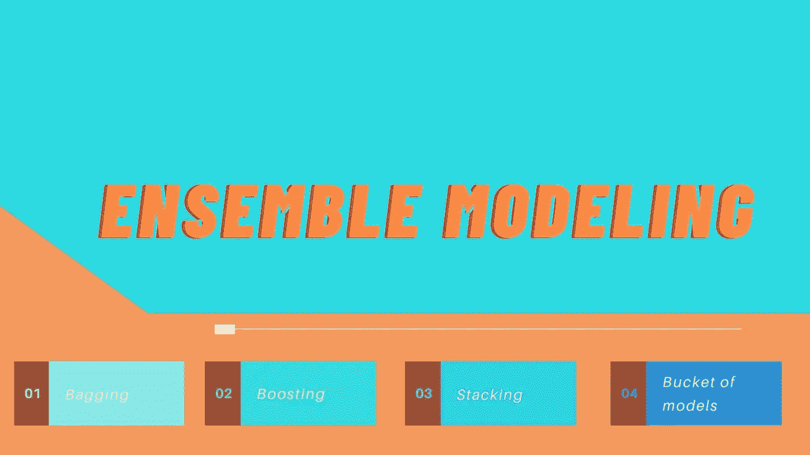
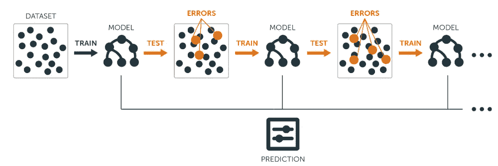
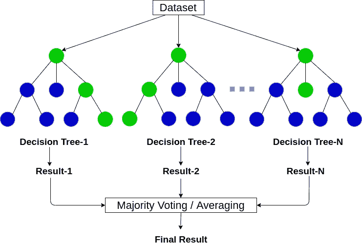
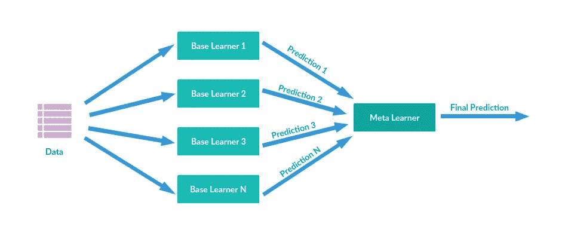

# 集成学习介绍|最佳机器学习

> 原文：<https://medium.com/analytics-vidhya/ensemble-modeling-in-machine-learning-7b74a2286f94?source=collection_archive---------9----------------------->

由 ashwinhprasad 和 canva 一起创建

当谈到预测建模时，单一的算法模型可能不足以做出最佳预测。机器学习中最有效的方法之一是**集成建模**或**集成**。

集成建模是遵循相同或不同算法的多个机器学习模型的组合，以做出更好的整体预测。
通常是这些类型的模型赢得了由*网飞*或*卡格尔*举办的机器学习比赛。

# 种类

集成建模方法可以分为不同的类别。
他们是:

1.  **顺序**

图片来自 kdnuggets

您可能已经猜到了，该模型包含一系列步骤。
在每一步，通过考虑模型在前一步产生的预测中的误差，通过对前一步的错误分类增加一些权重，来提高模型的性能。例子: **Adaboost。**

> M 模型犯错误→模型更加关注错误→模型改进

上述语句被重复多次，直到模型做出准确的预测

**2。平行**

与顺序方法相反，并行方法同时在数据集上拟合(训练)多个模型。在这里，模型是相互独立的。
对数据集进行独立训练后，所有模型进行预测，最终的最优预测将基于分类问题的投票原则或回归问题的平均原则。
**示例:**多个决策树一起工作以形成对相同数据的多个预测，最终结果将是所有决策树预测的平均值(在回归问题的情况下为*)*

*并行建模可以进一步分为两类:**同构和异构建模**。*

*   **同质建模:* 在数据集上训练的多个模型是相同类型的，只有一些最小的变化。
    示例:随机森林算法(多决策树)*
*   **异构建模:*模型类型不同。
    示例:一个人工神经网络和一个 k-最近邻模型一起工作以做出最佳预测*

# *集成建模的四个主要子类*

*整体建模有 4 个主要的子类，分别是*装袋、推进、模型桶和堆叠**

***装袋或自举聚集***

**

*来自 Analytics Vidhya 的随机森林图像*

*这是同质系综的一个例子。在这种方法中，数据集的随机样本被挑选 **n** 次，并且同类型的 **n** 个模型在这些 **n** 个样本上训练(*每个模型在单个样本上训练*)。然后使用投票系统从所有 **n** 模型的预测中做出预测，或者在回归的情况下平均所有模型的预测*

***提升** 在提升中，权重被添加到来自前一次迭代的误分类数据，从而在下一次迭代中进行改进。这个过程一直持续到模型能够做出好的预测。这是顺序建模的一个例子。*

*这可以与下面的场景相比较:
老师在学校上化学课，在进行测试时，她知道一些学生在测试中表现不好。因此，她为上次考试分数低的学生开设补习班来提高他们的成绩，同时让分数高的学生自学。
这就是 boosting 的基本功能。*

***模型桶** 在这种技术中，在给定的训练数据集上训练不同的模型，并且在所有超参数调整之后，最终选择在测试集上表现最好的模型供将来使用。*

***堆叠***

**

*Stacking 根据数据训练多个不同的模型，并进行新的预测，它使用所有这些模型进行组合预测。
示例:将神经网络与 K 个最近邻居相结合*

# *结论*

*因此，一个不可否认的事实是，集成建模可能会提高准确性，并给我们一个整体更好的预测。这些多个模型的组合可以补充和补偿每个 mdoel 的弱点，从而导致更好的预测。但是，也有理由说，这样做，我们牺牲了模型的简单性和透明性，这可能导致一个解决方案是一个统计黑箱。*