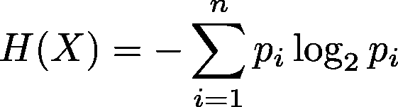
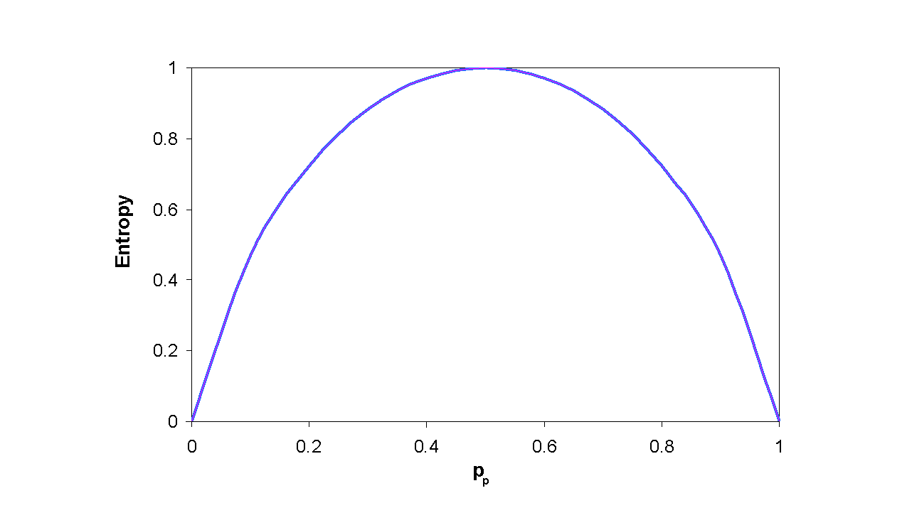
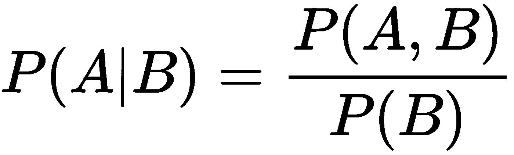
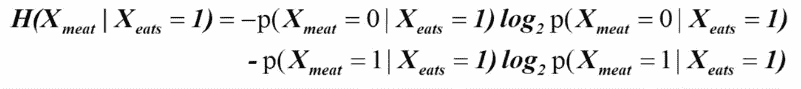

# 熵和条件熵

> 原文：<https://medium.com/analytics-vidhya/entropy-conditional-entropy-330d3152153?source=collection_archive---------6----------------------->

熵是统计学相关领域中常用的术语之一。它在许多数据驱动的领域，如数据挖掘、机器学习和自然语言处理(简称为 *NLP* )中有着重要的作用。比如用于决策树算法中的节点分裂。您可以了解数据集中两个或更多特征的关系。因此，你可以通过给定的熵公式来提取这些特征之间的相关性信息。

# 熵是什么？

熵是一个句子、数据集等中变量的*随机性*的度量。通过使用这个度量*，可以知道对于一个状态 *S* 是否存在一个变量。由于它声明了随机性，每当一个变量存在的可能性接近精确状态时，它的熵就变为零。在这种情况下，可以肯定的是，变量存在，并且在该时间之后没有随机性发生。与此相反，我们可以说，每当我们说“这个变量可以存在或不存在，很难说它是否存在”时，熵就会增加并接近 1(熵值必须在 0 和 1 之间)。*

如果变量明确存在，熵为 0；如果变量以 0.5 的概率存在，而以同样的概率不存在，熵为 1。在公式上很容易解释这一点。数学中 Log1 为 0。所以确切存在使得结果为 0。

让我们假设抛硬币(这是任何统计题目中最常见的例子)。如果这个硬币是公平的(一个正常的硬币)，那么我们知道有正面或反面的概率是相同的，对于一个公平的硬币来说等于 0.5。所以在这种情况下，硬币上任何一面的存在和不存在的相等导致熵为 1。

h(X)=—log _ 2(0.5)* 0.5+—log _ 2(0.5)* 0.5

H(X) = — (-1) (0.5) — (-1)(0.5) =1

另一方面，变量的确切存在使得熵值为 0。

H(X) = — log_2 (1) * 1 + — log_2(0) * 0

h(X)=-(0)* 1+0 = 0

所以我们可以在图中显示熵。

图上的熵

# 条件熵

条件熵和熵本身没有太大的区别。如果你熟悉概率讲座，你一定知道条件概率。它给出了一个变量 A 在另一个变量 B 的状态已知的情况下的概率。例如，如果变量 B 确实存在。所以变量 A 存在的概率表示为 P(A=？|B=1)。这被称为条件熵，如果你对任何统计领域感兴趣，这是一个关键话题。

变量 A 对 B 的条件概率公式

我们可以将上面描述的熵度量和条件概率相结合，以便计算一个新的值，称为*条件熵*。因此该度量包括熵计算中的两个变量的关系。

让我们举一个使用条件熵的例子。*水*和*饮料*这两个词是有关系的。你能拒绝吗？不。因为我们知道“人们喝水”。所以如果之前观察到*喝*这个词，那么*这个词就有可能是*水。我们可以说单词*饮料*的存在影响了单词*水*的存在概率。所以它的概率不再与没有观察到单词*饮料*时的概率相同。*喝*这个词对*水*这个词的随机性有影响。这叫做*条件熵*。

我们也可以对上面的例子进行新的评论。我们都知道，如果一个句子中有单词 Drink，那么单词 Water 的概率就很高。因为我们都必须喝水，但不能喝可乐或苏打水。喝水的可能性远远高于喝汽水的可能性。所以我们可以说词*水*对词*喝*的条件熵几乎为零或非常接近零(几乎确定)。

单词 meat 对单词 eats 的条件熵

# 熵用在哪里？

使用熵的一些领域有

*   机器学习算法(例如决策树算法)
*   自然语言处理
*   特征工程
*   强化学习中的正则化