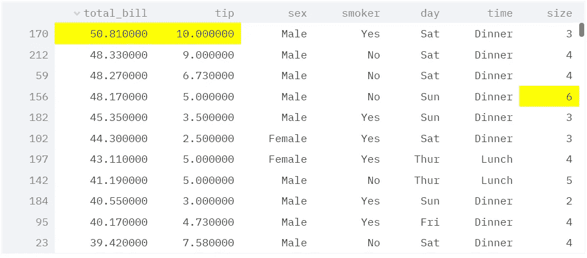

# EP3。在 Web 应用程序上显示数据框架

> 原文：<https://medium.com/analytics-vidhya/ep3-displaying-dataframes-on-the-web-app-b0c4a4c8b88f?source=collection_archive---------4----------------------->

## 3 种展示方式！！！！

显示我们在 web 应用程序中使用的数据集是更好的选择。因为用户也可以在我们的 web 应用程序本身中检查数据集，而不是打开一个新的选项卡并检查其中的数据。因此，今天在本文中，我们将了解如何使用 Streamlit 在我们的 web 应用程序中显示数据框。如果你还没有看过另外两集，请点击这里查看。


按作者

首先，我们将从导入我们需要的包开始。当我们处理数据帧时，我们显然需要我们的英雄**熊猫**，我们希望在我们的 **streamlit** 中显示这些数据，所以我们也将导入它们。

```
import pandas as pd
import streamlit as st
```

然后我们将加载我们的数据或读取我们的数据。我们将它存储在变量 **df** 中。我们将在这里使用的数据集是 tips 数据集。你也可以在 Kaggle 中找到这个数据集。[这里是网址](https://www.kaggle.com/jsphyg/tipping)。

```
df = pd.read_csv("tips.csv")
```

我们可以使用 3 种方法显示 streamlit 中的数据框，我们将逐一查看。

**方法 1 —显示动态数据帧。**

这里的动态数据框是这样一个数据框，我们可以使用它根据特定的列对它们进行重新排序，或者我们可以四处移动并检查该数据中的其他行。为了显示这些数据，我们将使用 dataframe()函数。它需要三个参数:

```
# SYNTAX
streamlit.dataframe(*data=None*, *width=None*, *height=None*) # height and width in pixels
```

我更喜欢方形数据框

```
st.dataframe(df,500,500)
```

我们也可以使用样式模块来样式化我们的数据。例如，假设您想要突出显示所有列中的所有最大值。在这种情况下，我们可以使用 highlight_max()，因为我们在处理列，所以我们必须将轴设置为 0。

```
st.dataframe(df.style.highlight_max(axis=0)
```

***输出:***



突出显示的最大值

**方法 2——显示静态数据帧**

我们可以使用表()创建静态数据框。这个函数只有一个参数，那就是我们的数据。

```
st.table(df)
```

**方法 3 —使用 write()显示数据帧**

第三种方法是使用我们的 write 函数来显示我们的数据集，如果你不知道 write 函数，可以看看这篇文章。

[](https://adithsreeram.medium.com/ep2-textual-functions-in-streamlit-daad2630cd30) [## EP2。Streamlit 中的文本功能

### 写()—高人一等的家伙！！！

adithsreeram.medium.com](https://adithsreeram.medium.com/ep2-textual-functions-in-streamlit-daad2630cd30) 

```
st.write(df.head())
```

甚至我们使用 write 函数显示的数据帧也是动态的。

# 奖金

**显示代码片段**

在结束这篇文章之前，我还想告诉你如何在 streamlit 中显示代码片段，给你一个奖励。

要在我们的 web 应用程序中显示我们的代码片段，我们必须使用函数代码()。

```
c = """for i in range(2,11,2):   
           print(i)"""st.code(c)
```

# 结论

就这样，我们结束了这篇文章。今天，在本文中，我们了解了如何使用我们的 streamlit 中提供的内置文本函数。

别忘了留下你的回答。✌

大家敬请关注！！为了把我的故事发到你的邮箱里，请订阅我的时事通讯。感谢您的阅读！不要忘记鼓掌，分享你的回答，并与朋友分享。

这篇文章早些时候发表在的[菲特奇](https://fittechie.in/)