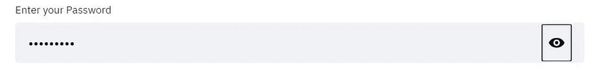
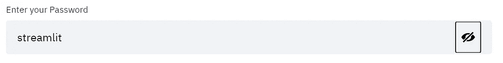

# EP6。接收来自用户的输入

> 原文：<https://medium.com/analytics-vidhya/ep6-receiving-input-from-the-user-4c47bfd01396?source=collection_archive---------9----------------------->

## 我们也可以接收日期和时间作为输入！！！！

嘿伙计们！！欢迎回到 EP6，学习我们的 Streamlit 基础知识系列。今天在这篇文章中，我们将看看如何接收用户的输入。我们将要接收的输入可以是一个文本、一个数字、一串文本行、日期、时间，甚至是密码，没有任何进一步的麻烦，让我们开始吧！！！


像往常一样，我们将从导入所有需要的包开始。当我们处理 streamlit 时，我们将导入 streamlit。

```
import streamlit as st
```

# 输入文本

为了接收文本输入，我们将使用函数 text_input()，该函数将接受一个强制参数，即类似问题的文本。例如，“输入您的姓氏:”

```
fn = st.text_input("Enter your first name: ")
```

您还可以设置希望用户输入的字符的限制。为此，我们将使用参数 max_chars。假设当我们将参数 max_chars 设置为 20 时，用户不能输入大于 20 的字符总数。

```
fn = st.text_input("Enter your first name: ", max_chars = 10)
```

# 文本区域

通过使用 text_input()，我们无法接收来自用户的多行输入。假设您希望接收用户的地址作为输入，在这种情况下 text_input()没有多大用处，我们可以使用函数 text_area()。

```
st.text_area("Give your feedback")
```

# 数字输入

number_input 函数帮助用户接收用户输入的数字。默认情况下，它接受一个类似问题的文本参数。例如，“输入您的年龄:”。

`st.number_input(“Enter your age”)`

默认情况下，数字将以 0.01 的速率递增。但是当你传递另一个值的时候，在函数内部，它会决定这些值必须以什么样的速率变化。当我们传递一个整数时，值以 1 的速率递增，当我们传递一个浮点数时，值以 0.01 的速率递增。

```
st.number_input(“Enter your age”, 5) 
#values will increase at the rate of +1/-1st.number_input(“Enter your age”, 5.5) 
#values will increase at the rate of +0.01/-0.01
```

您还可以添加另一个值，它是一个位置参数，将作为最大值。

```
st.number_input(“Enter your age”, 5, 100) # 100 is the max value, any other max value u enter will throw an error.
```

您还可以添加另一个值，它是一个位置参数，将作为默认值。

```
st.number_input(“Enter your age”, 5, 100, 77) # Here 77 will act as the default value.
```

您还可以添加另一个值，它是一个位置参数，将作为步长值。

`st.number_input(“Enter your age”, 5, 100, 75, 5)`

这里并不是说它只在 5、10、15……的范围内增加。假设当你设置你的值为 17，然后当你增加这个值，那么这些值将增加 17，22，27，32…

# 日期和时间输入

我们还可以接收用户输入的日期和时间。这是 streamlit 提供给我们的最有趣的特性之一。

```
# datest.date_input("When is your next flight")# timest.time_input("When is your class time")
```

# **奖金**

我们还可以从用户那里获得密码输入。这可以通过使用 text_input()中的“type”参数来实现。

我的密码看起来会像



```
password = st.text_input("Enter your Password", type = "password")
```

# 结论

就这样，我们结束了这篇文章。今天，在本文中，我们了解了如何在 streamlit 中添加媒体文件。

别忘了留下你的回答。✌

大家敬请关注！！为了把我的故事发到你的邮箱里，请订阅我的时事通讯。感谢您的阅读！不要忘记鼓掌，分享你的回答，并与朋友分享。

这篇文章早些时候发表在的[菲特奇](https://fittechie.in/)