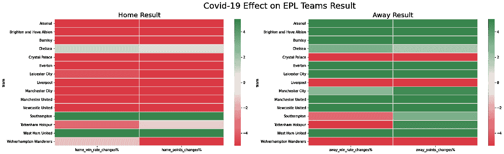
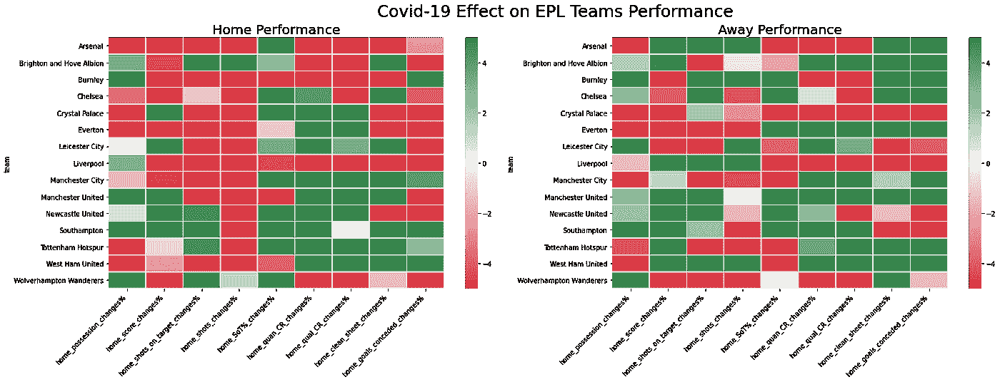

# EPL 新冠肺炎数据分析

> 原文：<https://medium.com/analytics-vidhya/epl-covid-19-data-analysis-739f0dbc09a?source=collection_archive---------4----------------------->

新冠肺炎对英超(EPL)球队影响的比较分析

*合著*[***Wira Febri Arjuna***](https://www.linkedin.com/in/wirafebriarjuna/)*和*[***Juan liognardo***](https://www.linkedin.com/in/juan-liong-2348a9105/)*。*

后新冠肺炎英格兰超级联赛比赛期间，空荡荡的体育场。来源:[雅加达邮报](https://img.jakpost.net/c/2021/03/12/2021_03_12_111250_1615545594._large.jpg)

# 目录

*   问题背景
*   目标
*   数据收集
*   数据预处理
*   数据可视化
*   结论
*   参考

# 泰勒:博士

*   总的来说，在新冠肺炎之后，主队的成绩会变得更差，而客场成绩会变得更好
*   总的来说，新冠肺炎之后，主队的表现也会下降
*   虽然它的表现没有改善，但由于主队的表现下降，客场队能够取得更好的成绩。
*   本项目 Github 回购链接:[此处](https://github.com/juanliong14/epl_data_analysis)

# 问题背景:空看台的影响

英格兰超级联赛(EPL)在 2020 年 3 月全国全面封锁后被叫停。其俱乐部随后就“重启项目”进行了投票，决定在 2020 年 6 月恢复联赛。

这一决定伴随着重大的调整，如主场观众的缺席，以防止新冠肺炎病毒的传播，以及球员在 2020/2021 赛季的恢复期较短，从 2020 年 10 月下旬(通常在 8 月)开始，必须在 2021 年 5 月前结束。

任何看足球的人都知道，主场因素对于一支球队获得积分是非常重要的。但是如果没有球迷，在主场比赛可能不会给主队带来主场优势。

> 英国著名运动心理学家迈克尔·考尔菲尔德告诉 ESPN 说:“(主场球迷的)恐吓因素被从对手那里拿走了。”。"在某种程度上，他们几乎是季前赛一样的友谊赛，没有人在场."

我们个人在某种程度上同意这种说法，但作为一名数据科学家，我们认为尽管这种说法令人满意，但它有些模糊，缺乏支持其有效性的适当论据。我们决定深入挖掘，探索新冠肺炎是如何影响 EPL 的。

# 目标

我们试图通过比较新冠肺炎奥运会前后的足球统计数据来找出足球比赛有多大的不同。我们将统计分为两类:结果统计和性能统计。新冠肺炎奥运会前后的成绩和表现统计数据的比较可以解释奥运会是如何变化的。

## **结果统计**

*   胜率
*   每场比赛的点数

## **性能统计**

*   控球权
*   每场比赛得分
*   击中目标
*   发射
*   击中目标% =击中目标/击中目标
*   数量转换率=进球/射门
*   质量转换率=进球数/命中目标数
*   清洁纸张率
*   每场比赛失球数

# 数据收集

这些数据是从 EPL [官方网站](https://www.premierleague.com/)上收集的，使用 python 中的 selenium 包进行 web 报废。对于 web scrapper，我们使用这个 github 库作为参考:[这里](https://gist.github.com/otavio-s-s?page=2)。

我们收集了 2018/2019 至 2020/2021 赛季的所有数据，包括新冠肺炎中断前 1 个赛季至新冠肺炎中断后 1 个赛季的比赛数据。从 2018/2019 赛季开始到 2020/2021 赛季结束，新冠肺炎中断前有 668 场比赛，新冠肺炎中断后有 472 场比赛。网站上的统计数据如下:

*   控球率%
*   击中目标
*   发射
*   高光
*   经过
*   用具
*   清除
*   角球
*   越位
*   黄牌
*   红牌
*   承认犯规

# 数据预处理

在确保废弃的数据是干净和完整的之后，我们通过计算剩余的统计数据来预处理数据，例如每场比赛的得分、胜率、命中率%、质量转换率、数量转换率、不失球率。在这个过程中，领域专业知识是必不可少的。

我们对球队进行了筛选，因此分析只使用了参加过所有三个赛季的球队的数据。之后，我们将数据分组到每个团队，计算 covid 前后的平均统计数据、名义变化和变化百分比。我们使用变化百分比来评估新冠肺炎对每个属性的影响:

1.  小于-5%的变化被归类为“负面影响”
2.  变化在-5%到 5%之间被归类为“相对未受影响”
3.  变化大于 5%被归类为“积极影响”

# 数据可视化

数据可视化对于确保正确传达从数据探索中获得的见解至关重要。以下是一些关于新冠肺炎如何影响 EPL 队的形象化描述。

新冠肺炎中断后主队胜率下降了 6.8%，而客场胜率上升了 6.4%。很明显，没有支持者在球场上，主队的结果更差，因为他们没有背后支持者的优势。

上图是 EPL 队主场胜率的变化。我们可以清楚地看到，胜率下降的俱乐部比胜率上升的俱乐部多。

随着胜率的下降，在新冠肺炎中断后，球队在主场的场均得分也下降了。与此同时，在新冠肺炎之后，客队从观众缺席中获得了优势，每场比赛得分增加。

从上面的每场比赛得分变化图表中，我们也可以观察到每场比赛失分的球队比没有失分的球队多。在新冠肺炎中断后，利物浦在其他 EPL 球队中成绩最差。他们在主场比赛时，每场比赛的胜率和得分下降最多。

我们可以很容易地发现，在后新冠肺炎时代，主队的成绩变得更差，而客场成绩更好。

从上面的热图中，我们还可以观察到主队的表现变得更差，而客场队的表现仍然是好坏参半，因为有些数据得到了改善，有些数据则有所下降。我们还毫不费力地注意到，大多数主队的主场投篮次数都有所下降

# 结论

*   总的来说，在新冠肺炎之后，主队的成绩会变得更差，而客场成绩会变得更好
*   主队的表现也普遍下降
*   虽然它的表现没有改善，但由于主队的表现下降，客场队能够取得更好的成绩。

# 参考

[1]奥特维奥·西莫斯·西尔韦拉。(2020).如何使用网页抓取建立足球数据集:[https://python . plain English . io/how-To-Build-A-Football-Dataset-With-Web-Scraping-D4 deffcaa 9 ca](https://python.plainenglish.io/how-to-build-a-football-dataset-with-web-scraping-d4deffcaa9ca)