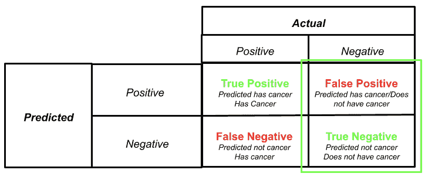
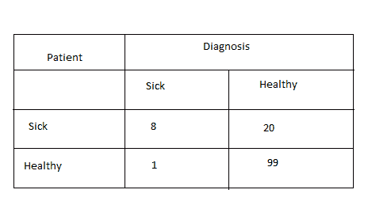
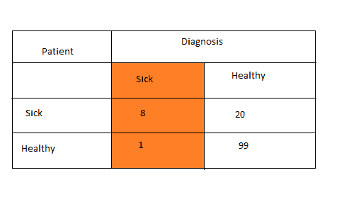
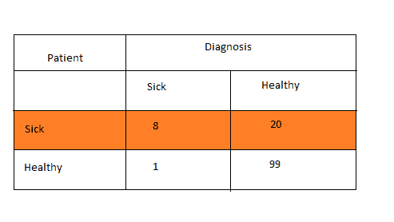

# 机器学习中的误差度量

> 原文：<https://medium.com/analytics-vidhya/error-metrics-in-machine-learning-f9eed7b139f?source=collection_archive---------2----------------------->

# 介绍

如果你正在阅读这篇博客，你可能对机器学习很熟悉，或者对学习机器学习感兴趣。机器学习是人工智能的一个子领域，它使系统从数据中学习，并使它们能够在最少的人工干预下做出决策。现在一般来说，我们用“模型”这个词来表示这个智能系统。现在，假设我们有一个被设计来执行特定任务的模型。该任务可以是任何事情，例如，将电子邮件分类为非垃圾邮件和垃圾邮件，或者图像分类问题。现在，有了这个模型，我们需要知道两件重要的事情

1.  该模型对于执行任务是否足够好
2.  新数据是否会降低模型的性能

现在，当涉及到模型开发时，这些点真的很重要。这些因素将决定模型有多好，以及如何改进模型。现在，我们如何知道模型是好是坏？

这就是绩效指标的作用。让我们看看它是什么。

# 分类的性能指标

所以我们需要一些方法来告诉我们的模型做得有多好。但是我们如何使用一个单一的指标来做到这一点呢？

# 准确(性)

一种方法是检查模型做出了多少次正确的决策，犯了多少次错误。这个想法将把我们带到最简单的性能指标——准确性。准确性可以定义为模型做出的正确决策的百分比。这很有道理，对吧？精确度的值越大，模型就越好。但这有时会很棘手。让我们看一个例子。

考虑一个癌症预测案例研究。给定一个人的详细信息，我们需要预测他是否患有癌症。假设，我们有一个为此任务训练的模型。现在，有四种可能发生的情况。

从这个图中，正真值和负真值的数量表明了这个模型有多好。让我们也分配一些值。

现在我们可以看到模型的假阳性数量非常高。这里，28 名癌症患者中，20 名患者被错误地识别为健康。现在这是一个严肃的问题。我们不能犯任何一个错误，不能识别真正的癌症患者。考虑到这一点，我们可以说这种模式表现不佳。现在，让我们检查模型的准确性。该模型的正确预测数为 107 (99+8)，错误数为 21 (20+1)。现在精度将是

尽管模型表现很糟糕，但我们可以看到模型的准确性非常高。如果我们只考虑准确性，我们可能会认为这个模型是一个很好的模型，就像将这个模型用于实际场景一样。从这个例子中，我们明白了一个简单的度量标准，比如准确性，不能在所有情况下都用作性能评估度量标准

# 精确度和召回率

我们在前面的例子中看到，准确性指标有时会产生误导。现在让我们尝试推导一些更合适的误差度量。从上面显示的混淆矩阵中，我们可以得出两个不同的指标——精确度和召回率

# 精确

精确度表明我们的预测有多精确或正确。如果我们联系前面的例子，我们可以这样定义精度。在被诊断为患病的患者中，有多少患者实际上已经患病。现在，如果精度的值越大，那么我们的诊断就越准确。我们还可以计算健康人识别的精度。让我们试着计算一下先前模型的精度。下图与我们之前看到的混淆矩阵相同。

现在，你可以看到在 9 个被诊断为患病的人中，有 8 个人确实患病了，但是有一个人是健康的。所以，这里这个人实际上并没有生病，但是由于模型识别出他生病了，他不得不做所有进一步的医疗检查，这很烦人。这里只有一个人被错误分类，这很好。但是如果这种错误分类更多，那将会给我们带来非常糟糕的结果。现在让我们来计算这个模型的精度。

精确度是正确预测的百分比。这里诊断=疾病的精确度是

类似地，我们可以计算诊断=健康的精度。在这里，我们计算，在所有被诊断为健康的患者中，有多少人实际上是健康的。从混淆矩阵中我们可以看到，99 人实际上是健康的，20 人实际上是患病的，但被检测为健康的。这意味着我们的模型很糟糕，对吗？

因此，很明显，该模型在检测患病患者方面表现不佳。现在让我们看看回忆是什么意思

# 回忆

在某些用例中，召回是一个非常重要的指标。回忆将告诉我们，在实际患病的患者中，有多少患者被确定为患病。因此，我们可以说，在医学领域，召回是一个非常重要的指标。因为在医学领域，较低的精确度只会将一些健康人识别为患病。那可能很烦人，但不是很严重。但是想象一下回忆较少的情况。更少的回忆意味着，我们不能识别真正生病的病人，我们诊断他们是健康的。那太可怕了。因此，在这种情况下，我们需要检查模型是否具有高召回率。

在这里，我们可以看到 28 名患病患者中，只有 8 名被检测为患病，而大多数(20 名)患者被诊断为健康，这很糟糕。现在让我们来看看这款车型的召回情况。

显然，这个模型是一个坏模型，从召回指标中可以清楚地看出这一点。

我们看到性能指标的选择完全基于数据和领域。在同一个示例用例中，我们看到模型的准确率为 83%，同一模型的召回率为 28%。显然，考虑到数据和领域，我们知道在这种情况下准确性不是一个好的度量标准。我们应该足够聪明，在评估模型时选择最合适的度量，否则评估结果会误导我们。

既然我们知道了精度和召回，那么我们如何知道什么时候使用精度，什么时候使用召回呢？

是的。如果我们能把精确度和召回率结合起来，形成一个单一的衡量标准。那太好了，对吧？让我们看看。

# F1 分数

现在，我们如何将两个指标组合成一个指标。最简单的方法是取这些指标的平均值，对吗？现在让我们看看那会是什么样子。让我们考虑同样的医学模式。我们正在考虑被诊断为生病的班级。

对于该模型，精确度= 88%，召回率= 28%

现在这些分数的平均值将是(88+ 28)/2 =58%

嗯，这可能给我们一种感觉，模型还不错，它给出了接近 60%的平均分。但是我们也可以看到召回有多糟糕。考虑到这一点，我们可以说，平均分数没有考虑模型的可怕场景。所以我们不能把平均作为一个单一的指标。现在怎么办？

让我介绍一个新术语——调和平均值。调和平均数像平均数，但又不一样。两个数之间的调和平均值可以写成:

调和平均值将小于算术平均值或平均值，并且将更接近于最小的数字。因此，如果精度或召回率较低，那么调和平均值也会较低。现在让我们尝试计算精确度和召回率之间的调和平均值

精度和召回率之间的调和平均值将具有范围从 0 到 1 的值。平均值越高，模型越好。这里，我们可以看到模型的调和平均值非常小，这清楚地表明我们的模型不好。

精确度和召回率之间的调和平均值被称为 F1 得分。F1 分数在许多情况下是一个非常受欢迎和广泛使用的指标，因为它试图捕捉最糟糕的情况。

# 回归的性能指标

只有当问题是分类时，像准确度、精确度、召回率和 F1 分数这样的指标才适用。考虑一个场景，你被告知开发一个机器学习模型来预测房价。输出标签是实数而不是类值(例如:生病或没生病)的问题类型称为回归问题。现在，如果输出标签是一个实数，那么准确度、精确度、召回率等指标。没有任何意义。在这里，我们必须使用一些其他的指标。

# 均方根误差

RMSE 或均方根误差是回归问题中最流行和最广泛使用的度量。现在，RMSE 计算将假设误差是正态分布的，它们是无偏的。下面给出了 RMSE 的方程式

许多机器学习算法使用 RMSE，因为它更快，更容易计算。太好了。那我们无论如何都可以用 RMSE？

在这里，我们可以看到，误差是平方的，因此 RMSE 将不会与误差处于同一标度。RMSE 也会处罚较大的失误，这在某些情况下并不好。RMSE 也深受离群值的影响。

# 平均绝对误差

MAE 或平均绝对误差是我们可以用于回归问题的另一个度量。

这里 e 代表预测值和实际值之间的误差。MAE 将测量误差的平均大小，而不考虑误差的方向或符号。MAE 是一个线性分数，这意味着所有个体差异在平均值中的权重相等。MAE 显然具有不惩罚大错误的优势，这在某些情况下非常有用。但是使用 MAE 的一个明显的缺点是它使用了绝对值，这在许多数学计算中是不希望的。

与分类指标类似，回归指标的使用也取决于数据和领域。

# 结论

在这篇博客中，我试图涵盖机器学习中一些最常用的错误度量。请注意，我只介绍了一些最常用的性能指标。还有许多其他指标我没有在这里介绍。你也可以探索一下。

如有任何疑问或建议，请通过 [LinkedIn](https://www.linkedin.com/in/vinitha-v-n-5a0560179/) 联系我

你也可以在 [Github](https://github.com/Vinithavn) 上查看我的项目