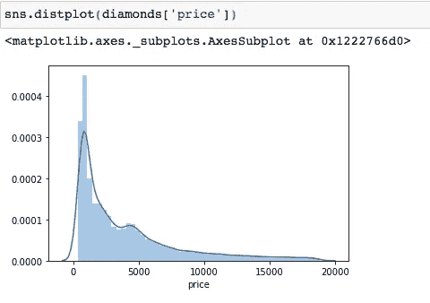

# 数据识别的基本统计概念

> 原文：<https://medium.com/analytics-vidhya/essential-statistical-concepts-for-data-cognizance-845ddb277b7?source=collection_archive---------17----------------------->

照片由 [**凯文 Ku**](https://www.pexels.com/@kevin-ku-92347?utm_content=attributionCopyText&utm_medium=referral&utm_source=pexels) 发自 [**Pexels**](https://www.pexels.com/photo/black-farmed-eyeglasses-in-front-of-laptop-computer-577585/?utm_content=attributionCopyText&utm_medium=referral&utm_source=pexels)

> "你可以拥有没有信息的数据，但你不能拥有没有数据的信息."
> 
> 丹尼尔·凯斯·莫兰

数据科学的存在是因为理解数据的需要。数据科学是多学科的，可以说数据科学最强的支柱是统计学。去掉数据科学家的编程和技术成分，你就有了一个*统计员*。

统计思维是理解数据的关键。在深入研究机器学习算法之前，最重要的是要知道你在处理什么！

统计学不仅使我们能够理解我们所拥有的数据，而且也给分析提供了更好的方向。这就是数据科学中的探索性数据分析，它结合了统计学和编程。

**关键统计概念**的知识，为了真正解释探索性数据分析有:

*   测量级别
*   集中趋势测量
*   离差的度量
*   对称度
*   相互关系

让我们通过问一些关键问题来掌握这些概念。

# 测量级别

威廉·沃比在 [Unsplash](https://unsplash.com/s/photos/measure?utm_source=unsplash&utm_medium=referral&utm_content=creditCopyText) 上拍摄的照片

> ***“我在处理什么类型的数据？”***

数据集由许多不同的列或要素组成。第一步也是最重要的一步是确定一个特性属于哪一级测量。一个特征可以属于标称、序数、间隔或比例尺度。

**标称** —用于根据数据的属性标记数据中的类别。

例如:男性或女性，O 型阳性或 B 型阳性。

**序数** —给数据分配一个等级/顺序

示例:小型、中型或大型

**标称**和**序数**标尺均用于**定性/分类特征**。

**区间** —这显示了作为固定单位的观察值之间的差异大小，以及它们的顺序。与另一个相比，一个观察值有多大或多小？

示例:温度

**比率** —不仅测量观察值之间的差异大小，还测量这些差异的比例。

例如:千克

**区间**和**比率**标尺均用于**定量/数值特征**。

了解测量水平使我们能够**将合适的分析技术**应用于数据。

如果一个分类特征有许多类别，它可以被分成更少、更有意义的类别。也不要求标准化这些特征。**分类数据**最好通过**条形图、饼状图和排列图**可视化。

**数字数据**最好通过**直方图、线图、散点图和气泡图**可视化。这些特征需要标准化，以便进一步分析和建模。

让我们探索一下钻石数据集，并确定分类变量和数值变量。

正如我们所观察到的，特征**‘切割’**和**‘净度’**是**有序分类变量**，分别根据钻石的质量和净度对其进行标注和排名。让我们通过使用 seaborn 的条形图来可视化“切割”功能:

在数据集中，变量“价格”和“克拉”是数值变量，具有比例尺度，因为它们有一个真正的零。让我们用散点图来想象一下:

# 集中趋势测量

> ***“描述我的全部数据的一个值是什么？”***

集中趋势的度量是数据集中大多数数值倾向于围绕其聚集的值。

均值、中值和众数是最常用的集中趋势度量。

平均值是最能代表数据的值。它是所有观察值的总和除以观察值总数。

Median 是最中间的值，将数据分成相等的两部分。在存在异常值的情况下，它比平均值更能代表数据。

众数是数据中最经常出现的值。

# 离差的度量

[Saad Chaudhry](https://unsplash.com/@saadchdhry?utm_source=unsplash&utm_medium=referral&utm_content=creditCopyText) 在 [Unsplash](https://unsplash.com/s/photos/dandelion?utm_source=unsplash&utm_medium=referral&utm_content=creditCopyText) 上拍摄的照片

> ***“我的数据变化有多大？”***

离差的度量显示了数据点偏离/偏离平均值的程度。这种方法使我们能够检验平均数的可靠性。

离差的常用度量是极差、四分位差及其系数、方差和标准差。

标准差可能是最受欢迎的度量，独立于任何度量单位。

# 对称度

罗宾·斯皮尔曼在 [Unsplash](https://unsplash.com/s/photos/symmetric?utm_source=unsplash&utm_medium=referral&utm_content=creditCopyText) 上的照片

> ***“我的数据往哪个方向走？”***

测量数据点变化/分散的方向。它们显示分布中的数据点主要集中在哪一边。数据可以是对称的也可以是非对称的。

集中趋势、分散性和偏斜度的测量被广义地称为**、**。

分析所有这些数据使我们能够*识别数据的主要特征和分布*。

例如，即使在图表上绘制变量之前，我们也可以通过简单地查看平均值、中值和众数来判断其类型。

*   如果均值>中值>众数，我们有一个正偏态分布，即异常值位于分布的右尾。
*   如果这个意思是< Median < Mode, we have a negatively skewed distribution i.e. outliers lie in the left tail of the distribution.
*   If the Mean = Median = Mode, we have a symmetrical/normal distribution, which is best for data analysis and modeling.

Let’s find these measures for the ‘price’ of diamonds. You can find them individually or use the ‘**。**形容()‘为此’的方法。

这里的平均值(3933)>中位数(2401)>众数(605)，所以我们有一个正偏态分布。

让我们绘制一个直方图来确认:

分布的尾部在右边，大部分的
观测值都集中在左边。大多数钻石的价格都低于 2000 美元。

此外，检查描述性统计是**异常值检测**的第一步。

如果平均值明显不同于中值，我们立即知道数据中存在异常值。

我们也可以通过箱线图来直观显示上述测量结果:

圆点代表异常值，而方框代表四分位数范围。盒子里的线是中间值。我们可以看到，与其他品质相比，优质钻石的克拉数最高。

# 相互关系

照片由 [JJ 英](https://unsplash.com/@jjying?utm_source=unsplash&utm_medium=referral&utm_content=creditCopyText)在 [Unsplash](https://unsplash.com/s/photos/link?utm_source=unsplash&utm_medium=referral&utm_content=creditCopyText)

> ***“我的数据中这些特征之间有什么关联度吗？***

当试图理解两个数量变量之间的关系时，相关性分析是有利的。

相关性表明两个变量之间关系的强度和方向。代表相关性的数值称为**“相关系数”**。

相关系数介于-1 和 1 之间。

*   值为 1 或接近 1 意味着高度正相关，即一个变量的值随着另一个变量的值的增加而增加。
*   值为-1 或接近-1 意味着高度负相关，即一个变量的值随着另一个变量的值的增加而减少。
*   值为 0 表示这两个变量之间没有关系。

相关性最好用散点图和热图来表示。

让我们通过使用“**”来看看钻石的“克拉”和“价格”之间的关系。corr()** '方法:

相关性为 **0.92，**为**高度正相关**。这意味着当克拉数增加时，钻石的价格也会增加。让我们用热图来描绘一下:

相关性分析帮助我们进行**特征选择**。具有高相关性的特征对因变量具有相同的影响，因此可以丢弃其中一个以获得更好的结果。

# 结论

对上面讨论的概念的深刻理解将使您不仅能够判断您的数据，还能够通过处理异常值、删除冗余特征和归一化数据分布来提高数据质量，从而显著提高机器学习模型的性能和准确的洞察力！

> *我是一名数据科学爱好者和 MBA 毕业生，对研究统计数据充满热情&。你可以在*上找到我
> 
> ***LinkedIn****:*[*https://www.linkedin.com/in/ruhii/*](https://www.linkedin.com/in/ruhii/)

*原载于 2021 年 2 月 13 日 https://www.analyticsvidhya.com***。**