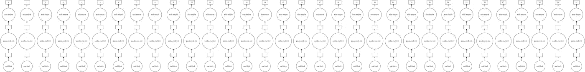
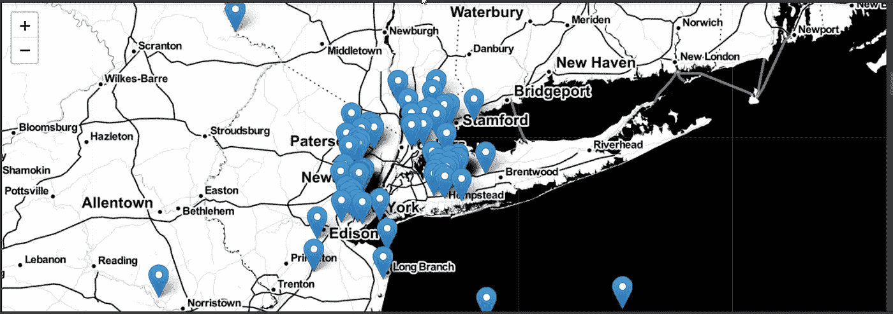

# 估计黄色出租车的载客密度

> 原文：<https://medium.com/analytics-vidhya/estimating-pickup-density-of-yellow-cabs-c6b45bb69331?source=collection_archive---------9----------------------->

鉴于世界各地对豪华公共交通的需求不断增长，对于这些企业以及司机本身来说，能够准确预测给定时间范围和位置群的出租车接客数量至关重要。


纽约市的黄色出租车

# 纽约出租车信息-

黄色出租车或黄色奖章出租车是纽约市著名的黄色出租车，专门通过街边招呼站提供运输服务。出租车的数量受到 TLC 颁发的牌照数量的限制。你站在街上，用手招呼一辆出租车，就可以使用这种交通方式。皮卡不是预先安排好的。

其他类型的出租车包括出租汽车和绿色出租车。

# **关于数据的信息-**

数据取自-

[https://www1 . NYC . gov/site/TLC/about/TLC-trip-record-data . page](https://www1.nyc.gov/site/tlc/about/tlc-trip-record-data.page)

收集和提供数据集的积分归纽约市出租车和豪华轿车委员会所有。

在我们的分析中，我们将使用 2015 年和 2016 年 1 月、2 月和 3 月的数据。(命名为 yellow _ trip data _ 2016–02 . CSV、yellow _ trip data _ 2015–03 等)。

每个这样的数据集大小接近 2 GB，占用超过 1000 万个数据点。

每个数据点有 19 个维度(属性)。让我们探索它们-

> **VendorID**
> 
> 表示提供记录的 TPEP 提供商的代码。
> 
> 1.创造性的移动技术
> 
> 2.VeriFone 公司。
> 
> **tpep _ 拾取 _ 日期时间**
> 
> 启用血糖仪的日期和时间。
> 
> **tpep_dropoff_datetime**
> 
> 血糖仪脱离的日期和时间。
> 
> **乘客数量**
> 
> 车内乘客的数量。这是驾驶员输入的值。(可能会出错)
> 
> **行程 _ 距离**
> 
> 出租车计价器显示的行驶里程(英里)。
> 
> **皮卡 _ 经度**
> 
> 计量表所在的经度。
> 
> **拾音器 _ 纬度**
> 
> 仪表所处的纬度。
> 
> **RateCodeID**
> 
> 对行程有效的薪酬代码。
> 
> 1.标准税率
> 
> 2.约翰·菲茨杰拉德·肯尼迪(John Fitzgerald Kennedy)
> 
> 3.纽瓦克
> 
> 4.拿骚还是威彻斯特
> 
> 5.协议票价
> 
> 6.集体乘车
> 
> **商店 _ 转发 _ 标志**
> 
> 该标志指示行程记录在发送给供应商之前是否保存在车辆存储器中，也称为“存储和转发”，因为车辆在该点没有到服务器的连接。
> Y=存储和前进行程
> N=非存储和前进行程
> 
> **下降 _ 经度**
> 
> 仪表脱离的经度。
> 
> **衰减 _ 纬度**
> 
> 仪表脱离的纬度。
> 
> **支付方式 _ 类型**
> 
> 表示乘客如何支付旅行费用的分类变量。
> 
> 1.信用卡
> 
> 2.现金
> 
> 3.免费
> 
> 4.辩论
> 
> 5.未知的
> 
> 6.无效行程
> 
> **车费 _ 金额**
> 
> 计价器计算出的时间和路程费用。
> 
> **号外**
> 
> 杂项额外费用和附加费。目前，这仅包括 0.5 美元和 1 美元的高峰时间和过夜费用。
> 
> **MTA _ 税务**
> 
> 根据使用的计量费率自动触发的 0.50 MTA 税。
> 
> **改善 _ 附加费**
> 
> 0.30 改良附加费在落旗处评估行程。改善附加费于 2015 年开始征收。
> 
> **小费 _ 金额**
> 
> 小费金额—该字段自动填充信用卡小费。不包括现金小费。
> 
> **过路费 _ 金额**
> 
> 行程中支付的所有通行费总额。
> 
> **合计 _ 金额**
> 
> 向乘客收取的总额。不包括现金小费。

## **使用 Dask 读取数据帧-**

为了处理如此大的数据帧，需要使用除 Pandas 之外的一些库。这是因为 Pandas 一次将整个数据帧加载到 RAM 中。另一种方法是 Dask，它将数据帧中的行逐步加载到 RAM 中，按照我们的代码指令处理它们，然后将它们从 RAM 中删除，为下一组行腾出空间。这使我们能够处理大于本地机器 RAM 的数据帧。这个概念非常类似于操作系统如何在硬盘内存块中存储大文件。根据 RAM 容量顺序访问和处理文件，然后删除。

与 Pandas 不同，对于像对一列求和这样的功能，Dask 不会立即触发计算。相反，它对数据帧进行分区，给它们分配键值对，然后并行化计算。

使用下面的代码片段来获得底层 Dask 图的可视化。

```
df.visualize() #visualize() is used to visualize the graph
```



你需要安装 Graphviz。圆圈代表操作，而矩形是结果。

为了直观地计算票价金额列的总和-

```
month.fare_amount.sum().visualize()
```


来计算总和。

```
month.fare_amount.sum.compute()
```

花絮:直到 compute()函数，整个命令看起来像熊猫。因此，如果没有 compute()函数，将执行整个数据集的延迟加载。只有在使用 compute()函数时，才会发生延迟计算。

# **ML 问题公式化-**

回到我们的问题，我们试图解决的案例研究本质上是一个时间序列预测和回归问题，以在给定位置坐标(纬度和经度)和 10 分钟时间间隔的情况下，在查询区域和周围区域(聚集在一起)中查找取件数量。

*给定一个聚类区域和 10 分钟的时间间隔，我们需要预测这段时间内的取件数量。*


样本时间序列数据。在我们的例子中，x 轴是第 I 个 10 分钟的间隔，y 轴是取货的数量。

上图是时序数据的一般图像。在我们的例子中，每个区域集群都有这样的表示。

# 绩效指标-

最重要-平均绝对百分比误差(MAPE)

司机更关心的是与实际皮卡数量的相对误差。

次要均方误差。

# 数据分析，用一些工程特征清理-

纽约位于坐标(纬度，经度)——(40.5774，-74.15) & (40.9176，-73.7004)之间。超出这些坐标的点作为异常值被移除。



使用薄层绘制的 100 个异常位置

对于下降纬度和经度也是如此。


甚至在海里也有一些落水者！

属性“tpep_pickup_datetime”和“tpep_dropoff_datetime”的数据类型为字符串。这些被转换成 unix 时间戳格式。

然后通过从拾取时间/60 中减去 unix 脱离时间来计算相应的持续时间(分钟)。

最后我们有了一个修改过的数据帧，带有属性-

> # 1.'乘客计数' :不言自明
> 
> # 2.' trip_distance ':自我说明(以英里为单位)
> 
> # 3.' pickup _ 经度' :不言自明
> 
> # 4.' pickup_latitude ':不言自明
> 
> # 5.' dropoff _ 经度' :不言自明
> 
> # 6.' dropoff_latitude ':不言自明
> 
> # 7.' total_amount ':已支付的交易总额
> 
> # 8.“trip_times”:每次行程的持续时间
> 
> # 9.pickup_times:转换成 unix 时间的拾取时间
> 
> # 10.“速度”:每次行程的速度

因此，增加的工程特征是行程时间、拾取时间和速度(单位为 km/h)(通过将 60*行程距离除以行程时间来计算)。

修改的数据帧-

截至目前，只有经纬度(其中 4 个)和取件时间这两个属性被剔除了离群值。我们还需要删除其他列中的异常值！

## **出行次数的异常值-**

绘制了 trip_time 值的箱线图。


它是高度倾斜的，并且不可解释来检测异常值。(记得在 seaborn，高于 Q3+1.5*IQR 的点和低于 Q1-1.5 * IQR 的点被认为是异常值)。

因此，我们采用百分位数法。在这种方法中，我们找到第 0-100 个百分位值来检测异常值出现的时间点。


显然存在异常值。让我们缩小范围(90–100)。


好吧！很明显，我们没有得到精确的百分位数，在这个百分位数以上，我们可以去除异常值。😅

根据纽约市出租车和豪华轿车委员会的规定，24 小时内的行程不能超过 12 小时。因此，那些行程持续时间<1 min and >为 720 分钟的数据点被删除。

现在，我们为 trip_times 绘制 PDF。


PDF 显示了对数正态分布。因此，它们被转换成对数值，使 PDF 成为正态分布。这将有助于应用高斯朴素贝叶斯(逻辑回归)。


log_times 现在看起来像高斯分布。

此外，Q-Q 图显示高斯性超过±3 个标准差。

## 速度异常值-

百分比法显示 99.9%的值为 45.31 英里/小时。小于 0 和大于 45.31 的速度值被删除。

还注意到，所有出租车的平均速度(sum(col)/len(df))为 12.45 英里/小时。因此，在 10 分钟内，出租车司机平均可以行驶 2 英里。这是一个合理的集群大小，因为出租车司机可以轻松地驾驶 2 英里移动到另一个集群，希望有更多的皮卡。

## 出行距离的异常值-

百分比法显示 99.9%的值为 23 英里。删除了小于 0 且大于 23 的行程距离。

## 票价金额的异常值-

99.9%似乎是一个合理的数值。因此，采用了肘法。

在这里，我们使用 matplotlib 绘制最后几个票价金额点，并尝试从那里估计异常值。比方说，我们按升序对值进行排序，并选择前 50 个值。(var[-50:])


y 轴范围太高，无法获得确切的拐点。让我们忽略前 35 个值，再次绘图。


var [-50:-35]

好多了！800 美元似乎是一个很好的拐点，在此之上可以删除点。

据观察，剔除异常值后，保留了很大一部分数据(97%)。

# 聚类区域-

现在，需要使用纬度和经度值对整个纽约市区域进行聚类/分段。K-Means 已被用于此目的。

请注意，已聚集了上车点，而不是下车点。

K-Means 通常对点进行聚类，使得每个聚类中的点数相似。因此，在拾音器数量密集的地方可以看到较小的聚类，而在拾音器数量稀疏的地方可以看到较大的聚类。

另一个约束将是我们需要群集间距离为<=2 miles. [which is the average distance traversed by yellow cab in 10-min interval]. And minimum inter-cluster distance should be 0.5 miles. Else, cluster regions would be too near one another .

Cluster analysis with K-Means for various k values (no of clusters) was performed (10,20,30,40,50). Kind of a grid search with k as hyperparameter. For each k, the average number of clusters with centres within 2 miles and beyond 2 miles is calculated and their percentages evaluated. Minimum inter-cluster distance for each k was calculated too.

It was found that the best k having min distance> 0.5 英里(约束)，并且好群集的百分比=25 是 40。


k=40 的 K-均值聚类如图所示


使用 matplotlib (ax.scatter)绘制。

从上面可以注意到，曼哈顿市有定义明确的小聚类，对应于更多的皮卡数量，而边远地区有更稀疏的聚类。

使用 kmeans.predict()将集群 id(从 1 到 40)添加到 df 中。请注意，我目前只使用 2015 年 1 月的数据。

# 时间宁滨-

注意到了 2015-2016 年 1 月、2 月和 3 月开始时的 UNIX 时间戳。

并且根据 UNIX 拾取时间和月初的时间戳之间的差异，为一个月中的每个拾取时间分配一个特定的 bin。

```
tenminutewise_binned_unix_pickup_times=[(int((i-start_pickup_unix)/600)+33) for i in unix_pickup_times] #Here 33 is more converting GMT to EST
```

# 应用分组依据

接下来，通过拾取集群将数据帧分组为主要索引，拾取容器为次要索引。回想一下，我们已经选择了 40 作为聚类数(k ),每个聚类有 4464 (24*31*60/10)个箱。

我们在分组后应用 count()函数来计算该时间仓中该集群的拾取总数。(这是我们的预测问题)。

```
jan_2015_groupby = jan_2015_frame[[‘pickup_cluster’,’pickup_bins’,’trip_distance’]].groupby([‘pickup_cluster’,’pickup_bins’]).count()
```

Groupby 数据帧看起来像这样


在下一步中，我们观察每个聚类有多少个丢失的时间箱(在 4464 个中)。

这些丢失的时间点值可以被填零或平滑。填零稍后会导致除以零的错误，所以我们平滑它们。

为了平滑，我们平均分布来自相邻聚类的拾取值。假设我们缺少“x”个提货箱，我们可以将第 x-1 个箱和第 x+1 个箱中的提货数量相加，然后除以 3，并用结果填充所有这些箱。

请注意，仅对训练数据执行平滑。对于测试数据，用 0 填充是为了避免数据泄露。

# 模特-

这是有趣的部分到达！将有两种类型的建模。

1.  使用 2015 年数据(训练)的拾取密度值计算 2016 年数据的拾取密度值，即 Rt=P2016t/P2015t(称为比率特征)
2.  使用 2016 数据本身的先前已知拾取密度值来预测未来值。

对于接下来的计算，我们使用窗口大小=3。

## 简单移动平均线

对于 2016 年(测试)数据中的每个聚类和每个 10 分钟条柱，最后 n 个 10 分钟条柱的相应比率(即 2016 年与 2015 年值之间的比率)被求和并除以 n。该值被用作当前比率，当前 2015 年值乘以该比率以获得预测的 2016 年值。计算相应的误差。

> r ' t =(rt1+rt2+rt3…rt n)/n(这里选择 n=3)

或者，我们可以使用过去的 n 个 10 分钟箱(对于特定聚类)2016 值本身来找到当前拾取密度值。

> p ' t =(pt1+pt2+pt3…pt n)/n(此处选择 n=1)

## 加权移动平均数-

简单的移动平均模型对前面的 n 个值给予了同等的重视。然而，我们凭直觉知道，未来更可能与最新值相似，而与旧值不太相似。加权平均值将这种类比转换成一种数学关系，对最近的先前值赋予最高的权重，对随后的旧值赋予递减的权重。

> r ' t =(N∫rt1+(n1)∫rt2+(N2)∫rt3…1∫RTN)/(N ∫( N+1)/2)，此处 n=5。请注意，权重保持与窗口大小相等。
> 
> p ' t =(N∫pt1+(n1)∫pt2+(N2)∫pt3…1∫ptn)/(N ∫( N+1)/2)，这里 n=2。

## 指数加权平均值-

通过加权平均，我们已经满足了对最新值给予较高权重和对后续值给予较低权重的类比，但是我们仍然不知道哪一个是正确的加权方案，因为存在无限多的可能性，其中我们可以以非递增顺序分配权重并调整超参数窗口大小。为了简化这一过程，我们使用指数移动平均，这是一种分配权重的更合理的方式，同时也使用了最佳的窗口大小。

在指数移动平均线中，我们使用单个超参数α，它是一个介于 0 和 1 之间的值，并且基于超参数α的值来配置权重和窗口大小。
例如，如果α=0.9，则当前迭代值所基于的天数约为 1/(1-α)= 10，即我们在预测当前迭代值之前考虑 10 天的值。

> R′t =α÷rt1+(1α)÷R′t 1。注意，如果α=0，R't=R't-1。如果α=1，R't=Rt-1。
> 
> P′t =α÷Pt 1+(1α)÷P′t 1

评估了使用预测和比率特征的所有基线模型(SMA、WMA、EWMA)。使用前值特征的 EWMA 给出了 13.5%的最佳 MAPE。

# **拟合回归模型-**

将来自最后 5 个 10 分钟时间仓和聚类区域的拾取密度值作为特征添加到我们的原始测试和训练数据帧中。还添加了直到时间仓的指数加权平均值。此外，我们还有纬度经度值和星期几作为特性。

使用线性回归、RF 回归和 XGBoost 回归。RF 回归器和 XGB 回归器也给出了特征重要性，正如所料，指数加权平均值具有最高的权重。

我们注意到这些模型的最佳性能为 12.5–13%的 MAPE，这与我们的 EWMA 基准模型非常相似。

# 部署-

该模型已在 Heroku 平台上部署。

[https://nyc-cab-pickup-predictor-api.herokuapp.com/](https://nyc-cab-pickup-predictor-api.herokuapp.com/)

请使用介于(40.5774，-74.15)和(40.9176，-73.7004)之间(纬度，经度)值作为纽约市的界限。使用合理的数值来保持理智:-)。

## 结论-

如果你喜欢这个博客，请给它大量的掌声，并关注我，因为我会在这里发布更多我的项目。