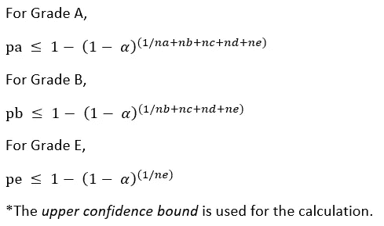
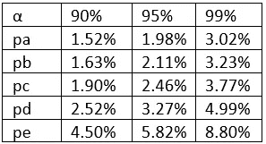
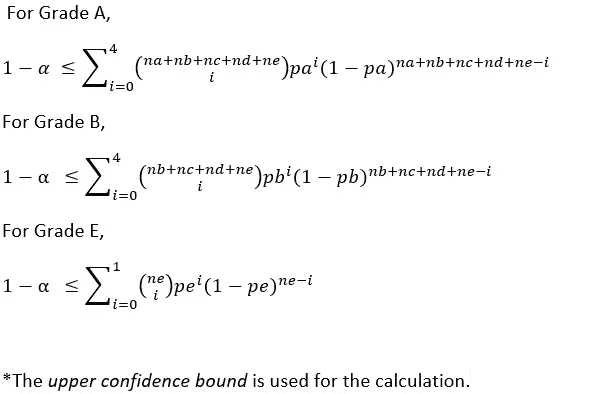
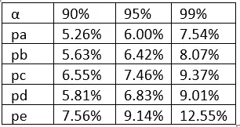
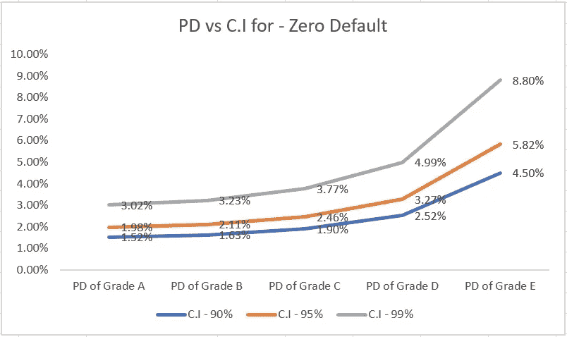
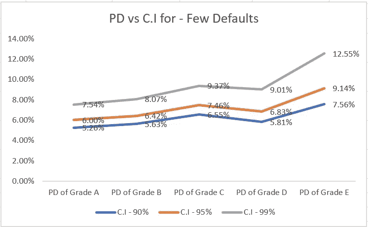

# 在 R 中使用 Pluto-Tasche 方法估计零(和低)违约投资组合的违约概率

> 原文：<https://medium.com/analytics-vidhya/estimating-probability-of-default-for-zero-and-low-default-portfolio-using-pluto-tasche-20b1b486d7ec?source=collection_archive---------3----------------------->


杰里米·帕金斯在 [Unsplash](https://unsplash.com?utm_source=medium&utm_medium=referral) 上的照片

在信贷风险管理领域，违约概率的估计对于满足监管要求(例如，巴塞尔、IFRS 9 等)非常重要。).在这方面，估计的违约概率的准确性确保了信用风险模型的正确性。然而，当投资组合中没有违约或违约数量非常少时，估计违约概率变得越来越具有挑战性。对于批发贷款，零违约或低违约是投资组合中的常见情景。例如，向政府发放大额贷款(主权贷款)的银行在大多数情况下都没有出现违约。尽管如此，贷款人需要在没有任何过去违约数据的情况下估计违约概率，以创建一个统计支持。

在本文中，我将描述 Pluto-Tasche(PT)方法，该方法反过来解决了估计零违约或低违约投资组合的 PD 的问题。这种方法与估计专业贷款的违约概率相关。

这里，假设默认值是独立的(换句话说，默认值之间没有相关性)。在这种情况下，PD 由置信区间的置信上限来估计。

为了计算违约概率，已经利用了*最审慎估计*(最审慎原则试图以一定程度的保守性来估计某个评级的最大违约概率，使得不会出现比当前评级和更低评级更多的违约)。

为了更好地理解这个概念，我们需要理解低违约投资组合(LDP)的定义。LDP 可以用一个投资组合来表征，其中违约的数量极低，或者在过去的数据中根本没有违约。由于数据不足，LDP 的 PD 估计值也很难进行回测。如上所述，LDP 的例子包括但不限于向银行贷款、主权贷款、专业贷款等。

这幅图中有两个场景-

1.零违约，以及

2.低默认

1.  **假设独立性为零的违约:**

在我们的示例中，让我们考虑投资组合中的五个评级等级，例如 A、B、C、D 和 E，每个等级中的客户数量分别为 na、nb、nc、nd 和 ne。最高信用等级为 A 级，最低信用等级为 e 级。根据假设，观察期内任何等级均未发生违约。每个等级的违约概率分别为 pa、pb、pc、pd 和 pe，其中 pa ≤ pb ≤ pc ≤ pd ≤ pe。

为了便于说明，我假设

na = 10，nb = 20，nc = 30，nd = 40，ne = 50。

**数学基础(根据本例):**



现在，根据最谨慎的估计，我可以这样写

pa = pb = pc = pd = pe

在这种情况下，我们还假设 A 级的置信区间为α。

现在，在零违约的情况下，具有多个置信区间(90%，95%，99%，99.9%)的各个概率(从 pa 到 pe)的置信上限如下:



2.**低** **默认具有独立性的假设:**

在这种情况下，我假设投资组合中发生的违约数量很少。例如，A 级零违约，B 级零违约，C 级两个违约，D 级一个违约，e 级一个违约，同样，我假设 pa=pb=pc=pd=pe，因此，与前一种情况一样，样本大小变为 na+nb+nc+nd+ne。

**数学基础(根据本例):**



现在，发生不超过四次违约的概率变成了；



违约概率(PD)和置信区间(C.I)之间的比较研究如下所示(针对零违约情况)



违约概率(PD)和置信区间(C.I)之间的比较研究如下所示(针对少数违约情况)



PD 计算是在 R 中完成的。在本练习中，使用了 R 中的“LDPD”包。由于插图中提到了一个时期的 PD，所以我使用了名为 *PTOnePeriodPD* 的函数。

为了在 Jupyter Notebook 中安装并激活软件包，我使用了以下代码:

```
install.packages("LDPD")
library(LDPD)
```

为了让读者理解 R 中 PD 的计算，我在下面提供了一些代码片段；

*   使用以下代码计算 90%置信区间下零违约情况下的 A 级 PD:

```
portfolio <- c(150)
defaults <- c(0)
PTOnePeriodPD(portfolio, defaults, conf.interval = 0.90)
```

*   使用以下代码计算 90%置信区间下零违约情况下的 B 级 PD:

```
portfolio <- c(140)
defaults <- c(0)
PTOnePeriodPD(portfolio, defaults, conf.interval = 0.90)
```

*   同样，使用以下代码计算 90%置信区间下零违约情况下的 E 级 PD:

```
portfolio <- c(50)
defaults <- c(0)
PTOnePeriodPD(portfolio, defaults, conf.interval = 0.90)
```

*   使用以下代码，计算 90%置信区间下少数默认情况下的 A 级 PD:

```
portfolio <- c(150)
defaults <- c(4)
PTOnePeriodPD(portfolio, defaults, conf.interval = 0.90)
```

*   使用以下代码计算 90%置信区间下少数违约情况下的 B 级违约概率:

```
portfolio <- c(140)
defaults <- c(4)
PTOnePeriodPD(portfolio, defaults, conf.interval = 0.90)
```

*   类似地，使用以下代码计算 90%置信区间的少数违约情况下的 E 级 PD:

```
portfolio <- c(50)
defaults <- c(1)
PTOnePeriodPD(portfolio, defaults, conf.interval = 0.90)
```

读者被邀请在他们自己的代码中试验多个置信区间。

本文提供了使用 Pluto-Tasche (PT)方法估计违约概率的基本介绍，该方法假设违约事件之间是独立的。然而，PT 方法有进一步的扩展，在多期情况下违约是相关的，这超出了本文的范围。读者可以自己探索同样的问题。

在 LinkedIn 上关注我。