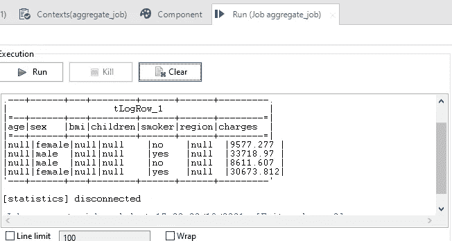

# 使用 Talend 的 ETL-数据处理

> 原文：<https://medium.com/analytics-vidhya/etl-data-processing-using-talend-4cda9d5891e9?source=collection_archive---------0----------------------->


马库斯·斯皮斯克在 Unsplash 上拍摄的照片

随着数据量的增加，处理变得单调乏味。ETL 工具有助于轻松转换大量数据。一旦数据被处理，它进一步使分析和解释数据更容易和更快。

*在 Talend 上实现一些处理之前，我们先来了解一下什么是 ETL..*

**什么是 ETL？** → 3 步数据集成流程——提取转换和加载。将原始数据从数据源移动到数据库或数据仓库需要这个过程。

*   **提取** 在 ETL 的第一步，从多个来源提取/收集结构化和非结构化形式的数据，并整合到一个集中的存储库中。
*   **转换** 接下来，对整个数据进行转换，以保证数据质量。应用各种规则和函数将数据转换成符合要求的格式。一些常用的转换包括标准化、排序、过滤、替换空值、替换单个值的不一致条目、删除重复项。
*   **加载** 最后，将提取和转换后的数据加载到目标数据仓库或数据库中。在此步骤中，应确保使用有限的资源准确加载数据，并且数据一致性没有损失。

让我们了解一下塔伦德..

**什么是 Talend？** → Talend 是数据集成中使用最广泛、最强大的 ETL 工具之一。它使得 ETL 的过程更加容易和经济有效。***Talend Open Studio for Data Integration***允许您使用预定义的组件构建 Java ETL 作业。它为您提供了一个图形化的工作区，您可以简单地从面板中拖放组件，并将它们连接起来，以映射源和目标之间的数据。

最后，让我们尝试一些 Talend 组件..

我们将使用以下 Talend 组件查看 5 个处理步骤:
tFileInputDelimiter、tFileOutputDelimiter、tLogRow、tMap、tFilterRow、tAggregateRow、tReplace、tReplaceList。

为了便于说明，我们将使用与之前一篇关于[数据处理](/swlh/keep-your-data-clean-8450e35f4895)的博客中相同的[*Insurance _ dataset*](https://www.kaggle.com/utkarshakathayat/insurance-dataset)，但是在一个文本文件中，用逗号分隔。


这是文本文件的样子。

在 TOS 中创建一个作业，如果您以前从未这样做过，请遵循[说明](https://help.talend.com/r/XqDwjCNcR28p0QBYSfToSA/uRvdIWL9yOIWOEWn_oK9ng)。然后，为分隔文件创建元数据，并在 *input* 家族的***tfileinutdelimitted***组件中使用它，以便进一步使用。如果你不知道怎么做，可以参考这个[链接](https://www.talend.com/resources/creating-using-metadata/)上的视频。


设置元数据。


*tFileInputDelimited* 组件的设置。

要查看数据，请使用*日志&错误*系列中的 ***tLogRow*** 组件，它允许您将作业中的数据流写入控制台。在组件设置中选择“表格”模式，以结构化表格格式查看数据。


tLogRow 组件的设置。

下图是我们桌子的样子。


输出曲线描绘台

## 替换缺失值或空值

在上面的输出图像中，我突出显示了缺失值或空值。让我们尝试使用来自*处理*家族的 ***tMap*** 组件来处理这些值。我们将在 tMap 组件窗口中使用可用的函数形成表达式，根据需要转换数据。之后，我们将保存处理过的数据。


用于替换缺失值的作业。


替换缺失值的 tMap 组件。

让我们来理解形成的表达..
Java 的条件或三元运算符(？:)用于编写替换缺失值或空值的表达式。

```
**Expression 1 ? Expression 2 : Expression 3** 
```

表达式 1 是要检查的条件。如果为真，则执行表达式 2，否则，执行表达式 3。

```
**row1.smoker.equals("NAN") ? "no" : row1.smoker
row1.region.isEmpty() ? "northeast" : row1.region****Relational.ISNULL(row1.bmi) ? 20.00 : row1.bmi** 
```

ISNULL()是由 Talend 的关系类别提供的函数，它返回一个布尔值

*输出*系列的***tOutputDelimited***组件帮助我们将转换后的数据保存到另一个具有合适分隔符的文件中。

为了进一步处理，像前面一样，将这个新文件添加到元数据，然后添加到 tFileInputDelimited 组件。
当我们再次使用 tLogRow 检查输出表时，您可以注意到变化(与之前的输出图像进行比较)。


处理缺失值后的输出。

## 创建列—出生年份


创建出生年份列的作业。


用于计算和创建出生年份列的 tMap 组件。

*理解表达..*

```
**TalendDate.addDate(TalendDate.getCurrentDate(),-row1.age, "yyyy")**
```

*addDate(Date date，int n，Date dateType)* 是 tMap 表达式生成器中 TalendDate 类别提供的函数。第一个参数是要添加日、月、年的日期；第二个参数是要添加的值，第三个参数是日期模式。该函数返回一个 Talend 日期。
在我们的例子中，我们需要从当前日期中减去年龄来得到出生年份。这也是为什么 addDate 函数传入的第一个参数是 Talend date category 提供的另一个内置函数- *getCurrentDate()* ，顾名思义返回当前日期。我们需要减去年龄，所以传递的第二个参数是减去年龄，第三个是 yyyy，因为需要年份。


包含出生年份列的输出表。

## 分类编码

[分类编码](/swlh/categorical-encoding-label-encoding-one-hot-encoding-115832c01b99)是数据分析中广泛使用的技术。让我们看看如何对两个分类列——性别和吸烟者——执行标签编码。这种技术通常可用于替换不一致的数据条目。比方说，有一个国家列，其中有 US、U.S.A、USA、America，它们都表示相同的值“USA ”,因此也可以使用相同的方法替换数据中不一致的值。我们将使用来自*处理*系列的***t 替换*** 组件，它在定义的输入列中进行搜索和替换，并在进一步处理之前帮助清理文件。


标签编码的作业。


t 替换用于对“性别和吸烟者”列的值进行编码的组件。

将在选定的输入列中搜索提到的字符串，并用提供的另一个字符串替换。


标签编码后的输出。

## 用区域代码替换区域值

如果您有一个包含国家的列，并且您想用另一个文件中的国家代码或包含语言代码的语言或包含邮政编码的地区来替换它们，您可以使用来自*数据质量*系列的 ***tReplaceList*** 组件。在我们的例子中，我们将使用这个组件用它们的代码替换区域值。下面是带区域及其代码的分隔文件的图像。将该文件添加到元数据中，并像前面一样在 tFileInputDelimited 组件中进一步使用它。


包含区域及其各自代码的文件。


用代码替换区域值的作业。

tReplaceList 将接受 2 个输入文件。这里，tFileInputDelimited_2 是我们的保险数据文件，tFileInputDelimited_3 是 region_code 文件。


t 用各自的代码替换区域值的替换列表。

查找搜索列是搜索代码的列，即 tFileInputDelimited_3 的区域，查找替换列是具有新值的列，即代码 tFileInputDelimited_3。然后选择主文件中需要替换的列，即 tFileInputDelimited_2 的 region 列。


用代码替换区域值后的输出。

## 过滤和汇总数据

tFilterRow 和 tAggregateRow 是两个*处理*系列组件，当您想要分别过滤数据和分组数据以聚合值时，这两个组件使您的工作变得简单。

比方说，你想比较吸烟和不吸烟的男性和有孩子的女性的平均保险费用。


过滤和汇总数据的作业。


用于筛选有孩子的人的 tFilterRow 组件。

首先，要获得有孩子的人的条目，您需要在 children 列上应用一个过滤器，使用大于运算符来表示值 0，即 children > 0。


用于合计费用的 tAggregateRow 组件。

然后将过滤后的输出作为输入提供给 tag aggregate row 组件。现在，将数据按性别和吸烟者分组，并将 average 函数应用于“费用”列。



过滤和聚合数据后的输出。

在上面的输出中，我们接收到 4 个观察值——不吸烟的女性、吸烟的男性、不吸烟的男性和吸烟的女性。比较这四个值，我们可以说，有孩子的不吸烟者的保险费比有孩子的吸烟者的保险费要少。

***感谢阅读！***

如果您想使用 python 执行一些数据处理，请阅读以下博客:

*   [https://medium . com/analytics-vid hya/getting-started-with-pandas-45c 7639 cd5ae](/analytics-vidhya/getting-started-with-pandas-45c7639cd5ae)
*   [https://medium.com/swlh/keep-your-data-clean-8450e35f4895](/swlh/keep-your-data-clean-8450e35f4895)

连接:[https://www.linkedin.com/in/akshada-gaonkar-9b8886189/](https://www.linkedin.com/in/akshada-gaonkar-9b8886189/)