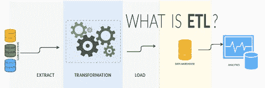

# 使用 Python 和 SQLAlchemy 进行 ETL 处理

> 原文：<https://medium.com/analytics-vidhya/etl-processing-with-python-sqlalchemy-3f8700c4b4cd?source=collection_archive---------30----------------------->

侯赛因·埃尔希设计

# 以 Python 和 SQLAlchemy 代码为例，了解数据驱动世界中的提取、转换和加载(ETL)。

数据驱动的人，无论是程序员、业务分析师、数据科学家还是数据库开发人员，都在直接或间接地开发 **ETL 管道**。对于数据驱动的业务， *ETL 是必须的*。

# 什么是 ETL？

在计算中，提取、转换、加载(ETL)是将数据从一个或多个源复制到目标系统的一般过程，该目标系统以不同于源的方式或在不同于源的上下文中表示数据。ETL 过程在 20 世纪 70 年代成为一个流行的概念，经常用于数据仓库。 [1](https://pandao.github.io/editor.md/en.html#1)

您可以**从任何数据源提取**数据，例如文件、任何 RDBMS 或 NoSql 数据库、网站(使用 scrabing)或实时用户或机器活动(来自 Kafka)。**转换**获取的数据，然后**将转换后的数据加载**到数据仓库中，供您的业务使用，如报告、分析或可视化。

ETL 是一个包含 3 个主要步骤的过程:

1.  **从单个或多个数据源提取** ing 数据。根据业务逻辑转换数据。
2.  **转换**本身是一个两步过程。数据清理和数据操作。
3.  **将**转换后的数据加载到目标数据源、数据仓库或数据集市。

# 提取

ETL 过程的第一部分包括从源系统中提取数据。在许多情况下，这代表了 ETL 最重要的方面，因为正确地提取数据为后续过程的成功奠定了基础。大多数数据仓库项目结合了来自不同源系统的数据。

# 转换

在这一阶段，一系列规则或函数被应用到提取的数据，以便为加载到最终目标做准备。

转换阶段的一个重要功能是数据清理，其目的是只将最“合适”的数据传递给目标。

在这个阶段使用标签编码，清除空值，计算一些组或聚合，分裂或任何变换。

# 装货

加载阶段将数据加载到最终目标中，最终目标可以是任何数据存储，包括简单分隔的平面文件或数据仓库。 [2](https://pandao.github.io/editor.md/en.html#2) 根据组织的要求，这一过程会有很大的不同。一些数据仓库可能会用累积信息覆盖现有信息；每天、每周或每月经常更新提取的数据。

> ETL 不应该与 Informatica、DataBricks 或 Airflow 等工具混淆。它是一个数据处理概念，可以通过编程语言和各种工具的帮助来创建。

# 创建 ETL 管道

让我们建立 ETL 管道。数据工程师、数据科学家、机器学习工程师、数据分析师大多使用数据。这些大多使用 Python 脚本语言。

因此，这里我们将通过使用 Python 编程语言和 SQLAlchemy 来建立我们的 ETL 管道。(您可以使用 sqlite3 等代替 SQLAlchemy)不要忘记 Python 附带了许多不同的库，可以帮助建立数十种数据分析、数据可视化或数据科学解决方案。

下面是我简单的 3 个主要步骤的 ETL 过程:

*   从**中提取数据。sqlite** 文件与 **SQLAlchemy**
*   用**熊猫**转换/操作数据
*   将数据载入**。带有 **SQLAlchemy** 的 sqlite** 数据库

# 代码源

python 代码源代码可以在 [my Github repository](https://github.com/huseyinelci/DE-ETLProcessingWithPython) 中找到。可以自由查看。[点击它](https://github.com/huseyinelci/DE-ETLProcessingWithPython)

# 数据源

源码所有者是 [Luis Rocha](https://github.com/lerocha) [下载文件](https://github.com/lerocha/chinook-database/blob/master/ChinookDatabase/DataSources/Chinook_Sqlite.sqlite) Chinook 是一个可供 SQL Server、Oracle、MySQL 等使用的示例数据库。它可以通过运行一个 SQL 脚本来创建。Chinook 数据库是 Northwind 数据库的替代产品，是演示和测试针对单个和多个数据库服务器的 ORM 工具的理想选择。

# 批准

这个项目中的**是开源**，所有者是[路易斯·罗查](https://github.com/lerocha)。此外，如果你计划在你的文章研究中使用这个数据库，或者你必须在路易斯·罗查知识库中找到并阅读主要资料。

# 作者

侯赛因·ELCI |[Github](https://github.com/huseyinelci)|[Kaggle](https://www.kaggle.com/huseyinelci)|[Linkedin](https://www.linkedin.com/in/huseyinelci/)| Medium |

# 承认

感谢 [Luis Rocha](https://github.com/lerocha) 提供的酷数据，我们可以创建一个前沿项目。

*最初发表于*[T5【https://www.linkedin.com】](https://www.linkedin.com/pulse/etl-processing-python-sqlalchemy-huseyin-elci/)*。*