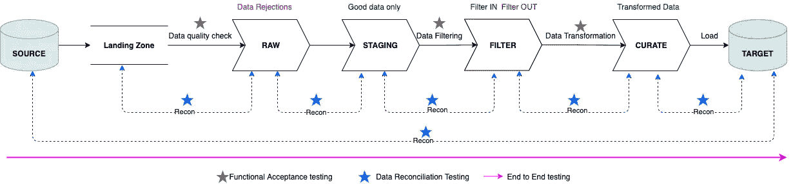
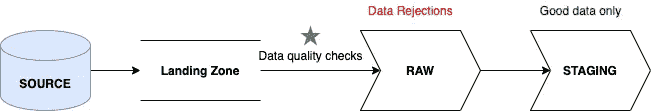
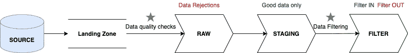
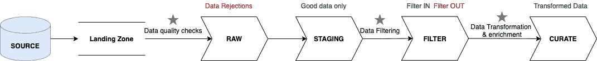
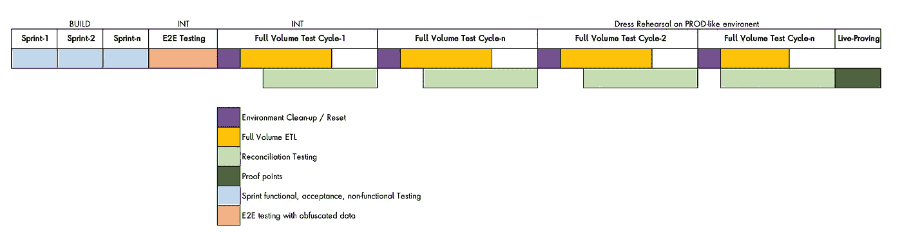

# ETL 测试指南

> 原文：<https://medium.com/analytics-vidhya/etl-testing-in-a-nutshell-f1967115a996?source=collection_archive---------8----------------------->

> 使用这篇基于真实行业案例研究和经验撰写的博客开始 ETL 测试。

典型的 ETL 流程(阶段名称可能不同)

尽管上面的图表有些简化，但这是大多数 ETL 工作流的样子。

简而言之，ETL 是一个将数据从源系统转移到目标系统的自动化过程，涉及到各个阶段，包括 **E** 提取、 **T** 转换和 **L** oad 子过程、*无数据丢失*，同时保持*数据完整性*。这也通常被称为*数据迁移*。

ETL 的目标是在一个地方拥有干净的、分类的、丰富的和精选的数据(*数据仓库或数据湖*)。这是运行*数据分析*和*数据科学*的第一步和先决条件。机器学习模型和分析工具针对这些数据运行，以获取有用的信息和预测，并基于这些信息和预测做出商业决策。

现在，这些数据可能以*批*(一次性、按需加载)或*实时*(连续、周期性流)的形式从数据源到达。虽然两者的 ETL 方法可能不同，但是本质是相同的——成功地将数据从源移动到目标，而没有任何数据丢失或错误。如果有任何意外的错误，它们应该是可跟踪和可管理的。

在本文中，让我们关注测试典型 ETL 工作流的方法和策略。

市场上有多种大数据技术可用于实施 ETL。有些是本地的，有些是基于云的。测试技术和工具也因之而异。这就是为什么，我们将尽可能保持这篇文章与技术无关。

# 测试类型:

## 1.隔离测试 ETL 组件

这包括测试 ETL 工作流中涉及的任何组件。它可以是微服务、转换引擎(如 Google Dataflow、Spark 等)、管道(Kafka、Google PubSub 等)。)、存储组件(像 HDFS、谷歌 GCS 桶等。)、登陆区(比如 unix 目录等。)、工作流管理器和编排器(如 Argo 等。)和任何其他参与组件。

确保每个组件都按照业务需求和系统设计(功能性和非功能性(性能、负载、灾难恢复等))的预期工作是很重要的。

这种测试侧重于使用 mocks 测试孤立的组件，以及它与其他组件的集成。

## 2.数据质量检查

数据质量检查验证源数据按照需求中定义的元数据协议具有可接受的质量。数据中不应有任何不一致或不准确之处。一些常见检查可以是对某些列的空值检查、重复检查、空白页眉和/或页脚等。

出于审计目的，拒绝、分离并记录任何不良数据。好的数据被*摄取*并通过剩下的 ETL 阶段。测试应该涵盖这两种场景。

## 3.测试过滤器条件

源系统通常会发送大量原始数据。从业务角度来看，有些数据可能不相关。这就是为什么它需要被过滤。当原始数据层存储所有数据时，只有在数据中过滤的*被传播到进一步处理。*过滤掉*数据再次被隔离并记录，以供审计之用。过滤条件根据业务需求定义。*

一些例子:

1.  过滤所有早于特定日期的记录。例如，21 年 3 月 1 日之前开立的所有账户
2.  筛选特定列具有特定值的所有记录。例如， *Acc_Status* = Open 的所有账户

## 4.测试数据转换逻辑

就像过滤条件一样，转换逻辑也在业务需求中定义。数据基于这些需求进行转换和丰富。有些转换像直接转换值一样简单，而有些转换可能是复杂的计算。

测试场景是基于逻辑推导出来的，涵盖正、负和边界值场景。测试转换引擎在遇到任何预期错误时的行为也很重要，尤其是在基于计算的规则中。

数据转换的输出是干净和精选的数据。

一些转换规则示例:

1.  将源中的真/假值转换为目标中的 1/0。
2.  通过在源的 Account_Id 中添加前缀 0 来转换目标中的*Account _ Id*,例如 72737455 到 00072737455
3.  通过将 *eod_balance* 乘以 0.025，转换目标中的 *predictive_index*

## 5.模式验证

模式验证是指测试源模式和目标模式。模式是源和目标的结构定义，由解决方案架构师定义。这通常包括列数据类型、最大/最小长度、唯一检查、页眉/页脚等。

例如:源模式中的*电话号码*字段可以是 11 位数字，而目标模式中是 10 位。这将导致 ETL 过程中出现模式错误。

## 6.测试数据映射

这是指源中的哪些列映射到目标中的哪些列。它通常以简单的 excel 格式在业务需求中定义。然而，技术实现对此有不同的处理，并使用其他技术。

例如:

1.  *源中的 Account_Id* 应该映射到目标中的 *int_acc_id*
2.  源中的*电话号码*应映射到目标上的*主电话号码*

## 7.数据验证和协调测试

数据协调是一个验证过程，通过将目标数据与原始源数据进行比较，确保数据迁移或 ETL 过程已将数据从源(LHS)正确传输到目标(RHS)。这种比较可以在两个 ETL 阶段之间进行，也可以在源和目标之间进行。

由于数据量巨大，使用一般的比较工具手动比较数据几乎是不可能的。协调规则是一种特殊的数学检查，利用它可以确信数据已经成功移动。侦察规则通常生成 3 种类型的报告- *差异*、*细节*和*摘要*。

常见的协调技术有:

*   **记录计数协调**:比较源端和目标端的记录数。
*   **缺失记录(目标中断)**:在源中存在但在目标中不存在的记录。
*   **额外记录(源中断)**:目标中存在但源中不存在的记录。
*   **重复记录**:在目标中多次出现的记录。
*   **汇总调节(最小值、最大值、总和、AVG)** :在源与目标的列上进行数学计算。例如，来源中的平均 eod_balance 应等于目标中的平均 eod_balance。
*   **记录内容核对**:源记录和目标记录的逐字段比较。

Recons 由财务和运营证据驱动。

协调测试通常在全卷数据上进行；这是它产生最大价值的地方。

使用 Spark 或类似的能够处理大量数据的技术来实现自动对账。也有一些商业工具可用，比如 QuerySurge。一些组织也喜欢建立他们自己的定制工具。

一些记录(如记录内容)可能会占用大量资源，运行时间可能会很长(取决于数据量)。需要记住这一点，只有在绝对必要的情况下才应该进行这种确认。

## 8.端到端测试

当所有的 ETL 阶段和它们的组件都测试好了，E2E 测试就执行了。这是为了确保 ETL 过程从开始到结束都完美无缺，并且一切都按照预期进行编排。

## 9.全容量测试

全卷测试是指对大型数据集(数百万和数十亿条记录)的 ETL 进行 E2E 测试。)目标是测试 ETL 如何处理大量不同的数据集。这有助于发现不可预见的场景和性能问题(如果有的话)。

除此之外，还有一些专门针对 ETL 的测试，比如数据完整性、数据沿袭和数据分类测试。

## 10.在源头测试提取

这是为了确保源文件按预期创建，并包含来自源系统的正确数据。测试所有数据提取条件和逻辑。

# 测试数据策略:

## 1.合成或人造数据

*   该测试数据是使用定制的测试数据创建工具/机制制造的
*   格式和架构与源文件格式和架构保持一致
*   根据测试场景制造测试数据组合
*   测试数据的制造是自动的、按需的，并且通常嵌入在自动化脚本中
*   合成测试数据最适合于 sprint 期间的小集合和故事的功能/验收测试。
*   使用合成数据的目的是证明 ETL 组件在消极和积极的场景中都“功能性地”正常工作。
*   大量的合成数据可用于负载测试。

## 2.混乱的数据

*   混淆的数据是真实的数据，但是用*掩盖了*(隐藏的)PI 信息，如姓名、尼诺、社会保险号等。这些值通常被替换为随机的垃圾字符，以保护数据的机密性。
*   创建这种类型的数据需要混淆(屏蔽)的努力
*   这是一个高质量的测试数据，具有各种各样的值，因此有助于发现边缘情况。
*   全体积 E2E 测试的理想选择

## 3.真实数据

*   无屏蔽的真实数据
*   通常用于生产环境
*   严格的访问控制

# 指示性测试计划

这是一个 ETL 测试项目的指示性测试计划。

关键点是:

*   构建时的组件测试(通常作为 CI/CD 的一部分)
*   接着是在 INT 上的几轮 E2E 测试
*   随后是 1-n 个循环的使用混淆数据的全容量测试
*   随后在类似生产的环境中使用真实数据进行 1-n 个周期的全面测试
*   随后是现场验证
*   每个测试周期后的环境清理，使一切恢复到基本状态。

# 共同的挑战

面临的一些常见挑战可能是:

*   数据混淆功能通常很难构建
*   涉及到严格的数据访问控制和机制，有时会限制测试活动
*   环境清理可能是一项棘手的工作，因此必须准备一份合适的操作手册
*   由于众多的依赖性，E2E 流通常需要一段时间才能工作。在此之前，必须使用模拟。ETL 阶段可能很难模仿。
*   掌握准确的源和目标模式映射是一项挑战。
*   选择正确的测试工具是关键。本地技术可能工作得最好，因为它们与源代码和 CI/CD 流程无缝集成。
*   全容量测试和数据协调需要强大的测试环境，构建和执行成本可能很高