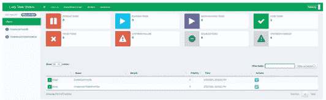
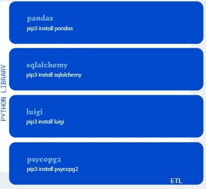
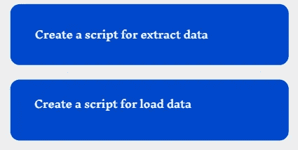
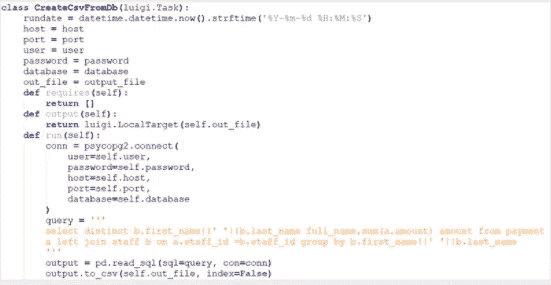
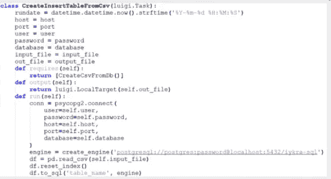
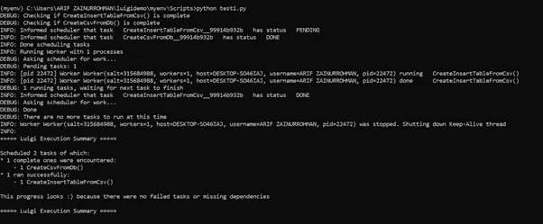
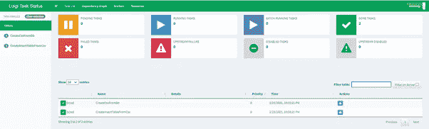
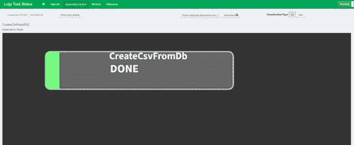
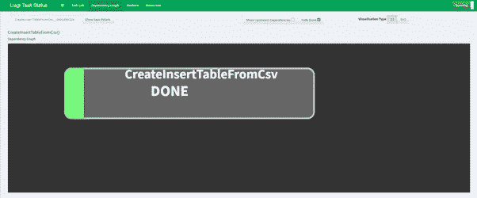
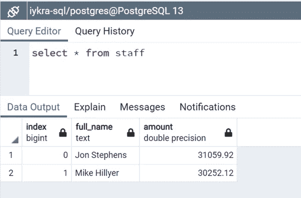

# 使用 Luigi 进行 ETL

> 原文：<https://medium.com/analytics-vidhya/etl-using-luigi-c8ff2bbf2ef3?source=collection_archive---------8----------------------->

路易吉仪表板

**E T L**

在计算中，提取、转换、加载(ETL)是将数据从一个或多个源复制到目标系统的一般过程，该目标系统以不同于源的方式或在不同于源的上下文中表示数据。ETL 过程在 20 世纪 70 年代成为一个流行的概念，经常用于数据仓库。

*摘录*

在数据提取步骤中，数据从源位置复制或导出到临时区域。数据几乎可以来自任何结构化或非结构化的来源— SQL 或 NoSQL 服务器、CRM 和 ERP 系统、文本和文档文件、电子邮件、网页等等。

*变换*

在临时区域中，原始数据被转换为对分析有用的数据，并符合最终目标数据仓库的模式，该数据仓库通常由结构化在线分析处理(OLAP)或关系数据库提供支持。这可能涉及以下内容:

*   过滤、清理、消除重复、验证和认证数据。
*   基于原始数据进行计算、翻译或汇总。这包括从更改行标题和列标题以保持一致性，到转换货币或度量单位，到编辑文本字符串，再到对值求和或求平均值，满足组织特定 BI 或分析目的所需的一切。
*   删除、加密、隐藏或以其他方式保护受政府或行业法规管辖的数据。
*   将数据格式化为表或连接表，以匹配目标数据仓库的模式

在临时区域执行这些转换——而不是在源系统内部——限制了对源系统的性能影响，并降低了数据损坏的可能性。

*加载*

在最后一步中，转换后的数据从临时区域转移到目标数据仓库中。通常，这涉及所有数据的初始加载，随后是增量数据更改的定期加载，以及不太常见的完全刷新，以擦除和替换仓库中的数据。

**什么是 Luigi？**

Luigi 是一个 Python 模块，可以帮助您构建批处理作业的复杂管道。它处理依赖性解析、工作流管理、可视化等。

Luigi 的目的是解决通常与长时间运行的批处理相关的所有问题。你想把很多任务链起来，自动化，失败就会发生。这些任务可以是任何事情，但通常是长时间运行的事情，如 Hadoop 作业、向/从数据库转储数据、运行机器学习算法或任何其他事情。

**什么是 psycopg2？**

Psycopg 是 Python 编程语言最流行的 PostgreSQL 适配器。其核心是 Python DB API 2.0 规范的完整实现。几个扩展允许访问 PostgreSQL 提供的许多特性。

**什么是 sqlalchemy？**

SQLAlchemy 是 Python SQL 工具包和对象关系映射器，为应用程序开发人员提供了 SQL 的全部功能和灵活性。

SQLAlchemy 允许开发人员使用简单的 SQL 语句(与其他对象关系映射工具不同)，这些语句提供了一种有用的方法来连接数据库表和用户定义的 Python 类。SQLAlchemy 对象关系映射工具主要集中于使用 SQL 表达式语言。

**场景**

我们有一个非常简单的场景来演示这些库的组合来创建 ETL，我们有两个不同的数据库 dvdrental 和 iykra-sql，我们构建一个查询来获取每个员工处理的总量，并创建一个 CSV，然后导入到 iykra-sql 数据库。

**准备**

我们需要创建查询并安装所需的 python 库，在本例中我们将使用 PostgreSQL。

Python 库

**解决方案**

我们有 2 个步骤来做这个例子，在这个例子中，我们不做转换过程。

提取和加载

**摘录**

提取脚本

**装载**

用于加载的脚本

**运行脚本**

运行脚本

**路易吉仪表盘**

路易吉仪表板

从数据库创建 Csv

将 Csv 插入数据库

**结果**

结果

**结论**

Luigi 是一个基于 Python 的 ETL**工具，由 Spotify 创建，但现在可以作为开源工具使用。它是一个比这个列表中的许多工具更复杂的工具，具有创建复杂的 ETL 管道的强大功能。**

因此，我们了解了 Luigi 如何使编写满足您需求的 ETL 变得更加容易。

**参考文献**

 [## 提取、转换、加载

### 在计算中，提取、转换、加载(ETL)是将数据从一个或多个数据源复制到另一个数据源的一般过程

en.wikipedia.org](https://en.wikipedia.org/wiki/Extract,_transform,_load)  [## 什么是 ETL(提取、转换、加载)？

### ETL 是一个从多个数据源提取、转换和加载数据到数据仓库或其他统一数据库的过程。

www.ibm.com](https://www.ibm.com/cloud/learn/etl)  [## 入门- Luigi 2.8.13 文档

### Luigi 是一个 Python (2.7、3.6、3.7 测试版)包，可以帮助您构建批处理作业的复杂管道。它处理…

luigi.readthedocs.io](https://luigi.readthedocs.io/en/stable)  [## Python - Psycopg 的 PostgreSQL 驱动程序

### psycopg2 池是一个非常简单的对象，比...

www.psycopg.org](https://www.psycopg.org) 

[www.sqlalchemy.org](http://www.sqlalchemy.org)

 [## 如何安装 SQLAlchemy |灵动网络

### SQLAlchemy 工具包和对象关系映射器是一套广泛的实用工具，用于处理 Python 和…

www.liquidweb.com](https://www.liquidweb.com/kb/how-to-install-sqlalchemy)