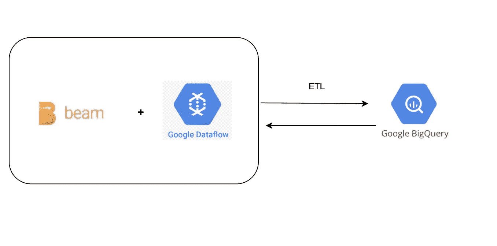

# 数据流和大查询的 ETL

> 原文：<https://medium.com/analytics-vidhya/etl-with-dataflow-bigquery-bfaf22fbd0d0?source=collection_archive---------1----------------------->

使用数据流和大查询提取、转换和加载

> 最初发表于[https://asyncq.com](https://asyncq.com/etl-with-dataflow-bigquery)

## 目录

*   介绍
*   用例
*   我们有什么选择？
*   结论

## 介绍