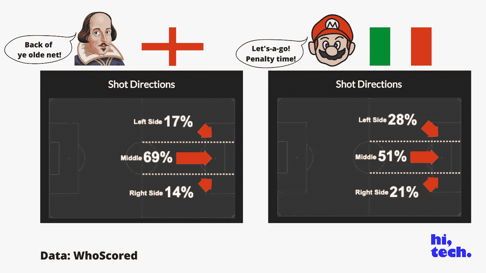

# 2020 年欧洲杯决赛:数据驱动的预览

> 原文：<https://medium.com/analytics-vidhya/euro-2020-final-a-data-driven-preview-ec29c32b4c49?source=collection_archive---------13----------------------->

图片:克拉克·博伊德

## 你需要的 100%的数据，外加一个预测。

欢迎来到《高科技》的特别版。

我现在要警告你:它对数据很重要。“如果”这个词也起了很大的作用。

哦，当然，我在这里加入了一些古怪的小玩意，在那里加入了一些老套的东西，但这主要是基于足球的有力分析。